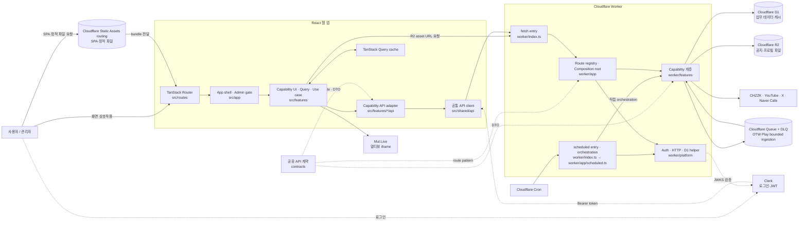
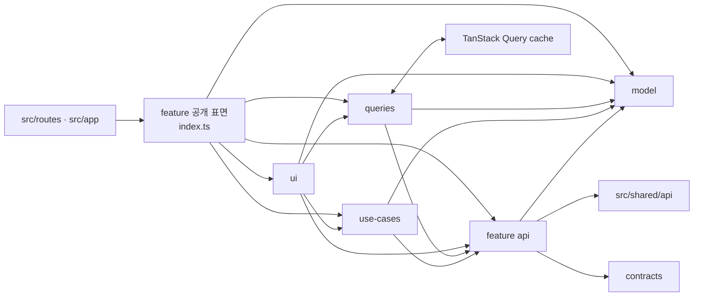
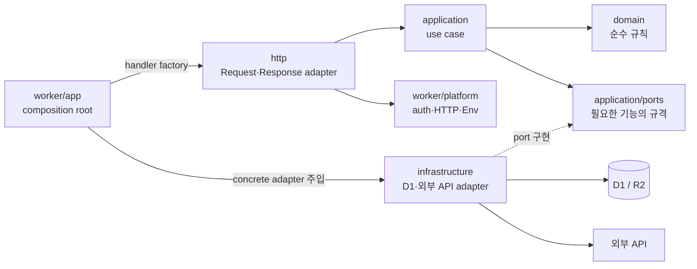
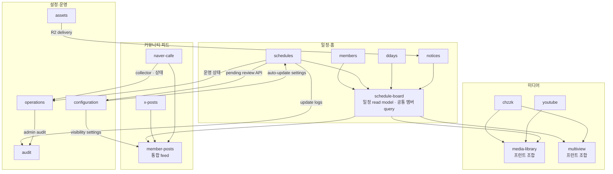
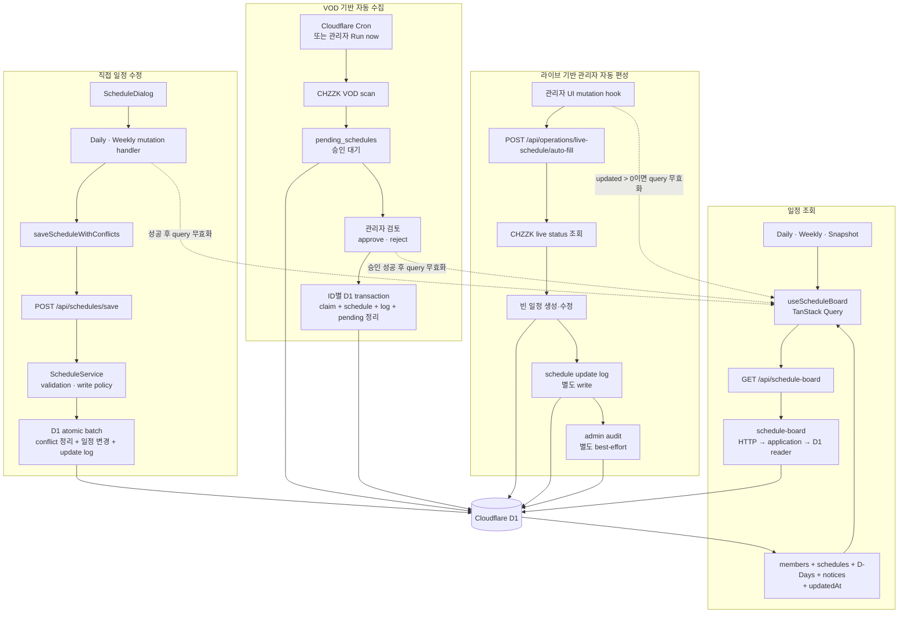
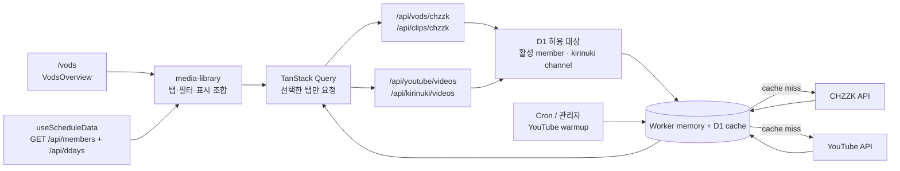
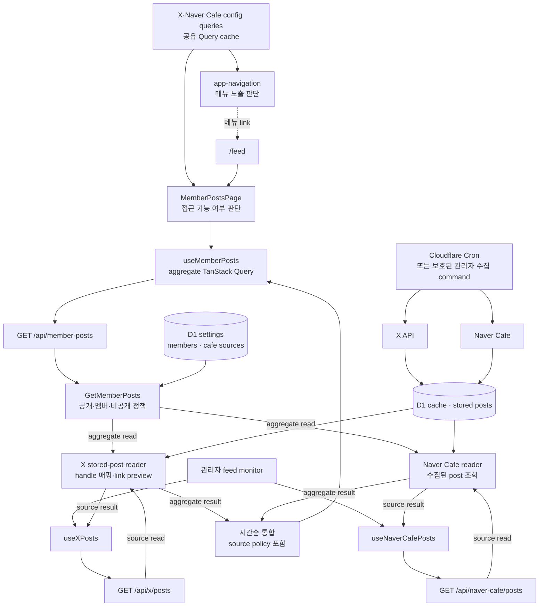
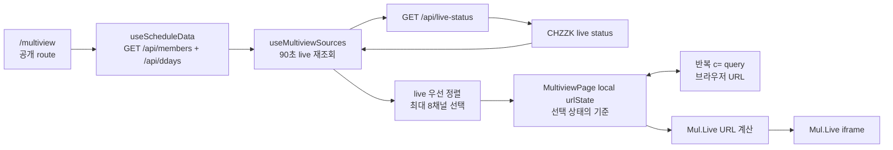
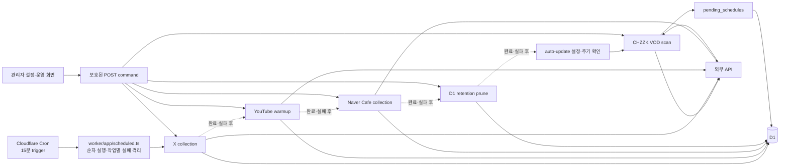

# OTW Schedule 아키텍처

## 문서 상태

- 상태: 현재 구현의 기준 문서
- 기준일: 2026-08-25
- 대상: React 웹 앱, Cloudflare Worker, D1, R2, Queue, 외부 콘텐츠 API

이 문서는 OTW Schedule의 현재 코드 소유권과 의존성 규칙을 정의한다.
리팩터링의 실행 배경과 당시 체크포인트는
`archive/architecture-refactoring-plan.md`에 보존하며, 구현 결과와 검증
근거는 `architecture-refactoring-verification.md`에서 확인한다.

## 1. 설계 목표

현재 구조는 다음 세 가지 목표를 우선한다.

1. 기능 변경 시 확인할 코드와 테스트를 한 capability에서 찾을 수 있어야 한다.
2. UI, HTTP, 도메인 규칙, D1·외부 API 구현의 의존성 방향이 역전되지 않아야 한다.
3. API 계약, 데이터 원자성, 외부 입력 제한을 자동화된 검증으로 보호해야 한다.

## 2. 전체 시스템 한눈에 보기

아래 화살표는 사용자의 요청이나 데이터가 이동하는 방향이다. 코드 import
방향은 다음 절의 계층 다이어그램에서 별도로 설명한다.



쉽게 비유하면 다음과 같다.

| 구성 | 쉬운 비유 | 실제 역할 |
| --- | --- | --- |
| `src/routes`, `src/app` | 안내 데스크와 건물 입구 | URL을 화면에 연결하고 공통 layout·관리자 gate를 적용한다. |
| `src/features` | 업무별 담당 부서 | 일정, 미디어, 게시물처럼 사용자 기능을 화면과 query 단위로 소유한다. |
| `contracts` | 프런트와 서버가 함께 쓰는 신청서 | 요청 URL과 payload·response 형식을 양쪽에서 동일하게 사용한다. |
| `worker/app` | 교환대와 배전반 | 요청을 정확한 feature로 보내고 실제 adapter를 조립한다. |
| `application` / `domain` | 업무 절차와 업무 규칙 | 무엇을 해야 하는지 결정하며 HTTP나 D1 세부 구현을 모른다. |
| `ports` / `infrastructure` | 콘센트 규격과 실제 플러그 | application이 요구하는 규격을 D1·외부 API adapter가 구현한다. |
| D1 | 업무 장부 | 일정·설정·수집 결과와 일부 외부 API cache처럼 구조화된 데이터를 보관한다. |
| R2 (`ASSET_BUCKET`) | 서비스용 파일 창고 | 공지·프로필 등 애플리케이션이 관리하는 이미지와 파일을 보관한다. |
| Cloudflare Queue + DLQ | 재시도 가능한 작업함 | OTW Play playlist ingestion을 최대 50개 영상 단위로 처리하고 실패 message를 격리한다. |
| Cloudflare Static Assets routing | 배포된 전시물 보관함 | 빌드된 SPA와 정적 파일을 Worker보다 먼저 전달하며 Worker에는 `ASSETS` binding이 있다. |

즉, 화면이 D1을 직접 만지는 구조가 아니다. 화면은 정해진 API 계약으로
요청하고, Worker의 해당 capability가 규칙을 적용한 뒤 저장소나 외부 API를
사용한다.

현재 `wrangler.jsonc`는 `/api/*`, `/r2-assets/*`만 Worker를 먼저 실행하고,
나머지 SPA·정적 파일 요청은 Cloudflare Static Assets routing이 먼저
처리한다. `worker/app/fetch.ts`는 `ASSETS` binding으로 직접 경로의 SPA fallback과
route별 SEO 응답을 제공한다.

일반적인 요청은 다음 순서로 처리된다.

1. 사용자가 route에 연결된 화면을 연다.
2. 화면의 feature query 또는 use case가 공유 API 계약으로 요청한다.
3. Worker route registry가 method와 path를 확인해 담당 feature로 보낸다.
4. HTTP adapter가 입력과 인증을 확인한다.
5. application/domain이 실제 업무 규칙을 결정한다.
6. infrastructure adapter가 D1·R2 또는 외부 API를 사용한다.
7. 응답이 TanStack Query cache에 반영되고 화면이 다시 그려진다.

## 3. 최상위 구조

```text
contracts/                    # frontend와 Worker가 공유하는 wire DTO
db/schema/index.ts            # Drizzle schema의 단일 기준

src/
  app/                        # provider, shell, admin composition
  routes/                     # 얇은 TanStack Router adapter
  features/<capability>/
    api/                      # HTTP client adapter
    model/                    # framework 비의존 모델과 변환
    queries/                  # TanStack Query server-state adapter
    use-cases/                # 필요한 경우의 frontend orchestration
    ui/                       # 화면과 capability UI
    index.ts                  # 외부 공개 표면
  shared/
    api/                      # apiFetch와 공통 header
    query/                    # QueryClient와 공통 query key
    ui/                       # shadcn/ui 및 공통 shell primitive
    lib/                      # 범용 유틸리티

worker/
  index.ts                    # Cloudflare runtime 진입점
  app/                        # exact route registry, cron, error boundary
  platform/                   # auth, D1, HTTP helper, cache, Env
  features/<capability>/
    domain/                   # 순수 규칙과 값
    application/              # use case
    application/ports/        # 필요한 port
    infrastructure/           # D1, Drizzle, 외부 API adapter
    http/                     # Request/Response adapter
    index.ts                  # composition용 공개 표면
```

책임이 없는 하위 계층은 만들지 않는다. 빈 폴더 구조보다 실제 소유권과
의존성 방향을 우선한다.

## 4. 의존성 방향

### 프런트엔드



- route는 URL parsing과 capability 화면 조합만 담당한다.
- 다른 capability를 참조할 때는 해당 capability의 `index.ts`만 사용한다.
- `model`은 React, TanStack Query, HTTP, Drizzle에 의존하지 않는다.
- frontend는 `db`와 `worker`를 import하지 않는다.
- 서버 상태의 기본 진입점은 TanStack Query cache다. dialog open, form
  draft 같은 UI 상태와 명시적인 편집용 working copy만 local state로 둔다.
  현재 `AutoUpdateSettingsManager`는 복합 pending 검토를 위해 settings와
  pending 목록을 local state로 복제하는 예외를 가진다.

### Worker



- `domain`, `application`, port는 `Request`, `Response`, `Env`, D1,
  Drizzle을 참조하지 않는다.
- raw D1 SQL과 업무·콘텐츠 외부 API client는 `infrastructure`에만 둔다.
  인증용 Clerk JWKS fetch는 `worker/platform/auth.ts`가 소유한다.
- `worker/platform`은 인증, 공통 HTTP·JSON helper, actor 추출과 audit
  insert helper를 제공한다. 각 HTTP adapter는 자신의 입력 parsing과 검증을
  소유하며, schedules처럼 local parser를 사용하는 adapter도 있다.
- API 최상위 예외 경계와 production 오류 응답은 `worker/app/fetch.ts`가
  담당한다.
- HTTP adapter는 infrastructure나 DB adapter를 직접 만들지 않는다.
  `worker/app`이 feature public `index.ts`에서 handler factory와 concrete
  adapter를 가져와 조합한다.
- Worker capability 간 참조는 상대 capability의 public `index.ts`로
  제한한다. application 간 협업은 port로 표현하고 concrete public service는
  `worker/app`에서 주입한다.
- `worker/index.ts`는 app composition을 Cloudflare `fetch`와 `scheduled`
  handler에 연결하는 역할만 담당한다.

이 규칙은 `pnpm architecture:check`가 AST import 검사, legacy 경로 검사,
raw SQL 위치 검사, production import cycle 검사로 강제한다. 정적
import/export뿐 아니라 문자열 또는 값 치환이 없는 템플릿 리터럴 dynamic
`import()`도 같은 검사를 받으며, 계산형 dynamic import는 정적 분석이
불가능하므로 거부한다.

## 5. Capability 소유권

| Capability | 주요 소유 범위 |
| --- | --- |
| `members` | 멤버 목록, profile, 배경 이미지 모델 |
| `schedules` | 일정 쓰기, conflict, 자동 수집, pending 검토 |
| `schedule-board` | daily, weekly, snapshot read model |
| `ddays` | D-Day 조회와 관리 |
| `notices` | 공지, banner, 노출, thumbnail |
| `chzzk` | live status, VOD, clip, CHZZK cache |
| `youtube` | 멤버 영상, kirinuki, cache, warmup |
| `media-library` | CHZZK·YouTube를 조합한 프런트 표시 |
| `x-posts` | X gateway, cache, collection, link preview |
| `naver-cafe` | source 설정, post 수집과 표시 |
| `member-posts` | X·Naver Cafe feed 조합과 monitor |
| `multiview` | member source 선택, 반복 `c=` URL, Mul.Live iframe |
| `configuration` | settings 계약, 정규화, 저장 |
| `audit` | admin audit 조회 |
| `operations` | health, retention, 운영 command 조합 |
| `assets` | Worker R2 key 정책과 asset delivery |

공통 admin 인증과 layout은 `src/app/admin`이 담당하고, 실제 관리 화면은
각 capability의 `ui/admin`이 소유한다.

모든 capability가 프런트와 Worker 양쪽에 같은 모양으로 존재하는 것은
아니다. `media-library`와 `multiview`는 기존 API를 조합하는 프런트
capability이고, `assets`는 R2 전달을 담당하는 Worker capability다. 필요한
책임만 만들고 빈 계층은 만들지 않는 원칙 때문이다.

주요 capability의 조합 관계는 다음과 같다. 실선 화살표는 앞 capability가
공개 표면이나 자신이 소유한 데이터를 제공하고 뒤 capability가 소비한다는
뜻이다. 양방향 협업은 목적이 다른 화살표 두 개로 표시한다. 어느 경우에도
상대 capability의 내부 파일을 직접 참조해도 된다는 뜻은 아니다.



현재 `media-library`, `member-posts`, `multiview`는 `schedule-board`의 공개
`useScheduleData` query로 활성 멤버와 D-Day를 읽는다. 이 query는
`GET /api/schedule-board`를 호출하는 것이 아니라 `GET /api/members`와
`GET /api/ddays`를 각각 요청한다.

## 6. 주요 기능별 흐름

### 6.1 일정 조회·수정·자동 수집



읽기는 `schedule-board`가 화면에 필요한 데이터를 한 번에 묶어 전달한다.
그래서 Daily, Weekly, Snapshot 화면이 각각 멤버·공지·D-Day·일정을 따로
조립하지 않는다. 다만 Worker 내부에서는 멤버, D-Day, 공지, 일정,
최신 변경 시각을 병렬 조회해 묶으므로, 이 응답 전체가 하나의 DB transaction
snapshot이라는 뜻은 아니다.

쓰기는 `schedules`가 소유한다. 충돌 일정 삭제, 일정 생성·수정, 변경 로그
기록은 같은 D1 batch에 들어가므로 중간 단계만 반영되는 상태를 막는다.
현재 제품 정책상 직접 일정 쓰기는 익명 요청도 허용하며, 이를
`ScheduleWriteAuthorizationPolicy`로 명시한다.

VOD 자동 수집은 곧바로 일정을 바꾸지 않고 `pending_schedules`에 올린 뒤
관리자 승인 단계에서 반영한다. 수집 중 pending insert, update log, 실행
이력, 마지막 실행 시각은 하나의 전역 transaction이 아니라 단계별로
기록한다. 대신 VOD ID와 일정 후보 key의 중복 방지로 재실행을 안전하게
만든다. 여러 pending을 한 번에 승인해도 ID별 transaction을 동시성 4로
처리하므로 일부 성공 결과를 그대로 반환한다.

별도의 관리자 live auto-fill command는 CHZZK live 상태로 빈 일정을 채운다.
일정 row, schedule update log, admin audit은 각각 별도 단계다. 따라서 뒤쪽
기록이 실패해도 앞에서 성공한 일정 변경을 되돌리지는 않으며, 전체 채널을
하나의 transaction으로 묶는 command도 아니다.

### 6.2 CHZZK·YouTube 미디어



`media-library`는 화면을 조합하지만 외부 API 자체를 소유하지 않는다.
CHZZK와 YouTube capability가 허용된 채널인지 먼저 확인하고, 정해진 cache
profile을 사용할 수 있는 요청만 cache한다. YouTube warmup은 자주 보는
결과를 미리 채워 사용자 요청에서 외부 API 호출과 quota 사용을 줄인다.

### 6.3 X·Naver Cafe 통합 게시물



`member-posts`는 두 source의 내부 구현을 복사하지 않고 각각의 공개
service를 조합한다. 공개 설정이면 cache 가능한 통합 응답을 만들고,
멤버 전용·비공개 또는 관리자 화면이면 `no-store`를 사용한다. 한 source가
실패해도 다른 source와 이전 cache를 가능한 범위에서 계속 표시한다.
`app-navigation`은 같은 config query cache로 메뉴 노출을 판단하고,
`MemberPostsPage`는 실제 페이지 접근 가능 여부를 별도로 판단한다.
관리자 monitor는 통합 `/api/member-posts`가 아니라 X와 Naver Cafe의
source별 query와 endpoint를 각각 호출해 상태를 나란히 확인한다.
일반 피드 조회는 저장된 X·Naver 게시물을 읽으며 외부 source를 즉시
수집하지 않는다. 화면의 강제 새로고침도 HTTP 응답 cache만 우회할 뿐이며,
실제 수집은 Cron 또는 보호된 관리자 command가 담당한다.

### 6.4 공개 멀티뷰



멀티뷰는 별도의 Worker capability나 브라우저 확장 기능을 두지 않는다.
기존 멤버 정보와 CHZZK live status를 프런트에서 조합하고, 선택한 채널을
local `urlState`에 둔다. 이 상태를 반복 `c=` parameter와 양방향
동기화하고 Mul.Live URL로 변환한다. 로그인 없이 사용할 수 있으며 iframe은
선택 결과가 바뀔 때만 새 URL을 받는다.

### 6.5 운영 자동화



정기 작업은 X 수집 → YouTube warmup → Naver Cafe 수집 → D1 retention
순서로 실행하고, 각 작업의 실패를 격리해 다음 작업을 계속한다. 그 뒤
auto-update 설정과 실행 주기를 확인해 필요할 때 CHZZK VOD 수집을 수행한다.
관리자 화면의 수동 실행도 같은 capability service를 사용하므로 정기
실행과 다른 업무 규칙이 생기지 않는다.

## 7. API 경계

`worker/app/routes.ts`는 모든 endpoint의 machine-readable manifest다.
각 route는 정확한 method, path pattern, owner, auth, cache, 성공 status를
가진다. 현재 manifest는 47개 route entry와 65개 method/path 계약을
등록한다.

- 등록되지 않은 `/api/*`: `404`
- 등록 path의 잘못된 method: `405`와 `Allow`
- numeric path parameter: 양의 safe integer만 허용
- malformed JSON 또는 strict validator가 거부한 입력: `400`. 일부 조회
  query parameter는 fallback·clamp 후 `200`으로 정규화한다.
- `cache=no-store`: handler가 `Cache-Control`을 생략했을 때 registry가
  `no-store`를 추가한다. 기존 값을 덮어쓰거나 최상위 예외 응답을 보정하지는
  않는다.

route의 `auth`는 계약을 설명하는 metadata이고 실제 JWT·관리자·visibility
검사는 각 HTTP adapter가 수행한다. Clerk JWT는 Worker가 JWKS로 signature,
issuer, 만료·`nbf`를 검증하고, `CLERK_JWT_AUDIENCE`가 설정된 경우에만
audience를 추가 검증한다.

frontend와 Worker가 공유하는 payload의 기본 소유자는 `contracts`다.
`contracts/api-routes.ts`는 양쪽에서 사용하는 route pattern과 URL builder를
소유한다. auth, cache, 성공 status 같은 Worker 실행 metadata와 Cloudflare
adapter는 `worker/app/routes.ts`가 소유한다.

현재 D-Day와 notice Worker handler 일부는 `worker/platform/types.ts`의
중복 payload type을 사용한다. 이는 `contracts` 단일 기준에서 벗어난 현재
예외이며, optional field drift를 피하려면 장기적으로 공유 contract로
수렴해야 한다.

## 8. 데이터 무결성

일정 쓰기와 pending 처리는 capability application port와 D1 repository를
통해 실행한다.

- 직접 일정 저장의 conflict 처리, schedule mutation, update log는
  `D1Database.batch()`의 한 transaction에 둔다.
- pending 승인은 ID별로 claim, schedule mutation, update log, pending
  정리를 한 transaction에 둔다. 거절은 claim, reject log, pending 정리를
  한 transaction에 둔다.
- create 결과 ID는 insert의 `meta.last_row_id`를 사용한다.
- `last_insert_rowid()`는 schedule insert 직후 해당 create·approve log에
  ID를 전달할 때만 사용한다.
- 일정 create, update, delete, conflict cleanup 로그는 같은 transaction에서
  `member_uid`와 당시 `member_name` snapshot을 함께 보존한다.
- 승인·거절처럼 pending을 소비하는 action은 첫 conditional DML을
  claim/CAS로 사용해 같은 pending의 동시 처리에서 한 요청만 성공시킨다.
  pending을 남기는 `resetProcessed`에는 이 보장이 적용되지 않는다.
- bulk 처리는 입력 순서를 유지하고 최대 동시성 4로 ID별 transaction을
  실행해 partial-success 계약을 보존한다.
- VOD 수집의 pending insert, 수집 log, 실행 이력, 마지막 실행 시각은
  전역 transaction으로 묶지 않으며, 중복 방지 key를 통해 재시도 가능성을
  보존한다.
- live auto-fill의 schedule mutation, schedule update log, admin audit은
  별도 단계다. 뒤쪽 기록 실패는 앞에서 성공한 mutation을 rollback하지
  않는다.

DB table 정의는 `db/schema/index.ts`가 단일 기준이다. frontend contract와
view model은 이 persistence schema를 import하지 않는다.

## 9. 조회와 command

GET endpoint는 조회 중 domain command를 실행하지 않는다.

- settings GET은 정규화한 값을 반환하지만 저장하지 않는다.
- notice 만료 여부는 조회 결과에서 계산한다.
- live status GET의 호환 필드 `scheduleAutoFill`은 `{ updated: 0 }`이며,
  실제 자동 반영은 admin POST command가 담당한다.

CHZZK, YouTube, X target은 각 domain policy가 형식, 중복, 활성 allowlist,
최대 개수를 검증한다. allowlist를 확인할 수 없으면 외부 요청을 보내지 않고
`503`을 반환한다.

## 10. 변경 탐색 순서

기능을 수정할 때는 다음 순서로 범위를 확인한다.

1. `contracts/<capability>.ts`
2. `worker/app/routes.ts`의 route manifest
3. `worker/features/<capability>`
4. `src/features/<capability>`
5. 얇은 `src/routes` 소비자
6. colocated test와 isolated D1 integration test

새 수평 계층인 `src/hooks`, `src/lib/api`, `worker/routes`,
`worker/services`를 만들지 않는다.

## 11. 필수 검증

```text
pnpm architecture:check
pnpm typecheck:test
pnpm lint
pnpm test
pnpm test:coverage
pnpm build
pnpm sync:agent-cursor:check
```

원자성·동시성 변경은 `pnpm test:worker-integration`으로 isolated D1에서도
검증한다. schema를 건드린 경우에는 별도로 `pnpm drizzle:generate` 결과에
예상하지 않은 migration이 없는지 확인한다.

## 12. 의도적 예외

- 익명 schedule 쓰기는 현재 제품 정책이다. 우발적 인증 누락이 아니라
  `ScheduleWriteAuthorizationPolicy` port와 `PublicScheduleWritePolicy`
  adapter로 명시한다.
- 기존 pending URL alias는 호환을 위해 유지하지만 같은 application use
  case를 호출한다.
- `/multiview`는 extension 없이 동작하는 공개 Mul.Live iframe과 반복
  `c=` query parameter를 유지한다.
