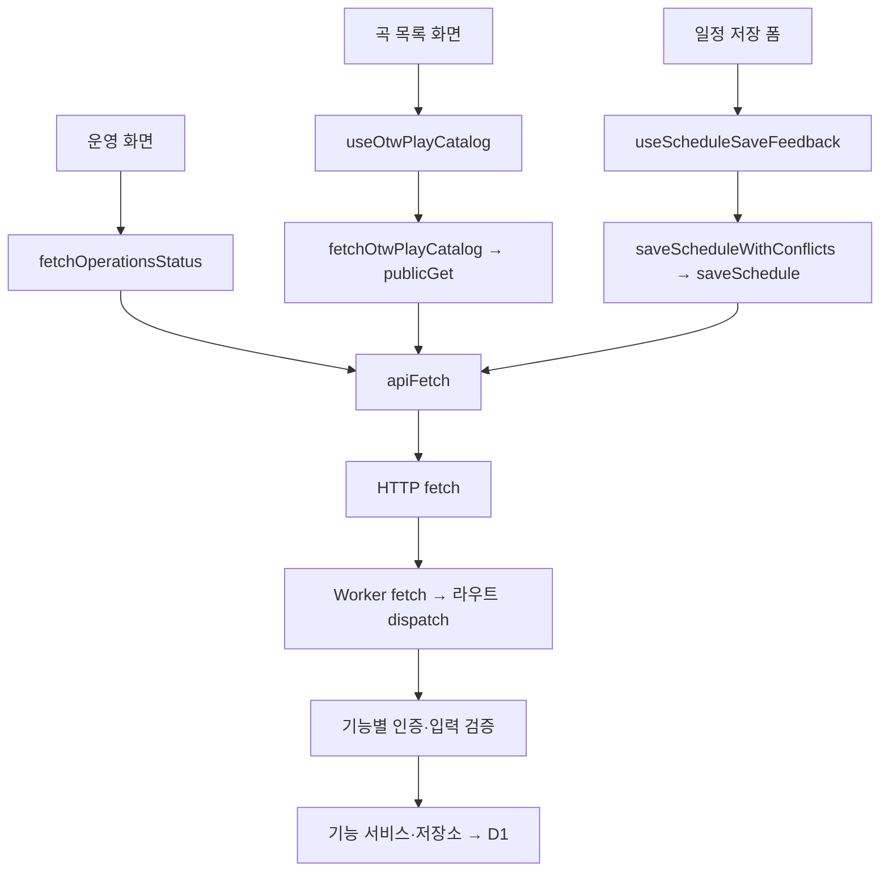

# Q: 연결 경로 추적

## Answer

# apiFetch 연결 경로 추적

기준 커밋: `58cb3f7e26146614b0af06dc4cc61ab086a35702`.
Graphify의 원본 `calls` 간선을 방향에 맞게 추적하고 현재 소스와 대조했다. 검색 확장 어휘는 실제 그래프에 존재하는 `api`, `fetch`다. HTTP 경계는 자동 추출 간선으로 간주하지 않고 공유 경로 계약과 Worker 라우트 등록부로 확인했다. 실제 요청이나 데이터 변경을 실행한 결과는 아니다.

## 1. 운영 상태 조회

`OperationsDashboard → useQuery → fetchOperationsStatus → apiFetch → GET /api/operations/status?windowHours=24 → Worker → createOperationsHandler → requireAdminUser → application.getStatus → getOperationsStatus → D1 상태 집계`

- 화면의 직접 호출: [operations-dashboard.tsx:658](C:/Develop/overthewall-schedule/src/features/operations/ui/admin/operations-dashboard.tsx:658). 별도 전용 query hook을 거치지 않고 화면에서 `useQuery`를 구성한다. staleTime은 30초다.
- API 모듈: [operations.ts:16](C:/Develop/overthewall-schedule/src/features/operations/api/operations.ts:16). URL을 공통 계약으로 만들며 `cache: no-store`를 전달한다. 인증 모드는 apiFetch 기본값인 optional이다.
- Worker 등록: [routes.ts:1221](C:/Develop/overthewall-schedule/worker/app/routes.ts:1221).
- 서버 권한과 요청 검증: [handler.ts:65](C:/Develop/overthewall-schedule/worker/features/operations/http/handler.ts:65). 관리자 인증 후 windowHours가 1–168 범위 정수인지 검사한다.
- 실제 조회 진입점: [operations-application.ts:649](C:/Develop/overthewall-schedule/worker/features/operations/infrastructure/operations-application.ts:649). `env.otw_db`에서 설정·실행·사용량 등을 읽어 상태를 집계한다.
- Graphify 근거: OperationsDashboard → fetchOperationsStatus(L658), fetchOperationsStatus → apiFetch(L20), 모두 EXTRACTED 호출 간선.

## 2. OTW Play 곡 목록

`/play/songs → OtwPlayCatalogPage → useOtwPlayCatalog → useInfiniteQuery → fetchOtwPlayCatalog → publicGet → apiFetch → GET /api/play/catalog → Worker → createPublicCatalogHandler → 회원 인증 → PublicCatalogService.browseCatalog → D1PublicCatalogReader.readCatalog`

- 화면: [catalog-page.tsx:49](C:/Develop/overthewall-schedule/src/features/otw-play/ui/public/catalog-page.tsx:49).
- 페이지네이션과 쿼리 캐시: [use-public-catalog.ts:72](C:/Develop/overthewall-schedule/src/features/otw-play/queries/use-public-catalog.ts:72). 커서를 다음 요청에 넣고, 일반 화면과 관리자 미리보기의 query key를 구분한다.
- URL 직렬화 및 인증 옵션: [public.ts:105](C:/Develop/overthewall-schedule/src/features/otw-play/api/public.ts:105). config만 auth=omit이고 카탈로그 등은 auth=required다. 관리자 미리보기에는 별도 헤더도 붙인다.
- 서버 인증: [public-catalog-handler.ts:513](C:/Develop/overthewall-schedule/worker/features/otw-play/http/public-catalog-handler.ts:513). config 외에는 회원 인증, 미리보기는 추가 관리자 인증을 수행한다.
- 서비스: [public-catalog-service.ts:175](C:/Develop/overthewall-schedule/worker/features/otw-play/application/public-catalog-service.ts:175). 공개 상태·검색 조건·커서를 검증하고, 허용된 캐시 적중이면 반환하거나 reader를 조회한다.
- D1 구현 연결: [routes.ts:206](C:/Develop/overthewall-schedule/worker/app/routes.ts:206).
- Graphify 근거: 화면 → hook(L49) → fetchOtwPlayCatalog(L83) → publicGet(L131) → apiFetch(L109), 모두 EXTRACTED 호출 간선.

## 3. 일정 저장과 화면 재조회

`DailySchedule 저장 폼 → handleSaveSchedule → scheduleSave.save → useScheduleSaveFeedback → saveScheduleWithConflicts → saveSchedule → apiFetch → POST /api/schedules/save → Worker → 입력·쓰기 권한 검사 → ScheduleService.save → saveWithConflictResolution → D1 batch`

- 화면 제출: [daily-schedule.tsx:239](C:/Develop/overthewall-schedule/src/features/schedule-board/ui/daily/daily-schedule.tsx:239), 폼 연결은 L820.
- 저장·후속 피드백: [use-schedule-save-feedback.ts:36](C:/Develop/overthewall-schedule/src/features/schedule-board/queries/use-schedule-save-feedback.ts:36).
- 날짜 변환과 API 호출: [save-schedule.ts:14](C:/Develop/overthewall-schedule/src/features/schedules/use-cases/save-schedule.ts:14), [schedules.ts:54](C:/Develop/overthewall-schedule/src/features/schedules/api/schedules.ts:54).
- 서버: [schedule-handler.ts:106](C:/Develop/overthewall-schedule/worker/features/schedules/http/schedule-handler.ts:106). JSON 입력을 검증하고 선택적 인증 결과를 쓰기 정책에 넘긴 후 service.save를 호출한다.
- 충돌 처리와 저장: [d1-schedule-write-repository.ts:80](C:/Develop/overthewall-schedule/worker/features/schedules/infrastructure/d1-schedule-write-repository.ts:80). 충돌 일정 조회·삭제 로그·삭제 및 상태에 따른 저장을 D1 batch로 실행한다.
- 성공 응답 후 `queryKeys.schedules.all`을 무효화해 다시 읽는다. 재조회 실패는 저장 실패와 구분하며 `retryRefresh`는 읽기만 재시도한다. [use-schedule-save-feedback.ts:18](C:/Develop/overthewall-schedule/src/features/schedule-board/queries/use-schedule-save-feedback.ts:18).
- Graphify 근거: useScheduleSaveFeedback → saveScheduleWithConflicts(L37) → saveSchedule(L16) → apiFetch(L55), 모두 EXTRACTED 호출 간선. repository 인터페이스를 통한 호출 일부는 INFERRED이며 실제 주입 구현을 routes.ts:142에서 대조했다.

## 공통 경계와 변경 영향

- [apiFetch:97](C:/Develop/overthewall-schedule/src/shared/api/client.ts:97)는 Clerk 토큰 획득, Authorization 헤더, JSON 직렬화, fetch, 응답 파싱, ApiError 변환을 담당한다. required에 토큰이 없으면 요청 전 401 오류를 던진다. omit은 Authorization과 쿠키 전송을 배제한다.
- 캐시 키·목록 갱신은 query/UI 계층이, 서버 권한·도메인 정책·영속성은 Worker 기능 계층이 담당한다.
- [Worker 진입점](C:/Develop/overthewall-schedule/worker/index.ts:9) → [handleWorkerFetch:117](C:/Develop/overthewall-schedule/worker/app/fetch.ts:117) → `workerRouteRegistry.dispatch`로 요청이 들어간다. API URL의 공통 기준은 [api-routes.ts](C:/Develop/overthewall-schedule/contracts/api-routes.ts)다.
- apiFetch의 인증·헤더·응답 처리 변경은 여러 기능에 영향을 준다. 특정 기능의 payload·검색 조건 변경은 해당 API 모듈과 공유 계약, Worker 처리기를 함께 살펴봐야 한다.
- 기존 그래프의 degree 114는 호출자 수가 아니라 여러 종류의 인접 관계 수다. 테스트나 import 연결을 실제 사용자 호출 흐름으로 해석하지 않았다.

## Outcome

- Signal: useful

## Source Nodes

- apiFetch()
- OperationsDashboard()
- OtwPlayCatalogPage()
- useScheduleSaveFeedback()