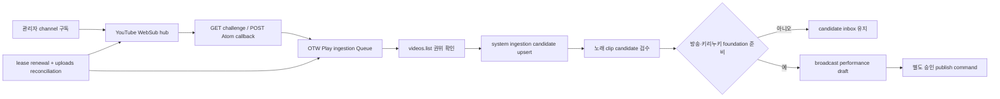

# OTW Play YouTube 노래 클립 채널 구독·신규 영상 후보 자동화 조사 보고서

상태: 2026-08-21 대상 범위·권장 운영값 채택, 구현 전

조사일: 2026-08-20

결정일: 2026-08-21

상위 문서: `otw-play-product-requirements.md`

선행 문서: `otw-play-catalog-bulk-ingestion-and-proposal-lifecycle-research.md`

## 1. 결론

자동 구독 대상은 OTW·멤버 공식 channel이 아니라 노래 방송에서 곡별 clip을 제작하는
관리자 승인 channel이다. OTW·멤버 공식 영상은 관리자 단건 등록 또는 playlist 벌크
입력으로 직접 관리한다. 승인된 clip channel의 신규 영상을 near-real-time으로 발견해
`singing_clip` 검수 후보를 만드는 자동화는 다음 hybrid로 구현한다.

- primary: YouTube 공식 PubSubHubbub/WebSub push notification
- reliability fallback: channel의 uploads playlist를 주기적으로 reconciliation
- processing: playlist import와 공유하는 D1 ingestion candidate + Cloudflare Queue
- publication: 자동 publish 금지. 방송·키리누키 foundation과 승인 정책이 준비되기
  전에는 catalog draft 변환도 금지

`search.list(channelId,order=date)` polling은 누락 확인의 주 경로로 사용하지 않는다.
channel resource가 제공하는 uploads playlist는 1-unit list API로 순회할 수 있고,
WebSub는 upload 및 title/description update를 push한다.

## 2. 공식 API 근거

YouTube는 channel feed에 대한 PubSubHubbub push notification을 공식 지원한다.
notification은 upload 또는 video title/description update 때 전송되며 Atom payload의
`yt:videoId`, `yt:channelId`로 대상을 식별할 수 있다.

- [YouTube push notifications](https://developers.google.com/youtube/v3/guides/push_notifications)
- [W3C WebSub Recommendation](https://www.w3.org/TR/websub/)

channel의 `contentDetails.relatedPlaylists.uploads`는 해당 channel의 upload playlist
ID다. uploads playlist는 `playlistItems.list`로 읽는다.

- [YouTube channel resource](https://developers.google.com/youtube/v3/docs/channels)
- [YouTube sample requests](https://developers.google.com/youtube/v3/sample_requests)

WebSub subscription은 영구가 아니라 lease다. callback은 intent verification GET에서
topic을 대기 중 subscription과 대조하고 `hub.challenge`를 그대로 응답해야 하며,
`hub.lease_seconds` 만료 전에 재구독해야 한다. notification POST는 빨리 2xx로 받고
실제 처리는 Queue로 넘긴다.

## 3. 접근 방식 비교

| 방식 | 장점 | 한계 | 판정 |
| --- | --- | --- | --- |
| WebSub push | near-real-time, 변화가 없을 때 API polling 없음 | lease 갱신, webhook 검증·유실 보완 필요 | primary |
| uploads playlist polling | 순서·pagination이 명확하고 1-unit list 사용 | 주기만큼 지연, 매번 page read | reconciliation |
| `search.list` polling | 날짜·검색 filter 제공 | 별도 search quota와 pagination, discovery에 불필요 | 사용하지 않음 |
| `activities.list` | channel activity 표현 | 완전한 upload ledger 계약으로 사용하기 어려움 | 사용하지 않음 |

WebSub만 사용하면 callback outage나 lease 만료 중 event를 놓칠 수 있다. uploads
playlist만 사용하면 불필요한 polling과 지연이 생긴다. 따라서 push + daily 또는
6시간 reconciliation 조합이 가장 안정적이다.

## 4. 자동화 정책

### 4.1 구독 가능 channel

다음 조건을 모두 만족해야 한다.

- `music_channels.provider='youtube'`
- `verification_status='approved'`
- `active=1`
- `channel_role='approved_kirinuki'` 또는 이를 대체하는 명시적 clip-curation 승인 role
- channel 운영 주체와 clip 사용·게시 승인 범위를 관리자가 확인
- 관리자가 automation을 별도로 활성화

OTW·멤버 공식·노래 channel은 자동 구독하지 않고 직접 입력한다. clip channel
allowlist 승인과 automation 구독 승인은 별도이며, channel이 승인되었다는 이유만으로
모든 upload를 자동 수집하거나 공개하지 않는다.

### 4.2 생성 결과

- 신규 video: `candidate_kind='singing_clip'`, status `discovered` ingestion candidate를
  upsert한다.
- 기존 candidate: `channel_websub` origin과 최신 확인 시각만 추가한다.
- 기존 catalog source: YouTube metadata refresh/source-health를 요청한다.
- title/description update: 새 candidate를 만들지 않고 동일 video를 refresh한다.
- private/deleted/missing item: candidate 상태를 `blocked` 또는 재시도 상태로 유지한다.

`singing_clip` candidate는 곡명·가창자·원본 방송·방송일·segment·clip 승인 상태가
필요하다. 방송·키리누키 aggregate와 변환 command가 구현되기 전에는 candidate inbox에서
검수·ignore·block만 가능하고 catalog draft를 만들 수 없다.

notification만으로 신규 upload와 metadata update를 권위 판정하지 않는다.
`videos.list(part=snippet,contentDetails,status)`로 video ID와 실제 channel ID,
privacy/embed/region 상태를 다시 확인한다.

### 4.3 자동 분류

자동화가 할 수 있는 것:

- channel/entity 기본 연결
- YouTube metadata·재생 상태 수집
- title keyword에 따른 triage priority 제안
- API가 제공하는 duration/live 상태와 Shorts 후보 표시
- 기존 source/proposal/candidate 중복 분류

자동화가 해서는 안 되는 것:

- title만으로 곡명·원곡 가수·참여자를 확정
- `original|cover` 관계를 확정
- 원본 방송·방송일·segment·clip 사용 승인을 추측
- 방송·키리누키 foundation 전에 catalog draft로 변환
- policy가 불명확한 영상을 publish
- unavailable item을 deleted/private로 추측
- 멤버 proposal submitter나 관리자 actor를 위조

## 5. 권장 처리 흐름

### 5.1 subscription 생성

1. 관리자가 clip channel의 운영 주체, 허용 범위, `approved_kirinuki` role과 수집
   정책을 확인한다.
2. application이 channel의 uploads playlist ID를 `channels.list`로 readback한다.
3. random callback capability token과 pending subscription row를 만든다.
4. Google hub에 `hub.mode=subscribe`, topic, HTTPS callback, secret을 요청한다.
5. callback GET에서 mode/topic/token을 검증하고 challenge를 echo한다.
6. hub가 준 lease seconds로 `lease_expires_at`을 기록한다.

### 5.2 notification 수신

1. callback path의 capability token과 WebSub signature를 검증한다.
2. XML parser는 DTD/external entity를 금지하고 body size를 제한한다.
3. feed channel/topic과 active subscription을 대조한다.
4. `(channelId,videoId,updatedAt)` delivery key를 D1에 기록하고 Queue에 enqueue한다.
5. 빠르게 `204`를 반환한다.
6. consumer가 `videos.list`로 확인하고 candidate/source를 idempotent upsert한다.

hub가 `hub.secret` signature를 제공하는 경우 반드시 검증한다. signature 지원 여부가
불확실해도 unguessable callback URL, topic 대조와 authoritative `videos.list` 확인은
유지한다.

### 5.3 lease renewal

- 매일 scheduled task가 `lease_expires_at`이 48시간 이내인 subscription을 claim한다.
- 갱신은 source-health와 독립 task로 실행해 실패를 격리한다.
- hub가 반환한 lease가 권위이며 성공 verification 뒤에만 active expiry를 갱신한다.
- 반복 실패는 `renewal_failed`와 safe code를 기록하고 관리자 화면에 노출한다.
- channel revoke/inactive 또는 automation off 시 unsubscribe를 요청하고 local 상태를
  즉시 disabled로 닫는다.

### 5.4 reconciliation

- 기본 6시간마다 active clip channel의 uploads playlist를 watermark가 나올 때까지
  읽되 한 channel·한 실행 최대 250개로 제한한다.
- `last_seen_published_at + video ID` watermark보다 새 항목을 candidate pipeline에 넣는다.
- 최소 하루 한 번은 최근 50개를 중복 확인해 WebSub 누락을 복구한다.
- 250개 cap까지 watermark가 나오지 않으면 `gap_suspected`로 닫고 관리자가 범위를
  확인한다.
- 장기 outage 또는 신규 구독 backfill은 관리자가 `최근 N개 가져오기`를 실행한다.
- backfill default는 0이다. 구독 활성화만으로 과거 전체 영상을 자동 적재하지 않는다.
- canary에서는 필요할 때만 최근 20개를 별도 수동 import한다.

## 6. 데이터 모델

### 6.1 `music_channel_subscriptions`

권장 필드:

- `id`, `channel_id`, `uploads_playlist_id`, `candidate_kind='singing_clip'`
- `status`: `pending|active|renewing|renewal_failed|disabled`
- `candidate_mode`: 최초에는 `review_only` 고정
- `callback_token_hash`, `websub_secret_version`
- `lease_expires_at`, `last_verified_at`, `last_notification_at`
- `last_reconciled_at`, `last_seen_video_id`, `last_seen_published_at`
- `version`, `created_by_user_id`, `created_at`, `updated_at`

root secret은 Cloudflare secret `OTW_PLAY_WEBSUB_SECRET_V1`에 저장하고
`channelId + subscriptionGeneration`으로 channel별 signature key를 파생한다. D1에는
secret 원문을 넣지 않는다. 회전은 V2와 V1을 48시간 함께 허용한 뒤 V1을 제거하며,
UI에는 configured/version 여부만 제공한다.

### 6.2 delivery와 audit

- `music_channel_subscription_deliveries`: delivery key, channel/video, received/processed
  시각, outcome, safe error code
- retention은 짧게 유지하되 candidate origin과 catalog event는 장기 감사 이력으로 남긴다.
- event: `channel.subscription_created|renewed|disabled|failed`,
  `candidate.discovered|refreshed|blocked|converted`

playlist import의 `music_ingestion_candidates`와 origin table을 반드시 재사용한다. 별도
자동화 candidate table을 만들면 중복 triage와 변환 command가 생긴다.

## 7. 관리자 API와 UI

### 7.1 API

| method | route | 역할 |
| --- | --- | --- |
| `GET` | `/api/play/admin/channel-subscriptions` | 상태·lease·최근 동기화 목록 |
| `POST` | `/api/play/admin/channel-subscriptions` | approved clip channel 구독 시작 |
| `PATCH` | `/api/play/admin/channel-subscriptions/:id` | expectedVersion 기반 설정 변경 |
| `POST` | `/api/play/admin/channel-subscriptions/:id/renew` | 수동 lease 갱신 |
| `POST` | `/api/play/admin/channel-subscriptions/:id/reconcile` | 최근 upload 수동 대조 |
| `DELETE` | `/api/play/admin/channel-subscriptions/:id` | unsubscribe·disable |
| `GET/POST` | `/api/play/webhooks/youtube/:token` | challenge와 notification callback |

webhook만 public route이며 admin session과 무관하다. callback은 별도 rate limit, body
limit, XML parser, secret/capability 검증을 적용한다.

### 7.2 UI

관리자 `가져오기` 아래 `노래 클립 자동 후보` 화면을 둔다.

- clip channel, 운영·승인 메모, role, active/verification 상태
- subscription 상태, lease 만료, 마지막 notification/reconciliation
- 발견·대기·blocked candidate 수
- `구독`, `일시 중지`, `갱신`, `지금 대조`, `최근 N개 가져오기`
- 최근 safe error와 다음 자동 재시도
- 해당 channel candidate filter로 이동

구독 dialog는 “OTW·멤버 공식 channel용 기능이 아님”, “노래 clip 후보만 생성되며
자동 공개·draft 변환되지 않음”, 과거 backfill 범위와 notification·reconciliation
동작을 명시한다.

## 8. 실패·중복·보안 경계

- Queue는 at-least-once이므로 delivery key와 video candidate unique로 효과를 dedupe한다.
- webhook 2xx와 실제 candidate 생성 성공을 같은 것으로 간주하지 않는다.
- invalid XML/signature/topic/channel은 Queue에 넣지 않고 safe failure event만 남긴다.
- provider 429/quota/5xx는 기존 source/candidate 상태를 보존하고 retry한다.
- non-quota 400/401/403은 shared dependency failure로 운영 화면에 올린다.
- WebSub delivery 순서를 신뢰하지 않는다. `videos.list`와 monotonic local timestamps가
  권위다.
- notification title·description, API error body, token, secret을 structured telemetry에
  넣지 않는다.
- 구독한 channel이 revoked/inactive가 되면 candidate 생성과 reconciliation을 즉시
  중단한다.
- channel 승인에는 운영 주체, clip 사용·게시 범위와 해제 절차를 기록한다. 기술적
  구독 성공은 권리·게시 승인을 뜻하지 않는다.
- Made for Kids item은 별도 policy review로 보내고 자동 draft 변환하지 않는다.
- public read/navigation flag와 독립적으로 운영하되 자동 결과는 언제나 비공개다.

## 9. 비용과 quota

현재 공식 quota 표 기준 `channels.list`, `playlistItems.list`, `videos.list`는 각각
1 unit이다. 예를 들어 active channel 20개를 6시간마다 uploads 첫 page로 대조하면
playlist read는 하루 약 80 unit이고, 실제 신규 video metadata batch만 추가된다.
이는 `search.list` 기반 polling보다 예측 가능하다.

Cloudflare Queue는 at-least-once delivery와 retry 비용이 있으므로 다음을 계측한다.

- notification received/verified/rejected
- queue enqueued/processed/retried/DLQ
- candidate new/existing/blocked
- subscription active/expiring/failed
- channel별 reconciliation latency와 last seen gap

다채널 API Data를 한 서비스에서 집계하는 운영은 YouTube Developer Policies의 Data
Aggregation 조항에 대한 별도 compliance 확인이 선행되어야 한다. 자동화가 기술적으로
가능하다는 사실을 channel 확대 승인으로 간주하지 않는다.

## 10. 전달 순서

노래 clip channel 자동화는 playlist import보다 먼저 구현하지 않는다.

1. PR-9B ingestion job/candidate/Queue foundation
2. PR-9C playlist bulk 검수·draft 변환으로 candidate 운영 흐름 검증
3. PR-9D1 approved clip channel WebSub callback, subscription state, renewal,
   reconciliation과 `singing_clip` candidate inbox
4. 권리·운영 범위를 확인한 approved clip channel 1개, backfill 0으로 7일 canary
5. 필요 시 최근 20개 수동 import와 notification → candidate readback 뒤 channel 확대
6. P3 방송·키리누키 foundation 뒤 PR-9D2 candidate → broadcast draft 변환

## 11. 수용 기준

- subscription challenge가 pending topic과 일치할 때만 성공한다.
- upload notification 한 건이 candidate 한 건만 만들고 재전송은 origin/delivery만 갱신한다.
- title/description update가 새 candidate를 만들지 않는다.
- payload channel과 `videos.list` channel이 다르면 후보를 만들지 않는다.
- webhook 응답은 downstream YouTube/D1 처리 완료를 기다리지 않는다.
- lease 만료 전 갱신하고 갱신 실패를 관리자에게 표시한다.
- WebSub notification을 의도적으로 누락한 fixture가 reconciliation에서 복구된다.
- revoked/inactive channel은 notification을 받아도 candidate를 만들지 않는다.
- API quota/retryable outage에서 기존 권위 상태가 보존된다.
- backfill 0 기본값과 명시적 최근 N개 import가 구분된다.
- official/member channel은 automation 대상이 아니며 직접 입력 경로를 사용한다.
- candidate는 방송·키리누키 foundation 전에 catalog draft로 변환되지 않는다.
- foundation 이후에도 candidate는 자동 publish되지 않고 실제 관리자 검수·변환을
  요구한다.

## 12. 채택 결과와 남은 운영 gate

| ID | 상태 | 확정값 또는 남은 확인 |
| --- | --- | --- |
| GATE-AUTO-01 | 해결 | P0-A Queue/DLQ, D1 job과 retention 정책 재사용 |
| GATE-AUTO-02 | 기본 정책 해결 | approved clip channel 1개, backfill 0, 필요 시 최근 20개. 실제 channel ID는 운영 전 지정 |
| GATE-AUTO-03 | 해결 | Cloudflare root secret, channel별 파생 key, V1/V2 48시간 회전 |
| GATE-AUTO-04 | 해결 | 6시간 watermark reconciliation, 실행당 250개 cap, 일일 최근 50개 중복 확인 |
| GATE-AUTO-05 | 해결 | title keyword는 내부 triage priority만 사용, 관리자 override 필수 |
| GATE-AUTO-06 | 운영 전 확인 | 실제 clip channel의 운영 주체·사용/게시 승인 범위와 YouTube API compliance |

채택 기본값은 `approved_kirinuki`, `candidate_kind='singing_clip'`, `review_only`,
backfill 0, 6시간 reconciliation과 자동 draft/publish 금지다. OTW·멤버 공식 channel은
이 자동화가 아니라 직접 입력 경로를 사용한다.
