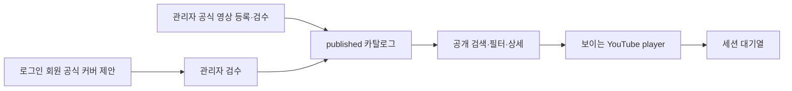

# OTW Play 구현 가이드와 단계별 플랜

상태: PR-7.1 회원 제안 Play 통합·Wizard UX 보완 중

기준일: 2026-08-19

상위 문서: `otw-play-product-requirements.md`

설계 문서:

- `otw-play-system-design.md`
- `otw-play-ui-ux-design.md`

## 1. 문서 목적

이 문서는 승인된 설계를 실제 구현으로 옮길 때의 순서, 파일 경계, migration,
테스트, 운영 데이터 입력, 단계적 공개와 rollback 기준을 정의한다. 현재 단계는
PR-6 공개 Discover·Catalog·곡 상세, participant/groupKey 호환과 Play-scoped 단일
YouTube player까지 완료되었다. 현재 단계는 회원 제출, 내 제안과 관리자
승인·published catalog 반영 E2E다. 저장 플레이리스트, SEO, production flag 변경,
배포와 원격 적용은 포함하지 않는다.

목표는 테스트만 통과한 조각이 아니라 다음 실제 흐름이 완성되는 것이다.



## 2. 구현 착수 gate

### 2.1 구현을 시작할 수 있는 기본 결정

다음은 현재 설계 기본값으로 개발을 진행할 수 있다.

- 공개 route: `/play`
- 공개 읽기: 로그인 없이 허용
- 내비게이션 라벨: `OTW Play`
- player 유지: `/play/*` 내부에서만 유지
- queue: frontend session 상태, 저장 플레이리스트 아님
- DB table 접두사: `music_*`
- 코드 capability: `otw-play`
- MVP: 오리지널과 공식 커버만 공개

공개 route, 접근 권한과 내비게이션은 후속 API·UI slice의 설계 기본값이다.
PR-3에서도 해당 route contract나 실행 경로를 만들지 않는다.

### 2.2 관련 slice 전에 확정해야 하는 제품 결정

| ID      | 확인 항목                            | 필요 시점               | 기본 권장안                                      |
| ------- | ------------------------------------ | ----------------------- | ------------------------------------------------ |
| GATE-01 | 공식 커버 인정 기준과 허용 채널      | 해결됨                  | DEC-044 `official_cover_v1`                      |
| GATE-02 | 초기 입력 대상 곡·멤버               | 운영 데이터 입력 전     | 그룹별 대표 5–10곡으로 검증                      |
| GATE-03 | 전 소속 멤버의 과거 공식곡 포함 범위 | 초기 데이터 입력 전     | 기록 보존, 현재 화면은 external 표시             |
| GATE-04 | 회원 제안 수정·철회                  | 해당 command 구현 전    | pending_review에서만 허용                        |
| GATE-05 | 거절 사유를 회원에게 보이는 범위     | 해결됨                  | 상태·일반 안내만 노출, 내부 code·note 비공개     |
| GATE-06 | 회원별 제출 제한                     | 해결됨                  | KST 일 5회 + 사용자별 edge 60초당 3회            |

결정되지 않은 slice만 보류하고 독립적인 domain, schema, 공개 read와 관리자
draft 작업은 계속할 수 있다. 결정 결과는 요구사항 문서의 TBD와 변경 이력에
먼저 반영한다.

GATE-01·05·06은 DEC-043~045로 해결되었다. GATE-04는 미확정이므로 PR-7에 회원
수정·철회 command나 control을 만들지 않는다.

## 3. 전달 전략

### 3.1 원칙

- 한 PR은 하나의 검증 가능한 architecture/foundation slice를 소유한다.
- schema migration PR과 이를 사용하는 runtime을 순서 없이 나누지 않는다.
- 중간 slice도 최종 상태 모델과 dependency direction을 사용한다.
- 임시 공개 endpoint, mock-only data path와 우회 관리자 SQL을 제품 경로로 남기지 않는다.
- PR-4의 공개 API는 `public_read_enabled=0`인 숨김 상태에서 실제 migration을
  적용한 격리 D1과 테스트 fixture로 계약·누출 방지·성능만 검증한다. 운영
  catalog 데이터를 입력하거나 공개 readback으로 검증하지 않는다.
- 관리자 입력 경로가 완성되는 PR-5 이후에만 실제 검수 데이터를 authoritative
  readback하고, 공개 UI 검증은 PR-6에서 수행한다.
- 각 PR의 설명에는 요구사항 ID, migration 영향, cache/auth 경계와 rollback을 적는다.

### 3.2 권장 PR 흐름

| PR   | 결과                                              | 원격 영향                                                             |
| ---- | ------------------------------------------------- | --------------------------------------------------------------------- |
| PR-1 | 공유 계약, 순수 domain과 공개 index               | 없음                                                                  |
| PR-2 | catalog foundation schema와 migration             | additive D1 artifact, 이번 PR에서는 원격 미적용·release 단계에서 적용 |
| PR-3 | proposal·event·search/meta schema와 migration     | additive D1 artifact, 이번 PR에서는 원격 미적용·release 단계에서 적용 |
| PR-4 | 공개 catalog query/API/cache                      | 숨겨진 API                                                            |
| PR-5 | 관리자 catalog command와 UI                       | 관리자 전용                                                           |
| PR-6 | 공개 Discover/Catalog/Detail과 player             | feature flag 뒤                                                       |
| PR-7 | 회원 제출·내 제안·관리자 승인 E2E                 | 로그인/관리자 전용                                                    |
| PR-8 | SEO, source health, observability, release switch | 단계적 공개                                                           |

PR 수는 코드 규모에 따라 더 쪼갤 수 있지만 migration 번호 하나에 무관한
기능을 섞지 않는다.

## 4. 0단계 — 기준선 확정

### 결과

- 제품 요구사항, 시스템 설계, UI 설계와 구현 계획의 경계가 일치한다.
- 상태 축과 공개·회원·관리자 경계가 확정된다.
- 구현 PR에서 사용할 requirement trace 표가 준비된다.

### 작업

- 현재 문서의 TBD와 gate 검토
- `/play` route와 공개 접근 확정
- 공식 채널 운영 규칙 확정
- 초기 입력 샘플과 담당자 결정
- 성능 fixture 규모 결정

권장 fixture:

- 대표: 곡 300개, 내부·외부 인원 80명, 600 performances, 700 sources
- 상한 검증: 곡 3,000개, search term 10,000개, performances 8,000개

fixture는 성능과 테스트용이며 production seed가 아니다.

### 종료 조건

- 관련 TBD의 상태가 문서에서 명확하다.
- 공개·제안·관리자 API가 같은 status field를 공유하지 않는다.
- 구현 파일 이름과 route naming이 합의되어 있다.

## 5. 1단계 — 계약과 순수 domain

### 결과

Cloudflare, React와 D1 없이도 핵심 규칙을 테스트할 수 있다.

### 주요 touchpoint

- `contracts/otw-play.ts`
- `worker/features/otw-play/domain/*`
- `worker/features/otw-play/index.ts`

실제 handler가 없는 route 상수는 만들지 않는다. application use case와 port는
실제 행동과 테스트가 생기는 후속 slice에서만 추가하며 빈 interface나
pass-through class를 미리 만들지 않는다.

PR-1은 `db/schema/index.ts`, Drizzle migration, `contracts/api-routes.ts`,
`worker/app/routes.ts`, API handler, frontend route, UI, player와 배포 설정을
수정하지 않는다. YouTube API도 호출하지 않는다.

### 구현 순서

1. 상태 축, 분류 3축, channel/source role, 참여자 종류와 공개 오류 계약 정의
2. 검색 정규화 함수
3. YouTube URL/video ID parser
4. proposal과 publication 상태 전이
5. exact/soft duplicate policy
6. source priority policy
7. runtime crypto에 의존하지 않는 결정적 dedupe key material

### 필수 단위 테스트

- 한글·일본어·영문과 호환 문자의 NFKC 정규화
- 공백과 구두점만 다른 입력의 동일 검색 key
- watch, `youtu.be`, embed와 Shorts URL의 11자리 video ID 추출
- 악성·유사 host, malformed URL과 잘못된 video ID 거부
- `pending_review`의 승인·거절과 proposal terminal state 재전이 거부
- `draft` → `published` → `withdrawn` publication 전이
- `published + unavailable source` 조합 허용
- 상태 축 사이 값 혼입 거부
- exact duplicate와 soft duplicate의 근거 분리 및 자동 병합 금지
- 같은 입력의 dedupe key material이 결정적임
- source priority 동시값에서 ID tie-break가 안정적임

### 종료 조건

- `pnpm architecture:check`
- domain에 runtime adapter import가 없음
- 공유 계약에 Drizzle row 또는 Cloudflare runtime type이 노출되지 않음
- 비어 있는 계층과 실행되지 않는 route contract가 없음

## 6. 2단계 — D1 catalog foundation

### 결과

곡, entity, channel, media source, performance와 관계를 정규화해 저장할 수 있다.

### 주요 touchpoint

- `db/schema/index.ts`
- 생성된 `drizzle/*.sql`
- 생성된 `drizzle/meta/*`
- `worker/features/otw-play/infrastructure/*.integration.test.ts`
- `scripts/d1-local-options.mjs`
- `scripts/d1-doctor.mjs`, `scripts/d1-doctor-core.mjs`와 회귀 테스트
- `scripts/d1-seed-local.mjs`, `scripts/d1-seed-guard.mjs`와 회귀 테스트
- `scripts/fixtures/local-d1-seed.sql`

API contract·handler, `worker/app/routes.ts`, frontend route·UI·player, 배포
설정과 원격 D1 적용은 PR-2에서 수정하거나 실행하지 않는다. production content와
운영 seed도 migration에 포함하지 않는다.

seed fixture는 `music_*` row를 삽입하지 않는다. 기존 music row를 보호 대상에
포함하고 명시적인 fixture 교체에서만 FK child-first 순서로 정리한다. seed와
doctor의 `--persist-to=<dir>`는 local D1 전용이며 두 명령에 같은 검증 경로를
전달한다. PR-2에서 remote doctor를 실행하지 않는다.

### migration A: catalog foundation

- `music_entities`, `music_entity_aliases`
- `music_songs`, `music_song_aliases`, `music_song_original_artists`
- `music_channels`, `music_channel_entities`
- `music_media_sources`, `music_media_source_relations`
- `music_performances`, `music_performance_participants`, `music_performance_sources`
- FK, CHECK, exact duplicate, source segment UNIQUE와 performance별 primary source
  partial UNIQUE

### PR-2 exact schema 결정

- `music_songs.is_otw_original`이 OTW 오리지널곡 여부의 권위이며 기본값 없는
  `NOT NULL` 입력이다.
- `music_channel_entities`는 별도 relation type 없이 연결 row 자체가 관계이며
  `(channel_id, entity_id)`를 복합 PK로 사용한다.
- `music_media_source_relations`는 두 source의 순서가 의미를 갖는 directed
  relation이며 self relation을 허용하지 않는다.
- `music_performances.dedupe_key`는 생성 후 immutable이고 metadata 수정으로
  다시 계산하지 않는다.
- `music_performance_sources`는 `(source_id, start_seconds)`를 UNIQUE로 유지한다.
- `music_performance_sources.priority`는 `NOT NULL DEFAULT 0`이고 음수를 거부한다.
- version, epoch-ms timestamp, credit order, source 구간과 priority는 SQLite
  `typeof(...) = 'integer'` CHECK로 REAL 값을 거부한다.
- 알려진 원곡 공개일 precision은 NULL을 허용하지 않고 `day`는 실제 달력 날짜를
  검증한다.
- `music_songs(merged_into_song_id)`와 `music_performances(song_id)`에는 FK child
  lookup을 위한 일반 index를 둔다.
- entity/song alias의 `alias_kind`는 nullable 자유 텍스트이며 CHECK 대상이 아니다.
- published performance partial index 세 개는 PR-3 search/meta migration으로
  미룬다.

### 작업 절차

```text
1. db/schema/index.ts 수정
2. pnpm drizzle:generate
3. 생성 SQL에서 예상하지 않은 DROP/ALTER/RENAME 검토
4. pnpm d1:reset:local -- --validate-only
5. 보호된 local D1의 검증 복사본에 `--persist-to`로 incremental migration 적용
6. 같은 검증 복사본에서 seed guard·fixture와 doctor 검증
7. 실제 생성 migration을 적용하는 isolated D1 integration test
```

직접 SQL이 필요한 partial index도 schema 표현 가능 여부를 먼저 확인한다.
Drizzle이 표현하지 못하는 custom SQL은 `pnpm drizzle:generate:custom`을 별도
결정으로 사용하며 schema와 migration의 차이를 문서화한다.

### 필수 DB 검증

- `PRAGMA foreign_key_check`
- `PRAGMA integrity_check`
- `PRAGMA schema_version`
- 주요 table의 `PRAGMA table_info`, `index_list`, `foreign_key_list`
- canonical source와 performance 관계의 round-trip
- 무효 enum/check insert 실패
- release source 삭제가 metadata를 연쇄 삭제하지 않음
- 한 performance에 primary source 하나만 허용
- `is_otw_original`이 performance relation과 독립적으로 round-trip
- `is_otw_original` NULL·생략 거부
- channel/entity 중복 link와 source self relation 거부
- directed source relation의 양방향 row가 서로 다른 관계로 보존됨
- 같은 source/start segment의 중복 performance 연결 거부
- source priority 기본값 `0`, NULL·음수 거부
- 정수 열의 fractional REAL 값 거부
- 알려진 공개일 precision의 NULL 및 잘못된 달력 날짜 거부
- nullable/free `alias_kind` 저장과 enum CHECK 부재
- performance dedupe key의 `NOT NULL UNIQUE`

performance dedupe key가 metadata 수정 대상에 포함되지 않는지는 PR-2의 DB
검증이 아니라 후속 repository 허용 field 목록과 application 회귀 테스트에서
검증한다.

### 종료 조건

- full migration chain과 isolated local D1에서 schema가 재현 가능하다.
- migration은 additive이며 기존 schedule 기능을 바꾸지 않는다.
- schema 단일 기준이 `db/schema/index.ts`다.
- API·UI·배포 설정 변경과 원격 D1 적용이 없다.

## 7. 3단계 — 제안·감사·검색 schema

### 결과

회원 입력을 canonical catalog와 격리하고, 승인 이력과 검색 projection을 제공한다.

API route·DTO contract·handler, application/repository, `worker/app/routes.ts`, frontend
route·UI, production catalog/proposal content, 배포 설정과 원격 D1 적용은 PR-3에
포함하지 않는다. 회원 제안 수정·철회 command, 거절 결과의 회원 노출, 제출
limit 숫자는 각각 GATE-04~06 확정 전 구현하지 않는다. quota/counter table도
추가하지 않는다.

### migration B: proposal·event

- `music_cover_proposals`
- `music_cover_proposal_participants`
- `music_cover_proposal_original_artists`
- `music_catalog_events`
- 사용자/idempotency UNIQUE, pending video/start partial UNIQUE
- status/submitter/reviewer와 event aggregate 조회 index
- proposal에는 channel 열이나 channel index를 두지 않음

### migration C: search·meta

- `music_search_terms`
- `music_catalog_meta` singleton 초기 row
- published partial `music_performances(released_at DESC, id)`
- published partial `music_performances(song_id, released_at DESC, id)`
- published partial `music_performances(relation_type, released_at DESC, id)`

### PR-3 exact schema 결정

- proposal aggregate는 UUID `TEXT` PK, epoch-ms `created_at/updated_at`, strict
  INTEGER `version >= 0`을 사용한다. 제출 URL/video/start/title, suggested song,
  private note, 독립 status, review lock pair, reviewer/time, private result/note와
  approved performance를 저장한다.
- proposal status는 `pending_review`, `approved`, `rejected`, `withdrawn`만
  허용하고 lock, reviewer/time, result/note, approved performance를 상태별 CHECK로
  일관되게 유지한다. terminal 상태는 lock을 가질 수 없다.
- suggested song은 `SET NULL`, approved performance는 `RESTRICT + UNIQUE`다.
  proposal child는 `(proposal_id, credit_order)` PK, proposal `CASCADE`, nullable
  resolved entity `RESTRICT`와 제출명 snapshot을 사용한다.
- proposal 제출 단계에는 channel identity를 저장하거나 YouTube API를 호출하지
  않는다. 채널·공개일 검증은 후속 관리자 승인 과정의 책임이다.
- event는 polymorphic aggregate FK 없이 ID, aggregate/event, actor, nullable JSON
  object before/after/detail과 시각을 저장한다. actor만 `member`, `admin`, `system`
  enum이며 aggregate/event와 `review_result_code`는 non-empty 자유 텍스트다.
- event detail은 allowlist를 사용하고 회원 note·내부 review note·이메일·token을
  복사하지 않는다. append-only는 후속 insert-only repository가 소유하며 DB
  trigger는 추가하지 않는다.
- `review_result_code`는 DB nullable 자유 텍스트지만 후속 reject command에서는
  non-empty 사유를 요구한다. GATE-05 전에는 이를 회원 노출 enum으로 만들지 않는다.
- search term kind는 `title`, `title_alias`, `original_artist`, `participant`다.
  PK는 `(song_id, term_kind, normalized_term)`이고 song 삭제 시 `CASCADE`다.
- catalog meta는 `id=1`, `revision=0`, `public_read_enabled=0`,
  `navigation_visible=0`, `updated_at=0`인 singleton으로 시작한다. navigation은
  public read 없이 켤 수 없다.
- catalog revision 단조 증가는 후속 mutation이 search projection·event와 같은
  D1 batch에서 수행한다. PR-3은 초기 row와 atomic increment SQL을 검증하며
  revision trigger는 추가하지 않는다.

### 생성 절차와 migration 분리

PR-2의 `0046_*`까지 적용된 schema에서 시작한다. 실제 다음 migration 번호가
다르면 그 번호를 따르되 현재 기준은 다음 세 artifact다.

1. `0047_*`: `db/schema/index.ts`의 proposal·event 4개 table을
   `pnpm drizzle:generate`로 생성한다.
2. `0048_*`: search/meta 2개 table과 published partial index 세 개를
   `pnpm drizzle:generate`로 생성한다.
3. `0049_*`: `pnpm drizzle:generate:custom`으로 빈 migration을 만든 뒤 구조적
   singleton `(1, 0, 0, 0, 0)` INSERT만 작성한다.

generated SQL·snapshot·journal은 직접 작성하거나 번호를 수동 할당하지 않는다.
custom migration에는 table/index/trigger나 운영 content를 넣지 않는다. 생성 SQL에
예상하지 않은 DROP, ALTER, RENAME이 없는지 검토하고 full chain과 PR-2 이후
incremental 적용을 모두 검증한다.

### 필수 integration test

- proposal 저장 시 canonical song/performance가 생기지 않음
- 같은 사용자·idempotency key가 row를 중복 생성하지 않음
- 같은 video/start pending 중복 거부
- 다른 사용자 proposal을 submitter predicate로 읽을 수 없음
- 잘못된 YouTube ID, enum, fractional integer, lock/status/review/performance 조합 거부
- proposal child의 순서, unresolved snapshot, role, CASCADE/RESTRICT/SET NULL
- rejected proposal과 event 보존, event actor pairing과 JSON object CHECK
- search term의 PK, enum, FK, CASCADE와 lookup index
- normalized prefix `GLOB` query가 lookup index를 range SEARCH로 사용함
- meta singleton의 fail-closed 초기값, strict integer/boolean과 navigation ⇒ public CHECK
- `WHERE revision = ?` CAS 기반 atomic increment와 stale revision 0행
- published partial index의 exact WHERE와 대표 query의 index 사용
- `PRAGMA foreign_key_check`, `PRAGMA integrity_check`
- force fixture seed 후 meta singleton이 보존됨

integration test는 테스트용 CREATE TABLE 복사본이 아니라 실제 `0046`과 PR-3
migration 세 개를 순서대로 Miniflare D1에 적용한다. local seed guard는 proposal,
event와 search row를 보호하되 구조적 meta row는 보호 row count와 fixture 삭제에서
제외한다. migration integration은 singleton의 초기 `(1, 0, 0, 0, 0)` 값을
검증한다. doctor는 새 여섯 table의 핵심 열, `id=1` singleton row 하나와 운영 중
현재 값의 type·range·flag invariant를 readback하며 revision과 flag가 0이라고
가정하지 않는다.

### 종료 조건

- 공개 reader는 proposal table에 의존하지 않는다.
- production content가 migration SQL에 포함되지 않는다.
- performance fixture로 hot query의 index 사용을 확인한다.
- full migration chain과 PR-2 이후 incremental migration이 isolated D1에서 재현된다.
- API·UI·배포 설정 변경과 원격 D1 적용이 없다.

## 8. 4단계 — 공개 catalog API와 cache

### 결과

승인된 데이터만 검색, filter, 정렬, 상세 조회할 수 있고 외부 API 없이 응답한다.
config는 공개 read flag가 꺼져 있어도 익명 `200`으로 현재 상태를 알리고, catalog,
facets와 두 detail endpoint는 `404 PLAY_PUBLIC_READ_DISABLED`로 fail closed한다.
frontend route·UI·player, 관리자·회원 command와 production content는 만들지 않는다.

### 주요 touchpoint

- `contracts/otw-play.ts`
- `contracts/api-routes.ts`
- `db/schema/index.ts`
- `drizzle/0050_parched_marvel_apes.sql`, additive
  `0051_clear_mantis.sql`, custom
  `0052_otw-play-public-read-model-backfill.sql`과 snapshot/journal
- `worker/features/otw-play/application/public-catalog-service.ts`
- `worker/features/otw-play/infrastructure/d1-public-catalog-reader.ts`
- `worker/features/otw-play/infrastructure/cloudflare-public-catalog-cache.ts`
- `worker/features/otw-play/http/public-catalog-handler.ts`
- `worker/app/routes.ts`
- `worker/app/route-registry.ts`
- `src/features/otw-play/api/public.ts`
- `src/features/otw-play/queries/*`
- `src/shared/api/client.ts`

### 구현 순서

1. public repository에 published predicate 고정
2. public query용 published partial index 두 개를 schema에서 추가하고
   `pnpm drizzle:generate`로 additive `0050_*` migration 생성
3. recent/title/participant keyset cursor
4. 검색 scoring과 member ANY/ALL
5. bounded IDs + detail batch 조립
6. strict query parser와 canonical query
7. versioned Cache API key, weak ETag와 standard error envelope
8. `apiFetch` 공개 요청의 `auth: omit` 지원
9. exact route manifest와 contract test
10. 상한 fixture에서 확인된 participant browse와 contains full-scan을 performance
    sort key 및 Unicode gram read model로 제거
11. read-model revision freshness를 config 이외 cache/content read 앞에서 검증

### PR-4 exact public contract

- endpoint는 익명 GET `/api/play/config`, `/api/play/catalog`,
  `/api/play/facets`, `/api/play/songs/:slug`,
  `/api/play/performances/:id` 다섯 개다.
- config는 flag가 꺼져 있어도 `200`이다. 나머지 endpoint는 meta를 먼저 읽고
  `public_read_enabled=0`이면 cache를 조회하지 않고
  `404 PLAY_PUBLIC_READ_DISABLED`를 반환한다.
- catalog 기본값은 `limit=24`, `memberMode=any`, `sort=recent`다. limit 최대 60,
  member raw 항목은 최대 10개, q는 trim 전 Unicode code point 기준 최대 80자다.
  중복 single parameter, 상한 초과, unknown parameter·enum, malformed date·cursor를
  clamp하거나 무시하지 않고 `400`으로 거부한다. 반복 member UID는 raw 상한을
  먼저 검증한 뒤 중복 제거·numeric 정렬한다.
- member는 numeric `members.uid`, originalArtist는 public entity slug, group은
  facets가 발급한 versioned opaque key다. group key kind는 `entity|unit`이며
  client는 내부 payload를 조립하거나 해석하지 않는다.
- public song/entity slug는 trim된 Unicode 단일 segment(최대 128 code point)로
  검증하며 control·surrogate와 경로/URL 예약 구분자를 허용하지 않는다. D1에서
  emit하는 값과 query/path에서 다시 consume하는 값에 같은 validator를 쓴다.
- q가 있으면 relevance가 첫 정렬 기준이고 선택한 sort는 동점 해소에 사용한다.
  exact total과 facet count는 만들지 않고 page data와 `nextCursor`만 반환한다.
- catalog Cache API는 q와 cursor가 모두 없는 구조화 첫 page만 filter·sort를 포함해
  5분 저장한다. song/performance detail은 10분, facets/config는 30분이다. 자유
  검색과 cursor page는 Cache API에 저장하지 않는다.
- config cache key와 ETag는 revision, 두 flag와 meta updatedAt을 포함한다. 나머지는
  revision과 canonical path/query의 SHA-256 weak ETag다. 일치하는
  `If-None-Match`는 body 없는 `304`다.
- Authorization, Cookie 또는 Set-Cookie가 있는 응답은 shared cache를 읽거나 쓰지
  않고 `Cache-Control: no-store`다. 정상 frontend public request는
  `apiFetch(..., { auth: "omit" })`를 사용한다.
- public GET은 YouTube adapter를 호출하지 않고 Cache API 실패 시 같은 revision을
  D1에서 읽는다. D1 실패 시 다른 revision의 stale 응답 없이 명시적 `503`이다.
- 공개 read가 활성인데 catalog revision과 read-model revision이 다르거나 read-model
  meta가 없으면 config 이외 endpoint는 Cache API를 읽기 전에
  `503 PLAY_CATALOG_UNAVAILABLE`이다. flag-off에서는 기존 `404`가 우선하며 config는
  projection freshness와 무관하게 현재 flag와 catalog revision을 계속 반환한다.

기존 `0050_*` schema 변경은 다음 두 published partial index뿐이며 그대로 유지한다.

- `idx_music_performances_published_released_song_id` on
  `(released_at DESC, song_id, id)`
- `idx_music_performances_published_participation_released_song_id` on
  `(participation_type, released_at DESC, song_id, id)`

두 index 모두 exact predicate는 `WHERE publication_status='published'`다. column,
table 또는 backfill을 섞어 migration history를 다시 쓰지 않는다.

상한 fixture 성능 보완은 후속 migration 두 개로 분리한다.

- additive `0051_clear_mantis.sql`: `music_public_performance_sort_keys`,
  `music_search_grams`, `music_search_gram_stats`, `music_public_read_model_meta` 네
  table과 lookup index, composite FK를 위한 `music_performances(id, song_id)` UNIQUE
- custom `0052_otw-play-public-read-model-backfill.sql`: 모든 performance의 첫
  participant key, canonical song title과 search term의 Unicode 2·3 code point gram,
  gram별 song count를 backfill한 뒤 마지막 statement에서 catalog meta revision을
  read-model meta로 복사

sort key는 performance별 한 row이고 첫 participant는 `credit_order ASC,
entity_id ASC`다. contains는 query의 모든 고유 bigram 또는 trigram이 stats에
존재하는지 확인하고 가장 희소한 gram의 song count를 읽는다. 희소 검색은 posting을,
밀집 검색은 요청한 recent/title/participant sort index를 먼저 순회한다. 2·3 code
point query는 gram membership 자체가 exact이고 더 긴 query만 canonical normalized
title과 search term의 실제 infix를 재검증한다. projection은 후보 및 정렬 최적화일
뿐이며 최종 candidate/hydration은 canonical·non-archived song, published official
performance와 동일-performance filter를 다시 검증한다. DB trigger, 새로운 API,
DTO 또는 cursor field는 추가하지 않는다.

### API 테스트

- draft, proposal, rejected가 어떤 공개 query에도 나타나지 않음
- q, 날짜, enum, cursor, limit의 400 계약
- member 선택 최대 10개와 limit 최대 60, 중복·unknown parameter를 strict `400`으로 거부
- config flag-off `200`과 나머지 endpoint의 `404 PLAY_PUBLIC_READ_DISABLED`
- 공개 read 활성 상태의 read-model meta 누락·stale revision에서 config는 `200`,
  나머지는 cache 전에 `503 PLAY_CATALOG_UNAVAILABLE`; flag-off에서는 기존 `404`
- q가 있을 때 relevance 우선, 선택 sort 동점 해소와 결정적 song ID 순서
- member UID, original artist slug와 facets 발급 group opaque key 검증
- exact total/facet count가 public DTO에 없음
- page 사이 중복·누락 없음
- 같은 의미의 query가 같은 canonical key를 생성
- current member와 deprecated member 투영
- source가 없거나 모두 불가인 곡의 `playable=false`
- public API path에서 YouTube adapter 호출 0회
- Authorization 없는 공개 request
- Cache API hit/miss와 cache failure fallback
- q/cursor/auth/cookie request의 Cache API bypass와 `no-store`
- config meta-aware ETag, catalog weak ETag와 `If-None-Match` `304`
- member/admin response cache와 key가 공유되지 않음

### 성능 검증

- `EXPLAIN QUERY PLAN`에서 주요 predicate가 index search를 사용
- `0050_*` SQL이 두 `CREATE INDEX`만 포함하고 `DROP`, `DELETE`, `ALTER`,
  `RENAME`이 없음
- `0051_clear_mantis.sql`이 네 table/index와 composite FK 지원 UNIQUE만 더하는
  additive DDL이고, `0052_otw-play-public-read-model-backfill.sql`이 projection
  backfill 후 read-model meta를 마지막에 복사
- 곡 3,000, search term 10,000, performance 8,000의 선언된 상한 fixture에서
  meta 포함 최대 6 statements, 100 bind 이하, query별 rows read 5,000 이하
- 현재 fixture 측정값: indexed recent 3,696, indexed title 3,552,
  indexed participant 3,552, browse recent 1,105, browse title 849,
  browse participant 1,337, 희소 contains fallback 232 rows read
- 공통 2 code point contains 측정값: recent 1,253, title 995,
  participant 1,483 rows read. 각 sort에서 연속 3 page의 cursor 중복 없음도 검증
- response gzip 100KB 이하
- cursor query가 offset을 사용하지 않음

위 수치는 이 대표 fixture와 현재 query 조합의 회귀 기준이다. 모든 가능한
adversarial 데이터 분포에 대해 rows read 5,000 이하를 수학적으로 보장한다고
표현하지 않는다. 운영 분포가 달라지면 D1 rows read와 latency를 다시 측정한다.

### 종료 조건

- 공개 API는 feature flag가 꺼진 상태로 배포 가능하다.
- config 이외 공개 조회는 flag-off에서 cache를 우회해 fail closed한다.
- 격리 D1 fixture를 통한 공개 API readback에서 승인 데이터만 보인다.
- 운영 catalog 데이터의 입력과 authoritative public readback은 PR-5 이후로
  남기며, PR-4 완료 증거로 대체하지 않는다.
- D1 장애는 명시적 503이며 철회된 오래된 콘텐츠를 임의 제공하지 않는다.
- read-model freshness가 확인되지 않으면 config 이외 cache와 content를 제공하지 않는다.
- GATE-01~06의 숫자·운영 vocabulary를 확정하거나 구현하지 않는다.
- 이 단계에서는 사용자 화면, navigation, 원격 D1과 배포에 변화가 없다.

## 9. 5단계 — 관리자 catalog와 검수

### 결과

관리자가 실제 채널과 영상을 검수하고 곡·가창을 draft로 등록해 게시할 수 있다.

### 주요 touchpoint

- `worker/features/otw-play/application/admin-catalog-service.ts`
- `worker/features/otw-play/application/ports/admin-catalog-repository.ts`
- `worker/features/otw-play/infrastructure/d1-admin-catalog-repository.ts`
- `worker/features/otw-play/infrastructure/youtube-metadata-reader.ts`
- `worker/features/otw-play/http/admin-catalog-handler.ts`
- `worker/app/routes.ts`
- `src/features/otw-play/api/admin.ts`
- `src/features/otw-play/ui/admin/*`
- `src/routes/admin/otw-play.tsx`
- `src/app/admin/admin-layout.tsx`
- `src/shared/query/query-keys.ts`

### 사용자 흐름

```text
새 영상 등록 → YouTube metadata·중복·채널 preflight → 영상 유형 선택
(커버는 원곡 제목·가수 입력) → 현재 멤버·외부 칩과 공개·참여 분류 →
전체 검토 → draft 또는 confirm 후 publish
```

DEC-024에 따라 별도 인물·그룹, 공식 채널, 곡, 가창 탭을 일상 진입점으로 사용하지
않는다. 최상위는 카탈로그와 제안 검수만 유지한다. 현재 멤버와 권위 YouTube channel
ID는 자동 추천·연결하고, 외부 identity와 unknown channel은 같은 dialog에서 명시적으로
생성·승인하거나 pending으로 보류한다. 기존 entity/channel endpoint는 고급 수정과
호환성을 위해 유지한다.

일반 `새 영상 등록`에서는 preflight 뒤 오리지널곡·공식 커버곡·노래방송을 먼저
선택한다. 오리지널은 기존 곡 검색과 새 곡 form을 건너뛰고 commit에서 다시 검증한
YouTube title과 participant로 song을 자동 생성한다. 커버는 영상 유형 단계 안에서
원곡 제목과 하나 이상의 원곡 가수를 필수로 받으며, 기존 identity 추천 또는 명시적인
새 외부 identity 칩을 `create` song command에 전달한다. 기존 곡에서 `다른 가창 추가`로
진입했을 때는 기존 song ID와 원곡 정보를 재사용한다. 노래방송은 다곡·구간 연결 계약이
마련되기 전까지 다음 단계와 저장을 막으며 별도 staging data도 만들지 않는다.
오리지널 자동 생성 song은 normalized video title과 commit에서 검증한 video ID로
versioned dedupe key material을 만든다. 커버 song은 normalized original title과 resolved
original artist ID로 canonical dedupe key material을 만들며 soft duplicate를 자동 병합하지 않는다.

카탈로그의 `곡 정보 수정`은 원곡 공개일 control을 노출하지 않는다. 곡명과 OTW
오리지널 여부 외에 등록 흐름과 같은 원곡 가수 자동완성·칩을 제공하며, 최소 한 명과
대표 한 명을 요구한다. 기존 날짜/precision은 read DTO의 값을 그대로 보존한다. 새
외부 가수 또는 아직 entity가 없는 현재 멤버를 선택한 경우 identity와 song credit,
검색/read-model projection, event와 revision을 `PUT /api/play/admin/songs`의 한 D1
batch에서 생성·교체한다.

`가창 정보 수정`은 연결 song, 현재 멤버·외부 participant와 역할·credit snapshot,
relation/release/participation/quality 축, 공개일시, YouTube URL·channel·segment·source
role 및 내부 메모를 모두 받는다. `PUT /api/play/admin/performances`는 YouTube metadata를
다시 확인하고 새 participant identity 생성, participant/source 교체, 이전·새 song의
projection 재생성, orphan source 정리, event와 두 revision을 한 D1 batch로 수행한다.
dedupe key와 publication status는 수정하지 않으며 publish/withdraw는 기존 conditional
command와 confirm UI로만 처리한다. withdrawn performance는 correction 대상이 아니며
삭제하거나 replacement draft를 만든다.

PR-5 D1 writer는 canonical song/performance/source/participant 변경, 해당 song의
`music_search_terms`, 모든 변경 performance의 대표 participant sort key, 영향받은
song의 2·3 code point gram과 gram stats, capability event, catalog revision 증가를
하나의 batch로 소유한다. 모든 authority·projection statement가 성공한 뒤
`music_public_read_model_meta`를 같은 새 revision으로 갱신한다. trigger나 후속
best-effort 갱신으로 분리하지 않으며 어느 statement든 실패하면 전체를 rollback한다.
command 시작 시 catalog와 read-model revision이 이미 다르면 일부 projection만
갱신해 정상 상태로 위장하지 않고 `503 PLAY_ADMIN_INTERNAL_ERROR`로 fail closed한다.

PR-5 관리자 route는 `auth=admin`, `Cache-Control: no-store`다. `entity`, `song`,
`performance`, `channel`, `source` command는 shared DTO와 `expectedVersion`을 사용한다.
YouTube 영상 command는 client의 제목·채널 주장을 권위값으로 사용하지 않고 외부
metadata의 video ID와 channel ID를 등록된 내부 channel identity와 다시 대조한다.
재검사에서 API 호출은 성공했지만 영상 항목이 사라진 경우 기존 source identity와
metadata를 보존하고 availability만 `unavailable`로 갱신한다. embed 비허용은 별도
`embed_disabled` 상태로 유지한다.
capability event가 authoritative audit이며 전역 admin audit mirror 실패는 성공한
catalog batch를 되돌리지 않는다.

`DELETE /api/play/admin/performances/:id`는 `draft|withdrawn`을 삭제하고,
`DELETE /api/play/admin/songs/:id`는 보관되지 않은 곡에 연결된 performance가 없거나 모두
`draft|withdrawn`일 때 곡과 performance를 함께 삭제한다. 현재 published, merge 대상과 승인
proposal이 참조하는 performance는 삭제를 거부한다. 소유 child와 orphan source 정리,
capability event, search/gram/sort projection 및 두 revision 증가는 하나의 D1 batch다.

통합 경로는 `POST /api/play/admin/catalog-entries/preflight`와
`POST /api/play/admin/catalog-entries`다. preflight는 mutation하지 않고 revision을
반환하며 commit은 YouTube metadata를 다시 읽는다. entity·channel·song·performance,
source, event, search/read-model projection과 두 revision은 한 D1 batch로 처리한다.
stale revision과 duplicate source는 각각 고정 409로 응답한다. DB migration, 공개 UI,
운영 공개 flag 변경은 이 slice에 포함하지 않는다.

GATE-01이 미확정인 동안 일반 draft 등록·수정, 채널 검수, publish/withdraw와 제안
거절은 사용할 수 있지만 회원 제안 승인 command는 `409
PLAY_ADMIN_POLICY_UNRESOLVED`로 fail closed한다. 관리자 UI도 승인 버튼을 비활성화한다.
이는 권장안을 확정 정책으로 바꾸지 않기 위한 임시 gate이며, GATE-01 결정 뒤 같은
service policy switch와 UI 검수 조건을 함께 활성화한다.

### 필수 테스트

- 비관리자 401/403
- 승인되지 않은 channel로 publish 422
- video metadata와 PK·channel mismatch 422
- primary source, 참여자와 세 분류축 누락 시 publish 거부
- publish event와 revision이 함께 반영
- publish와 함께 search term, sort key, gram/stat 및 read-model revision이 같은
  batch에서 반영되고 projection 실패 시 전체 rollback
- 기존 catalog/read-model revision 불일치 상태에서는 command 503 및 무변경
- event insert 실패 시 publish rollback
- stale expectedVersion 409
- 전역 admin audit 실패는 authoritative event를 훼손하지 않음
- 관리자 UI가 서버 성공 후 authoritative readback
- 가창 correction에서 연결 곡, 멤버·외부 참여자와 credit, 모든 분류·품질, 공개일시,
  YouTube source·channel·segment·role과 메모를 함께 수정하고 새 identity·양쪽 song
  projection·event·revision을 원자적으로 반영
- 가창 correction의 stale version 또는 identity/event/projection 실패 시 새 identity와
  authority·revision이 모두 rollback
- 현재 멤버 자동완성, 외부/그룹 free chip과 기존 identity 명시 재사용
- 승인 채널 자동 적용, 멤버 채널 자동 연결, unknown 승인·보류와 revoked 차단
- 오리지널·커버의 수동 곡 연결 생략과 metadata 기반 song+performance 생성, 기존 곡의 `다른 가창 추가`, draft와 confirm publish를 통합 command로 검증
- 노래방송 선택 시 다음 단계와 저장이 불가능하고 mutation이 0건인지 검증
- YouTube mismatch, 중복, stale revision, event/projection 실패의 전체 rollback
- 최상위 카탈로그·제안 검수 두 섹션과 오류 후 dialog 입력 보존
- draft·withdrawn performance 개별 삭제와 published가 없는 song 삭제의 원자성, orphan source 정리,
  event·projection·revision 동시 반영
- 현재 published performance 및 해당 곡 hard delete 거부

### 종료 조건

- raw remote SQL 없이 관리자 흐름으로 실제 draft와 published 항목을 만들 수 있다.
- 오류 수정, withdraw와 source 교체도 audit event를 남긴다.
- 공개 API에서 새 revision의 게시 항목을 확인할 수 있다.

## 10. 6단계 — 공개 UI와 YouTube player

### 결과

사용자가 OTW Play를 음악 앱으로 탐색하고 실제 공식 영상을 이어 들을 수 있다.

### 주요 touchpoint

- `src/routes/play.tsx`
- `src/routes/play/index.tsx`
- `src/routes/play/discover.tsx` (기존 링크의 Home redirect)
- `src/routes/play/songs/$songSlug.tsx`
- `src/features/otw-play/model/*`
- `src/features/otw-play/player/*`
- `src/features/otw-play/ui/catalog/*`
- `src/features/otw-play/ui/detail/*`
- `src/features/otw-play/ui/player/*`
- `src/app/layout/app-navigation.ts`
- `src/index.css`
- `Design.md`

### 구현 순서

1. DEC-029와 participant/groupKey 하위 호환 contract
2. `/play` nested route와 admin-auth 뒤의 config-gated PlayShell
3. 기존 Home·Discover를 `/play` 발견으로 통합하고 `/play/songs` 곡 검색의
   URL-synced 검색·filter·정렬 제공
4. song detail과 performance 직접 링크
5. first-intent single iframe player provider
6. queue reducer, repeat, shuffle, bounded unavailable skip
7. versioned `sessionStorage` restore와 public performance 재검증
8. 데스크톱 우측 380px PlayerQueuePanel의 상단 player·하단 queue,
   tablet/mobile 전체 화면 Now Playing
9. 모든 loading/empty/404/409/503/unavailable state
10. 64px Play header, 중앙·queue 내부 스크롤, 데스크톱 356×200px iframe과
    모바일 16:9 iframe을 공유하는 단일 player host
11. 발견의 겹친 card surface를 단일 full-width 배너로 평면화하고
    arrow·indicator·pointer drag·horizontal wheel·keyboard 수동 전환 유지
12. 최근 공개곡을 compact table로 표시하고 좁은 폭에서 보조 열을 숨겨 table
    horizontal scroll을 만들지 않음
13. 곡명 아래 참여자 profile/name과 YouTube·곡 상세 action을 합친 identity row,
    상태 문구 없는 단일 transport/control row, compact 게시 채널 출처와 실제 IFrame
    위치를 읽는 seekable progress·진행/남은 시간
14. 720px 미만 데스크톱 rail에서 참여자 identity는 한 줄로 유지하고 게시 채널 출처만
    먼저 숨기는 compact metadata와 640px 미만 `현재 재생`·`플레이큐` 상세 전환.
    단일 iframe과 YouTube·곡 상세 action은 계속 보이고 queue list만 남은 높이에서 독립 스크롤
15. 640–1279px 전체 Now Playing의 카탈로그 복귀를 pause 없는 216px 우측 하단
    miniplayer 전환으로 처리하고, 같은 200×200px iframe host와 재생 위치·볼륨을 유지

비로그인·비관리자는 `/play/*` 직접 route에 도달하더라도 로그인 또는 권한 안내만
보고 config·catalog 요청을 시작하지 않는다. 관리자는 frontend auth 확인 후
`auth: required`와 `X-OTW-Play-Admin-Preview: 1`로 config를 읽고, Worker의
`requireAdminUser` 검증을 통과한 경우 공개 flag가 꺼져 있어도 catalog·facets·detail과
player를 실제 공개 DTO로 검증한다. preview query key는 익명 public key와 분리하고
응답은 `no-store`, Cache API bypass로 처리한다. read-model revision mismatch는
preview에서도 `503`을 유지한다. 관리자 내비게이션은 preview config가 성공하면
두 공개 flag와 무관하게 표시하되, 익명 public GET의 config 200/나머지 flag-off 404
계약은 향후 운영 공개 전환을 위해 유지한다. 회원 제안 CTA는 PR-7의 실제 route가
생기기 전까지 만들지 않는다.

Catalog query는 단일 `participant=<public entity slug>`와
`participantRole=vocal|featured_vocal|chorus|other`를 제공하고 group participant DTO는
서버 생성 `groupKey`를 제공한다. identity와 role을 함께 선택하면 같은 participant
credit row에서 둘 다 만족해야 한다. role만 선택하면 그 역할 credit이 있는 동일
published performance를 찾는다. schema와 기존 공개 route 수는 변경하지 않는다.

### 플레이어 검증

- 사용자 조작 전 자동 재생하지 않음
- 앱 전체에 YouTube iframe 하나만 존재
- Play 내부 route 이동에서 불필요하게 재마운트되지 않음
- `/play` 이탈 시 정지·정리
- 재생 중 iframe이 보이고 최소 200×200px 이상
- YouTube UI, 광고, branding을 가리지 않음
- `origin` parameter와 autoplay-blocked event 처리
- `controls=0`, `fs=0`, `disablekb=1`, `iv_load_policy=3`, `rel=0` exact playerVars와
  폐기된 `showinfo`·`modestbranding`, 강제 CC `cc_load_policy` 부재 검증
- unavailable 두 항목 이상에서도 무한 skip 없음
- repeat/next/previous/shuffle의 결정적 reducer test
- 우측 PlayerQueuePanel, 전체 Now Playing과 miniplayer가 한 개의 iframe host를
  공유한다. 데스크톱 player는 queue 위에서 356×200px iframe을 유지하고 하단
  PlaybackBar가 없다. 1280px 미만에서는 첫 재생에 전체 화면 Now Playing을 연다.
  640–1279px 카탈로그 복귀는 pause 없이 200×200px visible miniplayer로 전환하고,
  640px 미만에서만 pause 후 launcher를 표시한다. 전체 화면에서
  previous/play/next, repeat·shuffle,
  음소거·volume, queue 선택·삭제·재정렬과 시각 queue 안내 footer 부재를 테스트한다.
- 같은 performance의 반복 enqueue는 항목을 늘리지 않고, 기존 play는 선택,
  play-next는 이동하며 구 session duplicate도 복원 시 정리함
- player는 `재생 중`·`재생 대기` 시각 문구를 렌더링하지 않고 previous/play/next,
  repeat·shuffle·mute·volume을 같은 row에 렌더링한다. 참여자 profile/name과 YouTube·곡
  상세 action은 같은 identity row에 배치한다. 게시 채널은 별도 compact source attribution이며
  참여자 profile을 channel avatar로 재사용하지 않는다. progress range는 current time·remaining time을 갱신하고 seek를
  IFrame API로 전달한다. segment source의 start/end clamp도 unit test로 검증한다.
- 640px 미만 높이의 데스크톱 rail에서 `플레이큐`를 선택해도 iframe count는 1이고
  pause·destroy가 호출되지 않는다. 현재 재생 상세는 숨고 queue list·재정렬·삭제가
  viewport 안의 내부 scroll로 접근 가능해야 한다. 640–719px에서는 전환 없이 compact
  player와 최소 144px queue가 함께 보여야 한다.
- 720px 미만 rail에서 참여자 identity와 action은 한 줄로 표시되고 게시 채널 출처만 숨겨지며,
  YouTube·곡 상세 action은 유지되어야 한다.
- 640–1279px에서 전체 player를 닫으면 pause 없이 우측 하단 216px miniplayer가
  표시되고 iframe은 정확히 하나이며 200×200px이어야 한다. full↔mini, queue 항목
  변경과 다음 곡 전환은 host를 재마운트하거나 mini를 강제로 전체 화면으로 열지 않는다.
  mini 확장은 자동 resume하지 않고 play/pause action만 재생 상태를 바꾼다.
- mini 상태에서 폭이 640px 미만으로 줄면 전체 Now Playing이 다시 표시되고, 그 폭에서
  카탈로그 복귀는 pause·launcher 동작을 유지한다.

### UI 검증

- 375px, 768px, 1440px
- light/dark
- 긴 한국어·일본어·영문 제목
- current member 오시마크와 external neutral chip
- 비로그인·비관리자에서 config·catalog 요청 0회와 관리자 전용 안내
- 키보드만으로 검색, filter, 재생과 queue reorder
- reduced motion, focus return, aria-live
- banner/thumbnail CLS와 lazy loading
- 상단 64px와 데스크톱 우측 380px PlayerQueuePanel이 viewport를 침범하지 않고
  중앙·queue 내부 스크롤을 유지함
- 1440×600·1440×700에서 참여자 이름, iframe 200px, YouTube·곡 상세 action과 queue가
  보이고 게시자 identity만 숨겨짐
- 640×800에서 전체 player → 우측 하단 miniplayer → 전체 player 재확장 동안 iframe이
  하나이며 카탈로그 복귀 pause와 자동 resume가 발생하지 않음
- 대표 배너가 pointer·mouse·keyboard로 전환되고 자동 순환하지 않음
- 최근 곡 table이 desktop center 폭을 넘지 않고 모바일에서는 보조 열을 숨김

### 종료 조건

- 관리자가 내비게이션에서 OTW Play를 열어 곡을 찾고 재생하며 다음 곡으로 이동한다.
- UI가 YouTube 정책을 우회하거나 숨은 재생에 의존하지 않는다.
- 640–1279px Now Playing에서 카탈로그로 돌아가면 visible miniplayer로 재생을 유지하고,
  640px 미만에서만 일시정지한 뒤 player를 다시 열 때 명시적으로 재개한다.
- session queue 복원은 public performance 재검증 뒤에만 표시되고 자동 재생하지 않는다.
- 운영 D1의 `public_read_enabled=0`, `navigation_visible=0`과 GATE-01~06은 그대로다.

## 11. 7단계 — 회원 제안과 관리자 승인 E2E

### 결과

로그인 회원의 공식 커버 제안이 비공개 상태로 저장되고 관리자 승인 후만 공개된다.

`/play` parent는 중립 Outlet으로 두고 catalog/player는 관리자 preview shell,
`/play/submit`과 `/play/submissions`는 JWT member shell로 분리한다. 회원 route는
public config·catalog·player query를 시작하지 않는다.

DEC-046에 따라 두 shell은 공통 `OtwPlayFrame` header를 사용한다. 전역 sidebar에는
별도 `곡 제안` 항목을 만들지 않고 `OTW Play`만 둔다. 관리자 catalog의 `발견`·`곡 검색`
옆과 member shell에는 `곡 제안` dropdown을 표시해 기존 두 member route로 이동한다.
공통 chrome 추출 과정에서 member shell에 catalog/player provider를 올리지 않는다.

### 주요 touchpoint

- `worker/features/otw-play/application/member-submission-service.ts`
- `worker/features/otw-play/application/admin-catalog-service.ts`
- `worker/features/otw-play/infrastructure/d1-member-submission-repository.ts`
- `worker/features/otw-play/infrastructure/d1-admin-catalog-repository.ts`
- `worker/features/otw-play/http/member-submission-handler.ts`
- `worker/features/otw-play/http/admin-catalog-handler.ts`
- `src/features/otw-play/ui/member/*`
- `src/features/otw-play/ui/admin/catalog-manager.tsx`
- `src/routes/play/_member.tsx`
- `src/routes/play/_catalog.tsx`
- `src/routes/play/submit.tsx`
- `src/routes/play/submissions.tsx`

### 구현 순서

1. preflight와 idempotency
2. D1 일일 limit port와 edge burst 보호
3. 3단계 제출 wizard
4. 본인 제안 목록·상세
5. 관리자 split review UI
6. YouTube 최신 metadata 검증
7. CAS + conditional insert + publish/event/revision batch
8. 승인·거절 authoritative readback

PR-7.1 frontend 보완은 다음 순서로 수행한다.

1. 공통 Play frame/header와 단일 global navigation entry
2. thumbnail/canonical identity가 보이는 영상 preflight
3. 명시적 새 곡/기존 곡 mode와 on-demand 후보 검색
4. keyboard member autocomplete와 explicit-add snapshot chip
5. chip 중복·상한, step focus와 오류 위치 복귀
6. dirty route-leave 확인과 권위 성공 결과/명시적 reset
7. 빈 내 제안 CTA와 불필요한 detail panel 제거
8. 참여자별 가창 역할 입력과 member DTO 역할 readback
9. 관리자 승인용 곡·원곡 가수·참여자·역할 편집
10. 공개 Discover·목록·상세·Player의 메인 보컬 우선 presentation

회원 제출은 `settings.otw_play_submission_daily_limit=5`와 KST day window를 D1
권위로 사용한다. Cloudflare Rate Limiting binding은 사용자 ID별 60초당 3회를
보조하며 edge 실패가 D1 제한을 우회하지 않는다. 반려 DTO는 상태만 제공하고
내부 review code·note·reviewer를 포함하지 않는다.

### 보안·무결성 테스트

- 비로그인 제출 401
- 다른 회원의 proposal ID 조회 404
- client의 status/submitter/reviewer 입력 무시
- 회원 payload로 original을 요청해도 관계가 cover로 고정되거나 요청이 거부됨
- token, note, 검색어가 log에 남지 않음
- 동일 idempotency retry가 같은 row 반환
- pending duplicate 409
- 일일 제한 429, edge limit이 D1 권위를 대체하지 않음
- 같은 proposal 동시 승인 시 한 요청만 성공
- CAS 0행일 때 canonical row가 하나도 생성되지 않음
- 중간 FK/event 오류 시 전체 batch rollback
- 승인 전 공개 API 누출 0건
- 승인 후 published item과 proposal link readback
- 거절 후 공개 0건, event와 회원 상태 보존
- 역할별 global navigation에 `OTW Play` 한 항목만 존재
- header dropdown의 keyboard 이동과 두 member route active state
- member route의 public config·catalog·player 요청 0회
- duplicate 차단, 후보 선택·해제, member autocomplete, chip 중복·상한
- 오류 후 step·입력·idempotency 유지와 작성 중 이탈 확인
- 성공 결과 유지와 사용자가 선택한 뒤에만 빈 form/request ID 생성
- legacy 역할 누락은 `vocal`로 정규화하고 unknown 역할은 400
- 동일 idempotency key에서 역할이 달라지면 409 conflict
- 관리자 편집값이 approval command에 반영되며 proposal snapshot은 변경되지 않음
- 발견·곡 목록·Player·queue에는 `vocal` 이름만 표시하고 보조 역할 tooltip·칩이 없음
- 곡 상세에는 메인 보컬·피처링 보컬·코러스·기타 참여 credit이 역할별로 모두 표시됨
- `participantRole` canonical query·cursor identity와 member·participant·group 동일-credit 필터 의미 검증

### 종료 조건

- 수용 기준 9–12를 실제 UI 흐름으로 재현한다.
- 관리자 승인 시 제출값과 최종 검수값을 모두 추적할 수 있다.
- 수정·철회가 미결정이면 UI와 API에 죽은 control을 만들지 않는다.

## 12. 8단계 — SEO, source health와 운영 준비

### 결과

직접 링크, sitemap, source 점검, 관측과 단계적 공개가 운영 가능하다.

### 주요 touchpoint

- `contracts/site-seo.ts`
- `worker/features/seo/*`
- `worker/app/fetch.ts`
- `worker/app/scheduled.ts`
- `worker/platform/types.ts`
- `wrangler.jsonc`
- 운영 dashboard 또는 기존 operations UI

### 작업

- `/play`와 `/play/*`의 직접 요청 처리
- published song만 sitemap과 metadata에 포함
- draft/proposal/rejected route는 index 대상에서 제외
- source `next_check_at` 기반 최대 50개 묶음 재검사
- YouTube quota/429에서 상태를 잘못 unavailable로 바꾸지 않는 retry
- structured logs와 필요 sampling의 tracing
- catalog cache hit와 D1 rows-read 관측
- `public_read_enabled`, `navigation_visible` 운영 switch

### 필수 검증

- `/play`, `/play/songs/{slug}` 직접 요청 200과 self-canonical
- unknown/withdrawn slug 404, sitemap 미포함
- 공개 페이지 HTML/metadata가 proposal 정보를 포함하지 않음
- Cron 한 번에 상한 수보다 많은 source를 조회하지 않음
- source 삭제 후 metadata 보존과 player fallback
- cache hit/miss, query rows와 error event를 운영에서 확인 가능

## 13. 운영 데이터 입력

production 카탈로그는 migration fixture나 raw SQL로 넣지 않는다.

1. `public_read_enabled=0`, `navigation_visible=0`
2. 공식 채널 allowlist를 관리자 UI에서 검수
3. 그룹별 대표 5–10곡을 draft로 입력
4. 원곡 가수, 참여자, 공개일, 분류 3축과 대표 source 검토
5. publish command로 event와 revision을 생성
6. 공개 API를 내비게이션 숨김 상태에서 실제 readback
7. 중복, orphan, primary source와 embed 가능성 확인
8. 제품 책임자가 초기 데이터 범위를 승인

대량 importer가 필요하면 raw table insert 도구가 아니라 application use case를
호출하는 idempotent 관리자 도구로 만든다. 검증과 event를 우회하지 않아야 한다.

## 14. 단계적 공개

### 배포 순서

1. migration 직전 D1 Time Travel/backup bookmark 기록
2. additive migration 원격 적용
3. Worker와 정적 앱 배포
4. admin auth·catalog input readback
5. `public_read_enabled=1`, navigation은 숨김
6. 익명 catalog, 상세, player 직접 URL 검증
7. 로그인 proposal과 관리자 승인 실제 흐름 검증
8. 승인 항목의 public readback과 cache revision 확인
9. `navigation_visible=1`
10. 24시간과 7일 지표 관찰

### 실제 검증 흐름

- 익명: 발견 → 곡 검색 → member filter → 상세 → 재생 → queue
- 회원: 로그인 → URL 입력 → 중복 확인 → 제출 → 내 제안
- 관리자: 검토 → 승인 → event 확인
- 익명 재조회: 새 revision에서 published item 확인
- 운영: logs, D1 rows read, cache status, YouTube quota 확인

fixture나 lower-level API만으로 이 검증을 대체하지 않는다.

## 15. rollback

| 상태                     | 조치                               | 데이터 처리                      |
| ------------------------ | ---------------------------------- | -------------------------------- |
| UI 문제                  | `navigation_visible=0`             | 카탈로그 보존                    |
| 공개 API 문제            | `public_read_enabled=0`            | 관리자·제안 데이터 보존          |
| 잘못된 운영 공개 데이터  | withdraw/unpublish + revision 증가 | 기본 보존, 테스트·오입력의 명시적 관리자 삭제만 예외 |
| Worker 회귀              | 이전 검증 Worker version 재배포    | additive table 유지              |
| migration 후 코드 불일치 | feature flag off, 호환 코드 복구   | down migration 자동 실행 금지    |
| 심각한 DB 손상           | Time Travel 복구 검토              | DB 전체 덮어쓰기이므로 별도 승인 |

일반 rollback에서 migration 파일이나 table을 삭제하지 않는다. Time Travel은
파괴적 복원이며 정확한 bookmark, 영향 범위와 사용자의 명시적 승인이 필요하다.

## 16. 검증 명령

### schema 변경 PR

```text
pnpm drizzle:generate
pnpm d1:reset:local -- --validate-only
pnpm exec wrangler d1 migrations apply otw-db --local --persist-to <isolated-persist-dir>
pnpm d1:seed:local -- --force --persist-to=<isolated-persist-dir>
pnpm d1:doctor -- --persist-to=<isolated-persist-dir>
pnpm test:worker-integration
```

`<isolated-persist-dir>`는 이전 migration까지 적용된 local D1의 검증 복사본이다.
현재 local D1에 보호 데이터가 있으면 reset이나 강제 seed를 실행하지 않는다.

### 관련 기능 PR

```text
pnpm architecture:check
pnpm typecheck:test
pnpm lint
pnpm test
pnpm test:worker-integration
pnpm build
pnpm sync:agent-cursor:check
```

### 최종 release gate

```text
pnpm test:coverage
pnpm preflight
```

명령 통과만으로 완료하지 않는다. 해당 PR의 실제 UI/API/DB 흐름과 권위
readback을 함께 기록한다.

## 17. 요구사항 추적표

| 요구사항 묶음         | 구현 소유             | 핵심 검증                                  |
| --------------------- | --------------------- | ------------------------------------------ |
| FR-001–005            | public catalog/search | 곡 grouping, 검색 대상, 최신 항목          |
| FR-006–011            | catalog query         | 우선순위, ANY/ALL, cursor 정렬             |
| FR-012, 014–016       | song detail/catalog   | 복수 version, credit, source relation      |
| FR-017, 020–023       | player/queue          | single iframe, repeat/shuffle, unavailable |
| FR-024–025            | route/SEO             | song/performance 직접 링크                 |
| FR-030–036            | member proposal       | auth, staging, 본인 상태, duplicate        |
| ADM-001–010, 014, 019 | admin catalog         | 공식 채널·영상 검수, draft/publish         |
| ADM-011–012, 020–021  | event/proposal        | 감사, 미검수 비공개, 거절 이력             |
| ADM-015–018           | review unit-of-work   | 승인 queue, CAS, 공개 승격                 |
| NFR-001–006           | UI/player             | YouTube 정책, 키보드, chip 접근성          |
| NFR-007–012           | repository/auth/cache | published-only, metadata 보존, cache 격리  |
| NFR-013–015           | rate/ownership/admin  | spam, 본인 조회, 관리자 전이               |

후속 FR-013, 018, 019, 026–029는 MVP test를 통과시키기 위한 hidden 구현으로
만들지 않는다. 현재 schema의 source segment와 relation 확장점만 보존한다.

## 18. 주요 위험과 대응

| 위험                                    | 가능성    | 영향                     | 필수 대응                                           |
| --------------------------------------- | --------- | ------------------------ | --------------------------------------------------- |
| 상태를 한 열에 혼합                     | 높음      | 공개 누출·잘못된 승인    | proposal/publication/quality/source 축 분리         |
| 공개 GET에 bearer 자동 첨부             | 높음      | shared cache bypass      | `apiFetch auth: omit`와 header test                 |
| 동시 승인                               | 중간      | 중복 catalog·불일치      | CAS, conditional insert, batch rollback integration |
| YouTube iframe 숨은 재생                | 중간      | 정책 위반·나쁜 모바일 UX | 단일 visible player, 640–1279px miniplayer, 640px 미만 복귀 pause |
| D1 fan-out·offset                       | 중간      | 높은 rows read·지연      | keyset + bounded detail batch + query plan          |
| current member 상태 cache               | 중간      | 전 소속 멤버 오표시      | member 상태 변경 시 revision 증가                   |
| stale cache로 철회 콘텐츠 노출          | 낮음–중간 | 운영·권리 문제           | revision key, 오래된 LKG 자동 제공 금지             |
| migration과 code 순서 불일치            | 중간      | production 5xx           | additive schema, flag, 순서와 readback              |
| YouTube quota 장애를 unavailable로 오판 | 중간      | 정상 영상 숨김           | retryable error와 source 상태 분리                  |

## 19. Definition of Done

MVP는 다음 조건이 모두 충족되어야 완료다.

- 대표 관리자가 공식 영상으로 정상 catalog를 생성·게시할 수 있다.
- 대표 회원이 proposal을 제출하고 본인 상태를 확인할 수 있다.
- 관리자가 같은 proposal을 검수·승인하고 권위 상태를 readback할 수 있다.
- 승인 전 proposal은 public catalog의 어떤 경로에도 노출되지 않는다.
- 승인 후 익명 사용자가 같은 곡을 검색하고 공식 영상을 재생할 수 있다.
- current member와 external/former chip이 요구대로 표시된다.
- queue next/previous/repeat/shuffle가 실제 iframe과 연결된다.
- source 장애가 song metadata와 event를 삭제하지 않는다.
- migration, architecture, type, lint, unit, integration, coverage와 build gate가 통과한다.
- production artifact identity, migration 적용, public API와 UI readback이 기록된다.
- rollback switch와 운영 담당자가 확인되어 있다.

## 20. 변경 관리

아이디어가 바뀌면 다음 순서로 반영한다.

1. 제품 요구사항의 결정, 범위와 수용 기준을 갱신한다.
2. 시스템 설계의 aggregate, API와 schema 영향을 확인한다.
3. UI 설계의 route, 화면 상태와 player 영향을 확인한다.
4. 이 문서의 gate, PR slice, test와 rollout을 조정한다.
5. 이미 migration이 배포된 경우 destructive rewrite보다 additive migration과
   호환 기간을 우선한다.
