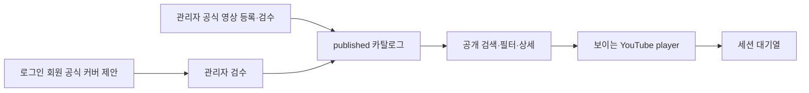

# OTW Play 구현 가이드와 단계별 플랜

상태: PR-2 catalog foundation schema·migration 실행 기준선

기준일: 2026-08-11

상위 문서: `otw-play-product-requirements.md`

설계 문서:

- `otw-play-system-design.md`
- `otw-play-ui-ux-design.md`

## 1. 문서 목적

이 문서는 승인된 설계를 실제 구현으로 옮길 때의 순서, 파일 경계, migration,
테스트, 운영 데이터 입력, 단계적 공개와 rollback 기준을 정의한다. 현재 단계는
PR-2 catalog foundation schema·migration이며 API·UI·원격 적용은 포함하지 않는다.

목표는 테스트만 통과한 조각이 아니라 다음 실제 흐름이 완성되는 것이다.



## 2. 구현 착수 gate

### 2.1 구현을 시작할 수 있는 기본 결정

다음은 현재 설계 기본값으로 개발을 진행할 수 있다.

- 공개 route: `/play`
- 공개 읽기: 로그인 없이 허용
- 내비게이션 라벨: `OTW Play`
- player 유지: `/play/*` 내부에서만 유지
- queue: frontend session 상태, 저장 플레이리스트 아님
- DB table 접두사: `music_*`
- 코드 capability: `otw-play`
- MVP: 오리지널과 공식 커버만 공개

공개 route, 접근 권한과 내비게이션은 후속 API·UI slice의 설계 기본값이다.
PR-2에서는 해당 route contract나 실행 경로를 만들지 않는다.

### 2.2 관련 slice 전에 확정해야 하는 제품 결정

| ID | 확인 항목 | 필요 시점 | 기본 권장안 |
| --- | --- | --- | --- |
| GATE-01 | 공식 커버 인정 기준과 허용 채널 | 관리자 등록·승인 API 전 | 승인된 공식 채널 + 실제 가창 credit 확인 |
| GATE-02 | 초기 입력 대상 곡·멤버 | 운영 데이터 입력 전 | 그룹별 대표 5–10곡으로 검증 |
| GATE-03 | 전 소속 멤버의 과거 공식곡 포함 범위 | 초기 데이터 입력 전 | 기록 보존, 현재 화면은 external 표시 |
| GATE-04 | 회원 제안 수정·철회 | 해당 command 구현 전 | pending_review에서만 허용 |
| GATE-05 | 거절 사유를 회원에게 보이는 범위 | 내 제안 UI 전 | 코드별 안전한 메시지로 노출, 내부 세부 정보 제외 |
| GATE-06 | 회원별 제출 제한 | 제출 API 전 | 설정 가능한 일일 제한 + edge burst 제한 |

결정되지 않은 slice만 보류하고 독립적인 domain, schema, 공개 read와 관리자
draft 작업은 계속할 수 있다. 결정 결과는 요구사항 문서의 TBD와 변경 이력에
먼저 반영한다.

PR-2 schema 결정은 GATE-01~06의 상태, 숫자 또는 운영 권장안을 변경하지 않는다.

## 3. 전달 전략

### 3.1 원칙

- 한 PR은 하나의 검증 가능한 architecture/foundation slice를 소유한다.
- schema migration PR과 이를 사용하는 runtime을 순서 없이 나누지 않는다.
- 중간 slice도 최종 상태 모델과 dependency direction을 사용한다.
- 임시 공개 endpoint, mock-only data path와 우회 관리자 SQL을 제품 경로로 남기지 않는다.
- 공개 API보다 관리자 입력 경로를 먼저 완성하여 실제 검수 데이터로 공개 UI를 검증한다.
- 각 PR의 설명에는 요구사항 ID, migration 영향, cache/auth 경계와 rollback을 적는다.

### 3.2 권장 PR 흐름

| PR | 결과 | 원격 영향 |
| --- | --- | --- |
| PR-1 | 공유 계약, 순수 domain과 공개 index | 없음 |
| PR-2 | catalog foundation schema와 migration | additive D1 artifact, 이번 PR에서는 원격 미적용·release 단계에서 적용 |
| PR-3 | proposal·event·search/meta schema와 migration | additive D1 |
| PR-4 | 공개 catalog query/API/cache | 숨겨진 API |
| PR-5 | 관리자 catalog command와 UI | 관리자 전용 |
| PR-6 | 공개 Discover/Catalog/Detail과 player | feature flag 뒤 |
| PR-7 | 회원 제출·내 제안·관리자 승인 E2E | 로그인/관리자 전용 |
| PR-8 | SEO, source health, observability, release switch | 단계적 공개 |

PR 수는 코드 규모에 따라 더 쪼갤 수 있지만 migration 번호 하나에 무관한
기능을 섞지 않는다.

## 4. 0단계 — 기준선 확정

### 결과

- 제품 요구사항, 시스템 설계, UI 설계와 구현 계획의 경계가 일치한다.
- 상태 축과 공개·회원·관리자 경계가 확정된다.
- 구현 PR에서 사용할 requirement trace 표가 준비된다.

### 작업

- 현재 문서의 TBD와 gate 검토
- `/play` route와 공개 접근 확정
- 공식 채널 운영 규칙 확정
- 초기 입력 샘플과 담당자 결정
- 성능 fixture 규모 결정

권장 fixture:

- 대표: 곡 300개, 내부·외부 인원 80명, 600 performances, 700 sources
- 상한 검증: 곡 3,000개, 10,000기 search term, 8,000 performances

fixture는 성능과 테스트용이며 production seed가 아니다.

### 종료 조건

- 관련 TBD의 상태가 문서에서 명확하다.
- 공개·제안·관리자 API가 같은 status field를 공유하지 않는다.
- 구현 파일 이름과 route naming이 합의되어 있다.

## 5. 1단계 — 계약과 순수 domain

### 결과

Cloudflare, React와 D1 없이도 핵심 규칙을 테스트할 수 있다.

### 주요 touchpoint

- `contracts/otw-play.ts`
- `worker/features/otw-play/domain/*`
- `worker/features/otw-play/index.ts`

실제 handler가 없는 route 상수는 만들지 않는다. application use case와 port는
실제 행동과 테스트가 생기는 후속 slice에서만 추가하며 빈 interface나
pass-through class를 미리 만들지 않는다.

PR-1은 `db/schema/index.ts`, Drizzle migration, `contracts/api-routes.ts`,
`worker/app/routes.ts`, API handler, frontend route, UI, player와 배포 설정을
수정하지 않는다. YouTube API도 호출하지 않는다.

### 구현 순서

1. 상태 축, 분류 3축, channel/source role, 참여자 종류와 공개 오류 계약 정의
2. 검색 정규화 함수
3. YouTube URL/video ID parser
4. proposal과 publication 상태 전이
5. exact/soft duplicate policy
6. source priority policy
7. runtime crypto에 의존하지 않는 결정적 dedupe key material

### 필수 단위 테스트

- 한글·일본어·영문과 호환 문자의 NFKC 정규화
- 공백과 구두점만 다른 입력의 동일 검색 key
- watch, `youtu.be`, embed와 Shorts URL의 11자리 video ID 추출
- 악성·유사 host, malformed URL과 잘못된 video ID 거부
- `pending_review`의 승인·거절과 proposal terminal state 재전이 거부
- `draft` → `published` → `withdrawn` publication 전이
- `published + unavailable source` 조합 허용
- 상태 축 사이 값 혼입 거부
- exact duplicate와 soft duplicate의 근거 분리 및 자동 병합 금지
- 같은 입력의 dedupe key material이 결정적임
- source priority 동시값에서 ID tie-break가 안정적임

### 종료 조건

- `pnpm architecture:check`
- domain에 runtime adapter import가 없음
- 공유 계약에 Drizzle row 또는 Cloudflare runtime type이 노출되지 않음
- 비어 있는 계층과 실행되지 않는 route contract가 없음

## 6. 2단계 — D1 catalog foundation

### 결과

곡, entity, channel, media source, performance와 관계를 정규화해 저장할 수 있다.

### 주요 touchpoint

- `db/schema/index.ts`
- 생성된 `drizzle/*.sql`
- 생성된 `drizzle/meta/*`
- `worker/features/otw-play/infrastructure/*.integration.test.ts`
- `scripts/d1-local-options.mjs`
- `scripts/d1-doctor.mjs`, `scripts/d1-doctor-core.mjs`와 회귀 테스트
- `scripts/d1-seed-local.mjs`, `scripts/d1-seed-guard.mjs`와 회귀 테스트
- `scripts/fixtures/local-d1-seed.sql`

API contract·handler, `worker/app/routes.ts`, frontend route·UI·player, 배포
설정과 원격 D1 적용은 PR-2에서 수정하거나 실행하지 않는다. production content와
운영 seed도 migration에 포함하지 않는다.

seed fixture는 `music_*` row를 삽입하지 않는다. 기존 music row를 보호 대상에
포함하고 명시적인 fixture 교체에서만 FK child-first 순서로 정리한다. seed와
doctor의 `--persist-to=<dir>`는 local D1 전용이며 두 명령에 같은 검증 경로를
전달한다. PR-2에서 remote doctor를 실행하지 않는다.

### migration A: catalog foundation

- `music_entities`, `music_entity_aliases`
- `music_songs`, `music_song_aliases`, `music_song_original_artists`
- `music_channels`, `music_channel_entities`
- `music_media_sources`, `music_media_source_relations`
- `music_performances`, `music_performance_participants`, `music_performance_sources`
- FK, CHECK, exact duplicate, source segment UNIQUE와 performance별 primary source
  partial UNIQUE

### PR-2 exact schema 결정

- `music_songs.is_otw_original`이 OTW 오리지널곡 여부의 권위이며 기본값 없는
  `NOT NULL` 입력이다.
- `music_channel_entities`는 별도 relation type 없이 연결 row 자체가 관계이며
  `(channel_id, entity_id)`를 복합 PK로 사용한다.
- `music_media_source_relations`는 두 source의 순서가 의미를 갖는 directed
  relation이며 self relation을 허용하지 않는다.
- `music_performances.dedupe_key`는 생성 후 immutable이고 metadata 수정으로
  다시 계산하지 않는다.
- `music_performance_sources`는 `(source_id, start_seconds)`를 UNIQUE로 유지한다.
- `music_performance_sources.priority`는 `NOT NULL DEFAULT 0`이고 음수를 거부한다.
- version, epoch-ms timestamp, credit order, source 구간과 priority는 SQLite
  `typeof(...) = 'integer'` CHECK로 REAL 값을 거부한다.
- 알려진 원곡 공개일 precision은 NULL을 허용하지 않고 `day`는 실제 달력 날짜를
  검증한다.
- `music_songs(merged_into_song_id)`와 `music_performances(song_id)`에는 FK child
  lookup을 위한 일반 index를 둔다.
- entity/song alias의 `alias_kind`는 nullable 자유 텍스트이며 CHECK 대상이 아니다.
- published performance partial index 세 개는 PR-3 search/meta migration으로
  미룬다.

### 작업 절차

```text
1. db/schema/index.ts 수정
2. pnpm drizzle:generate
3. 생성 SQL에서 예상하지 않은 DROP/ALTER/RENAME 검토
4. pnpm d1:reset:local -- --validate-only
5. 보호된 local D1의 검증 복사본에 `--persist-to`로 incremental migration 적용
6. 같은 검증 복사본에서 seed guard·fixture와 doctor 검증
7. 실제 생성 migration을 적용하는 isolated D1 integration test
```

직접 SQL이 필요한 partial index도 schema 표현 가능 여부를 먼저 확인한다.
Drizzle이 표현하지 못하는 custom SQL은 `pnpm drizzle:generate:custom`을 별도
결정으로 사용하며 schema와 migration의 차이를 문서화한다.

### 필수 DB 검증

- `PRAGMA foreign_key_check`
- `PRAGMA integrity_check`
- `PRAGMA schema_version`
- 주요 table의 `PRAGMA table_info`, `index_list`, `foreign_key_list`
- canonical source와 performance 관계의 round-trip
- 무효 enum/check insert 실패
- release source 삭제가 metadata를 연쇄 삭제하지 않음
- 한 performance에 primary source 하나만 허용
- `is_otw_original`이 performance relation과 독립적으로 round-trip
- `is_otw_original` NULL·생략 거부
- channel/entity 중복 link와 source self relation 거부
- directed source relation의 양방향 row가 서로 다른 관계로 보존됨
- 같은 source/start segment의 중복 performance 연결 거부
- source priority 기본값 `0`, NULL·음수 거부
- 정수 열의 fractional REAL 값 거부
- 알려진 공개일 precision의 NULL 및 잘못된 달력 날짜 거부
- nullable/free `alias_kind` 저장과 enum CHECK 부재
- performance dedupe key의 `NOT NULL UNIQUE`

performance dedupe key가 metadata 수정 대상에 포함되지 않는지는 PR-2의 DB
검증이 아니라 후속 repository 허용 field 목록과 application 회귀 테스트에서
검증한다.

### 종료 조건

- full migration chain과 isolated local D1에서 schema가 재현 가능하다.
- migration은 additive이며 기존 schedule 기능을 바꾸지 않는다.
- schema 단일 기준이 `db/schema/index.ts`다.
- API·UI·배포 설정 변경과 원격 D1 적용이 없다.

## 7. 3단계 — 제안·감사·검색 schema

### 결과

회원 입력을 canonical catalog와 격리하고, 승인 이력과 검색 projection을 제공한다.

### migration B: proposal·event

- `music_cover_proposals`
- `music_cover_proposal_participants`
- `music_cover_proposal_original_artists`
- `music_catalog_events`
- idempotency, pending video duplicate, channel/reviewer index

### migration C: search·meta

- `music_search_terms`
- `music_catalog_meta` singleton 초기 row
- published partial `music_performances(released_at DESC, id)`
- published partial `music_performances(song_id, released_at DESC, id)`
- published partial `music_performances(relation_type, released_at DESC, id)`

### 필수 integration test

- proposal 저장 시 canonical song/performance가 생기지 않음
- 같은 사용자·idempotency key가 row를 중복 생성하지 않음
- 같은 video/start pending 중복 거부
- 다른 사용자 proposal을 submitter predicate로 읽을 수 없음
- rejected row와 event가 보존됨
- search term projection의 FK와 delete 정책
- catalog revision 단조 증가

### 종료 조건

- 공개 reader는 proposal table에 의존하지 않는다.
- production content가 migration SQL에 포함되지 않는다.
- performance fixture로 hot query의 index 사용을 확인한다.

## 8. 4단계 — 공개 catalog API와 cache

### 결과

승인된 데이터만 검색, filter, 정렬, 상세 조회할 수 있고 외부 API 없이 응답한다.

### 주요 touchpoint

- `contracts/otw-play.ts`
- `contracts/api-routes.ts`
- `worker/features/otw-play/application/browse-*`
- `worker/features/otw-play/infrastructure/d1-catalog-reader.ts`
- `worker/features/otw-play/infrastructure/cloudflare-catalog-cache.ts`
- `worker/features/otw-play/http/public-handler.ts`
- `worker/app/routes.ts`
- `worker/app/route-registry.ts`
- `src/features/otw-play/api/public.ts`
- `src/features/otw-play/queries/*`
- `src/shared/api/client.ts`

### 구현 순서

1. public repository에 published predicate 고정
2. recent/title/participant keyset cursor
3. 검색 scoring과 member ANY/ALL
4. bounded IDs + detail batch 조립
5. canonical query와 versioned Cache API key
6. ETag와 standard error envelope
7. `apiFetch` 공개 요청의 `auth: omit` 지원
8. exact route manifest와 contract test

### API 테스트

- draft, proposal, rejected가 어떤 공개 query에도 나타나지 않음
- q, 날짜, enum, cursor, limit의 400 계약
- member 선택 최대 10개와 limit 최대 60 clamp/거부 기준
- page 사이 중복·누락 없음
- 같은 의미의 query가 같은 canonical key를 생성
- current member와 deprecated member 투영
- source가 없거나 모두 불가인 곡의 `playable=false`
- public API path에서 YouTube adapter 호출 0회
- Authorization 없는 공개 request
- Cache API hit/miss와 cache failure fallback
- member/admin response cache와 key가 공유되지 않음

### 성능 검증

- `EXPLAIN QUERY PLAN`에서 주요 predicate가 index search를 사용
- 기본 page D1 statement 수가 설계된 bounded count 이내
- 대표 fixture와 상한 fixture에서 rows read 기록
- response gzip 100KB 이하
- cursor query가 offset을 사용하지 않음

### 종료 조건

- 공개 API는 feature flag가 꺼진 상태로 배포 가능하다.
- 공개 API readback에서 승인 데이터만 보인다.
- D1 장애는 명시적 503이며 철회된 오래된 콘텐츠를 임의 제공하지 않는다.

## 9. 5단계 — 관리자 catalog와 검수

### 결과

관리자가 실제 채널과 영상을 검수하고 곡·가창을 draft로 등록해 게시할 수 있다.

### 주요 touchpoint

- `worker/features/otw-play/application/manage-catalog.ts`
- `worker/features/otw-play/infrastructure/d1-catalog-writer.ts`
- `worker/features/otw-play/http/admin-handler.ts`
- `worker/features/youtube` 공개 metadata service
- `worker/app/routes.ts`
- `src/features/otw-play/api/admin.ts`
- `src/features/otw-play/ui/admin/*`
- `src/routes/admin/otw-play.tsx`
- `src/app/admin/admin-layout.tsx`
- `src/shared/query/query-keys.ts`

### 사용자 흐름

```text
공식 채널 검수 → YouTube 영상 확인 → 곡 연결/생성 → 원곡 가수 →
참여자와 분류 3축 → draft 저장 → 재생 미리보기 → publish
```

### 필수 테스트

- 비관리자 401/403
- 승인되지 않은 channel로 publish 422
- video metadata와 PK·channel mismatch 422
- primary source, 참여자와 세 분류축 누락 시 publish 거부
- publish event와 revision이 함께 반영
- event insert 실패 시 publish rollback
- stale expectedVersion 409
- 전역 admin audit 실패는 authoritative event를 훼손하지 않음
- 관리자 UI가 서버 성공 후 authoritative readback

### 종료 조건

- raw remote SQL 없이 관리자 흐름으로 실제 draft와 published 항목을 만들 수 있다.
- 오류 수정, withdraw와 source 교체도 audit event를 남긴다.
- 공개 API에서 새 revision의 게시 항목을 확인할 수 있다.

## 10. 6단계 — 공개 UI와 YouTube player

### 결과

사용자가 OTW Play를 음악 앱으로 탐색하고 실제 공식 영상을 이어 들을 수 있다.

### 주요 touchpoint

- `src/routes/play.tsx`
- `src/routes/play/index.tsx`
- `src/routes/play/songs/$songSlug.tsx`
- `src/features/otw-play/model/*`
- `src/features/otw-play/player/*`
- `src/features/otw-play/ui/catalog/*`
- `src/features/otw-play/ui/detail/*`
- `src/features/otw-play/ui/player/*`
- `src/app/layout/app-navigation.ts`
- `src/index.css`
- `Design.md`

### 구현 순서

1. `/play` nested route와 PlayShell
2. Discover와 Catalog
3. URL-synced 검색·filter·정렬
4. song detail과 performance 직접 링크
5. single iframe player provider
6. queue reducer, repeat, shuffle, skip
7. `sessionStorage` restore
8. responsive player rail/dock/sheet
9. 모든 loading/empty/error/unavailable state

### 플레이어 검증

- 사용자 조작 전 자동 재생하지 않음
- 앱 전체에 YouTube iframe 하나만 존재
- Play 내부 route 이동에서 불필요하게 재마운트되지 않음
- `/play` 이탈 시 정지·정리
- 재생 중 iframe이 보이고 최소 200×200px 이상
- YouTube UI, 광고, branding을 가리지 않음
- `origin` parameter와 autoplay-blocked event 처리
- unavailable 두 항목 이상에서도 무한 skip 없음
- repeat/next/previous/shuffle의 결정적 reducer test

### UI 검증

- 375px, 768px, 1440px
- light/dark
- 긴 한국어·일본어·영문 제목
- current member 오시마크와 external neutral chip
- 키보드만으로 검색, filter, 재생과 queue reorder
- reduced motion, focus return, aria-live
- card/thumbnail CLS와 lazy loading

### 종료 조건

- 대표 사용자가 내비게이션에서 OTW Play를 열어 곡을 찾고 재생하며 다음 곡으로 이동한다.
- UI가 YouTube 정책을 우회하거나 숨은 재생에 의존하지 않는다.
- 모바일에서 player를 접으면 재생이 일시정지한다.

## 11. 7단계 — 회원 제안과 관리자 승인 E2E

### 결과

로그인 회원의 공식 커버 제안이 비공개 상태로 저장되고 관리자 승인 후만 공개된다.

### 주요 touchpoint

- `worker/features/otw-play/application/submit-cover-proposal.ts`
- `worker/features/otw-play/application/approve-proposal.ts`
- `worker/features/otw-play/infrastructure/d1-review-unit-of-work.ts`
- `worker/features/otw-play/http/member-handler.ts`
- `worker/features/otw-play/http/admin-handler.ts`
- `src/features/otw-play/ui/submissions/*`
- `src/features/otw-play/ui/admin/submission-review.tsx`
- `src/routes/play/submit.tsx`
- `src/routes/play/submissions.tsx`

### 구현 순서

1. preflight와 idempotency
2. D1 일일 limit port와 edge burst 보호
3. 3단계 제출 wizard
4. 본인 제안 목록·상세
5. 관리자 split review UI
6. YouTube 최신 metadata 검증
7. CAS + conditional insert + publish/event/revision batch
8. 승인·거절 authoritative readback

### 보안·무결성 테스트

- 비로그인 제출 401
- 다른 회원의 proposal ID 조회 404
- client의 status/submitter/reviewer 입력 무시
- 회원 payload로 original을 요청해도 관계가 cover로 고정되거나 요청이 거부됨
- token, note, 검색어가 log에 남지 않음
- 동일 idempotency retry가 같은 row 반환
- pending duplicate 409
- 일일 제한 429, edge limit이 D1 권위를 대체하지 않음
- 같은 proposal 동시 승인 시 한 요청만 성공
- CAS 0행일 때 canonical row가 하나도 생성되지 않음
- 중간 FK/event 오류 시 전체 batch rollback
- 승인 전 공개 API 누출 0건
- 승인 후 published item과 proposal link readback
- 거절 후 공개 0건, event와 회원 상태 보존

### 종료 조건

- 수용 기준 9–12를 실제 UI 흐름으로 재현한다.
- 관리자 승인 시 제출값과 최종 검수값을 모두 추적할 수 있다.
- 수정·철회가 미결정이면 UI와 API에 죽은 control을 만들지 않는다.

## 12. 8단계 — SEO, source health와 운영 준비

### 결과

직접 링크, sitemap, source 점검, 관측과 단계적 공개가 운영 가능하다.

### 주요 touchpoint

- `contracts/site-seo.ts`
- `worker/features/seo/*`
- `worker/app/fetch.ts`
- `worker/app/scheduled.ts`
- `worker/platform/types.ts`
- `wrangler.jsonc`
- 운영 dashboard 또는 기존 operations UI

### 작업

- `/play`와 `/play/*`의 직접 요청 처리
- published song만 sitemap과 metadata에 포함
- draft/proposal/rejected route는 index 대상에서 제외
- source `next_check_at` 기반 최대 50개 묶음 재검사
- YouTube quota/429에서 상태를 잘못 unavailable로 바꾸지 않는 retry
- structured logs와 필요 sampling의 tracing
- catalog cache hit와 D1 rows-read 관측
- `public_read_enabled`, `navigation_visible` 운영 switch

### 필수 검증

- `/play`, `/play/songs/{slug}` 직접 요청 200과 self-canonical
- unknown/withdrawn slug 404, sitemap 미포함
- 공개 페이지 HTML/metadata가 proposal 정보를 포함하지 않음
- Cron 한 번에 상한 수보다 많은 source를 조회하지 않음
- source 삭제 후 metadata 보존과 player fallback
- cache hit/miss, query rows와 error event를 운영에서 확인 가능

## 13. 운영 데이터 입력

production 카탈로그는 migration fixture나 raw SQL로 넣지 않는다.

1. `public_read_enabled=0`, `navigation_visible=0`
2. 공식 채널 allowlist를 관리자 UI에서 검수
3. 그룹별 대표 5–10곡을 draft로 입력
4. 원곡 가수, 참여자, 공개일, 분류 3축과 대표 source 검토
5. publish command로 event와 revision을 생성
6. 공개 API를 내비게이션 숨김 상태에서 실제 readback
7. 중복, orphan, primary source와 embed 가능성 확인
8. 제품 책임자가 초기 데이터 범위를 승인

대량 importer가 필요하면 raw table insert 도구가 아니라 application use case를
호출하는 idempotent 관리자 도구로 만든다. 검증과 event를 우회하지 않아야 한다.

## 14. 단계적 공개

### 배포 순서

1. migration 직전 D1 Time Travel/backup bookmark 기록
2. additive migration 원격 적용
3. Worker와 정적 앱 배포
4. admin auth·catalog input readback
5. `public_read_enabled=1`, navigation은 숨김
6. 익명 catalog, 상세, player 직접 URL 검증
7. 로그인 proposal과 관리자 승인 실제 흐름 검증
8. 승인 항목의 public readback과 cache revision 확인
9. `navigation_visible=1`
10. 24시간과 7일 지표 관찰

### 실제 검증 흐름

- 익명: 발견 → 검색 → member filter → 상세 → 재생 → queue
- 회원: 로그인 → URL 입력 → 중복 확인 → 제출 → 내 제안
- 관리자: 검토 → 승인 → event 확인
- 익명 재조회: 새 revision에서 published item 확인
- 운영: logs, D1 rows read, cache status, YouTube quota 확인

fixture나 lower-level API만으로 이 검증을 대체하지 않는다.

## 15. rollback

| 상태 | 조치 | 데이터 처리 |
| --- | --- | --- |
| UI 문제 | `navigation_visible=0` | 카탈로그 보존 |
| 공개 API 문제 | `public_read_enabled=0` | 관리자·제안 데이터 보존 |
| 잘못된 공개 데이터 | withdraw/unpublish + revision 증가 | hard delete 금지 |
| Worker 회귀 | 이전 검증 Worker version 재배포 | additive table 유지 |
| migration 후 코드 불일치 | feature flag off, 호환 코드 복구 | down migration 자동 실행 금지 |
| 심각한 DB 손상 | Time Travel 복구 검토 | DB 전체 덮어쓰기이므로 별도 승인 |

일반 rollback에서 migration 파일이나 table을 삭제하지 않는다. Time Travel은
파괴적 복원이며 정확한 bookmark, 영향 범위와 사용자의 명시적 승인이 필요하다.

## 16. 검증 명령

### schema 변경 PR

```text
pnpm drizzle:generate
pnpm d1:reset:local -- --validate-only
pnpm exec wrangler d1 migrations apply otw-db --local --persist-to <isolated-persist-dir>
pnpm d1:seed:local -- --force --persist-to=<isolated-persist-dir>
pnpm d1:doctor -- --persist-to=<isolated-persist-dir>
pnpm test:worker-integration
```

`<isolated-persist-dir>`는 이전 migration까지 적용된 local D1의 검증 복사본이다.
현재 local D1에 보호 데이터가 있으면 reset이나 강제 seed를 실행하지 않는다.

### 관련 기능 PR

```text
pnpm architecture:check
pnpm typecheck:test
pnpm lint
pnpm test
pnpm test:worker-integration
pnpm build
pnpm sync:agent-cursor:check
```

### 최종 release gate

```text
pnpm test:coverage
pnpm preflight
```

명령 통과만으로 완료하지 않는다. 해당 PR의 실제 UI/API/DB 흐름과 권위
readback을 함께 기록한다.

## 17. 요구사항 추적표

| 요구사항 묶음 | 구현 소유 | 핵심 검증 |
| --- | --- | --- |
| FR-001–005 | public catalog/search | 곡 grouping, 검색 대상, 최신 항목 |
| FR-006–011 | catalog query | 우선순위, ANY/ALL, cursor 정렬 |
| FR-012, 014–016 | song detail/catalog | 복수 version, credit, source relation |
| FR-017, 020–023 | player/queue | single iframe, repeat/shuffle, unavailable |
| FR-024–025 | route/SEO | song/performance 직접 링크 |
| FR-030–036 | member proposal | auth, staging, 본인 상태, duplicate |
| ADM-001–010, 014, 019 | admin catalog | 공식 채널·영상 검수, draft/publish |
| ADM-011–012, 020–021 | event/proposal | 감사, 미검수 비공개, 거절 이력 |
| ADM-015–018 | review unit-of-work | 승인 queue, CAS, 공개 승격 |
| NFR-001–006 | UI/player | YouTube 정책, 키보드, chip 접근성 |
| NFR-007–012 | repository/auth/cache | published-only, metadata 보존, cache 격리 |
| NFR-013–015 | rate/ownership/admin | spam, 본인 조회, 관리자 전이 |

후속 FR-013, 018, 019, 026–029는 MVP test를 통과시키기 위한 hidden 구현으로
만들지 않는다. 현재 schema의 source segment와 relation 확장점만 보존한다.

## 18. 주요 위험과 대응

| 위험 | 가능성 | 영향 | 필수 대응 |
| --- | --- | --- | --- |
| 상태를 한 열에 혼합 | 높음 | 공개 누출·잘못된 승인 | proposal/publication/quality/source 축 분리 |
| 공개 GET에 bearer 자동 첨부 | 높음 | shared cache bypass | `apiFetch auth: omit`와 header test |
| 동시 승인 | 중간 | 중복 catalog·불일치 | CAS, conditional insert, batch rollback integration |
| YouTube iframe 숨은 재생 | 중간 | 정책 위반·나쁜 모바일 UX | Play-scoped visible player, 접을 때 pause |
| D1 fan-out·offset | 중간 | 높은 rows read·지연 | keyset + bounded detail batch + query plan |
| current member 상태 cache | 중간 | 전 소속 멤버 오표시 | member 상태 변경 시 revision 증가 |
| stale cache로 철회 콘텐츠 노출 | 낮음–중간 | 운영·권리 문제 | revision key, 오래된 LKG 자동 제공 금지 |
| migration과 code 순서 불일치 | 중간 | production 5xx | additive schema, flag, 순서와 readback |
| YouTube quota 장애를 unavailable로 오판 | 중간 | 정상 영상 숨김 | retryable error와 source 상태 분리 |

## 19. Definition of Done

MVP는 다음 조건이 모두 충족되어야 완료다.

- 대표 관리자가 공식 영상으로 정상 catalog를 생성·게시할 수 있다.
- 대표 회원이 proposal을 제출하고 본인 상태를 확인할 수 있다.
- 관리자가 같은 proposal을 검수·승인하고 권위 상태를 readback할 수 있다.
- 승인 전 proposal은 public catalog의 어떤 경로에도 노출되지 않는다.
- 승인 후 익명 사용자가 같은 곡을 검색하고 공식 영상을 재생할 수 있다.
- current member와 external/former chip이 요구대로 표시된다.
- queue next/previous/repeat/shuffle가 실제 iframe과 연결된다.
- source 장애가 song metadata와 event를 삭제하지 않는다.
- migration, architecture, type, lint, unit, integration, coverage와 build gate가 통과한다.
- production artifact identity, migration 적용, public API와 UI readback이 기록된다.
- rollback switch와 운영 담당자가 확인되어 있다.

## 20. 변경 관리

아이디어가 바뀌면 다음 순서로 반영한다.

1. 제품 요구사항의 결정, 범위와 수용 기준을 갱신한다.
2. 시스템 설계의 aggregate, API와 schema 영향을 확인한다.
3. UI 설계의 route, 화면 상태와 player 영향을 확인한다.
4. 이 문서의 gate, PR slice, test와 rollout을 조정한다.
5. 이미 migration이 배포된 경우 destructive rewrite보다 additive migration과
   호환 기간을 우선한다.
