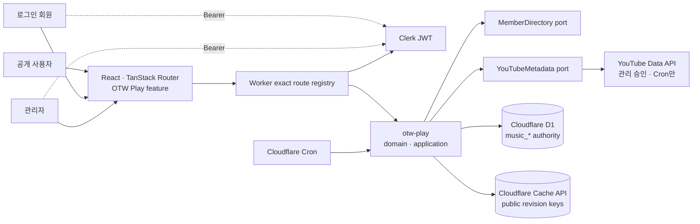
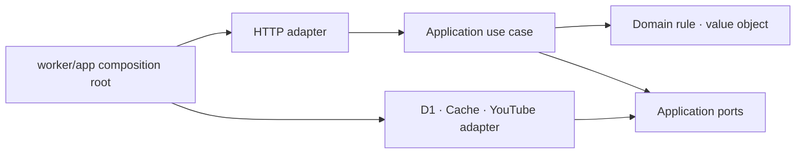
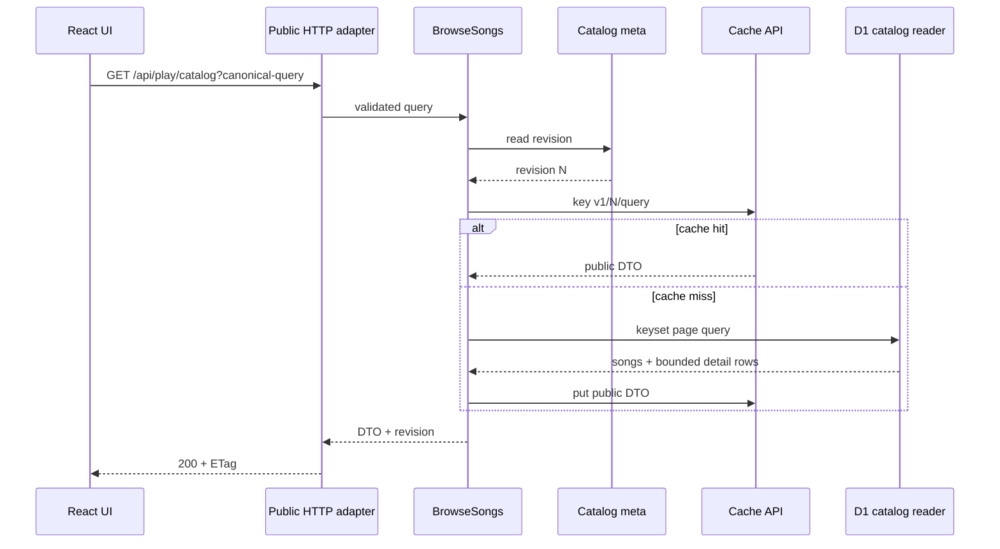
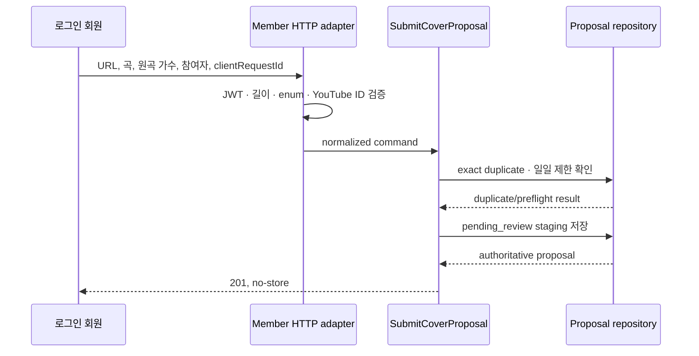
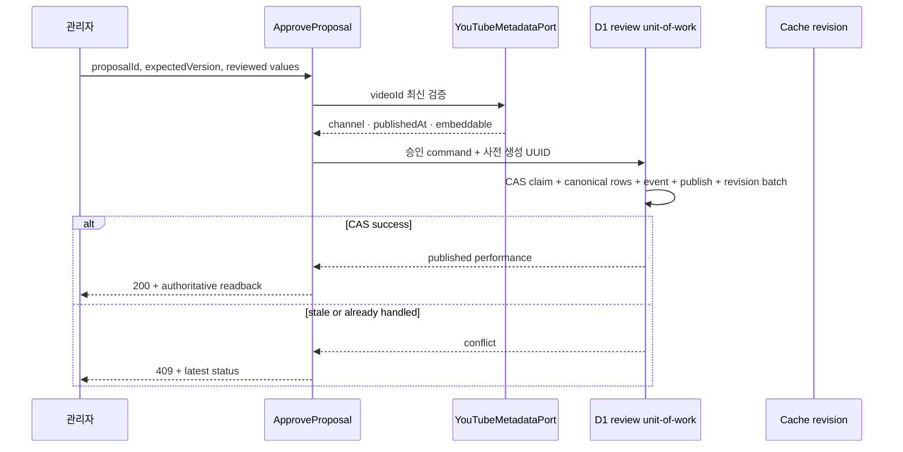
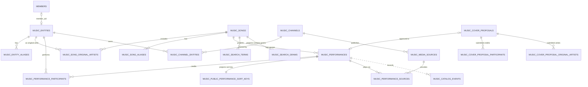

# OTW Play 시스템·DB 설계

상태: PR-8 운영 공개 설계 기준선

기준일: 2026-08-20

상위 문서: `otw-play-product-requirements.md`

관련 문서:

- `otw-play-ui-ux-design.md`
- `otw-play-implementation-guide.md`
- `architecture.md`

## 1. 설계 결론

OTW Play는 기존 VOD 최신 영상 피드의 이름이나 화면만 바꾸는 기능이 아니다.
곡, 가창 버전, 참여자, 공식 채널, 재생 소스와 회원 제안의 생명주기를 소유하는
독립 `otw-play` capability로 구현한다.

핵심 설계는 다음과 같다.

1. D1의 정규화된 `music_*` 테이블을 카탈로그의 단일 권위로 사용한다.
2. 미검수 회원 제안은 staging aggregate에 보관하고 승인 시에만 공개
   카탈로그로 승격한다.
3. 공개 상태, 제안 심사 상태, 품질 상태와 소스 가용성을 서로 다른 축으로
   분리한다.
4. 공개 read model은 항상 `published`만 읽으며 관리자용 상태 parameter를
   받지 않는다.
5. Worker는 HTTP → application → domain/port ← infrastructure 의존 방향을
   지킨다.
6. 공개 조회 중 YouTube API를 호출하지 않는다. 외부 검증은 관리자 승인과
   Cron 점검에서만 수행한다.
7. 공개 읽기는 revision 기반 Cloudflare Cache API를 사용하고, 회원·관리자
   응답은 `no-store`로 분리한다.
8. 승인·게시·감사 이벤트·catalog revision 증가는 CAS와 D1 batch로
   부분 반영을 막는다.
9. 검색·참여자 정렬용 파생 read model은 canonical catalog revision과 일치할
   때만 config 이외 공개 조회에 사용한다.
10. R2, KV, Durable Objects와 Queues는 MVP에 추가하지 않는다.

테이블은 제품명 변경에 덜 민감한 `music_*` 접두사를 사용하고, 코드
capability는 제품 언어에 맞춰 `otw-play`를 사용한다.

## 2. 아키텍처 결정 기록

### ADR-PLAY-001: 독립 capability

상태: 채택

이유:

- 기존 YouTube capability는 채널별 영상 조회와 quota/cache를 소유한다.
- OTW Play는 작품·가창·크레딧·공개 승인이라는 다른 업무 규칙을 가진다.
- YouTube cache row나 최신 영상 응답은 음악 카탈로그의 권위 데이터가 아니다.

결과:

- `otw-play`가 catalog와 proposal 업무 규칙을 소유한다.
- `youtube`와 `members`는 공개 service를 port adapter로 제공한다.
- capability 간 내부 파일이나 DB repository 직접 import를 금지한다.

### ADR-PLAY-002: 상태 축 분리

상태: 채택

요구사항의 여러 상태 이름은 하나의 row 상태가 아니라 서로 다른 aggregate와
관심사다.

| 축             | 저장 위치                                 | 값                                                                                             |
| -------------- | ----------------------------------------- | ---------------------------------------------------------------------------------------------- |
| 회원 제안 심사 | `music_cover_proposals.status`            | `pending_review`, `approved`, `rejected`, `withdrawn`                                          |
| 카탈로그 공개  | `music_performances.publication_status`   | `draft`, `published`, `withdrawn`                                                              |
| 카탈로그 품질  | `music_performances.quality_status`       | `ok`, `needs_update`                                                                           |
| 소스 가용성    | `music_media_sources.availability_status` | `unknown`, `playable`, `private`, `embed_disabled`, `deleted`, `region_blocked`, `unavailable` |
| 공식 채널 검수 | `music_channels.verification_status`      | `pending`, `approved`, `revoked`                                                               |

`unavailable`은 곡이나 가창의 공개 상태가 아니다. 모든 연결 소스가 재생
불가여도 곡과 가창 메타데이터는 `published`로 보존하고 공개 DTO의
`playable=false`로 계산한다.

자동 수집의 `candidate`는 후속 범위다. 도입 시 별도
`music_ingestion_candidates` aggregate를 만들며 회원 제안 상태에 섞지 않는다.

### ADR-PLAY-003: 공개 read boundary 분리

상태: 채택

- 공개 repository는 SQL 자체에 `publication_status='published'`를 고정한다.
- 공개 endpoint에 `includeDraft`, `admin`, `status` 우회 parameter를 만들지 않는다.
- 회원 repository는 SQL에 `submitted_by_user_id = auth.sub`를 포함한다.
- 관리자 endpoint는 별도 handler와 repository method를 사용한다.
- 공개 DTO에는 제출자, 내부 note, 거절 사유, reviewer와 staging ID를 넣지 않는다.

### ADR-PLAY-004: 단일 Play-scoped player

상태: 채택

`/play` 중첩 route가 player provider와 단일 YouTube iframe을 소유한다. Play
내부 탐색에서는 재생 문맥을 유지하고 다른 사이트 영역으로 이동하면 player를
정리한다. 이는 저장 플레이리스트 없이도 음악 앱의 연속성을 제공하면서 숨은
재생 금지 정책을 지킨다.

- player script와 `YT.Player`는 첫 사용자 재생 의도 뒤에 한 번만 생성한다.
- iframe이 절반 이상 보일 때만 `loadVideoById`를 호출한다.
- 640–1279px Now Playing에서 카탈로그로 돌아갈 때는 같은 iframe host를 visible
  miniplayer로 축소하고, 640px 미만에서만 먼저 pause한다. `/play` 이탈은 stop 뒤
  destroy한다.
- queue는 versioned `sessionStorage` 식별자 상태만 저장하고 공개 performance
  API로 복원 유효성을 다시 확인한다. 복원 직후 자동 재생하지 않는다.
- player iframe은 16:9와 최소 200×200px를 보장하고 YouTube UI·광고·브랜딩
  위에 overlay를 두지 않는다.

DEC-031과 이를 단순화한 DEC-033·034에 따라 이 provider를 소비하는 `PlayShell`은
route 콘텐츠와 별도로 데스크톱 우측 `PlayerQueuePanel`을 소유한다. 상위 탐색은
`/play` 발견과 `/play/songs` 곡 검색만 제공하고,
`/play/discover`는 기존 링크를 `/play`로 redirect한다. 두 route 사이를 이동해도
queue와 player instance는 유지된다.
`PlayerQueuePanel` 상단은 356×200px 단일 iframe과 현재 곡 정보,
iframe 아래의 곡명과 identity row는 참여자 profile/name과 YouTube/곡 상세 action을 함께
제공한다. current member는 `/profile/{code}.webp`, external은 person icon, group은 group
icon을 사용한다. 음악 분류와 가창 분류는 identity 아래의 보조 metadata로 투영한다.
그 다음 semantic range가 IFrame API `getCurrentTime`/`getDuration`을 주기적으로 읽어
진행/남은 시간을 표시하며 `seekTo`를 수행하고, 상태 문구 없는 단일 control row가
previous/play/next, repeat/shuffle, mute/volume을 소유한다. transport 아래에는 YouTube
icon·`게시 채널` label·channel 이름만 남겨 가창자와 업로드 주체를 구분하고, 참여자 이미지를
channel avatar로 재사용하지 않는다. segment source는
`start_seconds`를 0점으로 환산하고 `end_seconds`가 있으면 그 구간 안으로 제한한다.
권위 channel avatar URL이 없는 현재 wire contract에서는 연결된 current member profile을
사용하고 나머지는 중립 fallback을 사용한다. 하단 queue 영역은
순서·선택·삭제·재정렬만 제공하고 남은 높이를 독립 스크롤한다. 하단 PlaybackBar,
접기·펼치기와 overlay 상세 panel은 없다. 이 재배치는 API, schema, cache key와
운영 flag를 바꾸지 않는다.

우측 rail의 높이 적응은 DEC-040을 따른다. `PlayerQueuePanel` 자체는 남은 viewport의
`height: 100%`, `min-height: 0`, `overflow: hidden` 경계를 가지며 queue list만 세로로
스크롤한다. viewport 높이가 720px 미만이면 iframe 200px과 queue 최소 144px,
참여자 옆 YouTube·곡 상세 action은 유지한다. 참여자 이름은 한 줄 말줄임으로 남기고
게시 채널 출처 행만 먼저 숨기며 수직 여백을 줄인다. 높이 640px 미만에서는 iframe 아래에
`현재 재생`·`플레이큐` 전환을 표시하고 두 상세 영역 중 하나만 남은 높이를 사용한다.
이 전환은 표현 상태일 뿐 queue authority나 player state를 바꾸지 않으며, iframe host는
DOM에 한 번만 유지되어 재생·진행 위치·볼륨이 끊기지 않는다.

IFrame `playerVars`는 `controls=0`, `fs=0`, `disablekb=1`, `iv_load_policy=3`,
`rel=0`을 사용한다. 이는 OTW Play의 외부 transport와 progress가 중복 native chrome을
대체하기 위한 공식 parameter 조합이다. `showinfo`·`modestbranding`은 폐기되어 사용하지
않고 iframe 위 overlay로 YouTube UI를 가리지 않는다. `cc_load_policy`는 `1`만 강제
표시 의미가 공식화되어 있으므로 설정하지 않으며 caption 기본값은 사용자 preference를
따른다.

DEC-032·034·037·041의 layout chrome은 `PlayShell` 안에서 상단 64px와 데스크톱 우측
380px `PlayerQueuePanel`을 사용한다. 중앙 catalog와 우측 queue는 document scroll
대신 각자 `overflow-y: auto`를 사용한다. 1280px 미만에서는 첫 재생 의도 뒤 같은 단일
iframe host를 전체 화면 `Now Playing`에 표시하고, 곡·참여자 정보와 재생 조작,
0–100 volume, 세션 queue를 한 화면에서 제공한다. 640–1279px의 카탈로그 복귀는
pause 없이 같은 host를 우측 하단 216px miniplayer로 축소한다. iframe은 200×200px로
계속 보이고 아래 44–48px 영역에 곡명·play/pause·전체 화면 확장을 둔다. full↔mini와
queue 항목 변경은 host를 재마운트하거나 현재 시간·볼륨을 초기화하지 않으며 확장은
자동 resume하지 않는다. mini 상태에서 폭이 640px 미만이 되면 전체 Now Playing을
다시 열고, 640px 미만의 카탈로그 복귀만 pause 후 launcher를 표시한다. 1280px 이상
rail과 `/play` 이탈 stop·destroy는 기존대로다. 숨겨진 상태에서 재생하거나 두 host를
동시에 렌더링하지 않는다. queue rail의 announcement는 screen reader용 live region으로만 유지한다.
발견의 단일 full-width 대표 배너 carousel
state는 표현 계층에만 존재하고 catalog 순서, cursor, queue와 player authority를
변경하지 않는다. 앞·뒤 card surface는 렌더링하지 않고 화살표·indicator·pointer
drag·가로 wheel·키보드로 현재 배너만 교체한다. 최근 공개곡 projection은 추가
read model 없이 기존 catalog response를 compact table 행으로 표현한다.

운영 공개 전에는 `/play/*` 표현 계층 앞에 Clerk 관리자 gate를 둔다. auth가 아직
load되지 않았거나 비로그인·비관리자이면 config query와 nested catalog UI를
마운트하지 않는다. 이 preview gate는 익명 public GET의 장래 공개 계약을
변경하지 않으며, 내비게이션은 관리자 권한과 두 catalog flag를 모두 요구한다.

### ADR-PLAY-005: MVP Cloudflare 구성 최소화

상태: 채택

- D1: 권위 데이터와 검색 read model
- Cache API: 공개 응답 read-through cache
- Smart Placement: 현재 설정 유지
- Cron: 게시 소스의 제한된 재검사
- R2: MVP 음악 데이터에는 사용하지 않음
- Queue: 자동 후보 수집이나 대량 점검이 실제로 필요할 때 도입
- Durable Object: 서버 재생 대기열이나 전역 lock이 없으므로 사용하지 않음

### ADR-PLAY-006: PR-2 catalog identity와 관계 의미

상태: 채택

- `music_songs.is_otw_original`이 OTW 오리지널곡 여부의 단일 권위다.
  기본값 없는 `NOT NULL` 값으로 명시 입력하며 performance 관계, 채널 역할 또는
  source metadata에서 이 값을 추론하지 않는다.
- entity/song alias의 `alias_kind`는 nullable 자유 텍스트다. PR-2에서 enum이나
  CHECK를 추가하지 않는다.
- `music_channel_entities`는 row 존재 자체가 채널의 소유·소속 연결을 뜻한다.
  별도 relation type 없이 `(channel_id, entity_id)`를 복합 PK로 사용한다.
- `music_media_source_relations`는 `source_id`에서 `related_source_id`로 향하는
  directed relation이다. 역방향 row를 암묵적으로 생성하지 않는다.
- `music_performances.dedupe_key`는 생성 후 불변이다. 참여자, 표시 metadata와
  source 우선순위 변경으로 다시 계산하지 않는다.
- 같은 `(source_id, start_seconds)` segment는 둘 이상의 performance에 연결하지
  않으며 DB UNIQUE로 막는다.
- `publication_status='published'` 전용 partial index는 search/meta와 함께
  PR-3에서 추가한다.

PR-2는 local schema, 생성 migration과 D1 검증만 소유한다. API contract·handler,
frontend route·UI, 배포 설정과 원격 migration 적용은 포함하지 않는다.
GATE-01~06의 상태와 권장안은 변경하지 않는다.

### ADR-PLAY-007: PR-3 proposal·event·search/meta 경계

상태: 채택

- proposal은 미검수 입력 snapshot이며 canonical song, performance, source 또는
  channel row를 만들지 않는다. 제출 시 channel metadata를 조회하거나 proposal에
  channel ID를 저장하지 않고, 후속 관리자 승인 과정에서 검증한다.
- catalog event의 `aggregate_type`, `event_type`과 proposal의
  `review_result_code`는 non-empty 자유 텍스트다. 운영 vocabulary가 정해지기 전
  enum이나 CHECK 값을 발명하지 않는다.
- event actor만 `member`, `admin`, `system`으로 제한하고 사용자 actor와 Clerk
  `sub`의 존재를 함께 검증한다.
- 검색 term 종류는 `title`, `title_alias`, `original_artist`, `participant`로
  고정한다.
- catalog meta는 `id=1`, `revision=0`, `public_read_enabled=0`,
  `navigation_visible=0`, `updated_at=0`인 구조적 singleton으로 시작한다.
- revision 증가는 후속 catalog command의 같은 D1 batch가 소유한다. event의
  append-only는 후속 insert-only repository가 소유하며 PR-3에서는 UPDATE/DELETE
  trigger나 revision trigger를 만들지 않는다.

PR-3은 shared DB vocabulary contract, local schema, 생성 migration, singleton
custom migration과 D1 검증만 소유한다. API route·DTO·handler,
application/repository, frontend route·UI,
production content, 배포 설정과 원격 D1 적용은 포함하지 않는다. GATE-01~06의
상태, 숫자와 운영 권장안도 변경하지 않는다.

### ADR-PLAY-008: PR-4 공개 read와 cache 계약

상태: 채택

- `/api/play/config`는 `public_read_enabled=0`이어도 익명 `200`으로 현재 flag와
  revision을 반환한다. meta 갱신 시각은 cache key와 ETag에만 사용하고 wire에는
  노출하지 않는다. 나머지 네 public endpoint는 flag가 꺼져
  있으면 cache를 사용하지 않고 `404 PLAY_PUBLIC_READ_DISABLED`를 반환한다.
- query는 strict하다. 중복 single-value parameter, 상한 초과,
  알 수 없는 enum·parameter와 malformed cursor를 clamp하거나 무시하지 않고
  `400`으로 거부한다.
- 검색어가 있으면 relevance가 첫 정렬 기준이고 선택한 recent/title/participant
  정렬은 relevance 동점 해소에 사용한다. 응답은 exact total과 facet count를
  계산하지 않는다.
- public member key는 기존 numeric `members.uid`, original artist key는 public
  entity slug다. group key는 facets가 발급하는 versioned opaque string이며
  내부 kind는 `entity` 또는 `unit`이다. client는 이를 조립하거나 해석하지 않는다.
- Cache API는 자유 검색과 cursor page를 저장하지 않는다. `q`와 `cursor`가 없는
  구조화된 첫 catalog page는 filter·sort 조합을 포함해 저장한다.
- config cache key와 ETag는 revision, 두 flag와 meta `updated_at`을 포함한다.
  나머지 ETag는 revision과 canonical path/query의 SHA-256으로 만든 weak validator다.
  Authorization 또는 Cookie가 있는 요청은 Cache API를 우회하고 `no-store`로
  응답한다.
- 공개 read가 활성인 상태에서 `music_catalog_meta.revision`과 공개 read-model
  revision이 일치하지 않으면 config 이외 endpoint는 cache를 읽기 전에
  `503 PLAY_CATALOG_UNAVAILABLE`로 fail closed한다. flag-off에서는 기존
  `404 PLAY_PUBLIC_READ_DISABLED`가 우선하며 `/api/play/config`는 projection
  상태와 무관하게 현재 flag와 catalog revision을 계속 반환한다.
- 성능 projection은 후보를 줄이고 participant keyset 순서를 제공할 뿐이다.
  최종 candidate와 hydration SQL은 canonical·non-archived song,
  `published` official performance와 동일-performance filter predicate를 다시
  적용하므로 projection row만으로 공개 자격을 부여하지 않는다.
- 이 보완은 기존 endpoint, DTO, query, cursor와 cache 계약을 바꾸지 않는다.
  DB trigger도 추가하지 않으며 후속 PR-5 writer가 canonical 변경, search term,
  sort key, gram/stat과 두 revision을 같은 D1 batch에서 원자적으로 갱신한다.
- PR-4는 public read만 구현한다. 관리자 command, 회원 proposal API, frontend
  route·UI·player, production content, 배포와 원격 D1 적용은 포함하지 않는다.

PR-6은 기존 공개 read에 하위 호환 필드 두 개만 더한다. catalog의 단일
`participant` parameter는 public entity slug를 받아 다른 filter와 같은 published
performance에서 만족해야 한다. group participant DTO의 `groupKey`는 서버가
발급한 opaque key이며 client는 생성하거나 해석하지 않는다. schema 변경 없이
기존 participant/entity index와 canonical cursor·cache key를 사용한다.

운영 공개 전 관리자 UI 검증은 같은 다섯 GET에
`X-OTW-Play-Admin-Preview: 1`과 Clerk bearer를 함께 보낸다. HTTP layer는 content
query와 meta read 전에 `requireAdminUser`로 토큰과 관리자 allowlist를 검증한다.
인증된 preview만 `public_read_enabled=0`을 우회할 수 있으며, read-model revision
불일치는 그대로 `503`이다. preview 응답은 항상 `Cache-Control: no-store`와
`Vary: Authorization, Cookie`를 사용하고 Cache API를 읽거나 쓰지 않는다. header가
없는 익명 GET은 DEC-019의 config 200과 나머지 flag-off 404 계약을 그대로 따른다.
frontend query key도 `public`과 `admin-preview` audience를 분리한다.

### ADR-PLAY-009: 회원 제안은 Play chrome을 공유하고 data boundary는 분리

상태: 채택

- 전역 navigation은 역할별 별도 `곡 제안` 항목을 만들지 않고 `OTW Play` 하나만
  제공한다. 관리자는 `/play`, 로그인 비관리자는 공개 flag와 무관하게
  `/play/submit`으로 진입한다.
- 로그인 비관리자가 member header나 `OTW Play로 돌아가기`를 통해 `/play`에
  직접 도달하면 catalog shell 대신 새 제안과 내 제안으로 이어지는 member landing을
  렌더링한다. 이 landing도 public config/catalog/player provider를 마운트하지 않는다.
- 관리자 catalog shell과 member shell은 brand, 64px header, 반응형 간격과
  `곡 제안` dropdown을 같은 frontend component로 사용한다. dropdown은
  `/play/submit`과 `/play/submissions`만 연결한다.
- chrome 공유는 data-provider 공유를 뜻하지 않는다. member route는 기존처럼
  `OtwPlayCatalogRequestProvider`, public config/catalog query와 player provider를
  마운트하지 않으며 비로그인 CTA도 같은 frame 안에서 렌더링한다.
- wizard는 server preflight가 반환한 thumbnail·canonical URL·video ID를 표시하고,
  기존 곡 검색은 명시적 요청에서만 수행한다. 현재 멤버는 members authority를
  이름·code·unit으로 검색하며 원곡 가수·외부 참여자는 명시적 add action으로만
  snapshot chip을 만든다.
- API 오류는 입력, 현재 step과 `clientRequestId`를 유지한다. 작성 중 route 이탈은
  확인을 요구하고 성공 시 create response를 권위 결과로 유지한다. 새 request ID와
  빈 form은 사용자가 `다른 곡 제안`을 선택할 때만 생성한다.

이 결정은 Worker/API, DB, 인증·제한·승인 정책, 공개 flag와 cache contract를
변경하지 않는다.

## 3. 전체 시스템 구조



공개 읽기와 외부 검증의 경로를 분리한다.

- 사용자의 검색·상세·재생 요청: Cache API와 D1만 사용
- 회원 제안: URL/ID 형식, D1 exact duplicate와 정책만 검사
- 관리자 승인: 저장된 제안을 읽은 뒤 YouTube metadata와 공식 채널을 검증
- Cron: 재검사 시점이 된 소스만 제한된 묶음으로 YouTube에 조회

## 4. Clean Architecture

### 4.1 제안 디렉터리

```text
contracts/
  otw-play.ts

src/features/otw-play/
  api/
  model/
  queries/
  use-cases/
  player/
  ui/
    catalog/
    detail/
    player/
    submissions/
    admin/
  index.ts

worker/features/otw-play/
  domain/
    catalog.ts
    proposal.ts
    status-transition.ts
    search-normalization.ts
    duplicate-policy.ts
    source-selection.ts
  application/
    browse-songs.ts
    read-song-detail.ts
    submit-cover-proposal.ts
    list-own-proposals.ts
    approve-proposal.ts
    reject-proposal.ts
    manage-catalog.ts
    recheck-sources.ts
    ports/
  infrastructure/
    d1-catalog-reader.ts
    d1-catalog-writer.ts
    d1-proposal-repository.ts
    d1-review-unit-of-work.ts
    d1-search-reader.ts
    cloudflare-catalog-cache.ts
  http/
    public-handler.ts
    member-handler.ts
    admin-handler.ts
  index.ts
```

필요한 책임이 없으면 빈 폴더나 pass-through class를 만들지 않는다.

### 4.2 의존성 방향



금지:

- domain/application에서 `Request`, `Response`, `Env`, D1, Drizzle import
- HTTP layer에서 SQL 또는 `getDb` 사용
- `otw-play`에서 `youtube/infrastructure` 직접 import
- frontend에서 DB schema 또는 Worker code import
- route에서 feature 내부 파일 import

현재 `scripts/architecture-check.mjs`의 경계를 그대로 통과해야 한다.

### 4.3 계층별 책임

#### Domain

- 상태 전이 허용 여부
- 검색어 정규화와 허용된 YouTube URL의 video ID parser
- exact/soft duplicate 규칙
- 소스 우선순위와 결정적 tie-break
- 멤버 ANY/ALL filter 의미
- current OTW와 external 표시 정책의 입력·출력 모델
- queue shuffle처럼 framework와 무관한 순수 알고리즘

#### Application

- use case 순서와 실패 의미
- port 조합
- 승인 전 검수 항목 결정
- 공개·제안·관리자 업무 경계
- idempotency, optimistic concurrency와 결과 타입

주요 port:

- `PlayCatalogReader`
- `PlayCatalogWriter`
- `CoverProposalRepository`
- `PlayReviewUnitOfWork`
- `MemberDirectory`
- `YouTubeVideoMetadataReader`
- `ApprovedChannelPolicy`
- `CatalogCache`
- `PlayEventWriter`
- `AdminAuditWriter`
- `SubmissionRatePolicy`
- `Clock`, `IdGenerator`

#### Infrastructure

- D1 prepared statement와 batch
- Drizzle schema mapping
- Cache API key·read·write
- members/youtube 공개 service adapter
- 전역 admin audit adapter
- 외부 API quota와 retry 세부 구현

#### HTTP

- 인증과 관리자 guard
- query/body 크기와 enum 검증
- domain YouTube parser 결과의 입력 오류·DTO 매핑
- DTO 변환과 error code
- `Cache-Control`, `ETag`, `Vary`, request ID

#### Frontend

- TanStack Query는 서버 상태를 소유한다.
- player reducer는 현재 세션 queue만 소유한다.
- `/play` route는 feature 공개 index를 조합한다.
- 공개 호출은 bearer를 보내지 않아 shared cache가 가능해야 한다.

현재 `apiFetch`는 로그인 상태이면 공개 GET에도 Authorization을 자동 첨부한다.
구현 시 `auth: 'omit' | 'optional' | 'required'` 같은 명시적 option을 추가하고
OTW Play 공개 API는 `omit`을 사용해야 한다. 회원·관리자 API는 `required`다.

## 5. 핵심 요청 흐름

### 5.1 공개 카탈로그



공개 목록은 한 번의 거대한 fan-out join으로 pagination하지 않는다.

1. 필터와 cursor를 적용해 곡 ID 24개를 선택한다.
2. 선택된 ID의 원곡 가수, 공개 performance, 참여자와 대표 source를 제한된
   batch query로 읽는다.
3. Worker에서 DTO를 조립한다.

목록 DTO에는 카드에 필요한 대표 performance만 넣고, 모든 version은 곡
상세에서 조회한다.

### 5.2 회원 제안



임의 URL을 Worker가 fetch하지 않는다. 지원하는 YouTube URL 형식에서 video ID만
추출하고, 외부 API URL은 YouTube adapter가 직접 구성하여 SSRF를 막는다.

### 5.3 관리자 승인



승인 후 전역 `admin_audit_logs`에는 운영 요약을 best-effort로 남긴다. 카탈로그
무결성에 필요한 `music_catalog_events`는 승인 batch 안에 있어야 한다.

## 6. 데이터 모델

### 6.1 키와 시간

- 새 `music_*` aggregate ID: Worker에서 미리 생성한 UUID `TEXT` PK
- 공개 slug: 생성 후 안정적으로 유지하는 `TEXT UNIQUE`
- timestamp: Unix epoch millisecond `INTEGER`
- 원곡 공개일: ISO `TEXT` + `year|month|day|unknown` precision
- 수정 가능한 aggregate: `version INTEGER NOT NULL DEFAULT 0`

SQLite의 `INTEGER` affinity만으로는 `0.5` 같은 REAL 저장을 막지 못한다. 따라서
version, timestamp, 공개 순서, source 구간과 priority처럼 논리적으로 정수인 열은
범위 CHECK와 함께 `typeof(column) = 'integer'`를 검증한다. 알려진 공개일
precision은 날짜를 반드시 요구하고, `day` precision은 실제 달력 날짜까지
검증한다.

UUID를 미리 만들면 parent/child ID를 승인 batch 전에 확정할 수 있고
`last_insert_rowid()` 의존을 피할 수 있다.

### 6.2 권위 카탈로그

| 테이블                           | 핵심 열                                                                                                                       | 역할                                          |
| -------------------------------- | ----------------------------------------------------------------------------------------------------------------------------- | --------------------------------------------- |
| `music_entities`                 | `id`, `member_uid`, `entity_kind`, `display_name`, `normalized_name`, `slug`, `archived_at`                                   | 멤버·외부 인원·원곡 가수·그룹의 통합 identity |
| `music_entity_aliases`           | `entity_id`, `alias`, `normalized_alias`, `locale`, `alias_kind`                                                              | 다른 언어·활동명 검색                         |
| `music_songs`                    | `id`, `slug`, `title`, `normalized_title`, `dedupe_key`, `is_otw_original`, 원곡 공개일, `merged_into_song_id`, `archived_at` | 음악 작품과 OTW 오리지널 여부의 권위          |
| `music_song_aliases`             | `song_id`, `alias`, `normalized_alias`, `locale`, `alias_kind`                                                                | 제목 별칭                                     |
| `music_song_original_artists`    | `song_id`, `entity_id`, `credit_order`, `is_primary`                                                                          | 복수 원곡 가수                                |
| `music_channels`                 | provider ID, 표시명, 역할, 검수 상태, 활성 여부                                                                               | 공식 채널 allowlist                           |
| `music_channel_entities`         | `channel_id`, `entity_id`                                                                                                     | row 자체가 뜻하는 공동·유닛 채널 소유 연결    |
| `music_media_sources`            | provider 영상 ID, channel, metadata, 가용성, `last_checked_at`, `next_check_at`                                               | YouTube 영상 자체                             |
| `music_media_source_relations`   | `source_id`, `related_source_id`, `relation_type`                                                                             | 방향이 있는 후속 원본·키리누키·대체 영상 연결 |
| `music_performances`             | song, 분류 3축, 공개·품질 상태, 공개일, version                                                                               | 특정 곡의 한 공식 가창 버전                   |
| `music_performance_participants` | performance, entity, 역할, 순서, credit snapshot                                                                              | 실제 가창 참여자                              |
| `music_performance_sources`      | performance, source, 구간, 역할, 우선순위, primary                                                                            | 가창과 재생 소스 연결                         |

`music_media_sources`와 `music_performance_sources`를 분리하는 이유는 하나의 긴
영상이 후속 단계에서 여러 곡 구간을 포함할 수 있기 때문이다. 동일 YouTube
영상은 한 번만 저장하고 여러 performance가 각 구간으로 연결한다.

`music_songs.is_otw_original`은 저장된 곡 자체의 권위 값이다. performance의
`relation_type='original'`과 독립적이며 다른 metadata에서 파생하지 않는다.
`NOT NULL`이고 기본값이 없으므로 생성 command가 값을 명시해야 한다.
두 alias table의 `alias_kind`는 nullable 자유 텍스트로 저장한다.

`music_channel_entities`에는 관계 종류 열을 두지 않는다. 복합 PK가 같은
channel/entity 연결의 중복을 막는다. source relation은 `source_id`를 주체,
`related_source_id`를 대상으로 해 방향을 보존하며 두 ID가 같은 row는 거부한다.

### 6.3 회원 제안과 이력

| 테이블                                  | 핵심 열                                                                                                                   | 역할                   |
| --------------------------------------- | ------------------------------------------------------------------------------------------------------------------------- | ---------------------- |
| `music_cover_proposals`                 | submitter, idempotency key, URL/video ID, 제출 제목, suggested song, note, status, version, review lock, reviewer, result | 제안 aggregate         |
| `music_cover_proposal_participants`     | proposal, 순서, resolved entity nullable, 제출명 snapshot, 역할                                                           | 승인 전 참여자 입력    |
| `music_cover_proposal_original_artists` | proposal, 순서, resolved entity nullable, 제출명 snapshot                                                                 | 승인 전 원곡 가수 입력 |
| `music_catalog_events`                  | aggregate, event, actor, before/after, 제한된 detail, 시각                                                                | append-only 권위 이력  |

제안은 canonical entity/song/performance row를 만들지 않는다. 승인 command가
제출 snapshot을 검수된 entity와 song에 resolve한 뒤 공개 카탈로그를 만든다.

Clerk 사용자 정보는 `sub`만 저장하고 이메일 같은 불필요한 개인정보를 복제하지
않는다. note 원문은 구조화 로그나 전역 audit detail에 넣지 않는다.

#### `music_cover_proposals` exact schema

- `id TEXT PRIMARY KEY`: application이 만드는 UUID, trim 후 non-empty
- `submitted_by_user_id TEXT NOT NULL`: Clerk `sub`
- `idempotency_key TEXT NOT NULL`: 후속 API의 `clientRequestId`를 영구 저장
- `submitted_url TEXT NOT NULL`, `youtube_video_id TEXT NOT NULL`,
  `segment_start_seconds INTEGER NOT NULL DEFAULT 0`
- `submitted_title TEXT NOT NULL`, `suggested_song_id TEXT NULL`,
  `submitted_note TEXT NULL`
- `status TEXT NOT NULL DEFAULT 'pending_review'`,
  `version INTEGER NOT NULL DEFAULT 0`
- `review_lock_token TEXT NULL`, `review_lock_expires_at INTEGER NULL`
- `reviewed_by_user_id TEXT NULL`, `reviewed_at INTEGER NULL`,
  `review_result_code TEXT NULL`, `review_note TEXT NULL`
- `approved_performance_id TEXT NULL`
- `created_at INTEGER NOT NULL`, `updated_at INTEGER NOT NULL`

`suggested_song_id`는 `music_songs(id) ON DELETE SET NULL`,
`approved_performance_id`는 `music_performances(id) ON DELETE RESTRICT`이며 한
performance는 최대 한 proposal의 승인 결과다. `(submitted_by_user_id,
idempotency_key)`는 UNIQUE다. `(youtube_video_id, segment_start_seconds)`는
`status='pending_review'`일 때만 UNIQUE다.

`youtube_video_id`는 `[A-Za-z0-9_-]`로 된 정확히 11자리만 허용한다.
segment, version과 모든 시각은 SQLite `typeof(...)='integer'`로 REAL 값을
거부하고 0 이상이어야 하며 `updated_at >= created_at`, 존재하는
`reviewed_at >= created_at`이다. 필수 텍스트와
존재하는 lock token·result code·note는 trim 후 non-empty다. lock token과
expiry는 둘 다 NULL이거나 둘 다 존재해야 한다.

상태별 coherence는 다음과 같다.

| status           | lock            | reviewer/time | result/note | approved performance |
| ---------------- | --------------- | ------------- | ----------- | -------------------- |
| `pending_review` | paired nullable | NULL          | NULL        | NULL                 |
| `approved`       | NULL            | 둘 다 필수    | 선택        | 필수                 |
| `rejected`       | NULL            | 둘 다 필수    | 선택        | NULL                 |
| `withdrawn`      | NULL            | NULL          | NULL        | NULL                 |

GATE-04가 확정되기 전에는 `withdrawn` 값을 schema에만 보존하고 회원 수정·철회
command나 전이를 구현하지 않는다. GATE-05는 DEC-045로 해결되었으며 회원 DTO는
`rejected` 상태와 일반 안내만 제공하고 `review_result_code`, `review_note`, reviewer와
lock 정보를 노출하지 않는다. DB 열은 nullable로 유지하며 reject command는 관리자
내부 기록을 위한 non-empty 사유 입력을 계속 요구한다.

조회 index는 `(status, created_at, id)`, `(submitted_by_user_id, created_at DESC,
id)`, `(reviewed_by_user_id, reviewed_at DESC, id) WHERE reviewed_by_user_id IS NOT
NULL`과 FK lookup용 `(suggested_song_id)`다. proposal에 channel 열이나 channel
index를 만들지 않는다.

#### proposal child exact schema

두 child table은 `(proposal_id, credit_order)`를 복합 PK로 사용한다.
`proposal_id`는 proposal 삭제 시 `CASCADE`, nullable `resolved_entity_id`는
`music_entities(id) ON DELETE RESTRICT`다. `credit_order`는 0 이상의 strict
INTEGER이고 `submitted_name_snapshot`은 non-empty다.
`music_cover_proposal_participants`만 `participant_role`을 가지며 기존
`vocal`, `featured_vocal`, `chorus`, `other` CHECK를 재사용한다. resolved entity
역조회 index를 두며 unresolved snapshot을 중복 이름만으로 병합하지 않는다.

DEC-047에 따라 회원 제출 payload는 참여자마다 같은 역할 값을 선택적으로 받는다.
이전 client가 역할을 보내지 않으면 `vocal`로 정규화해 하위 호환성을 유지한다.
idempotency payload 비교에는 표시명뿐 아니라 역할도 포함한다. 관리자 승인은 proposal
snapshot row를 UPDATE하지 않고 승인 command의 subject·credit·role을 편집해 catalog row에
반영하므로 제출 원본과 최종 검수값을 함께 추적할 수 있다. 공개 reader는 전체 credit과
role을 그대로 반환한다. DEC-048에 따라 compact presentation은 `vocal`만 표시하고
보조 credit tooltip·칩을 만들지 않는다. 곡 상세는 `vocal`, `featured_vocal`, `chorus`,
`other`를 역할별로 펼쳐 표시한다.

#### `music_catalog_events` exact schema

- `id TEXT PRIMARY KEY`
- `aggregate_type TEXT NOT NULL`, `aggregate_id TEXT NOT NULL`,
  `event_type TEXT NOT NULL`
- `actor_kind TEXT NOT NULL`: `member`, `admin`, `system`
- `actor_user_id TEXT NULL`
- `before_json TEXT NULL`, `after_json TEXT NULL`, `detail_json TEXT NULL`
- `created_at INTEGER NOT NULL`

polymorphic aggregate FK는 만들지 않아 대상 row와 독립적으로 이력을 보존한다.
ID, aggregate/event와 존재하는 actor user ID는 non-empty다. `member`와 `admin`
actor는 `actor_user_id`가 필수이고 `system` actor는 NULL이어야 한다. JSON 열은
NULL 또는 유효한 JSON object만 허용한다. `created_at`은 0 이상의 strict
INTEGER다. `(aggregate_type, aggregate_id, created_at DESC, id)` index를 둔다.

event detail은 command별 allowlist만 기록한다. `submitted_note`, `review_note`,
이메일과 token을 before/after/detail에 복사하지 않는다. PR-3 DB는 event UPDATE와
DELETE를 trigger로 막지 않는다. 후속 infrastructure는 insert-only method만
노출하고 승인 batch에서 event append 실패를 전체 실패로 처리한다.

### 6.4 검색과 카탈로그 meta

| 테이블                               | 핵심 열                                                          | 역할                                                  |
| ------------------------------------ | ---------------------------------------------------------------- | ----------------------------------------------------- |
| `music_search_terms`                 | song, term kind, 표시값, normalized term                         | 제목·별칭·원곡 가수·참여자 검색 projection            |
| `music_catalog_meta`                 | singleton ID, revision, public flag, navigation flag, updated_at | cache revision과 단계적 공개 switch                   |
| `music_public_performance_sort_keys` | performance, song, 대표 participant entity와 normalized key      | participant 정렬의 performance 단위 keyset projection |
| `music_search_grams`                 | song, gram size, normalized gram                                 | Unicode 2·3 code point contains 후보 projection       |
| `music_search_gram_stats`            | gram size, normalized gram, song count                           | query gram 중 가장 희소한 후보 key 선택               |
| `music_public_read_model_meta`       | singleton ID, revision, updated_at                               | 파생 read model 완성 revision과 freshness gate        |

`music_search_terms`의 PK는 `(song_id, term_kind, normalized_term)`이다. 게시,
수정, 철회 시 해당 곡의 term projection과 revision을 같은 batch에서 갱신한다.

`music_search_terms`는 `song_id TEXT NOT NULL`, `term_kind TEXT NOT NULL`,
`display_value TEXT NOT NULL`, `normalized_term TEXT NOT NULL`만 가진다.
`song_id`는 `music_songs(id) ON DELETE CASCADE`이고 term kind는 `title`,
`title_alias`, `original_artist`, `participant`만 허용한다. 표시값과 normalized
값은 각각 trim 후 non-empty이며 `(normalized_term, term_kind, song_id)` lookup
index를 둔다. exact 검색은 `normalized_term = ?`, prefix 검색은 정규화가 GLOB
metacharacter인 구두점도 제거한다는 전제에서 `normalized_term GLOB ?`와
`normalized-prefix + '*'` bind를 사용한다. 기본 BINARY index에서 range SEARCH가
되지 않는 `LIKE 'prefix%'`는 사용하지 않는다.

`music_catalog_meta`는 `id INTEGER PRIMARY KEY`, `revision INTEGER NOT NULL`,
`public_read_enabled INTEGER NOT NULL`, `navigation_visible INTEGER NOT NULL`,
`updated_at INTEGER NOT NULL`만 가진다. 모든 값은 strict INTEGER이고 id는 1,
revision과 updated_at은 0 이상, flag는 0 또는 1이어야 한다.
`navigation_visible=1`이면 `public_read_enabled=1`이어야 한다. migration은
`(1, 0, 0, 0, 0)` row 하나를 삽입해 fail-closed로 시작한다.

singleton row는 운영 content가 아니라 구조적 상태다. local seed guard의 보호
row count와 fixture 삭제에서 제외한다. doctor는 `id=1` row가 정확히 하나인지와
현재 값의 type·range·flag invariant를 readback하되 운영 중 변경 가능한 revision과
flag가 0이라고 가정하지 않는다. 초기 `(1, 0, 0, 0, 0)` exact 값은 migration
integration test에서만 검증한다. revision 단조 증가는 후속 command가
`revision = revision + 1`을 catalog 변경·search projection·event와 같은 D1
batch에 넣어 보장한다. PR-3은 초기 row와 atomic increment SQL 가능성만 검증하고
trigger를 추가하지 않는다.

PR-4 성능 보완의 네 table은 canonical catalog를 대체하지 않는 파생 read model이다.
`music_public_performance_sort_keys`는 공개 여부와 무관하게 모든 performance마다
정확히 한 row를 두고, `credit_order ASC, entity_id ASC`의 첫 participant를 대표로
선택한다. participant가 없으면 entity와 normalized key를 함께 NULL로 둔다.
`performance_id`가 PK이고 representative entity는 `ON DELETE RESTRICT`다. entity와
normalized key는 둘 다 NULL이거나 둘 다 non-NULL·non-empty여야 한다. participant
존재·부재를 나눈 두 keyset index와 representative entity lookup index를 둔다.
`(performance_id, song_id)`는 `music_performances(id, song_id)`를 composite FK로
참조하고 performance 삭제 시 cascade한다. 이를 위해 parent에는
`UNIQUE(id, song_id)`를 둔다. 실제 공개 여부, MVP release type과 모든 filter는
후보 및 hydration의 canonical SQL이 다시 검증한다.

`music_search_grams`는 canonical `music_songs.normalized_title`과 해당 song의 모든
`music_search_terms.normalized_term`을 합쳐 song 단위로 중복 제거한 Unicode
2·3 code point gram을 저장한다. `(song_id, gram_size, normalized_gram)`이 PK이고
`(gram_size, normalized_gram, song_id)` lookup index를 사용한다.
gram size는 strict INTEGER `2|3`이고 normalized gram의 Unicode 길이는 size와
같아야 한다. `music_search_gram_stats`는 `(gram_size, normalized_gram)` PK와 양의
strict INTEGER `song_count`로 같은 gram의 song 수를 저장한다. contains query는
query의 서로 다른 모든 2자 또는 3자 gram이 stats에 존재하는지 먼저 확인하고,
그중 `song_count`가 가장 작은 gram을 선택한다. 희소 posting은 gram에서 song으로
조회하고, 밀집 posting은 요청 sort index에서 song을 순회하며 해당 gram 존재를
확인한다. 2·3 code point query는 gram 자체가 전체 query이므로 membership이 exact다.
더 긴 query는 canonical title과 search term에
`instr(normalized_value, query) > 0`를 다시 적용한다. 따라서 gram은 false positive를
공개 결과로 승격시키지 않으며 canonical title만 있는 곡도 검색할 수 있다.

`music_public_read_model_meta`는 `id=1` singleton이다. 초기 custom backfill은 sort
key, gram과 stats를 모두 채운 다음 마지막 statement에서 `music_catalog_meta`의
revision과 updated_at을 복사한다. 이후 활성화된 config 이외 공개 read는 두
revision이 같을 때만 cache 또는 D1 content read를 진행한다. row가 없거나 revision이
다르면 오래된 cache도 반환하지 않고 `503 PLAY_CATALOG_UNAVAILABLE`이다. flag-off
`404` 검사가 먼저이며 config는 freshness gate의 예외다. meta의 id, revision과
updated_at은 strict INTEGER이고 id는 1, 나머지는 0 이상이어야 한다.

### 6.5 핵심 관계



`MUSIC_MEDIA_SOURCES`는 영상, `MUSIC_PERFORMANCES`는 가창 버전이다. 두 엔티티를
합치지 않는 것이 후속 방송 구간과 대체 소스 확장의 핵심이다.

### 6.6 주요 enum과 check

| 열                      | 값                                                                                                               |
| ----------------------- | ---------------------------------------------------------------------------------------------------------------- |
| `entity_kind`           | `person`, `group`, `organization`                                                                                |
| `channel_role`          | `otw_official`, `unit_official`, `member_music`, `member_main`, `project_official`, `approved_kirinuki`, `other` |
| `relation_type`         | `original`, `cover`                                                                                              |
| `release_type`          | `official_mv`, `official_video`, `broadcast`, `live`, `shorts`                                                   |
| `participation_type`    | `solo`, `duet`, `unit`, `group`, `external_collab`                                                               |
| participant role        | `vocal`, `featured_vocal`, `chorus`, `other`                                                                     |
| public participant kind | `current_member`, `external`, `group`                                                                            |
| source role             | `official`, `kirinuki`, `broadcast_original`, `alternate`                                                        |
| source relation         | `excerpt_of`, `alternate_of`                                                                                     |
| proposal status         | `pending_review`, `approved`, `rejected`, `withdrawn`                                                            |
| event actor kind        | `member`, `admin`, `system`                                                                                      |
| search term kind        | `title`, `title_alias`, `original_artist`, `participant`                                                         |

`entity_kind`는 persistence identity의 형태이고 participant role은 가창 credit의
역할이다. 공개 participant kind는 화면 투영 계약이며 전 소속 멤버를 반드시
`external`로 변환한다. `group`은 보조 표시이고 실제 참여자 credit을 대체하지
않는다.

`alias_kind`는 이 enum 표에 포함하지 않는다. nullable 자유 텍스트이므로 DB
CHECK 대상이 아니다. source relation은 열거값만 제한하고 방향은 source ID 두
개의 순서로 표현한다.

공식 영상 MVP의 source 구간은 `start_seconds=0`, `end_seconds=NULL`이다.
`end_seconds`가 있으면 `end_seconds > start_seconds` check를 둔다.

### 6.7 관계와 삭제 정책

- `music_entities.member_uid → members.uid`: `ON DELETE SET NULL`
- song의 alias/original artist: song hard delete 시 `CASCADE`
- performance의 participant/source link: performance hard delete 시 `CASCADE`
- performance → song, source → channel, junction → entity/source: `RESTRICT`
- source relation의 양쪽 source FK: `RESTRICT`
- proposal의 suggested song: `SET NULL`
- proposal의 approved performance: `RESTRICT`
- 관리자는 테스트·오입력 정리를 위해 `draft` 또는 `withdrawn` performance를 개별 hard delete할 수 있다.
- song hard delete는 보관되지 않은 곡에 연결된 performance가 없거나 모두 `draft|withdrawn`이고, merge 대상이나 승인 proposal의 performance 참조가 없을 때만 허용한다. 이 경우 performance와 소유 child를 같은 batch에서 함께 삭제한다.
- 현재 `published` performance가 연결된 song/performance와 rejected proposal은 운영 command에서 hard delete하지 않는다.
- 일반 운영의 잘못된 공개 데이터는 우선 `withdrawn`, `archived`, merge 관계로 보존한다. 관리자가 테스트·오입력 정리를 위해 명시적 삭제를 선택한 withdrawn 항목만 irreversible confirm 뒤 예외적으로 제거한다.
- draft 삭제도 capability event를 남기고 search/read-model projection과 catalog/read-model revision을 같은 D1 batch에서 갱신한다. source는 다른 performance가 참조하지 않을 때만 함께 제거한다.

마이그레이션에서는 foreign key와 CHECK를 명시하고
`PRAGMA foreign_key_check`, `PRAGMA integrity_check`로 검증한다.

## 7. 제약과 인덱스

### 7.1 DB가 막는 exact duplicate

- `music_channels`: `UNIQUE(provider, external_channel_id)`
- `music_media_sources`: `UNIQUE(provider, external_id)`
- `music_entities`: partial `UNIQUE(member_uid) WHERE member_uid IS NOT NULL`
- `music_songs.dedupe_key`: unique
- `music_performances.dedupe_key`: unique
- `music_songs.is_otw_original`: 기본값 없는 `NOT NULL`, `CHECK (is_otw_original IN (0, 1))`
- `music_channel_entities`: `PRIMARY KEY(channel_id, entity_id)`
- `music_media_source_relations`: `PRIMARY KEY(source_id, related_source_id, relation_type)`와 `CHECK(source_id <> related_source_id)`
- `music_performance_sources`: partial `UNIQUE(performance_id) WHERE is_primary=1`
- `music_performance_sources`: `UNIQUE(source_id, start_seconds)`
- `music_performance_sources.priority`: `NOT NULL DEFAULT 0`, `CHECK(priority >= 0)`
- `music_cover_proposals`: partial
  `UNIQUE(youtube_video_id, segment_start_seconds) WHERE status='pending_review'`
- proposal retry: `UNIQUE(submitted_by_user_id, idempotency_key)`
- approved proposal result: `UNIQUE(approved_performance_id)`; SQLite의 nullable UNIQUE는 여러 NULL을 허용

Domain은 hash가 아니라 다음과 같은 버전 포함 canonical key material을 만든다.
각 요소는 JSON tuple처럼 경계가 모호하지 않은 형식으로 직렬화한다.

```text
song:v1 material = ["song:v1", normalized title, sorted unique original-artist entity IDs]
performance:v1 material = ["performance:v1", song ID, media source ID, start seconds]
```

후속 infrastructure adapter가 UTF-8 key material에 SHA-256을 적용한다. 순수
domain은 Web Crypto, Node crypto 또는 Cloudflare runtime에 의존하지 않는다.

참여자 보완으로 같은 공식 영상이 새 performance가 되지 않도록 performance key에
참여자 목록은 넣지 않는다.

저장된 `music_performances.dedupe_key`는 immutable identity다. performance의
metadata나 연결 source의 primary/priority를 편집해도 갱신하지 않는다. 동일
source segment는 `UNIQUE(source_id, start_seconds)`가 별도 performance로 다시
연결되는 것을 막는다. Drizzle이 생성하는 PR-2 DDL은 이 값을 `NOT NULL UNIQUE`로
저장하며, 값 자체의 UPDATE 금지는 후속 repository의 허용 update field 목록에서
강제한다. 운영 SQL로 이 열을 직접 수정하는 것은 지원하지 않는다.

유사 제목, 유사 원곡 가수, 인접 공개일과 겹치는 참여자는 soft duplicate다.
자동 병합하지 않고 관리자에게 후보와 근거만 보여준다.

### 7.2 hot query 인덱스

- `music_entities(normalized_name, id)`
- `music_entities(member_uid)` partial unique
- `music_entity_aliases(normalized_alias, entity_id)`
- `music_songs(normalized_title, id)`
- `music_songs(merged_into_song_id)` (self-FK 지원)
- `music_song_aliases(normalized_alias, song_id)`
- `music_song_original_artists(entity_id, song_id)`
- `music_channels(verification_status, active, channel_role)`
- `music_media_sources(channel_id, provider_published_at DESC, id)`
- `music_media_sources(availability_status, last_checked_at)`
- published partial `music_performances(released_at DESC, id)` where `publication_status='published'`
- published partial `music_performances(song_id, released_at DESC, id)` where `publication_status='published'`
- published partial `music_performances(relation_type, released_at DESC, id)` where `publication_status='published'`
- published partial `music_performances(released_at DESC, song_id, id)` where `publication_status='published'`
- published partial `music_performances(participation_type, released_at DESC, song_id, id)` where `publication_status='published'`
- `music_performances(song_id)` (FK 지원; published partial index와 별도)
- `music_performance_participants(entity_id, performance_id)`
- `music_performance_sources(performance_id, priority, source_id)`
- `music_performance_sources`의 `UNIQUE(source_id, start_seconds)`를 source segment lookup에도 사용

source priority는 NULL을 허용하지 않는다. 값이 생략되면 `0`이며 낮은 값부터
비교한 뒤 최종적으로 source ID를 사용해 결정적인 순서를 만든다.

- `music_cover_proposals(status, created_at, id)`
- `music_cover_proposals(submitted_by_user_id, created_at DESC, id)`
- `music_catalog_events(aggregate_type, aggregate_id, created_at DESC)`
- `music_search_terms(normalized_term, term_kind, song_id)`
- `music_public_performance_sort_keys(normalized_participant, song_id, performance_id)`
  partial where representative participant가 존재함
- `music_public_performance_sort_keys(song_id, performance_id)` partial where
  participant가 없음
- `music_public_performance_sort_keys(representative_participant_entity_id, performance_id)`
- `music_search_grams(gram_size, normalized_gram, song_id)`

인덱스는 예상 조합을 모두 만드는 방식이 아니라 실제 hot query와
`EXPLAIN QUERY PLAN` 결과에 맞춰 최소화한다. D1은 반환 행이 아니라 읽은 행을
측정하므로 full scan 제거가 우선이다.

첫 세 published partial index는 PR-3 search/meta migration에 있고, 뒤의
`released_at DESC, song_id, id`와 participation index는 기존 `0050_*` migration에
그대로 유지한다. PR-4 성능 보완은 이를 다시 쓰지 않고 additive
`0051_clear_mantis.sql`에 네 read-model table, 그 index와
`music_performances(id, song_id)` UNIQUE를 추가한다.
`0052_otw-play-public-read-model-backfill.sql` custom migration은 기존 row의
performance sort key, search gram과 stats를 backfill하고 read-model meta를
마지막에 채운다. trigger, public contract 변경, production content는 어느
migration에도 넣지 않는다.

## 8. API 설계

### 8.1 공개

| Method | Path                         | 목적                                         | Cache API                 |
| ------ | ---------------------------- | -------------------------------------------- | ------------------------- |
| GET    | `/api/play/config`           | 공개·내비게이션 기능 flag와 catalog revision | 예                        |
| GET    | `/api/play/catalog`          | 검색·필터·정렬·cursor 목록                   | `q`·`cursor` 없는 첫 page |
| GET    | `/api/play/facets`           | 멤버·그룹·원곡 가수 filter 자료              | 예                        |
| GET    | `/api/play/songs/:slug`      | 곡과 모든 공개 공식 버전                     | 예                        |
| GET    | `/api/play/performances/:id` | 가창 직접 링크                               | 예                        |

목록 parameter:

```text
q
member=1&member=2
memberMode=any|all
group
participant
participantRole=vocal|featured_vocal|chorus|other
relation=original|cover
participation=solo|duet|unit|group|external_collab
originalArtist
publishedFrom
publishedTo
sort=recent|title|participant
cursor
limit
```

- 기본 limit 24, 최대 60
- member 최대 10개
- q는 trim 전 Unicode code point 기준 최대 80자
- 날짜는 ISO day 형식
- member는 numeric `members.uid`, originalArtist는 public entity slug다.
- participant는 public entity slug이며 participantRole은 독립 single-value enum이다.
- participantRole만 지정하면 해당 역할 credit이 있는 published performance를 찾는다.
  member·participant·group과 함께 지정하면 각각 선택된 participant row 자체가 그 역할을
  가져야 하며, 다른 participant의 역할로 조건을 대신 만족할 수 없다.
- group은 facets가 발급한 versioned opaque key만 허용한다. opaque payload kind는
  `entity` 또는 `unit`이며 API 소비자가 직접 생성하지 않는다.
- public song/entity slug는 trim된 Unicode 단일 segment이며 최대 128 code point다.
  control·surrogate와 `\\`, `/`, `?`, `#`, `%`, `.`/`..` segment는 공개 wire에서
  거부하고, 같은 validator를 response projection과 request에 적용한다.
- `memberMode` 기본값은 `any`, sort 기본값은 `recent`다.
- single-value parameter 중복, member raw 항목 10개·limit 60 초과,
  알 수 없는 parameter·enum과 malformed cursor는 모두 `400`이다. clamp하거나
  첫 값만 선택하지 않는다. 반복 member UID는 raw 항목 수를 먼저 검증한 뒤
  중복을 제거하고 numeric 오름차순으로 canonicalize한다.
- `publishedFrom`과 `publishedTo`는 UTC 기준 inclusive ISO day다. from이 to보다
  늦으면 `400`이다.
- query key는 기본값을 명시적으로 채운 뒤 parameter 이름과 의미상 순서가 없는
  반복값을 정렬해 canonicalize한다.

응답 공통 envelope:

```ts
{
  data: T;
  nextCursor: string | null;
  catalogRevision: number;
  generatedAt: string;
}
```

`nextCursor`는 catalog 목록에서만 다음 page token을 담고 다른 endpoint에서는
`null`이다. exact `totalCount`와 facet별 count는 응답하지 않는다. catalog item은
song 단위이고 카드에 필요한 대표 published performance 하나만 포함한다. detail은
같은 song의 모든 published performance를 반환한다. 공개 DTO에는 Drizzle row,
제안·reviewer·internal note와 staging identifier를 넣지 않는다.

`GET /api/play/config`는 public flag가 꺼져 있어도 동작한다. catalog, facets,
song detail과 performance detail은 meta를 먼저 읽고 `public_read_enabled=0`이면
`404 PLAY_PUBLIC_READ_DISABLED`를 반환한다. unknown, merged, archived song과
draft·withdrawn performance도 public `404`다.

### 8.2 로그인 회원

| Method | Path                              | 목적                                     |
| ------ | --------------------------------- | ---------------------------------------- |
| POST   | `/api/play/submissions/preflight` | video ID, exact duplicate와 유사 곡 후보 |
| POST   | `/api/play/submissions`           | 공식 커버 제안                           |
| GET    | `/api/play/submissions/mine`      | 본인 제안 목록                           |
| GET    | `/api/play/submissions/:id`       | 본인 제안 상세                           |

route manifest의 auth는 현재 `member-policy`를 사용하고 handler에서 실제 JWT를
검증한다. 모든 응답은 `Cache-Control: no-store`다.

제안 요청은 `clientRequestId`, YouTube URL, 곡명, 복수 원곡 가수, 참여자,
선택 note를 받는다. client가 보낸 status, submitter와 reviewer는 무시한다.
회원 command의 관계는 서버에서 항상 `cover`로 고정하며 `original`은 관리자
직접 등록 use case로만 처리한다.

### 8.3 관리자

| Method   | Path                                        | 목적                                   |
| -------- | ------------------------------------------- | -------------------------------------- |
| GET      | `/api/play/admin/catalog`                   | draft·published 운영 목록              |
| POST     | `/api/play/admin/catalog-entries/preflight` | URL·YouTube metadata·채널·중복과 현재 revision 확인 |
| POST     | `/api/play/admin/catalog-entries`           | 곡·가창·identity·채널을 한 atomic command로 등록 |
| POST/PUT | `/api/play/admin/entities`                  | 인물·그룹·원곡 가수 identity 생성·수정 |
| POST/PUT | `/api/play/admin/songs`                     | 곡 생성·수정                           |
| DELETE   | `/api/play/admin/songs/:id`                 | published가 없는 테스트·오입력 곡 정리 |
| POST/PUT | `/api/play/admin/performances`              | 가창 draft 생성·전체 metadata 수정     |
| DELETE   | `/api/play/admin/performances/:id`           | draft·withdrawn 가창 정리              |
| POST     | `/api/play/admin/performances/:id/publish`  | 검수 후 게시                           |
| POST     | `/api/play/admin/performances/:id/withdraw` | 공개 철회                              |
| GET      | `/api/play/admin/submissions`               | 검토 대기 목록                         |
| POST     | `/api/play/admin/submissions/:id/approve`   | 검수값으로 승인·게시                   |
| POST     | `/api/play/admin/submissions/:id/reject`    | 사유와 함께 거절                       |
| CRUD     | `/api/play/admin/channels`                  | 공식 채널 검수·활성 관리               |
| POST     | `/api/play/admin/sources/:id/recheck`       | 소스 상태 재검사                       |

승인, 반려, publish, withdraw와 draft 삭제 command에는 `expectedVersion`을 요구한다.

통합 등록의 preflight는 mutation 없이 authoritative YouTube video/channel metadata,
동일 source segment, 기존 채널 상태와 `members.youtube_channel_id` 및 활성
`member_links.youtube_channel_id` 일치를 확인한다. commit은 client가 표시한 제목과
채널 주장을 사용하지 않고 metadata를 다시 조회한다. preflight revision과 commit
revision이 다르면 `409 PLAY_ADMIN_STALE_WRITE`, 동일 video/segment면 기존 song과
performance ID를 포함한 `409 PLAY_ADMIN_DUPLICATE_SOURCE`를 반환한다.

새 영상 UI는 preflight 뒤 오리지널곡·공식 커버곡·노래방송을 먼저 구분한다.
오리지널은 수동 song 선택을 요구하지 않고 검증된 video title로 내부 song을 만들며,
선택한 participant identity를 original artist credit으로 재사용한다. 공식 커버는
관리자가 `원곡 제목`과 하나 이상의 `원곡 가수` identity를 별도로 입력하고 그 값으로
song을 만든다. client의 video title/channel 주장은 계속 신뢰하지 않지만, 관리자가
명시적으로 입력한 원곡 정보는 catalog command의 검증된 입력으로 취급한다. 기존 곡의
`다른 가창 추가` 진입만 명시적으로 그 song과 원곡 정보를 재사용한다. 노래방송은 한
source에 여러 곡과 segment를 연결해야 하므로 현재 통합 command가 받지 않으며
canonical row나 staging row를 생성하지 않는다.
오리지널 자동 생성 song은 normalized video title과 검증된 YouTube video ID로 dedupe
key material을 만든다. 커버 song은 normalized original title과 선택·생성된 original
artist identity로 canonical dedupe key material을 만든다. exact 중복은 충돌로 거부하되
soft duplicate를 자동 연결하지 않는다.

곡 수정 command는 원곡 가수를 raw 이름 문자열이 아니라 `member|entity|new_external`
subject로 받는다. 현재 멤버 identity가 없거나 새 외부 가수 칩이 포함되면 identity 생성,
song credit 교체, dedupe/search/gram projection, capability event와 두 revision 갱신을
하나의 D1 batch로 수행한다. 수정 form에서 원곡 공개일을 받지 않더라도 client는 읽은
기존 날짜와 precision을 그대로 보내며 server는 이를 보존한다.

가창 수정 command도 참여자를 `member|entity|new_external` subject로 받는다. 연결
song, 관계·공개 형태·참여 형태, 품질, 공개일시, 내부 메모, 전체 participant credit과
공식 YouTube source의 channel·segment·source role을 교체할 수 있다. server는 입력
URL에서 video ID를 다시 검증하고 YouTube metadata의 channel ID를 선택된 내부 channel과
대조한다. 아직 entity가 없는 현재 멤버와 새 외부 subject는 같은 batch에서 identity로
만든다. 이전 song과 새 song의 search/gram/participant sort projection, orphan source
정리, `performance.updated` event와 두 revision도 그 batch에 포함한다. performance
dedupe key와 publication status는 이 correction의 수정 허용 field가 아니며, 게시·철회는
각각의 conditional transition command로만 수행한다.

현재 멤버 entity가 없으면 `member_uid`로 자동 생성한다. 외부 인물·그룹은 관리자가
기존 후보를 선택한 경우만 재사용하며 새 칩은 UUID suffix의 server slug를 가진 별도
identity가 된다. 권위 멤버 채널은 자동 연결할 수 있지만 그 밖의 새 채널은 인라인
관리자 승인 또는 pending/inactive 중 하나가 필요하다. pending/inactive 채널은 draft만,
revoked 채널은 등록과 게시 모두 금지한다. canonical row, search term, participant sort
key, gram/stat, event와 catalog/read-model revision은 같은 D1 batch에서 반영한다.

PR-5 관리자 고정 오류 code는 `PLAY_ADMIN_INVALID_REQUEST`,
`PLAY_ADMIN_NOT_FOUND`, `PLAY_ADMIN_STALE_WRITE`,
`PLAY_ADMIN_DUPLICATE_SOURCE`,
`PLAY_ADMIN_VALIDATION_FAILED`,
`PLAY_ADMIN_EXTERNAL_SERVICE_UNAVAILABLE`, `PLAY_ADMIN_INTERNAL_ERROR`다.
proposal approve는 DEC-044의 `official_cover_v1` 정책을 적용한다. 승인·활성 상태의
`otw_official|unit_official|member_music|member_main|project_official` channel, 최신
YouTube video/channel·playable 일치와 `singingCreditConfirmed=true`를 모두 요구한다.
하나라도 충족하지 않으면 proposal은 `pending_review`에 남고 catalog row·event·revision을
생성하지 않는다.

### 8.4 오류 계약

```ts
{
  error: {
    code: string;
    message: string;
    fields?: Record<string, string>;
    requestId: string;
  };
}
```

| Status | 의미                                             |
| ------ | ------------------------------------------------ |
| 400    | malformed body/query/cursor                      |
| 401    | 로그인 필요                                      |
| 403    | 관리자 권한 필요                                 |
| 404    | 공개 대상 없음 또는 소유하지 않은 제안           |
| 409    | exact duplicate, stale version, 잘못된 상태 전이 |
| 422    | 공식 채널·영상·참여자 검수 실패                  |
| 429    | 제출 제한                                        |
| 503    | D1 또는 YouTube의 재시도 가능한 장애             |

공유 DTO는 `contracts/otw-play.ts`가 소유하고 Drizzle row type을 노출하지 않는다.

PR-4 public read의 고정 오류 코드는 다음과 같다.

| Status | Code                        | 조건                                                 |
| ------ | --------------------------- | ---------------------------------------------------- |
| 400    | `PLAY_INVALID_QUERY`        | 알 수 없거나 중복된 parameter, 잘못된 enum·날짜·상한 |
| 400    | `PLAY_INVALID_CURSOR`       | token 구조·query·sort가 현재 request와 불일치        |
| 409    | `PLAY_CURSOR_STALE`         | token의 catalog revision이 현재 revision과 불일치    |
| 404    | `PLAY_PUBLIC_READ_DISABLED` | config 이외 endpoint에서 공개 read flag가 꺼짐       |
| 404    | `PLAY_NOT_FOUND`            | 공개 가능한 canonical song 또는 performance가 없음   |
| 503    | `PLAY_CATALOG_UNAVAILABLE`  | meta 또는 catalog D1 read 실패                       |
| 500    | `PLAY_INTERNAL_ERROR`       | 공개 projection 또는 response 조립 계약 위반         |

공개 read가 비활성화된 config 이외 endpoint의 `404` code는
`PLAY_PUBLIC_READ_DISABLED`다. 존재하지 않거나 공개되지 않은 song/performance는
동일한 public not-found envelope를 사용해 draft·withdrawn 존재 여부를 누출하지
않는다. D1 meta 또는 catalog read 실패는 `503 PLAY_CATALOG_UNAVAILABLE`이며 오래된
다른 revision을 대신 반환하지 않는다.

## 9. 알고리즘

### 9.1 검색 정규화와 순위

표시 원문은 보존하고 검색값만 다음 순서로 정규화한다.

1. Unicode NFKC
2. trim
3. 연속 공백 축약
4. locale-independent lowercase
5. 호환 구두점을 공백으로 통일
6. 다시 공백 축약

로마자, 일본어와 한국어를 임의 번역·음차하지 않는다. 다른 표기는 관리자가
alias로 등록한다.

검색 순위:

1. 대표 제목 exact
2. 제목 alias exact
3. 대표 제목 prefix
4. 원곡 가수 exact/prefix
5. 참여자 exact/prefix
6. 제한된 contains fallback
7. 동점이면 최신 공식 공개일과 song ID

`q`가 있으면 위 relevance bucket이 항상 첫 정렬 기준이다.
`sort=recent|title|participant`는 같은 relevance bucket 안의 keyset 정렬이며 마지막 tie-break는
항상 song ID다. `q`가 없으면 선택한 sort가 첫 정렬 기준이다.

prefix query는 `${normalized}*`를 `GLOB ?`에 bind한다. contains는 prefix 결과가
부족하고 검색어가 2자 이상일 때만 별도 phase로 실행한다. 2 code point query는
서로 다른 bigram을, 그보다 긴 query는 서로 다른 trigram을 만들고, stats에서
모든 query gram의 존재를 확인한 다음 가장 희소한 gram의 song count로 실행 경로를
선택한다. 희소 검색은 posting 주도, 밀집 검색은 recent/title/participant sort index
주도로 bounded page를 찾는다. 2·3 code point query는 exact gram membership을 쓰고,
그보다 긴 후보는 canonical normalized title 또는 normalized search term의 실제
infix를 다시 검증한다. FTS5와 virtual table은 사용하지 않는다.

성능 수용 기준은 곡 3,000개, search term 10,000개, performance 8,000개의 선언된
대표 상한 fixture에서 각 query가 D1 rows read 5,000 이하, 최대 6 statements,
100 bind 이하인 것이다. 이 fixture는 현재 MVP 분포의 회귀 기준이며 임의의 모든
adversarial 데이터 분포에 대한 수학적 상한을 뜻하지 않는다. 실제 운영 분포가
달라지면 rows read와 latency를 관측해 read model을 다시 평가한다.

### 9.2 filter 의미

- 곡은 하나 이상의 `published` performance가 모든 filter를 만족할 때 반환한다.
- 여러 performance에 나뉜 참여자를 합쳐 ALL로 간주하지 않는다.
- ANY: 같은 performance에 선택 멤버 중 한 명 이상 참여
- ALL: 같은 performance에 선택한 모든 멤버 참여
- 현재 그룹 filter는 실제 participant의 `members.unit_name`과 명시적 group
  entity를 모두 고려하되 실제 멤버 기록을 생략하지 않는다.

### 9.3 keyset pagination

- recent cursor: `latestReleasedAt + songId`
- title cursor: `normalizedTitle + songId`
- participant cursor: 대표 참여자의 `normalizedName + songId`
- cursor는 version, catalog revision, canonical query fingerprint와 해당 sort tuple을
  포함한 JSON을 base64url로 인코딩하고 server에서 schema를 검증한다.
- `OFFSET`은 사용하지 않는다.

같은 query와 catalog revision에서는 페이지 사이 중복·누락이 없어야 한다.

### 9.4 대표 소스 선택

대표 소스는 공개 조회 때 YouTube를 호출해 정하지 않는다. publish 또는 source
recheck에서 다음 순서로 계산·저장한다.

1. 승인된 활성 채널
2. `playable`과 embed 가능
3. OTW/유닛 공식
4. 멤버 공식 노래 채널
5. 멤버 메인 공식 채널
6. 승인된 프로젝트 공식 채널
7. 관리자 override
8. 동률이면 priority, source ID

primary가 재생 불가가 되면 `priority ASC, source_id ASC`의 첫 playable 대체
소스를 공개 DTO에서 선택하고 `usingFallback=true`를 알린다. 무단 자동 교체가
아니라 이미 검수된 연결 소스 안에서만 선택한다.

### 9.5 queue

- queue는 frontend reducer와 `sessionStorage`에만 둔다.
- shuffle은 현재 항목을 고정하고 나머지에 Fisher–Yates를 한 번 적용한다.
- 난수 함수를 주입 가능하게 하여 test를 결정적으로 만든다.
- unavailable skip은 한 탐색당 queue 길이만큼만 시도해 무한 순환을 막는다.
- repeat은 `off`, `one`, `all`의 명시적 state machine으로 구현한다.

## 10. 동시성·원자성·idempotency

### 10.1 낙관적 잠금

수정 command는 `expectedVersion`을 받고 다음 CAS를 사용한다.

```sql
UPDATE music_cover_proposals
SET review_lock_token = ?, review_lock_expires_at = ?
WHERE id = ?
  AND status = 'pending_review'
  AND version = ?
  AND (review_lock_token IS NULL OR review_lock_expires_at < ?)
```

승인 batch의 모든 canonical insert는 동일 lock token이 있는 제안의
`EXISTS` 조건으로 보호한다. 마지막에 proposal을 `approved`로 바꾸고 lock을
지우며 version을 증가시킨다. batch 결과에서 첫 CAS 또는 마지막 transition의
`changes`가 1이 아니면 `409 STALE_WRITE`다.

이 패턴은 CAS가 0행이어도 SQL 오류가 발생하지 않는 점을 보완한다. claim 실패
시 뒤의 조건부 insert도 모두 0행이어야 한다. 중간 constraint 또는 event 쓰기
실패는 D1 batch 전체를 rollback한다.

### 10.2 승인 batch

1. proposal CAS claim
2. 필요한 entity/song/source insert 또는 기존 row 연결
3. performance, participant, source link 생성
4. 해당 song의 search term projection 생성
5. 변경된 모든 performance의 대표 participant sort key 갱신
6. 영향받은 song의 2·3 code point gram과 gram stats 갱신
7. performance `published`
8. proposal `approved`와 approved performance 연결
9. capability event append
10. catalog revision CAS 증가
11. 모든 authority·projection 쓰기가 성공한 뒤 read-model meta를 같은 새
    revision으로 갱신

writer는 command 시작 시 catalog revision과 read-model revision의 일치를 요구한다.
이미 불일치한 상태에서는 영향받은 일부 row만 다시 만들고 revision을 맞추는 자동
복구를 하지 않으며 관리자 command를 503으로 중단한다. 전체 read model 복구는 별도
검증 도구가 모든 projection을 재구축한 뒤 ready marker를 마지막에 갱신해야 한다.

UUID는 application에서 미리 만들고, 모든 SQL은 prepared statement로 bind한다.
YouTube 외부 호출은 batch 밖에서 먼저 끝내고 CAS로 그 사이의 변경을 감지한다.
위 단계는 PR-5 writer가 하나의 D1 batch로 소유한다. trigger나 별도 비동기 job에
projection freshness를 맡기지 않으며, 중간 statement가 실패하면 catalog revision과
read-model revision을 포함해 전체 batch를 rollback한다.

### 10.3 재시도

- `(submitted_by_user_id, idempotency_key)`가 같으면 기존 제안을 반환한다.
- 같은 approve request가 이미 승인된 제안을 다시 만나면 연결된 performance를
  readback하고 성공 또는 명시적 already-processed 결과를 반환한다.
- 같은 video/start의 다른 pending 제안은 `409 EXACT_DUPLICATE`다.
- soft duplicate는 자동 병합하지 않는다.

## 11. Cloudflare 최적화

### 11.1 공개 Cache API

Cache API key:

```text
https://otw.internal/cache/play/v1/{catalogRevision}/{canonicalPathAndQuery}
```

- 고정 내부 host를 사용해 host 기반 cache poisoning을 막는다.
- query parameter와 반복값을 정렬해 같은 의미의 key를 하나로 만든다.
- `q`와 `cursor`가 없는 구조화된 첫 catalog page는 filter·sort 조합을 포함해
  저장한다. facets, config와 공개 detail도 저장한다.
- 자유 검색어와 cursor page는 Cache API에 저장하지 않는다. 자유 검색은 browser
  `private, max-age=30` 이하만 허용하고 cursor page는 browser
  `private, max-age=60`만 허용한다.
- member/admin 응답과 Authorization 요청은 저장하지 않는다.
- Cookie가 있는 요청도 저장하거나 Cache API에서 읽지 않는다.
- Set-Cookie가 있는 응답을 저장하지 않는다.

권장 TTL:

| 응답          | Browser      | Cache API  |
| ------------- | ------------ | ---------- |
| 기본 catalog  | 60초         | 5분        |
| 곡 상세       | 60초         | 10분       |
| facets/config | 60초         | 30분       |
| 자유 검색     | 최대 30초    | 저장 안 함 |
| cursor page   | 60초 private | 저장 안 함 |
| 회원·관리자   | 0            | 저장 안 함 |

Cache API는 PoP local이고 `cache.delete()`도 해당 data center에만 영향을 준다.
삭제 무효화 대신 revision을 cache key에 포함한다. Cache API 자체는
`stale-while-revalidate`를 지원하지 않으므로 해당 header만 믿지 않는다.

config cache key와 ETag는 `catalogRevision + public_read_enabled +
navigation_visible + updated_at`을 사용한다. 나머지 ETag는
`catalogRevision + canonicalPathAndQuery`의 SHA-256을 사용한 weak validator다.
`If-None-Match`가 일치하면 body 없는 `304`를 반환한다. 공개 member 상태가 바뀌는
command도 catalog revision을 증가시켜 전 소속 멤버 chip이 오래 cache되지 않게
한다. Cache API에 넣는 clone의 TTL과 client에 반환하는 browser TTL은 분리한다.

### 11.2 D1 query 최적화

- 모든 query에 prepared statement와 명시적 LIMIT
- offset pagination 금지
- 기본 24, 최대 60의 bounded IDs
- detail은 3–4개 bounded query를 `db.batch()`로 실행
- variable ID는 최대 크기를 제한하고 100 bind 안에서 chunk
- `ORDER BY RANDOM()` 금지
- migration 후 `PRAGMA optimize`
- hot query는 `EXPLAIN QUERY PLAN`에서 index search 확인
- D1 `rows_read`, `rows_written`, query latency를 관측
- participant browse는 performance별 대표 key projection에서 시작하되 canonical
  performance/song predicate와 같은-performance filter guard를 다시 적용
- contains는 gram stats의 candidate 밀도에 따라 posting 또는 sort index를 먼저
  사용하고, 2·3 code point 초과 query는 canonical title/search term의 실제 infix를
  재검증
- config 이외 content/cache read 전에 catalog와 read-model revision 일치 확인

현재 Smart Placement를 유지한다. D1 read replication은 Sessions API를 사용하지
않는 현재 adapter에는 자동 적용되지 않으므로, cache miss p95 문제가 실제로
관측된 뒤 infrastructure adapter에서만 검토한다.

### 11.3 YouTube와 Cron

- public GET에서 YouTube API 호출 금지
- 회원 제출은 ID 형식과 DB duplicate까지만 확인
- 관리자 검수에서 최신 metadata·channel·embed 상태 확인
- Cron은 `next_check_at`이 지난 source 최대 50개를 한 번에 조회
- quota 오류 시 상태를 unavailable로 덮지 않고 재시도 시각과 오류를 기록
- 영상은 다운로드, 음원 추출, 프록시 또는 R2 재호스팅하지 않는다.

## 12. 보안과 개인정보

- 회원: 기존 `authenticateRequest` 계열, manifest `member-policy`
- 관리자: `requireAdminUser`
- 소유권: proposal query의 SQL predicate로 강제
- admin/member endpoint: `Cache-Control: no-store`, `Vary: Authorization`
- body 크기, 배열 길이, 문자열 길이와 enum 제한
- 참여자 최대 수와 멤버 filter 최대 수 제한
- 임의 remote URL fetch 금지
- client가 보낸 actor/status/reviewer 무시
- token, API key, 회원 note와 검색 원문을 구조화 로그에 남기지 않음
- 검색 로그는 길이 또는 비가역 hash만 기록

스팸 보호는 두 층으로 둔다.

1. Cloudflare rate limiting 또는 WAF: 짧은 burst 억제
2. D1: 사용자별 일일 제출 수와 exact duplicate의 권위 검사

회원 제출은 `settings.otw_play_submission_daily_limit`의 권위값을 읽으며 초기값은
DEC-045에 따라 `5`다. KST 자정 경계에서 모든 proposal 상태를 합산하고, 별도의
Cloudflare Rate Limiting binding이 사용자 ID별 60초당 3회 burst를 제한한다. setting
누락·손상, D1 또는 edge limiter 실패는 제한을 우회하지 않고 `503`으로 닫는다.
edge rate limit은 분산 환경에서 일일 권위 카운터로 사용하지 않는다.

## 13. 실패 처리

| 실패                               | 동작                                                  |
| ---------------------------------- | ----------------------------------------------------- |
| 공개 Cache API 실패                | D1을 읽어 정상 응답, 구조화 warning                   |
| D1 공개 조회 실패                  | 오래된 철회 콘텐츠를 임의 제공하지 않고 503           |
| YouTube 승인 검증 실패             | proposal 유지, 승인 전이 없음, retryable 503          |
| source 삭제·비공개                 | source 상태 변경, metadata 보존, player fallback/skip |
| 동시 관리자 승인                   | 한 CAS만 성공, 나머지 409, 부분 canonical row 없음    |
| exact duplicate                    | 409, 같은 idempotency key면 기존 결과 readback        |
| soft duplicate                     | 저장 가능, 관리자 warning                             |
| current member가 deprecated로 변경 | revision 증가 후 external chip projection             |
| capability event 저장 실패         | 승인 batch 전체 rollback                              |
| 전역 admin audit 실패              | 승인 결과 유지, 별도 관측·재기록 대상                 |

## 14. 관측성과 성능 목표

구조화 이벤트:

- `play.catalog.read`
- `play.proposal.submitted`, `approved`, `rejected`
- `play.catalog.published`, `withdrawn`, `updated`
- `play.source.unavailable`, `recovered`
- `play.youtube.verify_failed`
- `play.concurrent_write_conflict`
- `play.release.updated`
- `play.request.failed`

공통 필드:

- `requestId`, `cfRay`, `routeId`, status
- duration, cache status
- D1 rows read/written
- resource ID, 상태 전이
- 사용자 원문을 제외한 error code

Workers Logs는 개별 진단, Analytics Engine `OTW_PLAY_ANALYTICS` dataset
`otw_play_events`는 고정 24시간 집계와 관리자 화면을 소유한다. 모든 event는
Analytics Engine에 기록하고, 성공한 public read의 custom log에만 request ID 기반
결정적 10% sampling을 적용한다. mutation, source 전이, release와 `4xx/5xx`는
sampling하지 않는다. cache hit/miss/bypass는 `play.catalog.read.cacheStatus`로만
기록한다. Analytics 집계는 `_sample_interval`을 반영하며 요청별 지표를 D1에
저장하지 않는다.

token, authorization/cookie, IP, 검색 원문·query string, proposal note, 관리자 이름과
YouTube credential은 두 backend에 전달하지 않는다. actor 신원은 기존 D1 admin
audit에만 남긴다. D1 비용은 실제 result metadata의 `rows_read`, `rows_written`을
합산하고 metadata가 없는 operation은 추정하지 않고 `null`을 기록한다.

초기 목표:

| 지표                                | 목표       |
| ----------------------------------- | ---------- |
| 공개 Cache API hit Worker p95       | 150ms 이하 |
| 공개 cold catalog p95               | 600ms 이하 |
| D1-only mutation p95                | 1초 이하   |
| 공개 5xx                            | 0.5% 미만  |
| 기본 catalog/detail cache hit ratio | 80% 이상   |
| catalog response gzip               | 100KB 이하 |
| UI player 제외 CLS                  | 0.1 이하   |

YouTube 외부 검증 시간은 mutation 목표와 분리해 측정한다. 목표는 출시 전 로컬
fixture와 preview 배포에서 기준선을 만들고, 운영 24시간·7일 값으로 다시
조정한다.

## 15. 설계 수용 기준

- 공개 repository만으로 draft, proposal 또는 rejected 데이터를 읽을 수 없다.
- 전 소속 멤버는 기존 연결을 보존하면서 조회 시 external chip으로 투영된다.
- 같은 YouTube 영상은 media source 하나로 보존되고 여러 performance 구간에 연결될 수 있다.
- 같은 제안을 동시에 승인해도 canonical performance는 하나만 생성된다.
- 승인 중 event 쓰기가 실패하면 proposal과 catalog 모두 원래 상태다.
- 검색, member ANY/ALL과 세 정렬이 keyset pagination에서 중복·누락 없이 동작한다.
- 공개 read 활성 상태에서 파생 read-model revision이 catalog revision과 다르면
  config 이외 공개 read가 cache 전에 `503`으로 중단되고 config는 계속 읽을 수 있다.
- performance sort key와 search gram이 있어도 canonical publication·song predicate를
  통과하지 못한 row는 공개되지 않는다.
- public GET은 YouTube API를 호출하지 않는다.
- public/member/admin DTO와 cache가 서로 섞이지 않는다.
- source가 사라져도 곡·가창·감사 이력은 남는다.
- schema 변경은 `db/schema/index.ts`에서 시작하고 생성 migration을 검토한다.

## 16. 공식 기술 근거

- D1 batch: https://developers.cloudflare.com/d1/worker-api/d1-database/
- D1 index: https://developers.cloudflare.com/d1/best-practices/use-indexes/
- D1 limits: https://developers.cloudflare.com/d1/platform/limits/
- D1 foreign keys: https://developers.cloudflare.com/d1/sql-api/foreign-keys/
- D1 SQL·FTS5: https://developers.cloudflare.com/d1/sql-api/sql-statements/
- Workers Cache API: https://developers.cloudflare.com/workers/runtime-apis/cache/
- Workers cache control: https://developers.cloudflare.com/cache/concepts/cache-control/
- Smart Placement: https://developers.cloudflare.com/workers/configuration/placement/
- YouTube IFrame Player: https://developers.google.com/youtube/iframe_api_reference
- YouTube required functionality: https://developers.google.com/youtube/terms/required-minimum-functionality

## 17. 완료된 PR-7.2 곡 분류와 player 지속성

DEC-049에 따라 `music_song_tags(song_id, tag_key, display_name)`를 곡 소유 child로 둔다. `tag_key`는 NFKC 기반 검색 정규화 결과이며 `(song_id, tag_key)`로 중복을 막는다. 관리자 song/create-entry command는 최대 10개·표시명 40자의 태그를 같은 D1 batch에 저장하고 public/admin read model은 `tags`를 반환한다. 태그 vocabulary는 DB enum으로 고정하지 않는다.

`/play`의 발견 index와 곡 검색·상세는 같은 pathless catalog layout 아래에 두어 `OtwPlayPlayerProvider`와 단일 iframe host가 탭 이동으로 재마운트되지 않게 한다. member submission layout은 계속 분리되어 public catalog/player를 시작하지 않는다.

위 설계는 migration `0054_*`, public/admin DTO와 UI에 반영되었고 PR-7의
회원 제안·승인 흐름 및 후속 안정화와 함께 완료되었다. PR-8은 이 구조를 다시
설계하지 않고 운영 공개에 필요한 외부 진입·source freshness·운영 제어만 추가한다.

## 18. PR-8 운영 공개 설계 경계

PR-8은 서로 다른 실패 경계와 rollback 단위를 가지므로 PR-8A, PR-8B, PR-8C로
나눈다. 세 slice는 기존 public/member/admin DTO와 상태 축을 유지하며, 구현만
병합되었다는 이유로 `public_read_enabled` 또는 `navigation_visible`을 변경하지 않는다.

### 18.1 PR-8A — 직접 경로와 SEO

- `/play`와 `/play/songs/{slug}` 직접 요청은 Worker SEO/asset 경계를 통해 앱 HTML과
  route별 metadata를 반환한다. client-side navigation 성공을 직접 요청 검증으로
  대체하지 않는다.
- metadata와 sitemap의 동적 곡 목록은 OTW Play public reader를 사용하며
  canonical `published` song만 읽는다. proposal, draft, rejected, withdrawn과 관리자
  preview 결과를 SEO projection에 전달하지 않는다.
- public read가 비활성인 동안 Play HTML은 `noindex,nofollow`이며 sitemap에서
  제외한다. public read가 활성이고 navigation이 숨겨진 canary에서는 `/play`,
  `/play/songs`, published song을 `noindex,follow`로 제공하되 sitemap에서 제외한다.
  `navigation_visible=1`에서만 `/play`와 published song이 `index,follow`와 sitemap
  대상이 된다. `/play/songs`는 모든 공개 상태에서 `noindex,follow`이며 sitemap에
  포함하지 않는다.
- sitemap용 OTW Play projection은 canonical published slug만 안정 정렬해 읽고
  `lastmod`를 추가하지 않는다.
- unknown·withdrawn slug는 앱 shell `200`으로 숨기지 않고 서버 직접 요청에서
  `404`를 반환한다. member route와 `/admin/otw-play`는 계속 `noindex`다.
- 권장 구현은 `contracts/site-seo.ts`의 정적 placeholder를 published song을 읽는
  SEO application port로 교체하되, 기존 feed/profile SEO 실패 격리와 `ASSETS`
  fallback 계약을 보존하는 것이다.

### 18.2 PR-8B — source health와 예약 재검사

- `worker/app/scheduled.ts`는 OTW Play application use case를 독립 scheduled task로
  호출한다. Cron이 관리자 HTTP handler나 raw SQL을 직접 호출하지 않는다.
- repository는 `next_check_at <= now`인 source를 `next_check_at`, `id` 순으로 최대
  50개 claim하고 `next_check_at`을 30분 lease 시각으로 옮긴다. 한 실행이 상한을
  넘거나 offset pagination을 사용하지 않으며 source version CAS로 겹친 Cron과 수동
  재검사의 늦은 결과를 버린다.
- 관리자 수동 `source 재확인`과 Cron은 같은 YouTube metadata reader, 상태 판정,
  repository command를 공유한다. public GET에서는 YouTube API를 호출하지 않는다.
- 삭제·비공개·embed 차단·지역 제한처럼 확정 가능한 응답만 source availability를
  전이한다. quota, `429`, timeout과 upstream `5xx`는 기존 availability를 유지하고
  `next_check_at`과 구조화된 retryable error event만 갱신한다.
- YouTube가 반환한 `uploadStatus`, `privacyStatus`, `embeddable`,
  `regionRestriction`만 상태 근거로 사용한다. 지역 판정은 `KR` 기준이며 item이
  누락되면 private/deleted를 추정하지 않고 `unavailable`로 보수 판정한다. 판정
  우선순위는 deleted, private, region-blocked, embed-disabled, playable/unavailable이다.
- 성공 뒤 다음 점검은 playable 24시간, private/unavailable 6시간,
  embed-disabled/region-blocked 24시간, deleted 7일이다. timeout·network·upstream
  `5xx`·invalid response는 30분, `429`는 `Retry-After` 또는 1시간, quota는 24시간
  뒤 재시도하며 `Retry-After`는 15분~24시간으로 제한한다.
- source 전이가 공개 대표 source 또는 fallback 결과를 바꾸면 source update,
  catalog event, catalog/read-model revision을 하나의 repository-owned D1 batch로
  반영한다. 곡·가창·감사 metadata는 삭제하지 않는다.
- 운영 UI는 재확인 필요·재생 불가 source 수, 마지막 점검 시각, 다음 점검 시각과
  수동 재검사 진입점을 제공한다. 최근 복구는 7일 안의 source별 최신 recovery로
  정의하고 각 목록은 총계와 최대 50개를 반환한다. 새 table·column은 추가하지 않고
  due source와 recovery event 조회용 additive index 및 기존 NULL `next_check_at`
  backfill만 migration에 포함한다.

### 18.3 PR-8C — 관측과 운영 공개 switch

- PR-8C는 PR-8B source-health 전이를 직접 계측하므로 PR-8B 위에 stack한다.
- HTTP/application/infrastructure 경계에서 고정된 `play.*` event를 중복 없이 기록한다.
  공통 필드는 schema version, 발생 시각, request ID, CF-Ray, route ID,
  method/trigger, status, duration, cache status, D1 rows read/written, 비민감 resource
  ID·transition·error code다.
- Workers Logs는 개별 진단, Analytics Engine binding `OTW_PLAY_ANALYTICS`와 dataset
  `otw_play_events`는 24시간 집계와 관리자 화면을 소유한다. 조회에는 비민감 Worker
  variable `CLOUDFLARE_ACCOUNT_ID`와 secret `OTW_PLAY_ANALYTICS_READ_TOKEN`을
  사용한다. Analytics Engine SQL이 `UNION`을 지원하지 않으므로 고정 summary·route·
  event `SELECT` 세 개를 `FORMAT JSON`으로 공유 5초 timeout 안에 병렬 실행한다. read token 미설정·
  외부 장애는 release 제어와 분리된 HTTP 200 partial 상태로 반환한다.
- 운영 switch는 `requireAdminUser`, `no-store`, 명시적 request/response DTO,
  conditional audit insert, CAS update와 authoritative readback을 한 D1 batch로 처리하는
  OTW Play 관리자 command로 소유한다. `GET /api/play/admin/release`는 현재 flag,
  revision readiness와 최근 release audit 최대 20개를 반환한다.
- `PATCH /api/play/admin/release`는 기대한 두 flag와 `updatedAt`, 목표 두 flag,
  transition별 confirmation을 받는다. stale 변경은 `409`, revision 불일치 상태의 공개
  활성화는 `422`이며 flag 변경 자체는 catalog/read-model revision을 증가시키지 않는다.
- `navigation_visible=1`은 `public_read_enabled=1`일 때만 허용한다. public read를
  끄는 command는 navigation도 같은 D1 write에서 끄며, navigation만 먼저 켜는
  상태는 DB와 application 모두 거부한다.
- 관리자 UI는 두 flag를 별도 단계로 표시하고 public read 활성화 전 직접 URL
  검증, rollback 영향과 navigation 노출을 confirm한다. PR-8C 병합·배포 시 기본
  동작은 flag `0/0` 유지다.

### 18.4 의존성과 권장 전달 순서

1. PR-8A로 익명 진입·canonical·sitemap 경계를 먼저 고정한다.
2. PR-8B로 source-health command와 운영 readback을 고정한 뒤 PR-8C를 그 head 위에
   stack해 source 전이까지 동일 telemetry로 계측한다.
3. 세 PR의 실제 흐름과 운영 readback이 모두 통과한 뒤 초기 catalog 범위를
   승인하고 `public_read_enabled=1`을 적용한다.
4. 익명 검색·상세·player와 회원 제안·관리자 승인을 다시 검증한 뒤 마지막으로
   `navigation_visible=1`을 적용한다.
