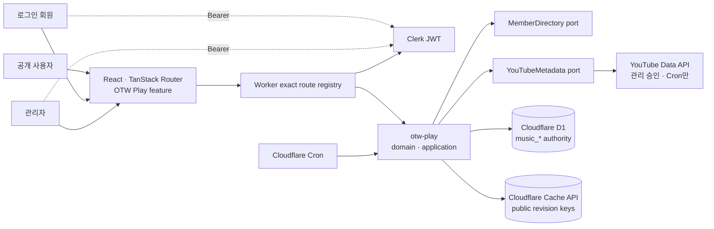
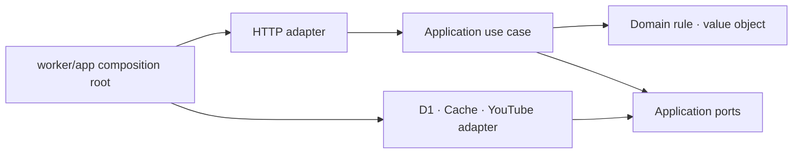
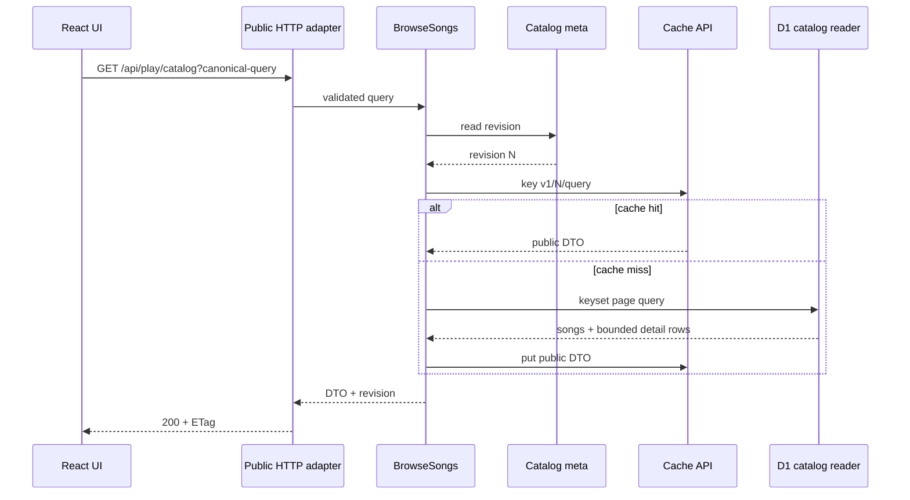
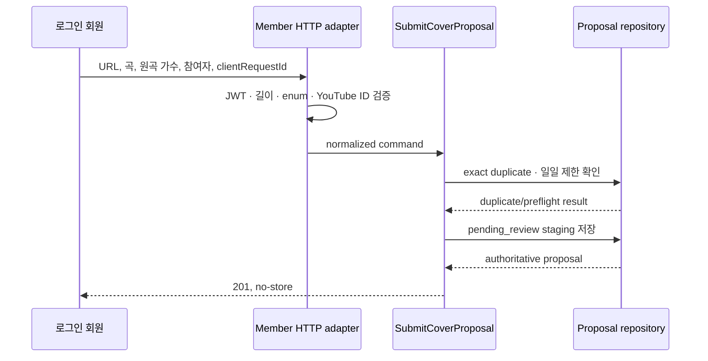
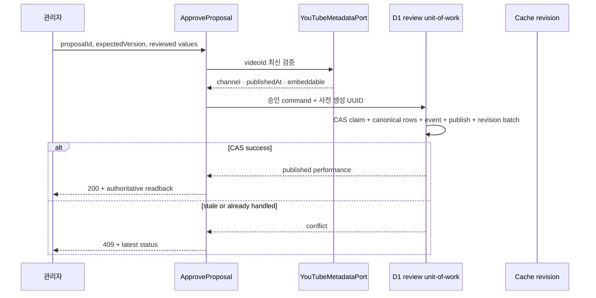
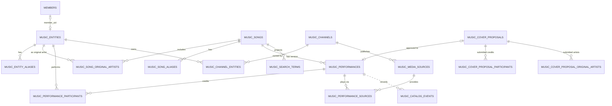

# OTW Play 시스템·DB 설계

상태: 구현 전 설계 기준선

기준일: 2026-08-11

상위 문서: `otw-play-product-requirements.md`

관련 문서:

- `otw-play-ui-ux-design.md`
- `otw-play-implementation-guide.md`
- `architecture.md`

## 1. 설계 결론

OTW Play는 기존 VOD 최신 영상 피드의 이름이나 화면만 바꾸는 기능이 아니다.
곡, 가창 버전, 참여자, 공식 채널, 재생 소스와 회원 제안의 생명주기를 소유하는
독립 `otw-play` capability로 구현한다.

핵심 설계는 다음과 같다.

1. D1의 정규화된 `music_*` 테이블을 카탈로그의 단일 권위로 사용한다.
2. 미검수 회원 제안은 staging aggregate에 보관하고 승인 시에만 공개
   카탈로그로 승격한다.
3. 공개 상태, 제안 심사 상태, 품질 상태와 소스 가용성을 서로 다른 축으로
   분리한다.
4. 공개 read model은 항상 `published`만 읽으며 관리자용 상태 parameter를
   받지 않는다.
5. Worker는 HTTP → application → domain/port ← infrastructure 의존 방향을
   지킨다.
6. 공개 조회 중 YouTube API를 호출하지 않는다. 외부 검증은 관리자 승인과
   Cron 점검에서만 수행한다.
7. 공개 읽기는 revision 기반 Cloudflare Cache API를 사용하고, 회원·관리자
   응답은 `no-store`로 분리한다.
8. 승인·게시·감사 이벤트·catalog revision 증가는 CAS와 D1 batch로
   부분 반영을 막는다.
9. R2, KV, Durable Objects와 Queues는 MVP에 추가하지 않는다.

테이블은 제품명 변경에 덜 민감한 `music_*` 접두사를 사용하고, 코드
capability는 제품 언어에 맞춰 `otw-play`를 사용한다.

## 2. 아키텍처 결정 기록

### ADR-PLAY-001: 독립 capability

상태: 채택

이유:

- 기존 YouTube capability는 채널별 영상 조회와 quota/cache를 소유한다.
- OTW Play는 작품·가창·크레딧·공개 승인이라는 다른 업무 규칙을 가진다.
- YouTube cache row나 최신 영상 응답은 음악 카탈로그의 권위 데이터가 아니다.

결과:

- `otw-play`가 catalog와 proposal 업무 규칙을 소유한다.
- `youtube`와 `members`는 공개 service를 port adapter로 제공한다.
- capability 간 내부 파일이나 DB repository 직접 import를 금지한다.

### ADR-PLAY-002: 상태 축 분리

상태: 채택

요구사항의 여러 상태 이름은 하나의 row 상태가 아니라 서로 다른 aggregate와
관심사다.

| 축 | 저장 위치 | 값 |
| --- | --- | --- |
| 회원 제안 심사 | `music_cover_proposals.status` | `pending_review`, `approved`, `rejected`, `withdrawn` |
| 카탈로그 공개 | `music_performances.publication_status` | `draft`, `published`, `withdrawn` |
| 카탈로그 품질 | `music_performances.quality_status` | `ok`, `needs_update` |
| 소스 가용성 | `music_media_sources.availability_status` | `unknown`, `playable`, `private`, `embed_disabled`, `deleted`, `region_blocked`, `unavailable` |
| 공식 채널 검수 | `music_channels.verification_status` | `pending`, `approved`, `revoked` |

`unavailable`은 곡이나 가창의 공개 상태가 아니다. 모든 연결 소스가 재생
불가여도 곡과 가창 메타데이터는 `published`로 보존하고 공개 DTO의
`playable=false`로 계산한다.

자동 수집의 `candidate`는 후속 범위다. 도입 시 별도
`music_ingestion_candidates` aggregate를 만들며 회원 제안 상태에 섞지 않는다.

### ADR-PLAY-003: 공개 read boundary 분리

상태: 채택

- 공개 repository는 SQL 자체에 `publication_status='published'`를 고정한다.
- 공개 endpoint에 `includeDraft`, `admin`, `status` 우회 parameter를 만들지 않는다.
- 회원 repository는 SQL에 `submitted_by_user_id = auth.sub`를 포함한다.
- 관리자 endpoint는 별도 handler와 repository method를 사용한다.
- 공개 DTO에는 제출자, 내부 note, 거절 사유, reviewer와 staging ID를 넣지 않는다.

### ADR-PLAY-004: 단일 Play-scoped player

상태: 채택할 구현 기본값

`/play` 중첩 route가 player provider와 단일 YouTube iframe을 소유한다. Play
내부 탐색에서는 재생 문맥을 유지하고 다른 사이트 영역으로 이동하면 player를
정리한다. 이는 저장 플레이리스트 없이도 음악 앱의 연속성을 제공하면서 숨은
재생 금지 정책을 지킨다.

### ADR-PLAY-005: MVP Cloudflare 구성 최소화

상태: 채택

- D1: 권위 데이터와 검색 read model
- Cache API: 공개 응답 read-through cache
- Smart Placement: 현재 설정 유지
- Cron: 게시 소스의 제한된 재검사
- R2: MVP 음악 데이터에는 사용하지 않음
- Queue: 자동 후보 수집이나 대량 점검이 실제로 필요할 때 도입
- Durable Object: 서버 재생 대기열이나 전역 lock이 없으므로 사용하지 않음

## 3. 전체 시스템 구조



공개 읽기와 외부 검증의 경로를 분리한다.

- 사용자의 검색·상세·재생 요청: Cache API와 D1만 사용
- 회원 제안: URL/ID 형식, D1 exact duplicate와 정책만 검사
- 관리자 승인: 저장된 제안을 읽은 뒤 YouTube metadata와 공식 채널을 검증
- Cron: 재검사 시점이 된 소스만 제한된 묶음으로 YouTube에 조회

## 4. Clean Architecture

### 4.1 제안 디렉터리

```text
contracts/
  otw-play.ts

src/features/otw-play/
  api/
  model/
  queries/
  use-cases/
  player/
  ui/
    catalog/
    detail/
    player/
    submissions/
    admin/
  index.ts

worker/features/otw-play/
  domain/
    catalog.ts
    proposal.ts
    status-transition.ts
    search-normalization.ts
    duplicate-policy.ts
    source-selection.ts
  application/
    browse-songs.ts
    read-song-detail.ts
    submit-cover-proposal.ts
    list-own-proposals.ts
    approve-proposal.ts
    reject-proposal.ts
    manage-catalog.ts
    recheck-sources.ts
    ports/
  infrastructure/
    d1-catalog-reader.ts
    d1-catalog-writer.ts
    d1-proposal-repository.ts
    d1-review-unit-of-work.ts
    d1-search-reader.ts
    cloudflare-catalog-cache.ts
  http/
    public-handler.ts
    member-handler.ts
    admin-handler.ts
  index.ts
```

필요한 책임이 없으면 빈 폴더나 pass-through class를 만들지 않는다.

### 4.2 의존성 방향



금지:

- domain/application에서 `Request`, `Response`, `Env`, D1, Drizzle import
- HTTP layer에서 SQL 또는 `getDb` 사용
- `otw-play`에서 `youtube/infrastructure` 직접 import
- frontend에서 DB schema 또는 Worker code import
- route에서 feature 내부 파일 import

현재 `scripts/architecture-check.mjs`의 경계를 그대로 통과해야 한다.

### 4.3 계층별 책임

#### Domain

- 상태 전이 허용 여부
- 검색어 정규화와 허용된 YouTube URL의 video ID parser
- exact/soft duplicate 규칙
- 소스 우선순위와 결정적 tie-break
- 멤버 ANY/ALL filter 의미
- current OTW와 external 표시 정책의 입력·출력 모델
- queue shuffle처럼 framework와 무관한 순수 알고리즘

#### Application

- use case 순서와 실패 의미
- port 조합
- 승인 전 검수 항목 결정
- 공개·제안·관리자 업무 경계
- idempotency, optimistic concurrency와 결과 타입

주요 port:

- `PlayCatalogReader`
- `PlayCatalogWriter`
- `CoverProposalRepository`
- `PlayReviewUnitOfWork`
- `MemberDirectory`
- `YouTubeVideoMetadataReader`
- `ApprovedChannelPolicy`
- `CatalogCache`
- `PlayEventWriter`
- `AdminAuditWriter`
- `SubmissionRatePolicy`
- `Clock`, `IdGenerator`

#### Infrastructure

- D1 prepared statement와 batch
- Drizzle schema mapping
- Cache API key·read·write
- members/youtube 공개 service adapter
- 전역 admin audit adapter
- 외부 API quota와 retry 세부 구현

#### HTTP

- 인증과 관리자 guard
- query/body 크기와 enum 검증
- domain YouTube parser 결과의 입력 오류·DTO 매핑
- DTO 변환과 error code
- `Cache-Control`, `ETag`, `Vary`, request ID

#### Frontend

- TanStack Query는 서버 상태를 소유한다.
- player reducer는 현재 세션 queue만 소유한다.
- `/play` route는 feature 공개 index를 조합한다.
- 공개 호출은 bearer를 보내지 않아 shared cache가 가능해야 한다.

현재 `apiFetch`는 로그인 상태이면 공개 GET에도 Authorization을 자동 첨부한다.
구현 시 `auth: 'omit' | 'optional' | 'required'` 같은 명시적 option을 추가하고
OTW Play 공개 API는 `omit`을 사용해야 한다. 회원·관리자 API는 `required`다.

## 5. 핵심 요청 흐름

### 5.1 공개 카탈로그



공개 목록은 한 번의 거대한 fan-out join으로 pagination하지 않는다.

1. 필터와 cursor를 적용해 곡 ID 24개를 선택한다.
2. 선택된 ID의 원곡 가수, 공개 performance, 참여자와 대표 source를 제한된
   batch query로 읽는다.
3. Worker에서 DTO를 조립한다.

목록 DTO에는 카드에 필요한 대표 performance만 넣고, 모든 version은 곡
상세에서 조회한다.

### 5.2 회원 제안



임의 URL을 Worker가 fetch하지 않는다. 지원하는 YouTube URL 형식에서 video ID만
추출하고, 외부 API URL은 YouTube adapter가 직접 구성하여 SSRF를 막는다.

### 5.3 관리자 승인



승인 후 전역 `admin_audit_logs`에는 운영 요약을 best-effort로 남긴다. 카탈로그
무결성에 필요한 `music_catalog_events`는 승인 batch 안에 있어야 한다.

## 6. 데이터 모델

### 6.1 키와 시간

- 새 `music_*` aggregate ID: Worker에서 미리 생성한 UUID `TEXT` PK
- 공개 slug: 생성 후 안정적으로 유지하는 `TEXT UNIQUE`
- timestamp: Unix epoch millisecond `INTEGER`
- 원곡 공개일: ISO `TEXT` + `year|month|day|unknown` precision
- 수정 가능한 aggregate: `version INTEGER NOT NULL DEFAULT 0`

UUID를 미리 만들면 parent/child ID를 승인 batch 전에 확정할 수 있고
`last_insert_rowid()` 의존을 피할 수 있다.

### 6.2 권위 카탈로그

| 테이블 | 핵심 열 | 역할 |
| --- | --- | --- |
| `music_entities` | `id`, `member_uid`, `entity_kind`, `display_name`, `normalized_name`, `slug`, `archived_at` | 멤버·외부 인원·원곡 가수·그룹의 통합 identity |
| `music_entity_aliases` | `entity_id`, `alias`, `normalized_alias`, `locale`, `alias_kind` | 다른 언어·활동명 검색 |
| `music_songs` | `id`, `slug`, `title`, `normalized_title`, `dedupe_key`, 원곡 공개일, `merged_into_song_id`, `archived_at` | 음악 작품 |
| `music_song_aliases` | `song_id`, `alias`, `normalized_alias`, `locale`, `alias_kind` | 제목 별칭 |
| `music_song_original_artists` | `song_id`, `entity_id`, `credit_order`, `is_primary` | 복수 원곡 가수 |
| `music_channels` | provider ID, 표시명, 역할, 검수 상태, 활성 여부 | 공식 채널 allowlist |
| `music_channel_entities` | `channel_id`, `entity_id`, 관계 | 공동·유닛 채널 소유 연결 |
| `music_media_sources` | provider 영상 ID, channel, metadata, 가용성, `last_checked_at`, `next_check_at` | YouTube 영상 자체 |
| `music_media_source_relations` | source 두 개와 관계 | 후속 원본·키리누키·대체 영상 연결 |
| `music_performances` | song, 분류 3축, 공개·품질 상태, 공개일, version | 특정 곡의 한 공식 가창 버전 |
| `music_performance_participants` | performance, entity, 역할, 순서, credit snapshot | 실제 가창 참여자 |
| `music_performance_sources` | performance, source, 구간, 역할, 우선순위, primary | 가창과 재생 소스 연결 |

`music_media_sources`와 `music_performance_sources`를 분리하는 이유는 하나의 긴
영상이 후속 단계에서 여러 곡 구간을 포함할 수 있기 때문이다. 동일 YouTube
영상은 한 번만 저장하고 여러 performance가 각 구간으로 연결한다.

### 6.3 회원 제안과 이력

| 테이블 | 핵심 열 | 역할 |
| --- | --- | --- |
| `music_cover_proposals` | submitter, idempotency key, URL/video ID, 제출 제목, suggested song, note, status, version, review lock, reviewer, result | 제안 aggregate |
| `music_cover_proposal_participants` | proposal, 순서, resolved entity nullable, 제출명 snapshot, 역할 | 승인 전 참여자 입력 |
| `music_cover_proposal_original_artists` | proposal, 순서, resolved entity nullable, 제출명 snapshot | 승인 전 원곡 가수 입력 |
| `music_catalog_events` | aggregate, event, actor, before/after, 제한된 detail, 시각 | append-only 권위 이력 |

제안은 canonical entity/song/performance row를 만들지 않는다. 승인 command가
제출 snapshot을 검수된 entity와 song에 resolve한 뒤 공개 카탈로그를 만든다.

Clerk 사용자 정보는 `sub`만 저장하고 이메일 같은 불필요한 개인정보를 복제하지
않는다. note 원문은 구조화 로그나 전역 audit detail에 넣지 않는다.

### 6.4 검색과 카탈로그 meta

| 테이블 | 핵심 열 | 역할 |
| --- | --- | --- |
| `music_search_terms` | song, term kind, 표시값, normalized term | 제목·별칭·원곡 가수·참여자 검색 projection |
| `music_catalog_meta` | singleton ID, revision, public flag, navigation flag, updated_at | cache revision과 단계적 공개 switch |

`music_search_terms`의 PK는 `(song_id, term_kind, normalized_term)`이다. 게시,
수정, 철회 시 해당 곡의 term projection과 revision을 같은 batch에서 갱신한다.

### 6.5 핵심 관계



`MUSIC_MEDIA_SOURCES`는 영상, `MUSIC_PERFORMANCES`는 가창 버전이다. 두 엔티티를
합치지 않는 것이 후속 방송 구간과 대체 소스 확장의 핵심이다.

### 6.6 주요 enum과 check

| 열 | 값 |
| --- | --- |
| `entity_kind` | `person`, `group`, `organization` |
| `channel_role` | `otw_official`, `unit_official`, `member_music`, `member_main`, `project_official`, `approved_kirinuki`, `other` |
| `relation_type` | `original`, `cover` |
| `release_type` | `official_mv`, `official_video`, `broadcast`, `live`, `shorts` |
| `participation_type` | `solo`, `duet`, `unit`, `group`, `external_collab` |
| participant role | `vocal`, `featured_vocal`, `chorus`, `other` |
| public participant kind | `current_member`, `external`, `group` |
| source role | `official`, `kirinuki`, `broadcast_original`, `alternate` |
| source relation | `excerpt_of`, `alternate_of` |

`entity_kind`는 persistence identity의 형태이고 participant role은 가창 credit의
역할이다. 공개 participant kind는 화면 투영 계약이며 전 소속 멤버를 반드시
`external`로 변환한다. `group`은 보조 표시이고 실제 참여자 credit을 대체하지
않는다.

공식 영상 MVP의 source 구간은 `start_seconds=0`, `end_seconds=NULL`이다.
`end_seconds`가 있으면 `end_seconds > start_seconds` check를 둔다.

### 6.7 관계와 삭제 정책

- `music_entities.member_uid → members.uid`: `ON DELETE SET NULL`
- song의 alias/original artist: song hard delete 시 `CASCADE`
- performance의 participant/source link: performance hard delete 시 `CASCADE`
- performance → song, source → channel, junction → entity/source: `RESTRICT`
- proposal의 suggested song: `SET NULL`
- proposal의 approved performance: `RESTRICT`
- 공개 song/performance와 rejected proposal은 운영 command에서 hard delete하지 않는다.
- 잘못된 공개 데이터는 `withdrawn`, `archived`, merge 관계로 보존한다.

마이그레이션에서는 foreign key와 CHECK를 명시하고
`PRAGMA foreign_key_check`, `PRAGMA integrity_check`로 검증한다.

## 7. 제약과 인덱스

### 7.1 DB가 막는 exact duplicate

- `music_channels`: `UNIQUE(provider, external_channel_id)`
- `music_media_sources`: `UNIQUE(provider, external_id)`
- `music_entities`: partial `UNIQUE(member_uid) WHERE member_uid IS NOT NULL`
- `music_songs.dedupe_key`: unique
- `music_performances.dedupe_key`: unique
- `music_performance_sources`: partial `UNIQUE(performance_id) WHERE is_primary=1`
- `music_cover_proposals`: partial
  `UNIQUE(youtube_video_id, segment_start_seconds) WHERE status='pending_review'`
- proposal retry: `UNIQUE(submitted_by_user_id, idempotency_key)`

Domain은 hash가 아니라 다음과 같은 버전 포함 canonical key material을 만든다.
각 요소는 JSON tuple처럼 경계가 모호하지 않은 형식으로 직렬화한다.

```text
song:v1 material = ["song:v1", normalized title, sorted unique original-artist entity IDs]
performance:v1 material = ["performance:v1", song ID, media source ID, start seconds]
```

후속 infrastructure adapter가 UTF-8 key material에 SHA-256을 적용한다. 순수
domain은 Web Crypto, Node crypto 또는 Cloudflare runtime에 의존하지 않는다.

참여자 보완으로 같은 공식 영상이 새 performance가 되지 않도록 performance key에
참여자 목록은 넣지 않는다.

유사 제목, 유사 원곡 가수, 인접 공개일과 겹치는 참여자는 soft duplicate다.
자동 병합하지 않고 관리자에게 후보와 근거만 보여준다.

### 7.2 hot query 인덱스

- `music_entities(normalized_name, id)`
- `music_entities(member_uid)` partial unique
- `music_entity_aliases(normalized_alias, entity_id)`
- `music_songs(normalized_title, id)`
- `music_song_aliases(normalized_alias, song_id)`
- `music_song_original_artists(entity_id, song_id)`
- `music_channels(verification_status, active, channel_role)`
- `music_media_sources(channel_id, provider_published_at DESC, id)`
- `music_media_sources(availability_status, last_checked_at)`
- published partial `music_performances(released_at DESC, id)`
- published partial `music_performances(song_id, released_at DESC, id)`
- published partial `music_performances(relation_type, released_at DESC, id)`
- `music_performance_participants(entity_id, performance_id)`
- `music_performance_sources(performance_id, priority, source_id)`
- `music_performance_sources(source_id, start_seconds)`
- `music_cover_proposals(status, created_at, id)`
- `music_cover_proposals(submitted_by_user_id, created_at DESC, id)`
- `music_catalog_events(aggregate_type, aggregate_id, created_at DESC)`
- `music_search_terms(normalized_term, term_kind, song_id)`

인덱스는 예상 조합을 모두 만드는 방식이 아니라 실제 hot query와
`EXPLAIN QUERY PLAN` 결과에 맞춰 최소화한다. D1은 반환 행이 아니라 읽은 행을
측정하므로 full scan 제거가 우선이다.

## 8. API 설계

### 8.1 공개

| Method | Path | 목적 | Cache API |
| --- | --- | --- | --- |
| GET | `/api/play/config` | 공개·내비게이션 기능 flag와 catalog revision | 예 |
| GET | `/api/play/catalog` | 검색·필터·정렬·cursor 목록 | 기본 탐색만 |
| GET | `/api/play/facets` | 멤버·그룹·원곡 가수 filter 자료 | 예 |
| GET | `/api/play/songs/:slug` | 곡과 모든 공개 공식 버전 | 예 |
| GET | `/api/play/performances/:id` | 가창 직접 링크 | 예 |

목록 parameter:

```text
q
member=1&member=2
memberMode=any|all
group
relation=original|cover
participation=solo|duet|unit|group|external_collab
originalArtist
publishedFrom
publishedTo
sort=recent|title|participant
cursor
limit
```

- 기본 limit 24, 최대 60
- member 최대 10개
- q는 trim 전 최대 80자
- 날짜는 ISO day 형식
- 알 수 없는 enum과 malformed cursor는 `400`
- query key는 parameter 이름과 반복값을 정렬해 canonicalize한다.

응답 공통 envelope:

```ts
{
  data: T;
  nextCursor: string | null;
  catalogRevision: number;
  generatedAt: string;
}
```

### 8.2 로그인 회원

| Method | Path | 목적 |
| --- | --- | --- |
| POST | `/api/play/submissions/preflight` | video ID, exact duplicate와 유사 곡 후보 |
| POST | `/api/play/submissions` | 공식 커버 제안 |
| GET | `/api/play/submissions/mine` | 본인 제안 목록 |
| GET | `/api/play/submissions/:id` | 본인 제안 상세 |

route manifest의 auth는 현재 `member-policy`를 사용하고 handler에서 실제 JWT를
검증한다. 모든 응답은 `Cache-Control: no-store`다.

제안 요청은 `clientRequestId`, YouTube URL, 곡명, 복수 원곡 가수, 참여자,
선택 note를 받는다. client가 보낸 status, submitter와 reviewer는 무시한다.
회원 command의 관계는 서버에서 항상 `cover`로 고정하며 `original`은 관리자
직접 등록 use case로만 처리한다.

### 8.3 관리자

| Method | Path | 목적 |
| --- | --- | --- |
| GET | `/api/play/admin/catalog` | draft·published 운영 목록 |
| POST/PUT | `/api/play/admin/songs` | 곡 생성·수정 |
| POST/PUT | `/api/play/admin/performances` | 가창 draft 생성·수정 |
| POST | `/api/play/admin/performances/:id/publish` | 검수 후 게시 |
| POST | `/api/play/admin/performances/:id/withdraw` | 공개 철회 |
| GET | `/api/play/admin/submissions` | 검토 대기 목록 |
| POST | `/api/play/admin/submissions/:id/approve` | 검수값으로 승인·게시 |
| POST | `/api/play/admin/submissions/:id/reject` | 사유와 함께 거절 |
| CRUD | `/api/play/admin/channels` | 공식 채널 검수·활성 관리 |
| POST | `/api/play/admin/sources/:id/recheck` | 소스 상태 재검사 |

승인, 반려, publish와 withdraw command에는 `expectedVersion`을 요구한다.

### 8.4 오류 계약

```ts
{
  error: {
    code: string;
    message: string;
    fields?: Record<string, string>;
    requestId: string;
  };
}
```

| Status | 의미 |
| --- | --- |
| 400 | malformed body/query/cursor |
| 401 | 로그인 필요 |
| 403 | 관리자 권한 필요 |
| 404 | 공개 대상 없음 또는 소유하지 않은 제안 |
| 409 | exact duplicate, stale version, 잘못된 상태 전이 |
| 422 | 공식 채널·영상·참여자 검수 실패 |
| 429 | 제출 제한 |
| 503 | D1 또는 YouTube의 재시도 가능한 장애 |

공유 DTO는 `contracts/otw-play.ts`가 소유하고 Drizzle row type을 노출하지 않는다.

## 9. 알고리즘

### 9.1 검색 정규화와 순위

표시 원문은 보존하고 검색값만 다음 순서로 정규화한다.

1. Unicode NFKC
2. trim
3. 연속 공백 축약
4. locale-independent lowercase
5. 호환 구두점을 공백으로 통일
6. 다시 공백 축약

로마자, 일본어와 한국어를 임의 번역·음차하지 않는다. 다른 표기는 관리자가
alias로 등록한다.

검색 순위:

1. 대표 제목 exact
2. 제목 alias exact
3. 대표 제목 prefix
4. 원곡 가수 exact/prefix
5. 참여자 exact/prefix
6. 제한된 contains fallback
7. 동점이면 최신 공식 공개일과 song ID

prefix query는 `${normalized}%`를 bind한다. contains는 prefix 결과가 부족하고
검색어가 2자 이상일 때만 작은 limit으로 실행한다. 다음 중 하나를 지속적으로
넘으면 FTS5 projection을 별도 custom migration으로 검토한다.

- search term 10,000행
- cold search p95 500ms
- 한 검색의 D1 rows read 5,000행

FTS5는 권위 테이블이 아니라 교체 가능한 read model이어야 한다.

### 9.2 filter 의미

- 곡은 하나 이상의 `published` performance가 모든 filter를 만족할 때 반환한다.
- 여러 performance에 나뉜 참여자를 합쳐 ALL로 간주하지 않는다.
- ANY: 같은 performance에 선택 멤버 중 한 명 이상 참여
- ALL: 같은 performance에 선택한 모든 멤버 참여
- 현재 그룹 filter는 실제 participant의 `members.unit_name`과 명시적 group
  entity를 모두 고려하되 실제 멤버 기록을 생략하지 않는다.

### 9.3 keyset pagination

- recent cursor: `latestReleasedAt + songId`
- title cursor: `normalizedTitle + songId`
- participant cursor: 대표 참여자의 `normalizedName + songId`
- cursor는 version을 포함한 JSON을 base64url로 인코딩하고 server에서 schema를 검증한다.
- `OFFSET`은 사용하지 않는다.

같은 query와 catalog revision에서는 페이지 사이 중복·누락이 없어야 한다.

### 9.4 대표 소스 선택

대표 소스는 공개 조회 때 YouTube를 호출해 정하지 않는다. publish 또는 source
recheck에서 다음 순서로 계산·저장한다.

1. 승인된 활성 채널
2. `playable`과 embed 가능
3. OTW/유닛 공식
4. 멤버 공식 노래 채널
5. 멤버 메인 공식 채널
6. 승인된 프로젝트 공식 채널
7. 관리자 override
8. 동률이면 priority, source ID

primary가 재생 불가가 되면 `priority ASC, source_id ASC`의 첫 playable 대체
소스를 공개 DTO에서 선택하고 `usingFallback=true`를 알린다. 무단 자동 교체가
아니라 이미 검수된 연결 소스 안에서만 선택한다.

### 9.5 queue

- queue는 frontend reducer와 `sessionStorage`에만 둔다.
- shuffle은 현재 항목을 고정하고 나머지에 Fisher–Yates를 한 번 적용한다.
- 난수 함수를 주입 가능하게 하여 test를 결정적으로 만든다.
- unavailable skip은 한 탐색당 queue 길이만큼만 시도해 무한 순환을 막는다.
- repeat은 `off`, `one`, `all`의 명시적 state machine으로 구현한다.

## 10. 동시성·원자성·idempotency

### 10.1 낙관적 잠금

수정 command는 `expectedVersion`을 받고 다음 CAS를 사용한다.

```sql
UPDATE music_cover_proposals
SET review_lock_token = ?, review_lock_expires_at = ?
WHERE id = ?
  AND status = 'pending_review'
  AND version = ?
  AND (review_lock_token IS NULL OR review_lock_expires_at < ?)
```

승인 batch의 모든 canonical insert는 동일 lock token이 있는 제안의
`EXISTS` 조건으로 보호한다. 마지막에 proposal을 `approved`로 바꾸고 lock을
지우며 version을 증가시킨다. batch 결과에서 첫 CAS 또는 마지막 transition의
`changes`가 1이 아니면 `409 STALE_WRITE`다.

이 패턴은 CAS가 0행이어도 SQL 오류가 발생하지 않는 점을 보완한다. claim 실패
시 뒤의 조건부 insert도 모두 0행이어야 한다. 중간 constraint 또는 event 쓰기
실패는 D1 batch 전체를 rollback한다.

### 10.2 승인 batch

1. proposal CAS claim
2. 필요한 entity/song/source insert 또는 기존 row 연결
3. performance, participant, source link 생성
4. search term projection 생성
5. performance `published`
6. proposal `approved`와 approved performance 연결
7. capability event append
8. catalog revision 증가

UUID는 application에서 미리 만들고, 모든 SQL은 prepared statement로 bind한다.
YouTube 외부 호출은 batch 밖에서 먼저 끝내고 CAS로 그 사이의 변경을 감지한다.

### 10.3 재시도

- `(submitted_by_user_id, idempotency_key)`가 같으면 기존 제안을 반환한다.
- 같은 approve request가 이미 승인된 제안을 다시 만나면 연결된 performance를
  readback하고 성공 또는 명시적 already-processed 결과를 반환한다.
- 같은 video/start의 다른 pending 제안은 `409 EXACT_DUPLICATE`다.
- soft duplicate는 자동 병합하지 않는다.

## 11. Cloudflare 최적화

### 11.1 공개 Cache API

Cache API key:

```text
https://otw.internal/cache/play/v1/{catalogRevision}/{canonicalPathAndQuery}
```

- 고정 내부 host를 사용해 host 기반 cache poisoning을 막는다.
- query parameter와 반복값을 정렬해 같은 의미의 key를 하나로 만든다.
- 기본 catalog, facets와 detail만 저장한다.
- 자유 검색어는 저장하지 않거나 30초 이하의 작은 browser cache만 허용한다.
- member/admin 응답과 Authorization 요청은 저장하지 않는다.
- Set-Cookie가 있는 응답을 저장하지 않는다.

권장 TTL:

| 응답 | Browser | Cache API |
| --- | --- | --- |
| 기본 catalog | 60초 | 5분 |
| 곡 상세 | 60초 | 10분 |
| facets/config | 60초 | 30분 |
| 자유 검색 | 0–30초 | 저장 안 함 |
| 회원·관리자 | 0 | 저장 안 함 |

Cache API는 PoP local이고 `cache.delete()`도 해당 data center에만 영향을 준다.
삭제 무효화 대신 revision을 cache key에 포함한다. Cache API 자체는
`stale-while-revalidate`를 지원하지 않으므로 해당 header만 믿지 않는다.

ETag는 `catalogRevision + canonical query`의 hash로 만든다. 공개 member 상태가
바뀌는 command도 catalog revision을 증가시켜 전 소속 멤버 chip이 오래
cache되지 않게 한다.

### 11.2 D1 query 최적화

- 모든 query에 prepared statement와 명시적 LIMIT
- offset pagination 금지
- 기본 24, 최대 60의 bounded IDs
- detail은 3–4개 bounded query를 `db.batch()`로 실행
- variable ID는 최대 크기를 제한하고 100 bind 안에서 chunk
- `ORDER BY RANDOM()` 금지
- migration 후 `PRAGMA optimize`
- hot query는 `EXPLAIN QUERY PLAN`에서 index search 확인
- D1 `rows_read`, `rows_written`, query latency를 관측

현재 Smart Placement를 유지한다. D1 read replication은 Sessions API를 사용하지
않는 현재 adapter에는 자동 적용되지 않으므로, cache miss p95 문제가 실제로
관측된 뒤 infrastructure adapter에서만 검토한다.

### 11.3 YouTube와 Cron

- public GET에서 YouTube API 호출 금지
- 회원 제출은 ID 형식과 DB duplicate까지만 확인
- 관리자 검수에서 최신 metadata·channel·embed 상태 확인
- Cron은 `next_check_at`이 지난 source 최대 50개를 한 번에 조회
- quota 오류 시 상태를 unavailable로 덮지 않고 재시도 시각과 오류를 기록
- 영상은 다운로드, 음원 추출, 프록시 또는 R2 재호스팅하지 않는다.

## 12. 보안과 개인정보

- 회원: 기존 `authenticateRequest` 계열, manifest `member-policy`
- 관리자: `requireAdminUser`
- 소유권: proposal query의 SQL predicate로 강제
- admin/member endpoint: `Cache-Control: no-store`, `Vary: Authorization`
- body 크기, 배열 길이, 문자열 길이와 enum 제한
- 참여자 최대 수와 멤버 filter 최대 수 제한
- 임의 remote URL fetch 금지
- client가 보낸 actor/status/reviewer 무시
- token, API key, 회원 note와 검색 원문을 구조화 로그에 남기지 않음
- 검색 로그는 길이 또는 비가역 hash만 기록

스팸 보호는 두 층으로 둔다.

1. Cloudflare rate limiting 또는 WAF: 짧은 burst 억제
2. D1: 사용자별 일일 제출 수와 exact duplicate의 권위 검사

일일 제한 숫자는 TBD-014가 확정될 때 setting으로 정하며 코드 상수로 고정하지
않는다. edge rate limit은 분산 환경에서 일일 권위 카운터로 사용하지 않는다.

## 13. 실패 처리

| 실패 | 동작 |
| --- | --- |
| 공개 Cache API 실패 | D1을 읽어 정상 응답, 구조화 warning |
| D1 공개 조회 실패 | 오래된 철회 콘텐츠를 임의 제공하지 않고 503 |
| YouTube 승인 검증 실패 | proposal 유지, 승인 전이 없음, retryable 503 |
| source 삭제·비공개 | source 상태 변경, metadata 보존, player fallback/skip |
| 동시 관리자 승인 | 한 CAS만 성공, 나머지 409, 부분 canonical row 없음 |
| exact duplicate | 409, 같은 idempotency key면 기존 결과 readback |
| soft duplicate | 저장 가능, 관리자 warning |
| current member가 deprecated로 변경 | revision 증가 후 external chip projection |
| capability event 저장 실패 | 승인 batch 전체 rollback |
| 전역 admin audit 실패 | 승인 결과 유지, 별도 관측·재기록 대상 |

## 14. 관측성과 성능 목표

구조화 이벤트:

- `play.catalog.read`
- `play.catalog.cache_hit`, `cache_miss`
- `play.proposal.submitted`, `approved`, `rejected`
- `play.catalog.published`, `withdrawn`, `updated`
- `play.source.unavailable`, `recovered`
- `play.youtube.verify_failed`
- `play.concurrent_write_conflict`

공통 필드:

- `requestId`, `cfRay`, `routeId`, status
- duration, cache status
- D1 rows read/written
- resource ID, 상태 전이
- 사용자 원문을 제외한 error code

초기 목표:

| 지표 | 목표 |
| --- | --- |
| 공개 Cache API hit Worker p95 | 150ms 이하 |
| 공개 cold catalog p95 | 600ms 이하 |
| D1-only mutation p95 | 1초 이하 |
| 공개 5xx | 0.5% 미만 |
| 기본 catalog/detail cache hit ratio | 80% 이상 |
| catalog response gzip | 100KB 이하 |
| UI player 제외 CLS | 0.1 이하 |

YouTube 외부 검증 시간은 mutation 목표와 분리해 측정한다. 목표는 출시 전 로컬
fixture와 preview 배포에서 기준선을 만들고, 운영 24시간·7일 값으로 다시
조정한다.

## 15. 설계 수용 기준

- 공개 repository만으로 draft, proposal 또는 rejected 데이터를 읽을 수 없다.
- 전 소속 멤버는 기존 연결을 보존하면서 조회 시 external chip으로 투영된다.
- 같은 YouTube 영상은 media source 하나로 보존되고 여러 performance 구간에 연결될 수 있다.
- 같은 제안을 동시에 승인해도 canonical performance는 하나만 생성된다.
- 승인 중 event 쓰기가 실패하면 proposal과 catalog 모두 원래 상태다.
- 검색, member ANY/ALL과 세 정렬이 keyset pagination에서 중복·누락 없이 동작한다.
- public GET은 YouTube API를 호출하지 않는다.
- public/member/admin DTO와 cache가 서로 섞이지 않는다.
- source가 사라져도 곡·가창·감사 이력은 남는다.
- schema 변경은 `db/schema/index.ts`에서 시작하고 생성 migration을 검토한다.

## 16. 공식 기술 근거

- D1 batch: https://developers.cloudflare.com/d1/worker-api/d1-database/
- D1 index: https://developers.cloudflare.com/d1/best-practices/use-indexes/
- D1 limits: https://developers.cloudflare.com/d1/platform/limits/
- D1 foreign keys: https://developers.cloudflare.com/d1/sql-api/foreign-keys/
- D1 SQL·FTS5: https://developers.cloudflare.com/d1/sql-api/sql-statements/
- Workers Cache API: https://developers.cloudflare.com/workers/runtime-apis/cache/
- Workers cache control: https://developers.cloudflare.com/cache/concepts/cache-control/
- Smart Placement: https://developers.cloudflare.com/workers/configuration/placement/
- YouTube IFrame Player: https://developers.google.com/youtube/iframe_api_reference
- YouTube required functionality: https://developers.google.com/youtube/terms/required-minimum-functionality
