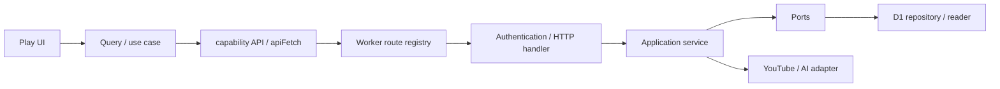

# OTW Play 시스템 설계

기준: 2026-09-17 / `58cb3f7e26146614b0af06dc4cc61ab086a35702`.
[제품 계약](otw-play-product-requirements.md)의 현재 접근·멤버 탐색 정책을 적용한다.
과거 단계별 ADR·schema 설명은 [설계 기록](archive/otw-play-system-design-before-2026-09-17.md)에 보존한다.
정확한 현재 schema와 HTTP 계약은 각각 [Drizzle schema](../db/schema/index.ts),
[공유 DTO](../contracts/otw-play.ts), [route registry](../worker/app/routes.ts)가 구현 근거다.

## 요청과 의존성

프런트는 `src/features/otw-play`, 서버는 `worker/features/otw-play`가 소유한다.
domain은 UI·Cloudflare adapter에 의존하지 않는다. HTTP는 인증·입력 검증·오류 변환을,
application은 유스케이스를, infrastructure는 D1·외부 시스템 접근을 담당한다.
라우트는 얇은 adapter이며 DB 호출을 UI나 route 파일로 끌어올리지 않는다.

## 인증과 읽기

`/api/play/config`를 제외한 catalog 요청은 회원 인증을 요구한다.
[API client](../src/features/otw-play/api/public.ts)는 catalog에 인증을 붙이고,
[Play shell](../src/features/otw-play/ui/public/play-shell.tsx)은 로그인·관리자 확인·회원 flag를 처리한다.
관리자 preview header는 서버 `requireAdminUser` 검증을 거친다.
[catalog handler](../worker/features/otw-play/http/public-catalog-handler.ts)는 preview에만
broadcast 읽기를 허용한다. 일반 회원 공식 catalog·상세·일괄 resolve·제안 검색에서 clip을 분리한다.

인증 catalog 응답은 `no-store`다. 과거 익명 catalog Cache API 설계를 현재 인증 응답에
그대로 적용하지 않는다. config와 서비스 내부 read model·cache의 책임은 별개다.
revision 일치, flag-off 차단, strict query·cursor 검증과 unpublished 데이터 격리를 유지한다.
파생 search projection은 권위 catalog를 대체하지 않는다.

대표 읽기 경로:
`OtwPlayCatalogPage → useOtwPlayCatalog → fetchOtwPlayCatalog → publicGet → apiFetch
→ GET /api/play/catalog → PublicCatalogService → D1PublicCatalogReader`.
호출 관계는 [service](../worker/features/otw-play/application/public-catalog-service.ts)와
[reader](../worker/features/otw-play/infrastructure/d1-public-catalog-reader.ts)에서 확인한다.

## 저장과 원자성

song, performance, entity, channel, source를 별도 identity로 유지한다.
publication/review/source-health를 하나의 상태로 합치지 않는다.
쓰기 command는 version/CAS, 승인된 source·채널, immutable dedupe identity를 검사한다.
`sources[]`가 performance source의 권위 입력이며 legacy 단일 source 호환은 ingress에만 둔다.

catalog 변경·관계·projection·event·revision은 동일 D1 batch로 처리한다.
Ready의 catalog materialization은 새 곡·외부 identity 재사용을 즉시 가능하게 하고,
가창 draft 변환과 publish는 별도 command로 유지한다. 재시도는 같은 idempotency 의도를
보존하며 부분 성공을 새 게시로 중복 실행하지 않는다.

draft·withdrawn 정리는 게시된 가창, 승인 proposal 참조, merge target을 보호한다.
event는 append-only repository가 소유하며 감사 이력·과거 migration을 임의 삭제하지 않는다.
DB FK/CHECK와 schema drift는 migration·doctor로 해결하고 런타임 fallback으로 숨기지 않는다.

회원 제안은 본인 소유·pending_review·version 검사 후 수정/철회한다.
승인은 최신 channel/source/credit 정책을 만족한 proposal과 published catalog를 원자적으로 전이한다.
서버가 submitter·reviewer·status·publication을 소유한다. 내부 note·review result는 공개 DTO에서 제외한다.

## 플레이리스트와 player

[PlaylistService](../worker/features/otw-play/application/playlist-service.ts)와
[D1PlaylistRepository](../worker/features/otw-play/infrastructure/d1-playlist-repository.ts)는
기본 모음, 계정별 비공개 목록, 소유권·version을 처리한다.
목록 저장과 queue 추가는 별도이며, 전체 페이지 resolve 후 중복 없는 가창 목록을 추가한다.

[PlayPlayerProvider](../src/features/otw-play/player/play-player-context.tsx)는 Play 영역에서
단일 iframe·presentation·queue를 유지한다. queue 복원은 ID 재검증을 거치고 자동 재생하지 않는다.
visible host·route 생명주기와 재생 명령을 분리하여 이동 중 이중 iframe이나 숨은 재생을 막는다.
전체 queue 삭제는 현재 항목과 sessionStorage도 초기화한다.
검수용 [segment preview](../src/features/otw-play/ui/admin/review-segment-player.tsx)는
명시적 미리보기이며 저장·게시 또는 추가 AI 실행과 결합하지 않는다.

## 자동화와 외부 시스템

현재 전달은 Cron → Workflow → D1 outbox → Queue다.
승인·활성 monitor·global pause·generation·lease·예산을 확인하고 시간당 uploads polling을 수행한다.
250개 cap와 continuation/watermark/gap, 수동 backfill 1~20개, 재개 시 최신 기준점 계약은
[polling runbook](operations/channel-upload-polling.md)에 통합한다.

WebSub producer/consumer/Queue는 종료되었다. callback 및 종료 관리자 명령은 HTTP 410이며
과거 subscription/delivery 테이블·migration은 이력이다. 새 설정·Queue를 복원하지 않는다.
현재 Queue 분기는 [worker-queue](../worker/app/worker-queue.ts)를 따른다.
Gemini 검수는 별도 AI Queue·예산·수동 적용 경계를 가지며 [AI 계약](otw-play-ai-review.md)을 따른다.

## 검증과 변경 순서

계약 변경은 DTO → service/port/repository → HTTP → UI 소비자를 함께 확인한다.
쓰기 변경은 실제 D1 무결성·CAS·재시도 검사를, 접근 변경은 역할×flag×공식/clip 범위를 검증한다.
재생 검증은 실제 visible YouTube iframe을 통한 사용 흐름이 필요하다.
테스트·정적 그래프만으로 운영 배포·권리·재생·신규 업로드 canary를 완료 처리하지 않는다.
명령과 릴리스 경계는 [유지보수 가이드](otw-play-implementation-guide.md)를 따른다.
