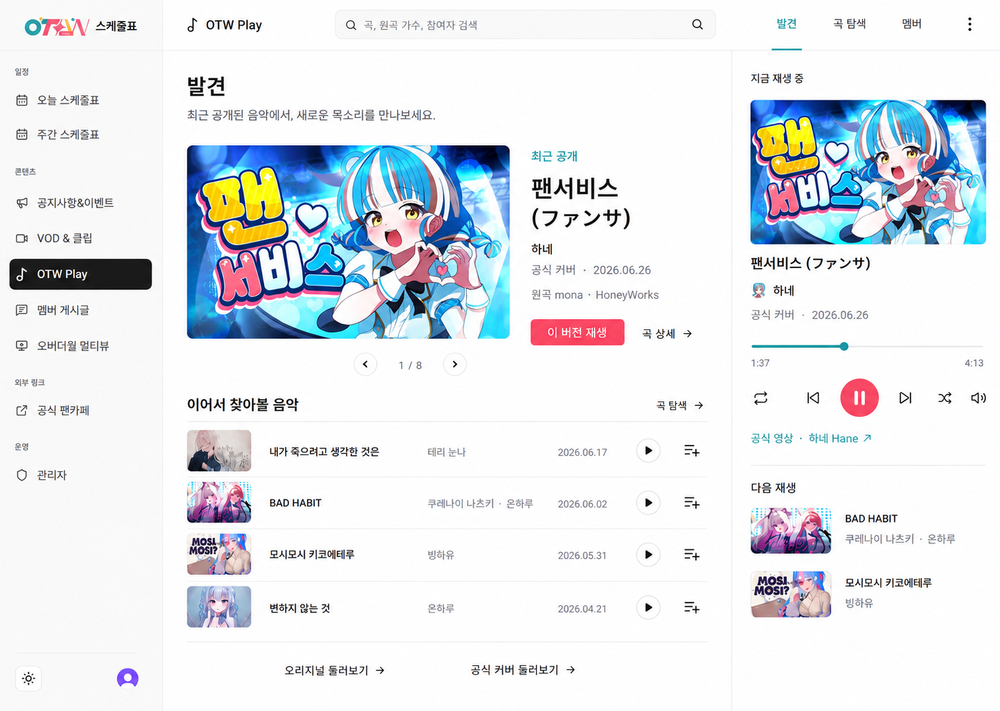
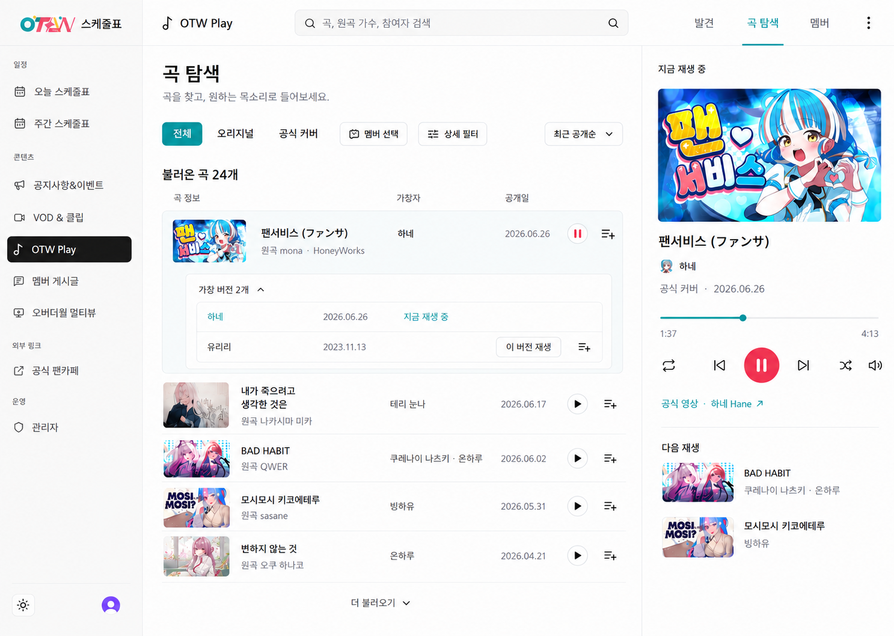
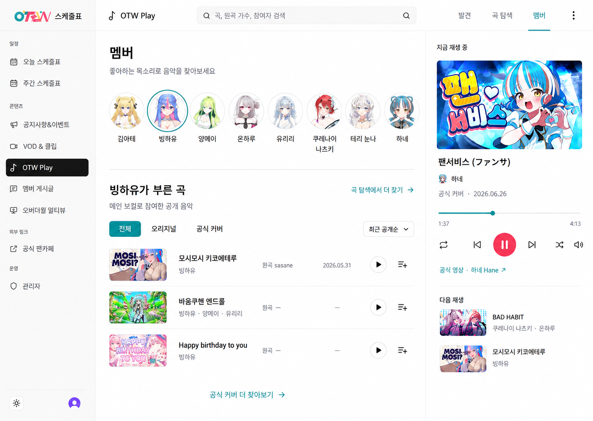

# OTW Play — 현재 기능 중심의 3개 화면과 모션 설계

> 2026-09-07: 전면 개편을 폐기하고 기존 UI 개선으로 방향을 변경했다.
> 이 문서는 이전 검토 기록이며 활성 UI 설계가 아니다. 현재 화면 기준은 `Design.md`의 OTW Play 절이다.

기준일: 2026-09-05 · 상태: 2026-09-07 폐기, 이전 검토 기록으로만 보존

상위 문서: [제품 요구사항](./otw-play-product-requirements.md) · [UI/UX 설계](./otw-play-ui-ux-design.md)

## 1. 확정한 방향과 범위

**발견 / 곡 탐색 / 멤버의 3개 화면을 현재 카탈로그·필터·곡 상세·플레이어로 구성한다.** 사용자는 기능 확장보다 현재 기능의 탐색·추천 경험, 세련된 시각 구성과 적절한 트랜지션을 우선하도록 요청했다. 이를 반영해 앞선 에디터 모음·프로필 노래책·저장 기능 중심 안을 대체한다.

세 시안은 하나의 앱을 구성하는 화면이며 선택형 스타일 후보가 아니다. 현재 운영 코드는 발견·곡 검색 두 메뉴다. 새 프런트엔드 배치·내비게이션·상호작용 구현은 필요하지만, **추천 서버·새 DB·관리자 편집 도구를 전제로 하지 않는다.** 이번 결과물은 이미지와 구현 명세이며 작동하는 UI나 애니메이션을 배포한 결과가 아니다.

| 화면 | 사용자 목적 | 현재 기능 재사용 |
| --- | --- | --- |
| 발견 | 최근 공개 음악에서 들어볼 곡 발견 | 최근 카탈로그, 대표 가창, 첫 8곡 배너 후보, 재생·상세 진입 |
| 곡 탐색 | 원하는 곡과 가창 버전 찾기 | 검색·관계/멤버/역할 필터·정렬·cursor·곡 상세 |
| 멤버 | 좋아하는 목소리에서 출발 | current member facet + 메인 보컬 곡 필터 + 기존 목록·재생 |
| 공통 플레이어 | 탐색 중에도 정확한 가창 이어 듣기 | 단일 iframe·session queue·반복·셔플·이전/다음·볼륨·큐 편집 |

에디터 큐레이션, 홍보문·노출 기간 관리, 모음 상세·일괄 재생, 사용자 보관함·좋아요, 새 멤버 프로필·노래책·제작 참여 집계, 개인화·인기 차트·AI 추천은 이번 개선에 추가하지 않는다. 기존 장기 요구사항을 삭제하는 뜻은 아니며 이번 UI의 의존성에서 제외한다.

## 2. 발견 — 기존 데이터로 자동 구성

큰 16:9 음악 이미지와 곡명·가창자·실제 공개일·재생 버튼을 하나의 대표 영역으로 묶는다. 소개 문장을 운영자가 작성하지 않아도 실제 제목과 참여자가 주인공이 되게 한다. 배너 아래에는 간결한 곡 행을 배치하고 오리지널·공식 커버 탐색으로 연결한다. 전체 멤버 디렉터리와 전체 무한 목록을 첫 화면에 모두 반복하지 않는다.

**대표 흐름:** 최근 음악 확인 → 정확한 가창 재생 → 곡 상세에서 다른 버전 확인 → 관계·멤버 조건으로 탐색 확장.

| 구성 | 정확한 자동 구성 규칙 | 한계·빈 상태 |
| --- | --- | --- |
| 대표 음악 | 현행 `useOtwPlayCatalog({ limit: 24 })` 첫 응답의 앞 8곡과 각 `representativePerformance` 재사용 | 전체 신작 가창 목록·개인 취향 추천을 의미하지 않음. 없으면 큰 빈 배너 생략 |
| 배너 전환 | 첫 페이지 후보 순서 유지, 화살표·키보드·기존 drag/wheel로 사용자가 선택 | 자동 순환·자동 소리 재생 없음. 다음 페이지 때문에 후보 교체하지 않음 |
| 이어서 찾아볼 음악 | 같은 첫 응답의 항목을 현재 정렬대로 사용하고, 현재 강조한 동일 performance만 이 선반에서 제외 | 로드된 범위만 표현. 개인화·인기나 전체 데이터 통계로 포장하지 않음 |
| 오리지널·공식 커버 진입 | 현재 `/play/songs`의 relation 필터로 이동 | 작은 표본의 필터링을 전수 결과로 표시하지 않음 |
| 한 곡의 다른 목소리 | 실제 `performanceCount`와 곡 상세의 가창 목록으로 연결 | `sourceCount`를 가창 수로 세지 않음. 한 버전뿐이면 비교 진입 과장하지 않음 |

새 API 호출을 늘려 여러 추천 선반을 채우지 않는다. 이 방식의 ‘자동 큐레이션’은 기존 카탈로그의 결정적인 정렬·표시 조합이며, 별도 편집 기능이나 학습형 추천 기능이 아니다. 모든 신규 가창을 빠짐없이 노출하는 새 조회 계약은 이번 범위 밖이다.

2026-09-05 조사에서 표본 상단 공개일은 2026.06.26이었다. ‘오늘의 신곡’·‘이번 주 공개’ 같은 문구와 임의의 최근 날짜를 만들지 않는다. 수집·등록일도 공개일로 대체하지 않는다.

## 3. 곡 탐색 — 명확한 정보 위계와 버전 비교

검색어 없이도 전체 곡을 볼 수 있어 메뉴는 ‘곡 탐색’으로 표현한다. `/play/songs`와 기존 검색 의미는 유지한다. 공통 헤더의 검색 입력은 하나이며, 관계 전환과 현재 적용 조건은 쉽게 확인·해제하고 고급 조건은 접힌 필터로 정리한다.

곡명 → 가창자 → 원곡 가수·공개일의 위계를 사용한다. 여러 버전이 있는 「팬서비스」는 실제 상세에서 읽은 하네·유리리 가창을 펼쳐 비교한다. 검색 결과의 기본 단위는 곡, 재생과 큐 추가는 선택한 performance다.

- 기존 상세를 행 안에서 읽는 UI는 신규 프런트엔드 상호작용이다. 펼친 곡만 조회하고 동일 query cache를 재사용한다. 새 버전 API를 만들지 않는다.
- 로딩·실패·재시도·접기·focus 복원을 제공한다. `performanceCount`만으로 참여자·날짜를 만들어내지 않는다.
- 필터된 대표 가창과 상세의 `performance` 선택을 유지한다. 모든 결과가 무조건 첫 번째 가창으로 재생되지 않게 한다.
- ‘불러온 곡 24개’는 로드 수다. 전체 곡 수·마지막 페이지 번호를 의미하지 않는다.
- 장르·분위기·태그의 새 전수 필터와 인기순은 추가하지 않는다. 기존 공개 API 필드만 사용한다.

## 4. 멤버 — 기존 필터를 시각적으로 탐색

큰 멤버 선택기를 독립 화면에 두고 선택한 멤버의 메인 보컬 곡을 기존 카탈로그로 조회한다. 시안은 빙하유를 선택한 예다. 별도 프로필·소개글·대표곡 pin·노래책 범주·곡 수 집계 없이 가창 목록과 재생으로 바로 연결한다.

- 데이터는 기존 current member facets와 `member`, `participantRole=vocal`, relation, sort, cursor를 재사용한다.
- 화면에 ‘메인 보컬로 참여한 공개 음악’이라고 표시해 코러스·제작 참여 전체와 혼동하지 않게 한다.
- 새 클라이언트 탐색 화면의 제안 경로는 `/play/members`다. 필터 query를 유지하며 세 번째 주요 메뉴로 연결한다. 이는 구현 전 프런트엔드 경로 제안이며 새 API나 `/play/members/{memberCode}` 노래책을 뜻하지 않는다.
- ‘곡 탐색에서 더 찾기’는 같은 member·role·relation 조건으로 `/play/songs`에 이동한다. 이름이 비슷한 독립 검색 모델을 만들지 않는다.
- FR-043~048의 노래책 공개·SEO 정책은 이 필터 화면을 구현하기 위한 조건이 아니다. 필터 결과 페이지는 기존 검색처럼 noindex·sitemap 제외를 유지하고 새 멤버 프로필을 색인하지 않는다.
- API가 실제로 반환하는 현재 멤버를 사용한다. 이미지의 8명·3곡은 관찰된 예이며 전체 결과 수로 주장하지 않는다.

곡 탐색에도 멤버 필터가 있지만, 곡 탐색은 여러 조건을 교차해 찾는 공간이고 멤버 화면은 사람을 먼저 고르는 빠른 진입이다. 목록·행·검색 상태·오류 처리 컴포넌트는 공유해 중복 구현을 줄인다.

## 5. 미학과 공통 플레이어

기존 `PublicAppShell`과 semantic token을 유지한다. 하나의 전역 메뉴와 Play의 세 메뉴, 하나의 검색 진입만 둔다. 배경·행·패널은 흰색과 옅은 중립색, 주요 행동은 coral, 선택은 teal을 사용한다. 회원·영상 이미지는 현재 원본 에셋을 바인딩하며 light/dark를 같은 정보 구조로 제공한다.

곡명 15~16px, 보조 정보 13~14px, 제목 28~36px을 설계 시작점으로 삼는다. 여백·정렬·타이포그래피·얇은 구분선으로 계층을 만들고 카드 안에 카드, 반복되는 큰 배지, 과도한 그림자를 줄인다. 긴 한국어·일본어 제목은 두 줄을 허용하고 다수 가창자 이름을 읽을 공간을 확보한다.

세 화면의 오른쪽에는 같은 하네 가창·진행 시간·다음 재생 예시를 유지했다. 화면을 바꿔도 곡이 바뀌지 않는다는 설계 설명이다. 실제 재생 연속성 테스트 결과가 아니다.

- 기존 DEC-036의 지금 재생·다음에 재생·마지막에 추가·중복 방지를 유지한다. 모음 전체 재생·영구 저장은 추가하지 않는다.
- 현재 곡과 다음 곡, 재생·일시정지·반복·셔플·볼륨의 상태를 텍스트·아이콘과 함께 명확히 표시한다.
- 큐의 드래그만을 유일한 순서 변경 방법으로 삼지 않는다. 기존 위/아래 이동과 삭제를 키보드·터치로 사용할 수 있게 한다.
- iframe은 실제 YouTube player를 사용한다. 움직이는 부모나 페이지 전환 subtree에 넣어 재생성하지 않는다. 별도 데스크톱 확장 감상 기능도 이번 범위에 추가하지 않는다.

## 6. 트랜지션·애니메이션 명세

목적은 화면·선택·재생 상태의 변화를 알아보기 쉽게 만드는 것이다. UI가 준비되면 즉시 조작할 수 있어야 하며 애니메이션이 끝날 때까지 기다리게 하지 않는다. 아래 수치는 구현·렌더 확인을 위한 시작값이다.

| 대상 | 모션 | 시간·이징 | 유지할 동작 |
| --- | --- | --- | --- |
| 주요 메뉴 전환 | 활성 밑줄 위치 전환, 중앙 콘텐츠 opacity 0→1·Y 4→0px | 160ms, ease-out | 헤더·player는 고정. 데이터 로딩과 구분하고 전체 앱 fade 금지 |
| 대표 음악 수동 전환 | 이미지·텍스트 crossfade, 이동 최대 8px | 200ms, ease-out | 빠른 입력은 최신 선택 우선. 자동 순환·음성 자동 재생 없음 |
| 멤버·관계 선택 | 선택 ring·배경·밑줄 색상 전환 | 140ms, ease-out | 선택 상태 즉시 반영. 새 결과 도착 전 기존 곡을 새 멤버 결과로 표시하지 않음 |
| 목록 교체 | 새 결과만 짧은 fade-in | 140ms, ease-out | 첫 행만 순차 등장시키는 긴 cascade 금지. 스크롤·키보드 focus 보존 |
| 가창 버전 펼침·필터 | 내용 높이 확장과 opacity, 화살표 회전 | 180ms, ease-out | aria-expanded 즉시 갱신, 닫힌 자식 focus 제거, fetch 완료를 모션으로 지연하지 않음 |
| 곡 행 hover/focus | 옅은 배경·액션 강조 | 120ms, ease-out | hover 없어도 재생·큐 행동 접근 가능. 행을 흔들거나 크게 확대하지 않음 |
| 버튼 press·큐 추가 | press scale 0.98, 성공 아이콘·색 전환 | 100ms press / 140ms feedback | 성공 확인 후 표시. 가짜 추가 완료·중복 증가 없음 |
| 큐 순서 이동 | 영향받는 행의 짧은 위치 보간 | 160ms, ease-out | 현재 곡 식별·focus 유지. 드래그 종료와 키보드 조작을 기다리게 하지 않음 |
| 로딩 | 크기를 예약한 정적인 skeleton과 짧은 로딩 설명 | 응답 시 즉시 교체 | 끝없는 shimmer·가짜 진행률 없음. API 실패는 오류·재시도로 전환 |

공통 duration token은 fast 100~120ms, standard 140~180ms, feature 200ms로 좁힌다. `transition: all` 대신 필요한 속성만 지정한다. opacity·transform을 우선하고 높이 전환은 작은 disclosure 영역으로 한정한다. CSS와 기존 컴포넌트를 먼저 사용하며 새 모션 라이브러리를 전제로 하지 않는다.

`prefers-reduced-motion: reduce`에서는 translate·scale·crossfade·위치 보간을 없애고 색·상태를 즉시 갱신한다. 동작 축소가 정보·focus·재시도·핵심 조작을 제거해서는 안 된다. 빠른 연속 탭·필터 입력은 중단·최신 상태 우선으로 처리한다. 오래된 응답이 현재 선택을 덮어쓰지 않게 기존 query key·취소·cache 경계를 따른다.

## 7. 반응형과 상태

| 환경·상태 | 기준 |
| --- | --- |
| 1280px 이상 | 기존 셸 64/256px과 우측 약 380px player를 기준으로 중앙 가용 폭 검증. 이미지의 미세한 폭 차이를 구현 값으로 복제하지 않음 |
| 640~1279px | 현행 full/visible mini player 유지. 세 메뉴와 검색을 가림 없이 제공하고 필터를 접음 |
| 640px 미만 | 세 메뉴는 한 줄 접근, 검색은 한 개 진입. 전용 감상에서 탐색 복귀로 영상이 숨겨지기 전에 일시정지 |
| 낮은 높이 | 영상·핵심 조작 우선. 큐·보조 정보에 기존 스크롤/전환 사용 |
| 정상 빈 결과 | 현재 조건을 표시하고 조건 해제·다른 멤버 선택 제공 |
| 조회 실패 | 빈 결과와 구별. 정상 기존 데이터 보존, 해당 조회 재시도 |
| 재생 불가 | 공개 metadata 유지, 실제 오류와 가능한 대체 영상·YouTube 외부 열기 안내 |

YouTube 최소 viewport·브랜딩·기본 조작을 지키고 숨은 영상 재생을 하지 않는다. [YouTube 최소 기능](https://developers.google.com/youtube/terms/required-minimum-functionality). 시안의 영상 그림은 운영 player가 아니며 실제 렌더에서 크기와 제어를 확인해야 한다.

## 8. 구현 범위와 완료 기준

| 작업 | 범위 | 완료 확인 |
| --- | --- | --- |
| 셸·화면 분담 | 3개 주요 메뉴, 공유 검색·목록, 클라이언트 멤버 필터 화면 | 원래 탐색 진입으로 세 화면과 상세 접근, 뒤로 가기·URL·필터 유지 |
| 발견 구성 | 기존 첫 응답 재사용, 대표+짧은 목록, 관계 진입 | 추가 운영 입력 없이 실제 DTO로 표시, 정확한 가창 재생 |
| 곡·멤버 탐색 | 기존 query·상세 cache 재사용, 버전 펼침·상태 정리 | 원하는 멤버·버전 선택, 실패·빈 상태·재시도 검증 |
| 모션·접근성 | 6절의 작은 전환과 reduced-motion | 빠른 입력·키보드·터치·긴 제목에서 제어 가능, player 지속 |

이번 단계는 API·DB·관리자 편집 도구·저장·추천 알고리즘 확장을 만들지 않는다. 향후 요청으로 그런 기능을 도입할 때 기존 안정된 song/performance 식별자와 단일 player를 재사용할 수 있도록 경계를 유지하는 것으로 충분하다. 빈 보관함이나 가짜 큐레이션 버튼을 미리 추가하지 않는다.

이미지 검토와 실제 구현 검증은 구분한다. 차후 구현에서는 발견→가창 재생, 검색→버전 선택, 멤버→같은 조건의 곡 탐색, 큐 재정렬, 화면 복귀, 모션 축소를 실제 UI에서 확인한다. 현재는 코드·DB·공개 flag를 변경하지 않았다.

## 9. 이미지 검토 및 원본 보정

내장 ImageGen으로 이 수정안의 3장을 생성하고 직접 확인했다. [정확한 프롬프트](./assets/otw-play-three-screen/prompts.md)를 보관한다. 목표 크기는 1440×1024이나 래스터 결과는 CSS 규격·동작·반응형 검증이 아니다.

- 메뉴 3개·공통 현재 곡·기존 필터·에디터/저장/노래책 기능 제거를 확인했다.
- 발견 시안의 「변하지 않는 것」 썸네일은 생성 과정에서 다른 인물로 바뀌었다. 곡 탐색 시안의 해당 실제 곡 이미지와 현재 source 원본을 사용한다.
- 멤버 시안의 일부 영상 artwork는 변형되었다. 「바움쿠헨 엔드롤」·「Happy birthday to you」를 포함해 실제 source thumbnail을 연결한다. 생성 썸네일을 운영 에셋으로 쓰지 않는다.
- 멤버 화면의 일부 `원곡 —`·날짜 대시는 목업의 미제공 정보다. 실제 DTO 값은 그대로 보여주고 없으면 보조 항목을 생략한다. 알려진 값을 목업에 맞춰 지우지 않는다.
- `쿠레나이 나츠키` 등 이름과 표기는 catalog/facet 원문을 사용한다. 정사각형으로 변형된 작은 영상은 실제 16:9로 보정한다.
- 펼친 버전의 중첩 테두리와 미세한 패널 폭 차이는 공통 컴포넌트에서 줄이고 통일한다.
- 실제 영상 내부 UI는 YouTube가 렌더링한다. 목업처럼 강제로 숨기거나 덮지 않는다. 진행 시간과 다음 재생은 설명용 예시다.
- 관리자 미리보기 배지가 그림에 없더라도 역할×flag 계약과 표시는 기존대로 유지한다.

## 10. 근거와 변경 이력

현재 코드의 [발견 후보 구성](../src/features/otw-play/ui/public/home-page.tsx), [공개 검색 DTO](../contracts/otw-play.ts), [기존 메뉴](../src/features/otw-play/ui/play-frame.tsx)를 재확인했다. 운영 미리보기의 24곡 첫 페이지·8명·팬서비스 2개 가창은 표본 관찰이며 전체 통계나 현재 배포 SHA의 증명은 아니다.

시각 방향은 앞선 [Apple Music](https://music.apple.com/kr/new), [Spotify 탐색·재생 병행](https://newsroom.spotify.com/2026-04-16/new-tablet-app-experience/), [Myousic](https://dribbble.com/shots/17359370-Myousic-Music-Player-Dashboard), [Fun Player](https://www.behance.net/gallery/237268969/Fun-Player-Music-Streaming-UIUX-Design) 조사에서 얻은 위계·밀도·이미지 원칙을 적용했다. 커뮤니티 시안은 사용성 실험으로 검증된 사실로 해석하지 않는다.

2026-09-05: 사용자의 기능 범위 축소 피드백을 반영해 에디터·신규 노래책·저장을 전제로 한 초안을 대체했다. 기존 기능 재사용, 자동 구성의 정확한 한계, 세 화면 시안, 모션·상태·검증 명세와 관련 프로젝트 문서를 갱신했다.
