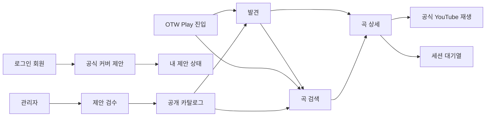
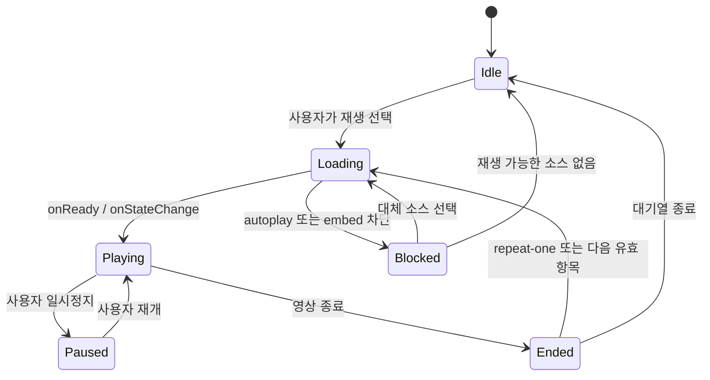

# OTW Play UI/UX 설계

상태: PR-9A~C·P0-B polling foundation 구현·배포 완료, 운영 공개 `0/0` UI/UX 기준선

기준일: 2026-08-25

상위 문서: `otw-play-product-requirements.md`

관련 문서:

- `otw-play-system-design.md`
- `otw-play-implementation-guide.md`
- `otw-play-catalog-bulk-ingestion-and-proposal-lifecycle-research.md`
- `otw-play-channel-subscription-automation-research.md`
- `otw-play-detailed-credits-and-member-songbook-research.md`
- `../Design.md`

## 1. 목적과 적용 원칙

이 문서는 OTW Play의 탐색, 검색, 재생, 세션 대기열, 회원 제안과 관리자
검수 경험을 정의한다. 제품 요구사항이 바뀌면 요구사항 문서를 먼저 갱신하고
이 문서의 화면·상태·수용 기준을 함께 조정한다.

MVP의 시각 목표는 일반적인 영상 목록이 아니라 **오버더월이 직접 운영하는
음악 앱**으로 인식되는 것이다. 다만 Spotify, TIDAL, Apple Music의 고유 UI를
복제하지 않고 다음 장점을 OTW의 기존 디자인 시스템에 맞게 재해석한다.

- Spotify: 탐색 영역과 현재 재생 문맥을 동시에 유지하는 정보 구조
- TIDAL: 아티스트와 작품 이미지를 중심에 둔 편집형 큐레이션 분위기
- Apple Music: 제목, 메타데이터, 검색과 재생 조작의 명료한 위계
- OTW Schedule: `PublicAppShell`, `ContentPageShell`, semantic token, 멤버
  색상과 현재 접근성 규칙

공식 참고 자료:

- Spotify 데스크톱 경험: https://newsroom.spotify.com/2023-06-20/spotify-desktop-experience-redesign-your-library-now-playing-views-customize/
- TIDAL 제품 방향: https://tidal.com/about
- Apple 디자인 원칙: https://developer.apple.com/design/human-interface-guidelines/design-principles
- Apple 검색 필드: https://developer.apple.com/design/human-interface-guidelines/search-fields
- YouTube 임베드 최소 기능: https://developers.google.com/youtube/terms/required-minimum-functionality
- YouTube IFrame Player API: https://developers.google.com/youtube/iframe_api_reference

## 2. 설계 기본값과 미결정 항목

다음 값은 DEC-019와 DEC-029로 확정된 공개 경험 기준이다.

| 항목 | 설계 기본값 | 변경 영향 |
| --- | --- | --- |
| 공개 경로 | `/play` | 내비게이션, SEO, 공유 URL, route contract |
| 접근 권한 | 현재 카탈로그·재생 UI는 관리자 preview, 제안은 로그인, 검수는 관리자 | 운영 공개 전 UI auth gate. 인증된 관리자는 공개 flag가 꺼져도 실제 UI를 보고, 화면에는 `관리자 미리보기 · 공개 비활성` 상태를 표시한다. 익명 public API 계약은 유지 |
| 내비게이션 라벨 | `OTW Play` | `app-navigation.ts`와 모바일 메뉴 |
| 플레이어 유지 범위 | `/play/*` 안에서만 유지, 다른 제품 영역 이동 시 정지 | nested layout과 player store |
| 대기열 복원 | `sessionStorage`에 현재 세션만 복원 | 저장 플레이리스트와 명확히 분리 |
| 외부 참여자 | 검색·필터에는 포함, 별도 공개 프로필은 만들지 않음 | detail route 범위 |
| 제안 수정·철회 | 본인의 `pending_review` 제안만 제공 | version CAS로 수정하고 철회는 확인 dialog 뒤 불가역 처리 |

## 3. 경험 원칙

### 3.1 곡을 먼저, 영상을 나중에

탐색 결과의 기본 단위는 YouTube 영상이 아니라 곡이다. 카드와 행의 첫 정보는
곡명이고 그 아래에 원곡 가수, OTW 가창 참여자, 버전 수를 배치한다. 영상
썸네일과 채널은 재생 가능한 공식 버전의 출처로 제시한다.

### 3.2 재생 문맥을 잃지 않기

사용자는 곡 상세, 검색 결과와 대기열을 오가면서도 현재 곡과 다음 곡을 알 수
있어야 한다. 데스크톱에서는 현재 재생 패널을 유지하고, 좁은 화면에서는
정책을 준수하는 확장형 플레이어를 사용한다.

### 3.3 멤버 중심이되 외부 협업을 지우지 않기

현재 멤버는 오시마크와 이름을 함께 표시한다. 외부 인원과 전 소속 멤버는
동일한 중립 칩을 쓰되, 곡 크레딧과 검색 결과에서는 빠지지 않는다. 색만으로
소속을 전달하지 않는다.

### 3.4 운영 신뢰를 화면에 드러내기

모든 공개 버전은 공식 채널명, 공개일과 YouTube에서 열기 링크를 제공한다.
회원 제안은 승인되기 전 공개 카탈로그와 철저히 분리하고, 제안자에게는 현재
상태와 검수 결과를 명확히 보여준다.

### 3.5 장식보다 빠른 재탐색

첫 진입은 매력적인 큐레이션 화면을 제공하되, 반복 사용자는 검색, 필터와
밀도 높은 곡 목록으로 빠르게 이동할 수 있어야 한다. 애니메이션은 상태 변화를
돕는 범위에만 사용한다.

## 4. 정보 구조와 경로

| 경로 | 사용자 | 목적 | 주요 화면 |
| --- | --- | --- | --- |
| `/play` | 관리자 preview·로그인 회원 | 관리자는 Discover, 회원은 새 제안·내 제안 landing | Role-aware Play home |
| `/play/discover` | 관리자 preview | 기존 링크 호환을 위해 `/play`로 redirect | Compatibility redirect |
| `/play/songs` | 관리자 preview | 곡명 검색과 관계·멤버·그룹·참여 형태 필터 | Song search |
| `/play/songs/$songSlug` | 관리자 preview | 곡 정보와 공식 가창 버전 비교 | Song detail |
| `/play/submit` | 로그인 회원 | 공식 커버곡 등록 제안 | Submission wizard |
| `/play/submissions` | 로그인 회원 | 자신의 제안 상태 확인 | My submissions |
| `/admin/music` | 관리자 | 카탈로그 운영 개요 | Music operations |

관리자 preview는 준비 중 화면의 대체 mock이 아니라 실제 공개 catalog DTO와
player 흐름을 사용한다. 다만 모든 API 요청은 관리자 bearer와 preview header를
요구하고 `no-store`로 처리한다. 비로그인·비관리자는 nested catalog 요청을 전혀
시작하지 않으며, 공개 flag가 꺼져 있다는 사실만으로 관리자 UI를 다시 준비 중
화면으로 가리지 않는다.
| `/admin/music/catalog` | 관리자 | 곡·가창·소스 등록 및 편집 | Catalog manager |
| `/admin/music/submissions` | 관리자 | 회원 제안 검수 | Review queue |

catalog 화면의 상위 탭은 `발견`, `곡 검색` 두 개만 둔다. 발견은 기존 Home·Discover의
재발견 역할을 함께 소유하고, 오리지널과 커버는 별도 상단 진입점이 아니라
`/play/songs`의 `곡 관계` 필터로 구분한다. 저장 플레이리스트와 라이브러리 탭은
MVP에 만들지 않는다. 두 탭 옆에는 primary `곡 제안` dropdown을 두며 `새 곡 제안`과
`내 제안`을 제공한다. member shell도 같은 OTW Play brand/header를 사용하되 catalog
탭·검색·player는 렌더링하지 않는다.

## 5. 반응형 앱 셸

OTW Play는 기존 `PublicAppShell` 안에 `PlayShell`을 둔다. 기존 사이트
사이드바가 이미 주 내비게이션을 담당하므로 음악 앱을 흉내 낸 두 번째 고정
사이드바는 만들지 않는다.

### 5.1 넓은 화면: 1280px 이상

- 기존 OTW 사이드바: 64px 또는 256px
- Play 상단 바: 좌측 메뉴 상단과 같은 64px 높이 안에 제품명, 탐색 탭과 검색을 배치한다.
- 중앙: 독립 스크롤 카탈로그. 발견은 검색을 header에 두고 hero 아래 곡·멤버 영역을
  같은 행으로 압축해 일반 데스크톱 높이에서 document scroll을 만들지 않는다.
- 우측: 380px `PlayerQueuePanel`을 유지한다. 상단에는 356×200px 단일 16:9
  YouTube iframe과 곡·참여자를 배치한다. 곡명 아래에서 현재 멤버 profile·외부 person·group
  icon과 참여자 이름을 보여주고 YouTube·곡 상세 action을 같은 identity row 오른쪽에 둔다.
  상태 문구는 표시하지 않고 previous/play/next·repeat·shuffle·mute·volume을 한 control row에
  둔다. 그 아래 게시 채널은 YouTube icon·label·channel 이름의 작은 출처 행으로 낮추고, 실제 재생 위치를
  반영하는 seekable progress와 진행/남은 시간을 player 하단에 둔다. 플레이큐는 그 아래 남은 높이에서
  순서·선택·삭제·재정렬을 독립 스크롤한다.
- 하단 재생바, player 접기·펼치기와 콘텐츠 위 overlay는 만들지 않는다.
- 높이 720px 미만에서는 게시 채널 출처 행과 여백을 먼저 줄이고,
  참여자 identity와 이름은 한 줄 말줄임으로 유지한다. 참여자 옆 YouTube·곡 상세 action, iframe 200px과
  플레이큐 최소 144px은 계속 제공한다. 높이 640px 미만에서는 iframe을 계속 보이게 둔 채 `현재 재생`과
  `플레이큐` segmented control로 상세 영역을 전환한다. 플레이큐 선택 시 목록과
  재정렬·삭제 버튼이 화면 안에서 스크롤 가능해야 하며 전환 때문에 재생이 멈추면 안 된다.

발견의 대표곡은 겹친 card stack이 아닌 하나의 넓은 full-width 배너로 표시한다.
자동 재생하거나 일정 시간마다 바뀌지 않으며 사용자는 좌우 화살표, indicator,
키보드 좌우 키, 마우스 drag 또는 가로 wheel로 직접 전환한다. 전환해도 곡의 실제
재생·대기열 상태는 임의로 바꾸지 않는다.

hero 아래의 최근 공개곡은 반복 card가 아니라 구분선 기반 compact table로 표시한다.
기본 열은 곡, 참여자, 관계, 공개일과 icon action이며 좁은 화면에서는 참여자·관계
열을 단계적으로 숨겨 table의 자체 가로 scroll을 피한다. 멤버 진입점은 별도 card
surface 없이 작은 원형 portrait grid로 유지한다.

### 5.2 중간 화면: 768–1279px

- 기존 사이트 사이드바는 현재 breakpoint 규칙 유지
- 검색과 필터는 상단 바와 drawer로 분리
- 768–1279px에서는 첫 재생에 모바일과 같은 전체 화면 Now Playing을 사용한다.
  카탈로그로 돌아가면 pause하지 않고 같은 iframe을 우측 하단 216px miniplayer의
  200×200px 영상으로 축소한다. miniplayer footer는 곡명·play/pause·전체 화면 확장만
  제공하며 queue 이동 때문에 다시 전체 화면을 강제로 열지 않는다.

### 5.3 모바일: 767px 이하

- 기존 56px 모바일 헤더 아래에 `OTW Play` 제목과 검색 버튼 배치
- 발견/곡 검색 탭은 가로 스크롤 가능한 sticky tab 사용
- 대표 배너는 한 열, 최근 곡 table은 곡·공개일·작업을 우선하고 보조 열을 숨김
- 재생 시작 시 별도 전체 화면 `Now Playing`으로 전환하고 단일 16:9 iframe의
  높이를 200px 이상 확보한다.
- Now Playing 안에 곡·참여자 정보, previous/play/next, repeat·shuffle, 음소거·volume,
  현재 세션 플레이큐와 키보드 재정렬을 함께 제공한다.
- 640–767px에서는 카탈로그로 돌아갈 때 같은 visible miniplayer로 축소하고 재생을
  유지한다. 640px 미만에서는 카탈로그 복귀 전에 pause하고 원형 Now Playing 진입
  버튼에서 player를 다시 열어 명시적으로 재개한다. mini 상태에서 폭이 640px 미만으로
  줄어들면 전체 Now Playing을 다시 열어 숨은 재생을 허용하지 않는다.
- 필터와 곡 버전 목록은 각각 제목이 있는 bottom sheet로 제공한다.

## 6. 시각 언어

### 6.1 방향: OTW Aurora Stage

기본 표면은 음악과 썸네일이 돋보이는 어두운 무대처럼 구성한다. 밝은 테마도
동일한 정보 위계를 유지하되, 첫 방문의 제품 인상은 dark-first로 검증한다.

- 배경: 기존 `--background`에서 한 단계만 분리한 깊은 neutral
- 표면: `--card`, `--popover`, `--border`를 재사용한 세 단계
- 브랜드 분위기: `--otw-1`, `--otw-2`, `--otw-3`의 낮은 opacity radial tint
- 멤버 색상: 현재 곡의 작은 accent, 칩 테두리, focus 보조에만 사용
- YouTube red: 외부 열기와 출처 배지처럼 플랫폼을 뜻하는 작은 요소에만 사용
- 썸네일: 공식 YouTube 원본 비율을 유지하고 임의 변형·합성·과도한 blur를 금지

계획 토큰은 전역 semantic token을 값으로 삼는 feature alias다.

| 토큰 | 용도 | 규칙 |
| --- | --- | --- |
| `--play-canvas` | 음악 영역 배경 | `--background`에서 대비 한 단계 |
| `--play-surface` | 카드·행 | `--card`와 동등한 대비 |
| `--play-surface-raised` | player·sheet | `--popover` 기반 |
| `--play-accent` | 주요 재생 CTA | OTW brand gradient가 아닌 단색 기준 |
| `--play-member-accent` | 현재 곡 참여자 문맥 | 런타임 멤버색, 대비 계산 필수 |

새 토큰을 도입할 때는 `src/index.css`와 `Design.md`를 함께 갱신한다.

### 6.2 타이포그래피와 밀도

- 기본 글꼴은 기존 Inter를 유지한다.
- 제품 제목은 24–28px, hero 곡명은 32–48px 범위에서 clamp한다.
- 카드 곡명은 14–16px semibold, 원곡 가수·공개일은 12–14px다.
- 숫자, 날짜, 재생 시간은 `tabular-nums`를 쓴다.
- 카드 radius는 `rounded-xl` 이하, player와 hero만 `rounded-2xl`을 허용한다.
- hover 확대는 1.01 이하로 제한하고 레이아웃이 움직이지 않게 한다.

### 6.3 실제 에셋 사용

MVP는 별도 앨범 아트를 만들지 않는다. 공식 YouTube 썸네일을 16:9로 표시하고
곡 카드 하단에 텍스트 영역을 결합한다. 정사각형 앨범 표지처럼 강제 crop하지
않는다. 추후 R2에 권리 확인된 공식 artwork가 추가되면 `artwork` 역할을
별도 필드로 도입할 수 있다.

## 7. 공개 화면 상세

### 7.1 Discover

노출 순서는 운영자가 고정하는 플레이리스트가 아니라 카탈로그의 검수된
데이터에서 결정적으로 계산한다.

1. `New on OTW Play`: 최신 공개 공식 버전 1개를 hero로 표시
2. `새 오리지널곡`: 최근 오리지널 6–10개
3. `새 공식 커버`: 최근 커버 6–10개
4. `멤버로 찾기`: 현재 멤버 avatar와 오시마크
5. `함께 부른 노래`: 듀엣·유닛·단체·외부 협업의 최근 항목

hero는 썸네일, 곡명, 참여자, 관계, 공개일, `재생`과 `곡 보기`만 제공한다.
자동 carousel이나 자동 재생 영상은 사용하지 않는다. hero 대상이 없으면
빈 장식 영역을 만들지 않고 다음 섹션을 올린다.

### 7.2 Catalog

상단의 검색 필드는 곡명, 별칭, 원곡 가수와 참여자를 검색한다. 입력 후
250ms debounce하되 Enter는 즉시 실행한다. 검색어, 필터와 정렬은 URL query에
직렬화하여 새로고침·공유·뒤로 가기를 보존한다.

필터:

- 멤버 복수 선택: 기본 `한 명 이상 포함(ANY)`
- `선택 멤버 모두 참여(ALL)` 명시적 toggle
- 그룹
- 곡 관계: 오리지널, 커버
- 참여 형태: 솔로, 듀엣, 유닛, 단체, 외부 협업
- 원곡 가수
- 공식 영상 공개일 범위

API wire에서는 멤버를 기존 numeric member UID로, 원곡 가수를 public entity
slug로 식별한다. 그룹은 facets가 발급한 versioned opaque key를 그대로 URL
query에 보존하며 client가 `entity`/`unit` payload를 직접 만들거나 해석하지 않는다.
외부·전 소속 참여자 칩은 서버가 제공한 public entity slug를 단일 `participant`
query로 보내며 별도 공개 프로필로 이동하지 않는다. 모든 참여자·그룹 조건은 다른
필터와 같은 published performance에서 동시에 만족해야 한다.

정렬:

- 최신 공개순 기본
- 곡명순
- 참여자순

활성 필터는 결과 위에 제거 가능한 칩으로 요약한다. 모바일에서 필터 drawer를
닫은 뒤에도 적용 조건, 현재 불러온 항목 수와 다음 page 존재 여부를 바로 알 수
있어야 한다. API는 exact total 또는 facet count를 제공하지 않는다. 결과는 초기에는
곡 단위 목록으로 표시하며, 이미지 탐색을 원하는 사용자를 위한 카드 view는
데이터와 사용성 검증 후 후속으로 고려한다.

### 7.3 Song detail

상단에는 대표 썸네일, 곡명, 원곡 가수, 원곡 공개 정보와 OTW 오리지널 여부를
표시한다. 아래 `공식 버전` 목록은 각 가창 기록을 독립 행으로 보여준다.

버전 행의 정보 순서:

1. 대표 소스 썸네일과 재생 버튼
2. 참여자 칩
3. 곡 관계·공개 형태·참여 형태
4. 공식 공개일과 채널명
5. 다른 공식 소스 개수
6. YouTube에서 열기

대표 소스가 unavailable이면 자동으로 조용히 다른 소스로 바꾸지 않는다.
상태와 사용 중인 대체 소스를 알리고, 관리자가 지정한 다음 유효 소스를
선택하도록 한다.

### 7.4 직접 링크

- `/play/songs/$songSlug`: 곡 중심 공유
- `/play/songs/$songSlug?performance=$performanceId`: 특정 공식 버전 강조
- `autoplay=1` 같은 공유 parameter는 사용하지 않는다. 사용자의 재생 조작 뒤에만
  플레이한다.

## 8. 참여자 칩

| 상태 | 시각 | 접근성 이름 | 동작 |
| --- | --- | --- | --- |
| 현재 멤버 | 오시마크 + 활동명 + 얕은 멤버색 accent | `현재 OTW 멤버, 이름` | 멤버 필터 적용 |
| 외부 인원 | 활동명 + neutral border | `외부 참여자, 이름` | 외부 참여자 필터 적용 |
| 전 소속 멤버 | 외부와 동일 | `외부 참여자, 이름` | 외부 참여자 필터 적용 |
| 그룹·유닛 | 이름 + `그룹` 보조 라벨 | `그룹, 이름` | 그룹 필터 적용 |

그룹 칩은 실제 참여자 칩을 대체하지 않는다. 외부 여부는 DB에 저장된 과거
스냅샷이 아니라 조회 시점의 현재 멤버 상태로 계산한다.

## 9. 재생과 세션 대기열

### 9.1 플레이어 규칙

- IFrame Player는 앱 전체에서 한 개만 생성한다.
- `origin`을 현재 사이트 origin으로 지정한다.
- iframe, YouTube 브랜딩, 광고와 기본 조작 UI를 가리는 overlay를 만들지 않는다.
- 사용자의 재생 클릭 전에는 영상 로드만 가능하며 소리 있는 자동 재생을 시도하지 않는다.
- iframe은 실제로 보이고 절반 이상 가시 영역에 있을 때만 scripted playback을 시작한다.
- 재생 불가, 삭제, 비공개, embed 차단을 구분해 안내하고 다음 소스로 이동할 수
  있게 한다.
- 앱의 이전/다음 버튼은 IFrame API가 재생하는 단일 영상의 내부 chapter가 아니라
  OTW Play 대기열 탐색을 담당한다. native controls는 `controls=0`으로 숨기되 iframe을
  overlay로 가리지 않고 앱의 play/pause·volume·seek를 IFrame API에 직접 전달한다.
- fullscreen·iframe keyboard·annotation은 각각 `fs=0`, `disablekb=1`,
  `iv_load_policy=3`으로 최소화한다. CC 강제 해제는 공식 parameter가 없어
  `cc_load_policy=1`을 설정하지 않고 사용자 YouTube preference를 따른다.
- 데스크톱은 재생이 시작되면 우측 PlayerQueuePanel 상단에서 단일 iframe을
  356×200px로 계속 보인다. 모바일·태블릿은 전체 화면 Now Playing에서 같은
  iframe을 최소 200px 높이로 보인다. 640–1279px은 카탈로그 복귀 후에도 200×200px
  miniplayer로 visible playback을 유지하고, 640px 미만만 복귀 전에 pause한다. 모든 레이아웃은
  음소거 버튼과 키보드 조작 가능한 0–100 볼륨 slider를 제공한다. 플레이큐 상태
  안내는 시각 footer가 아닌 `aria-live`로만 전달한다.
- iframe 바로 아래에는 곡명과 메인 참여자 identity를 먼저 배치한다. identity row는 current
  member profile image, external person icon, group icon과 이름을 사용하고 오른쪽에
  YouTube·곡 상세 action을 둔다. 음악 분류와 가창 분류는 이 주 정보 아래의 보조 metadata
  영역으로 내린다.
- metadata 다음에는 키보드 탐색 가능한 semantic progress range와 transport control을 연속
  배치한다. range는 실제 IFrame current time과 duration을 표시하고, 향후 동적 wave bar는
  동작·접근성 계약을 유지한 채 시각 표현만 교체한다. 게시 채널은 transport 아래의 compact
  source attribution row로 표시하며 권위 channel avatar URL이 없는 상태에서 참여자 이미지를
  publisher avatar처럼 재사용하지 않는다.
- 낮은 데스크톱 화면의 상세 전환은 iframe을 숨기는 접기 기능이 아니다. iframe은
  최소 200px로 계속 노출하고 player 정보 또는 queue만 남은 높이를 사용하며,
  선택 상태는 `aria-pressed`로 전달한다.

### 9.2 대기열 모델

대기열 항목은 `performanceId`, 선택한 `sourceId`와 당시 표시 snapshot만 가진다.
곡 전체를 복제 저장하지 않고 현재 카탈로그를 다시 조회할 수 있어야 한다.

- 재생 클릭: 같은 performance가 있으면 그 항목을 선택하고, 없으면 현재 뒤에 추가해 시작
- 대기열에 추가: 같은 performance가 없을 때만 마지막에 추가
- 다음에 재생: 기존 항목이면 현재 바로 뒤로 이동하고, 없으면 새로 추가
- drag reorder: 키보드 이동 명령도 함께 제공
- repeat: `off`, `all`, `one`
- shuffle: 현재 곡은 고정하고 남은 항목에 Fisher–Yates를 한 번 적용
- unavailable: 실패 횟수를 늘리지 않고 다음 유효 항목으로 한 번만 건너뜀
- 무한 순환 방지: 한 번의 다음 탐색에서 대기열 길이만큼만 검사

`sessionStorage`에는 식별자, 순서, 현재 index, repeat와 shuffle 상태만 저장한다.
로그인 계정과 동기화하지 않으며 플레이리스트라는 이름을 사용하지 않는다.
복원 시 각 performance를 공개 API로 재검증하고 재생 가능한 source를 다시 선택한다.
복원은 player 생성이나 자동 재생을 유발하지 않는다.
구 session에 같은 performance가 여러 번 남아 있으면 첫 항목만 유지하고 현재 index를
해당 performance로 다시 맞춘다. 실제 반복 감상은 duplicate가 아니라 repeat를 쓴다.

## 10. 회원 공식 커버 제안

### 10.1 3단계 wizard

1. **영상 확인**: YouTube URL 입력, ID 정규화, 표준 썸네일과 기존 영상·진행 중 제안 중복 확인
2. **곡과 참여자**: 곡명, 원곡 가수, 기존 곡 후보, 참여자 복수 선택, 외부
   참여자 텍스트, 선택 메모
3. **검토 후 제출**: 입력한 곡·원곡 가수·참여자와 video ID·썸네일 확인,
   승인 전 비공개 및 관리자 검수 항목 안내, 제출

각 단계 이동 시 해당 step 제목으로 focus를 옮기며 stepper는 완료·현재·미완료를
시각과 `aria-current`로 함께 구분한다. 영상 확인 성공 후 썸네일, canonical URL과
video ID를 다음 단계에서도 유지한다. duplicate는 URL 입력을 지우지 않은 채 다음
단계를 막는다.

곡 연결은 `새 곡으로 제안`과 `기존 곡 연결`을 명시적으로 선택한다. 기존 곡 검색은
버튼을 눌렀을 때만 실행하고 loading·빈 결과·선택 해제를 제공한다. 후보 선택은 곡명과
원곡 가수 snapshot을 기본값으로 채운다. 현재 멤버는 이름·code·unit을 keyboard로
검색·선택하고, 원곡 가수와 외부 참여자는 Enter 또는 `추가`로만 chip을 생성한다.
blur는 값을 확정하지 않으며 중복과 1–20/1–30 상한을 즉시 안내한다.

회원 제출 시 YouTube Data API를 호출하지 않는다. 캐시된 metadata가 있으면
보조 정보로만 보여주고, 없더라도 유효한 video ID 형식과 D1 중복 검사를 통과하면
제출할 수 있다. 실제 공개 상태, 공식 채널, 공개일과 embed 가능 여부는 관리자
승인 단계에서 최신 metadata로 검증한다. 형식 오류, exact duplicate와 제출 제한은
구체적인 이유를 표시하고 입력을 보존한다.

최종 화면은 thumbnail, 새 곡/기존 곡 구분, 원곡 가수와 참여자 chip, 메모 글자 수와
비공개 안내를 한 번에 검토한다. 오류는 원인이 있는 step으로 focus를 되돌리되 입력과
`clientRequestId`를 유지한다. 작성 중 route 이탈은 확인한다. 성공하면 form을 즉시
비우지 않고 권위 제출 결과와 `내 제안에서 확인`, `다른 곡 제안` action을 표시한다.

### 10.2 내 제안

상태는 운영 코드가 아닌 사용자 언어로 표시한다.

| 내부 상태 | 사용자 라벨 | 안내 |
| --- | --- | --- |
| `pending_review` | 검토 대기 | 관리자 확인 전이며 공개되지 않음 |
| `approved` | 승인·게시됨 | 연결된 공개 곡으로 이동 |
| `rejected` | 반려 | 공개되지 않으며 내부 사유 대신 일반 문의 안내 표시 |
| `withdrawn` | 철회 | 기존 데이터만 표시하며 PR-7에는 철회 control 없음 |

다른 회원의 제안 ID·제출자·내용은 노출하지 않는다. 중복 안내는 `이미 등록되어
있음` 또는 `검토 중인 동일 영상이 있음` 정도로 제한한다. 로그인 비관리자에게는
공개 Play flag와 무관하게 콘텐츠 메뉴의 단일 `OTW Play` 진입점을 제공하고,
member shell은 catalog config·player 요청을 시작하지 않는다. 제안이 없으면 상세
panel을 숨기고 `첫 곡 제안하기` CTA만 제공한다.

## 11. 관리자 UI

### 11.1 Music operations

관리자 홈은 과장된 dashboard보다 작업 대기 상태를 우선한다.

- 검토 대기 제안 수
- 재생 불가·재확인 필요 소스 수
- draft 곡·가창 수
- 최근 게시와 최근 거절
- 카탈로그 등록, 제안 검수, 소스 점검 진입

### 11.2 Review queue

데스크톱은 목록과 검수 패널의 split view를 쓴다.

- 좌측 360–420px: 대기 제안, 제출일, 제출자, 중복 경고
- 우측 상단: 실제 YouTube player와 공식 채널·공개일
- 우측 중앙: 제출값과 YouTube 메타데이터 비교
- 우측 하단: 기존 곡 연결 또는 새 곡 생성, 참여자·분류 수정, 승인·반려

승인 버튼은 다음 조건이 모두 충족된 뒤 활성화한다.

- 영상과 채널을 확인함
- 기존 영상 중복이 없음
- 기존 곡 연결 또는 새 곡 생성 선택
- 원곡 가수와 참여자 확정
- 관계·공개 형태·참여 형태 확정
- 대표 소스와 공개일 확정

반려는 사유 코드와 선택 메모를 받는다. 승인·반려는 confirm dialog를 거치며,
서버의 conditional transition이 성공하기 전 UI에서 낙관적으로 제거하지 않는다.

### 11.3 Catalog manager

관리자에게 DB 구조를 선행 작업으로 노출하지 않는다. 최상위 화면은 `카탈로그`와
`제안 검수`만 두고, 일상 입력은 `새 영상 등록` 하나로 시작한다. 카탈로그 목록은
곡 단위이며 행을 펼치면 모든 가창 버전, 한국어 상태, 참여자, 채널과 source가
나타난다. 데스크톱은 확장형 table, 모바일은 곡 card 아래 가창 card를 사용한다.

`새 영상 등록`은 넓은 dialog, 모바일에서는 전체 폭으로 다음 네 단계를 유지한다.

1. 영상 확인: URL metadata, 동일 segment, 승인·pending·revoked·멤버 권위 채널 확인
2. 영상 유형: `오리지널곡`, `공식 커버곡`, `노래방송` 중 하나를 선택한다. 오리지널은 수동 곡 연결 없이 진행한다. 커버는 같은 화면에서 `원곡 제목`과 `원곡 가수`를 분리해 필수 입력하되 별도 곡 검색 화면은 두지 않는다. 노래방송은 다곡·구간 연결 후속 범위 안내와 함께 현재 등록을 중단한다.
3. 참여자와 분류: 현재 멤버 자동완성, 기존 외부 후보, 명시적인 새 외부/그룹 칩, 공개 형태·참여 형태와 미등록·재승인 채널의 소유·연결 주체 확인
4. 검토와 저장: 영상·채널·자동 생성될 곡·참여자·분류를 요약하고 draft 또는 confirm 후 publish

새 영상 진입점의 오리지널은 YouTube metadata 제목으로 내부 song을 자동 생성하고
선택한 가창 참여자를 원곡 가수 credit으로도 사용한다. 공식 커버곡은 영상 제목과
원곡 정보를 섞지 않고 관리자가 입력한 원곡 제목과 원곡 가수 identity로 song을
생성한다. 원곡 가수 입력은 기존 identity 추천과 명시적인 새 외부 인물·그룹 칩을
사용한다. `다른 가창 추가`에서 시작한 경우에는 선택한 기존 song의 원곡 정보를
그대로 재사용하며 중복 입력을 요구하지 않는다.

`곡 정보 수정` dialog는 곡명, 원곡 가수 칩과 OTW 오리지널 여부만 기본 입력으로
제공한다. 원곡 공개일은 운영상 일상 수정 대상이 아니므로 form에서 제거하되 기존
저장값은 유지한다. 원곡 가수는 등록 dialog와 동일하게 현재 멤버 및 기존 외부
identity를 추천하고, 검색 결과가 없으면 새 외부 인물·그룹 칩을 명시적으로 추가한다.
첫 번째 칩을 대표 원곡 가수로 저장하며 빈 목록은 저장하지 않는다.

`가창 정보 수정`은 축약된 분류 form이 아니라 넓은 correction dialog다. 연결 곡,
곡 관계, 공개 형태, 참여 형태, 품질, 가창 공개일시, 참여자, 참여자별 역할과 표시
credit, YouTube URL, 공식 채널, 시작·종료 구간, source 역할과 내부 메모를 모두
편집할 수 있어야 한다. 참여자 입력은 등록과 같은 현재 멤버 자동완성·기존 외부
identity·새 외부/그룹 칩을 사용한다. 게시 상태는 이 form의 enum select로 섞지 않고
목록의 게시·철회 confirm action으로 유지한다. 저장 실패 시 dialog와 모든 입력을
보존하며 성공한 authoritative readback 뒤에만 닫는다.

채널과 외부 identity 관리는 `고급 관리` 우측 Sheet에만 둔다. 고급 관리는 목록과
현재 편집 form을 시각적으로 분리하고, label·help·action이 한 입력 단위로 읽히는
1열 또는 2열 반응형 form을 사용한다. 현재 멤버 identity는 `members`가 권위이므로
수동 UID·slug 편집을 제공하지 않는다. 입력 오류가 발생해도
dialog, 현재 단계와 모든 입력값을 유지한다.

PR-5 관리자 진입점은 `/admin/otw-play`이며 Admin Center의 콘텐츠 관리 메뉴에서
접근한다. 서버 command 성공 뒤 catalog와 proposal query를 invalidate해 authoritative
readback을 다시 표시하고 optimistic removal은 하지 않는다. PR-7에서는
검수 대기 제안과 YouTube 원본 링크를 제공한다. 승인 control은 DEC-044의 승인·활성
공식 채널, 최신 metadata, 곡·원곡 가수·참여자와 실제 가창 credit 확인이 모두 끝난
뒤 활성화하고, 거절은 내부 사유 code가 있어야 실행한다.

카탈로그의 draft·withdrawn 가창에는 `삭제`를 제공한다. 곡 단위 삭제는 연결된
가창에 현재 published가 없을 때 활성화한다. 삭제 전 confirm dialog에는 되돌릴 수
없다는 점, 삭제될 draft·withdrawn 가창 수와 철회 이력도 제거된다는 점을 표시한다.
현재 published가 하나라도 있으면 먼저 철회하도록 안내한다. 성공 뒤에는 optimistic
removal 대신 catalog를 다시 읽는다.

## 12. 로딩·빈 상태·오류 상태

| 상황 | 처리 |
| --- | --- |
| 첫 카탈로그 로딩 | 실제 카드·행 높이와 같은 skeleton, hero layout shift 방지 |
| 다음 페이지 로딩 | 기존 결과 유지, 하단 progress와 중복 클릭 방지 |
| 검색 결과 없음 | 적용 필터 요약, `필터 초기화`, 검색어 수정 제안 |
| 공개 카탈로그 없음 | 관리 운영 전용 안내, 임의 샘플 데이터 미노출 |
| 공개 read 비활성 | config flag를 기준으로 OTW Play 준비 중 안내, catalog endpoint 재시도 금지 |
| 공개 read-model 동기화 중 | config는 유지하되 catalog `503`에서는 이전 revision 결과를 현재 결과처럼 보여주지 않고 일시적 이용 불가와 수동 재시도 제공 |
| API 오류 | 이전 성공 데이터 유지 가능 시 stale 표시와 재시도 |
| 영상 unavailable | 곡 메타데이터 유지, 대체 소스 또는 YouTube 외부 링크 제공 |
| 인증 만료 | 입력 보존 후 로그인 재시도, 공개 탐색은 계속 가능 |
| 승인 충돌 | 최신 제안 상태 재조회 후 이미 처리된 결과 표시 |

## 13. 접근성

- 본문 대비 WCAG AA 4.5:1 이상, 큰 텍스트 3:1 이상을 목표로 한다.
- 모든 icon button에 `aria-label`을 제공한다.
- tab, chip, toggle, queue item에 `aria-selected`, `aria-pressed`,
  `aria-current`와 `aria-describedby`를 상태에 맞게 쓴다.
- 검색 suggestion은 combobox/listbox pattern을 따른다.
- filter sheet가 닫히면 focus를 열었던 버튼으로 돌려보낸다.
- 대기열 재정렬은 drag뿐 아니라 `위로 이동`, `아래로 이동` 명령을 제공한다.
- 새 곡 재생, unavailable 건너뜀과 제안 제출 결과는 적절한 `aria-live`로 알린다.
- touch target은 최소 44×44px를 목표로 한다.
- `prefers-reduced-motion`에서 hero transition, sheet spring과 artwork 이동을 줄인다.
- 오시마크 emoji는 장식으로 중복 읽히지 않게 하고 칩 전체 접근성 이름에 소속을 넣는다.

## 14. 성능과 체감 품질

- 최초 `/play` JS는 관리자 편집기와 제출 wizard를 포함하지 않고 route 단위로 분할한다.
- 처음 화면에는 필요한 hero와 첫 섹션 썸네일만 eager load하고 나머지는 lazy load한다.
- 썸네일은 명시적 `width`와 `height`, `aspect-ratio`로 CLS를 방지한다.
- 검색 결과는 이전 결과를 유지하면서 query가 바뀐 부분만 갱신한다.
- 한 화면에 YouTube iframe을 여러 개 만들지 않는다. 목록은 썸네일만 사용한다.
- player API script는 첫 재생 의도 또는 player가 필요한 route에서 한 번만 로드한다.
- 긴 목록은 cursor pagination을 기본으로 하고 실제 측정 전에는 virtual list를
  도입하지 않는다.
- participant 정렬과 contains 검색의 내부 read model은 결과를 근사하거나 새 공개
  상태를 만들지 않는다. 화면에 표시하기 전 canonical song과 published official
  performance 조건을 통과한 결과만 사용한다.
- 공개 read 활성 상태에서 catalog revision과 read-model revision이 다르면 config
  이외 공개 API는 cache 전에 `503`으로 중단된다. 후속 UI는 이를 빈 결과로 오해하지
  않고 동기화 중 오류 상태로 표시하며, 이전 revision 목록을 최신 결과처럼 계속
  노출하지 않는다. flag-off 상태는 기존 준비 중 안내를 유지한다.
- 곡 3,000개, search term 10,000개, performance 8,000개의 선언된 상한 fixture에서
  rows read 예산을 검증한다. 이는 현재 MVP 대표 분포의 회귀 기준이며 임의의 모든
  데이터 분포에서 같은 수치를 보장한다는 의미가 아니다.
- 목표: 공개 카탈로그 cache hit 기준 API p95 300ms 이내, 검색 miss 기준 p95
  800ms 이내, player 이외 화면 CLS 0.1 이하. 수치는 출시 전 실제 환경에서
  재측정하고 조정한다.

PR-4 성능 보완은 API·DTO·cursor와 화면 설계를 바꾸지 않으며 `/play` route,
navigation, player를 생성하지 않는다. 원격 D1 적용과 배포도 하지 않으므로 현재
사용자가 보는 화면에는 영향이 없다.

## 15. 화면별 수용 기준

### Discover

- 대표곡, 현재 멤버와 최근 공개곡을 한 화면에서 재발견할 수 있다.
- 현재 멤버 진입점에 오시마크가 표시된다.
- hero가 없어도 빈 큰 영역이 남지 않는다.
- 가창자는 메인 보컬 이름만 표시한다. 피처링 보컬·코러스·기타 참여 tooltip이나 보조 칩은 발견에서 표시하지 않고 곡 상세의 역할별 credit 영역에서만 확인한다.

### 곡 검색

- 검색·필터·정렬이 URL과 동기화된다.
- 오리지널과 공식 커버를 `곡 관계` 필터에서 구분한다.
- 멤버 ANY와 ALL 의미를 사용자가 구분할 수 있다.
- `가창 역할`은 참여자 identity와 분리된 필터로 제공하고 메인 보컬·피처링 보컬·코러스·기타 참여를 명시적으로 선택할 수 있다.
- 동일 곡은 한 결과로 묶이고 공식 버전 수를 확인할 수 있다.
- exact total이 있는 것처럼 표시하지 않고 현재 로드 수와 다음 page 여부를 구분한다.

### Player

- 사용자의 조작 전 자동 재생하지 않는다.
- 재생 중 iframe은 화면에 보이고 최소 크기를 충족한다.
- next, previous, repeat, shuffle와 queue reorder가 키보드로 가능하다.
- unavailable 소스가 무한 재시도되지 않는다.
- Now Playing과 queue는 메인 보컬 이름·avatar만 표시한다. 보조 가창 credit은 재생 조작을 방해하지 않도록 이 화면에 중복 표시하지 않고 곡 상세에서 확인한다.

### Submission

- 비로그인 사용자는 로그인 후 기존 입력으로 돌아올 수 있다.
- 승인 전 제안은 공개 검색·상세·재생 API에서 보이지 않는다.
- 제출자는 자신의 상태만 볼 수 있다.
- 회원은 선택한 멤버와 외부 참여자마다 메인 보컬·피처링 보컬·코러스·기타 참여 역할을 지정하고 최종 검토 화면에서 확인한다.

### Admin review

- 실제 영상, 공식 채널과 중복을 확인한 뒤 오리지널·공식 커버를 수동 곡 연결 없이 등록할 수 있다.
- 노래방송은 현재 등록 대상이 아님을 분명히 표시하고 draft나 published row를 만들지 않는다.
- 승인 또는 반려가 성공한 뒤 권위 있는 서버 상태를 다시 읽는다.
- 동시 검수 시 한 요청만 상태 전환에 성공한다.
- 관리자는 원 제안 snapshot을 보존하면서 승인에 반영할 곡, 원곡 가수, 참여자 identity·표시명·역할을 수정할 수 있다.
- 관리자는 승인에 반영할 공식 MV·공식 영상과 솔로·듀엣·유닛·단체·외부 협업
  분류를 명시적으로 선택한다. 미등록·재승인 채널은 첫 가창자를 소유자로 추정하지
  않고 실제 소유 인물·그룹을 확인하며, 새 외부 identity의 인물·그룹 종류도 선택한다.
- draft·withdrawn 가창과 published가 없는 곡은 명시적 확인 뒤 삭제할 수 있고, 현재 게시 중인 가창은 삭제 control로 제거할 수 없다.

## 16. 구현 시 금지사항

- VOD 최신 영상 피드의 이름만 OTW Play로 바꾸지 않는다.
- 현재 멤버·외부 인원을 색상 하나로만 구분하지 않는다.
- YouTube 썸네일을 임의 수정하거나 player 위를 OTW 조작부로 덮지 않는다.
- 숨겨진 iframe으로 음악을 계속 재생하지 않는다.
- 공개 화면에 `pending_review`, `draft`, `rejected` 데이터를 합치지 않는다.
- 세션 대기열을 저장 플레이리스트나 개인 라이브러리로 표현하지 않는다.
- 사용자 제안 form을 관리자 카탈로그 row에 직접 저장하지 않는다.

## 17. 변경 관리

UI 아이디어 변경 시 다음 순서로 반영한다.

1. 제품 요구사항의 결정·TBD·MVP 범위를 확인한다.
2. 이 문서의 정보 구조, 화면 상태와 수용 기준을 수정한다.
3. `Design.md`에 공용으로 승격할 패턴만 반영한다.
4. API·DB 의미가 바뀌면 `otw-play-system-design.md`를 함께 수정한다.
5. 구현 순서와 검증 gate는 `otw-play-implementation-guide.md`에 반영한다.

## 18. 완료된 곡 분류 표시 계층

- 곡 카드·hero·상세에서는 음악 태그를 제목에 가까운 1차 chip으로 표시한다. player에서는
  빠른 곡 식별을 위해 곡명·메인 참여자를 먼저 표시하고 음악 태그를 바로 다음 metadata
  영역에 배치한다.
- `오리지널/공식 커버`, `공식 MV/공식 영상`, `솔로/듀엣/유닛/협업`은 가창을 설명하는 작은 보조 metadata 행으로 표시한다.
- 관리자 등록·곡 수정에는 `K-POP`, `J-POP`, `보컬로이드` 빠른 선택과 자유 입력을 함께 제공한다.
- 넓은 화면의 발견 hero는 최대 1600px container와 30rem 높이까지 확장한다. 멤버명은 두 줄까지 개행해 긴 이름을 자르지 않는다.

위 계층과 `/play` 내부 player 지속성은 PR-7.2에서 완료되었다. PR-8은 공개
화면의 정보 구조를 다시 바꾸지 않고 직접 진입, 운영 상태와 단계적 공개 경험을
보완한다.

## 19. PR-8 공개·운영 UI/UX

### 19.1 PR-8A 직접 진입과 검색 노출

- 공개 활성 전 `/play` 직접 진입은 준비 중 또는 관리자 preview 접근 경계를
  유지하고 `noindex,nofollow`로 제공한다. public read가 활성이고 navigation이
  숨겨진 canary에서는 익명 Discover 화면을 새로고침·공유 URL에서도 복원하되
  `noindex,follow`와 sitemap 제외를 유지한다. `navigation_visible=1`에서만 `/play`와
  published 곡 상세를 색인·sitemap에 포함한다.
- `/play/songs`는 public read 활성 뒤에도 항상 `noindex,follow`이고 sitemap에는
  포함하지 않는다. sitemap의 곡 항목은 canonical slug만 사용하며 `lastmod`를
  추가하지 않는다.
- published 곡 상세는 제목, 원곡 가수, 메인 참여자와 공식 영상 의미가 드러나는
  고유 title·description·canonical을 제공한다. proposal note, 제출자, 내부 검수
  상태와 관리자 preview 문구는 metadata에 포함하지 않는다.
- unknown·withdrawn 곡 직접 URL은 명확한 404를 반환하며 다른 곡의 shell이나
  stale metadata를 성공 화면처럼 보여주지 않는다.

### 19.2 PR-8B source health 운영 화면

- 관리자 OTW Play 작업면에 `재확인 필요`, `재생 불가`, `최근 복구` source 수와
  source 점검 진입점을 제공한다. 과장된 dashboard보다 조치가 필요한 목록을 먼저
  표시한다.
- source 행은 availability, 마지막·다음 점검 시각, 곡·가창·채널과 수동 재검사
  action을 함께 보여준다. quota·일시 장애는 영상이 삭제된 것처럼 표시하지 않는다.
- source가 재생 불가여도 곡·가창 metadata와 YouTube 외부 링크 또는 대체 source를
  유지한다. 수동 재검사는 authoritative readback 뒤에만 상태를 갱신한다.
- `소스 상태` section 진입 시에만 운영 query를 시작한다. 최근 복구는 7일, 각 목록은
  최대 50개이며 연결 곡·가창은 총 개수와 최대 5개 요약을 표시한다. loading, empty,
  API 오류와 stale-write를 각각 구분한다.
- 수동 점검이 외부 장애 때문에 `retry_scheduled`로 끝나면 현재 availability를 유지한
  채 `외부 API 재시도 대기`와 다음 점검 시각을 표시한다. 성공 toast나 삭제 상태로
  오인시키지 않으며 관리자 catalog와 source-health query를 함께 갱신한다.

### 19.3 PR-8C 공개 switch와 관측

- 관리자 catalog에 `운영·공개` section을 추가하고 진입할 때만 observability,
  release와 source-health query를 시작한다. 최근 24시간 요청·오류율·cache·p95·D1
  비용을 summary로, route별 값은 desktop table과 mobile card로 표시한다.
- Analytics가 미설정이거나 일시 장애여도 `미설정`·`집계 일시 중단` partial 상태와
  안전한 안내만 표시한다. 이 상태는 release 조회와 control을 차단하지 않는다.
- 전체 관리자 catalog 조회가 실패해도 section navigation과 `운영·공개`는 유지한다.
  release endpoint가 정상인 동안 공개 상태 readback과 rollback control은 계속
  접근 가능해야 하며 catalog 오류는 catalog·제안 작업면에만 국한한다.
- 관리자 UI는 `공개 API`, `내비게이션 노출`을 별도 단계로 표시한다. 내비게이션은
  공개 API가 활성이고 직접 URL 검증이 끝난 뒤에만 켤 수 있다.
- flag 변경 전 현재 값, 영향 범위, rollback 동작을 confirm하고 성공 뒤 서버가
  반환한 config를 다시 표시한다. optimistic toggle과 배포 시 자동 활성화는 금지한다.
- 각 transition dialog는 해당 confirmation checkbox를 요구하며 닫힌 뒤 focus를 원래
  action으로 복귀시킨다. `409`는 최신 authoritative 상태 재조회 안내를 표시하고,
  revision 불일치는 해결 전 공개 활성 action을 비활성화한다.
- domain event 요약과 `소스 상태` 진입점을 함께 제공하되 raw SQL, 개별 request log,
  token, Cloudflare 오류 본문과 관리자 신원은 화면에 노출하지 않는다.
- 운영 화면은 cache hit/miss, 오류율, source 점검 결과와 최근 flag 변경 actor·시각을
  확인할 수 있어야 한다. 원문 검색어, 회원 note와 credential은 표시하지 않는다.

### 19.4 PR-8 UI 완료 조건

- `/play`와 published 곡 직접 URL이 내부 navigation과 같은 화면으로 복원된다.
- navigation 공개 전 route는 검색 색인에서 제외되고, navigation 공개 뒤에도
  `/play`와 published 곡 상세만 sitemap/index 대상이 된다.
- source health에서 조치 대상과 retryable 장애를 구분해 접근할 수 있다.
- public read `on`/navigation `off` 상태에서 익명 직접 URL을 검증할 수 있고,
  navigation을 켜기 전 별도 확인 단계가 존재한다.

### 19.5 구현 closeout과 후속 UI 원칙

- 직접 경로·SEO, source health, observability와 release control UI는 production에
  배포되었다. 현재 공개 flag는 `0/0`이며 전역 navigation에는 노출하지 않는다.
- 인증 관리자 화면 스모크, source 상태의 주기적 확인, catalog 정비, public canary와
  navigation 전환·rollback은 공개 전후 지속 운영 검증으로 남긴다.
- 후속 화면은 제품 요구사항의 P0~P4 순서를 따른다. 아직 gate가 닫힌 기능을 빈 탭이나
  비활성 control로 미리 노출하지 않고, 실제 end-to-end workflow와 함께 추가한다.

### 19.6 2026-08-21 채택 후속 화면 경계

- `가져오기`는 public·unlisted playlist URL만 받고 private playlist는 지원하지 않는다고
  입력 단계에서 명확히 안내한다. 5,000개 상한, 50개 batch 진행률과 candidate
  retention을 운영자가 이해할 수 있어야 한다.
- candidate 선택은 ready 항목의 catalog draft 변환 범위에만 사용한다. 공통값 일괄
  설정 form은 두지 않고, 행별 sticky 검수 form은 곡 연결·신규 생성, 원곡 가수,
  가창자·역할과 공개 분류 편집에 집중한다. 실제 저장값과 필수 누락 미리보기는 desktop
  table과 mobile card의 각 영상 행에 두고 form을 편집하는 동안 즉시 갱신한다.
- 숨김·삭제 영상 일괄 제외는 현재 filter가 아니라 job 전체의 확인된 재생 불가 후보만
  처리한다고 confirm dialog에 명시한다. `unknown`과 정책 검토 후보는 유지하고, 처리 뒤
  성공·별도 확인 건수를 toast로 분리해 보여 준다.
- 수집 진행 중 metadata가 갱신되면 후보 목록도 함께 최신화하되 열어 둔 행의 입력값과
  검수 baseline은 덮어쓰지 않는다. metadata-only version 변경은 저장을 이어가고, 다른
  관리자의 실제 검수 변경은 입력값을 유지한 상태에서 최신 권위 상태를 다시 불러왔다고
  안내한다.
- `노래 클립 자동 후보`는 OTW·멤버 공식 channel 등록과 분리한다. 유효한 candidate
  수집 승인이 있는 clip channel만 monitor와 transport action을 제공한다. subscription
  상태, lease, 마지막 알림·대조, 안전한 오류와 subscribe/pause/renew/reconcile/backfill
  action을 표시하되 방송·키리누키 foundation 전에는 `singing_clip` catalog draft action을
  제공하지 않는다.
- 멤버 노래책은 외부 음악 관계자용 credit database처럼 보이지 않게 current member의
  `부른 곡·오리지널·커버·협업·만든 곡`을 중심으로 구성한다. 추가 참여 정보도 OTW
  멤버의 작사·작곡·편곡·연주·제작만 표시한다.
- member page는 published song 1곡부터 direct URL을 제공하되 1~2곡은 noindex로
  유지하고, 3곡 이상과 navigation 공개·revision 일치에서만 navigation과 sitemap에
  포함한다. 대표 오리지널곡은 관리자 pin 최대 5곡과 최신순 fallback을 사용한다.

### 19.7 PR-9 운영 UI closeout

- playlist 수집 진행률, Queue 완료 readback, candidate 검수·보완·일괄 제외와 ready
  candidate의 draft 변환은 구현·배포되었다. 6시간 channel monitor는
  `singing_clip` 검수·제외만 제공한다.
- production 승인 clip channel은 0개다. legacy channel을 선택했다는 이유만으로 권리
  승인을 표시하거나 monitor/WebSub action을 활성화하지 않는다.
- production 인증은 Clerk production instance 전환 전까지 보류한다. 전환은 OTW Play
  공개 전환과 같은 변경 창에서 수행하며 개발 instance session으로 P0-A/P0-B 성공
  화면을 만들지 않는다.
- WebSub UI는 local Draft PR 범위이며 production에는 미배포다. 권리 승인·인증·secret이
  준비되지 않은 상태를 일반 오류가 아니라 명시적인 운영 gate로 보여 준다.
