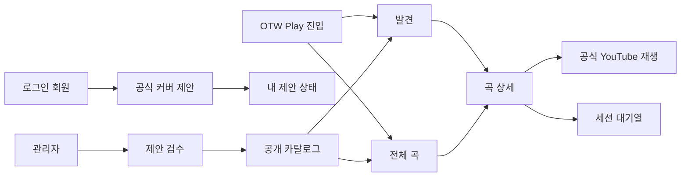
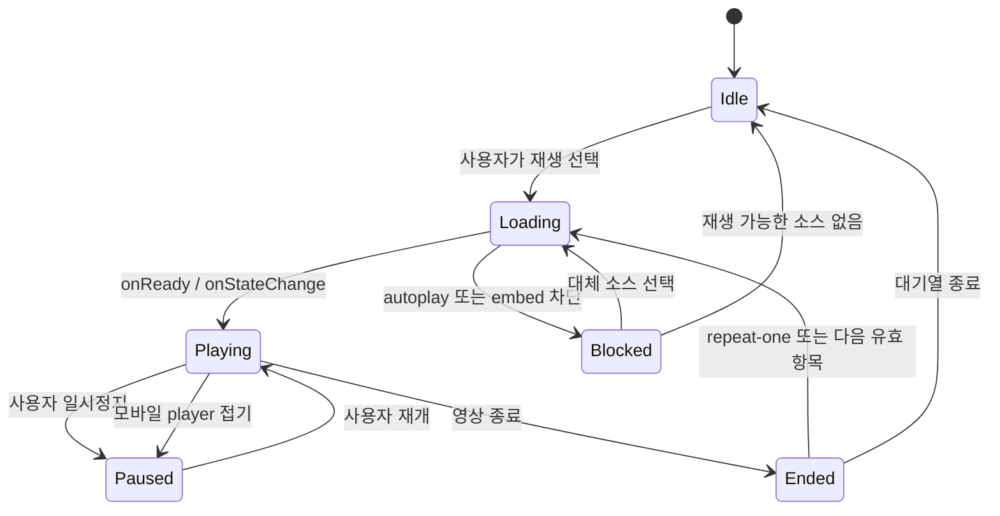

# OTW Play UI/UX 설계

상태: PR-5 관리자 catalog UI 구현 중, 공개 UI·player 미착수

기준일: 2026-08-11

상위 문서: `otw-play-product-requirements.md`

관련 문서:

- `otw-play-system-design.md`
- `otw-play-implementation-guide.md`
- `../Design.md`

## 1. 목적과 적용 원칙

이 문서는 OTW Play의 탐색, 검색, 재생, 세션 대기열, 회원 제안과 관리자
검수 경험을 정의한다. 제품 요구사항이 바뀌면 요구사항 문서를 먼저 갱신하고
이 문서의 화면·상태·수용 기준을 함께 조정한다.

MVP의 시각 목표는 일반적인 영상 목록이 아니라 **오버더월이 직접 운영하는
음악 앱**으로 인식되는 것이다. 다만 Spotify, TIDAL, Apple Music의 고유 UI를
복제하지 않고 다음 장점을 OTW의 기존 디자인 시스템에 맞게 재해석한다.

- Spotify: 탐색 영역과 현재 재생 문맥을 동시에 유지하는 정보 구조
- TIDAL: 아티스트와 작품 이미지를 중심에 둔 편집형 큐레이션 분위기
- Apple Music: 제목, 메타데이터, 검색과 재생 조작의 명료한 위계
- OTW Schedule: `PublicAppShell`, `ContentPageShell`, semantic token, 멤버
  색상과 현재 접근성 규칙

공식 참고 자료:

- Spotify 데스크톱 경험: https://newsroom.spotify.com/2023-06-20/spotify-desktop-experience-redesign-your-library-now-playing-views-customize/
- TIDAL 제품 방향: https://tidal.com/about
- Apple 디자인 원칙: https://developer.apple.com/design/human-interface-guidelines/design-principles
- Apple 검색 필드: https://developer.apple.com/design/human-interface-guidelines/search-fields
- YouTube 임베드 최소 기능: https://developers.google.com/youtube/terms/required-minimum-functionality
- YouTube IFrame Player API: https://developers.google.com/youtube/iframe_api_reference

## 2. 설계 기본값과 미결정 항목

다음 값은 구현 설계를 구체화하기 위한 **권장 기본값**이다. 카탈로그 공개 접근은
DEC-019로 확정되었고, 나머지 값은 제품 요구사항의 TBD를 확정으로 바꾸지 않는다.

| 항목 | 설계 기본값 | 변경 영향 |
| --- | --- | --- |
| 공개 경로 | `/play` | 내비게이션, SEO, 공유 URL, route contract |
| 접근 권한 | 카탈로그·재생은 공개, 제안은 로그인, 검수는 관리자 | API 인증과 캐시 경계 |
| 내비게이션 라벨 | `OTW Play` | `app-navigation.ts`와 모바일 메뉴 |
| 플레이어 유지 범위 | `/play/*` 안에서만 유지, 다른 제품 영역 이동 시 정지 | nested layout과 player store |
| 대기열 복원 | `sessionStorage`에 현재 세션만 복원 | 저장 플레이리스트와 명확히 분리 |
| 외부 참여자 | 검색·필터에는 포함, 별도 공개 프로필은 만들지 않음 | detail route 범위 |
| 제안 수정·철회 | `pending_review`일 때만 허용하는 방향, 첫 출시 여부는 단계별 결정 | command와 감사 이력 |

## 3. 경험 원칙

### 3.1 곡을 먼저, 영상을 나중에

탐색 결과의 기본 단위는 YouTube 영상이 아니라 곡이다. 카드와 행의 첫 정보는
곡명이고 그 아래에 원곡 가수, OTW 가창 참여자, 버전 수를 배치한다. 영상
썸네일과 채널은 재생 가능한 공식 버전의 출처로 제시한다.

### 3.2 재생 문맥을 잃지 않기

사용자는 곡 상세, 검색 결과와 대기열을 오가면서도 현재 곡과 다음 곡을 알 수
있어야 한다. 데스크톱에서는 현재 재생 패널을 유지하고, 좁은 화면에서는
정책을 준수하는 확장형 플레이어를 사용한다.

### 3.3 멤버 중심이되 외부 협업을 지우지 않기

현재 멤버는 오시마크와 이름을 함께 표시한다. 외부 인원과 전 소속 멤버는
동일한 중립 칩을 쓰되, 곡 크레딧과 검색 결과에서는 빠지지 않는다. 색만으로
소속을 전달하지 않는다.

### 3.4 운영 신뢰를 화면에 드러내기

모든 공개 버전은 공식 채널명, 공개일과 YouTube에서 열기 링크를 제공한다.
회원 제안은 승인되기 전 공개 카탈로그와 철저히 분리하고, 제안자에게는 현재
상태와 검수 결과를 명확히 보여준다.

### 3.5 장식보다 빠른 재탐색

첫 진입은 매력적인 큐레이션 화면을 제공하되, 반복 사용자는 검색, 필터와
밀도 높은 곡 목록으로 빠르게 이동할 수 있어야 한다. 애니메이션은 상태 변화를
돕는 범위에만 사용한다.

## 4. 정보 구조와 경로

| 경로 | 사용자 | 목적 | 주요 화면 |
| --- | --- | --- | --- |
| `/play` | 전체 | 큐레이션과 최근 공개곡 발견 | Discover |
| `/play/songs` | 전체 | 검색·필터·정렬 기반 전체 카탈로그 | Catalog |
| `/play/songs/$songSlug` | 전체 | 곡 정보와 공식 가창 버전 비교 | Song detail |
| `/play/submit` | 로그인 회원 | 공식 커버곡 등록 제안 | Submission wizard |
| `/play/submissions` | 로그인 회원 | 자신의 제안 상태 확인 | My submissions |
| `/admin/music` | 관리자 | 카탈로그 운영 개요 | Music operations |
| `/admin/music/catalog` | 관리자 | 곡·가창·소스 등록 및 편집 | Catalog manager |
| `/admin/music/submissions` | 관리자 | 회원 제안 검수 | Review queue |

공개 화면의 상위 탭은 `발견`, `전체 곡`, `오리지널`, `커버`로 제한한다.
오리지널과 커버는 별도 데이터 복제 화면이 아니라 `/play/songs`의 고정 필터
진입점이다. 저장 플레이리스트와 라이브러리 탭은 MVP에 만들지 않는다.

## 5. 반응형 앱 셸

OTW Play는 기존 `PublicAppShell` 안에 `PlayShell`을 둔다. 기존 사이트
사이드바가 이미 주 내비게이션을 담당하므로 음악 앱을 흉내 낸 두 번째 고정
사이드바는 만들지 않는다.

### 5.1 넓은 화면: 1280px 이상

- 기존 OTW 사이드바: 64px 또는 256px
- Play 상단 바: 제품명, 탐색 탭, 확장 검색, 제안 버튼
- 중앙: 독립 스크롤 카탈로그, 최대 읽기 폭을 고정하지 않고 카드 수를 조절
- 우측: 재생 중일 때 400px `NowPlayingRail`, 미재생 시 중앙 영역에 반환
- 플레이어 iframe: 16:9, 약 400×225px로 YouTube 최소 200×200px를 충족
- 대기열: 우측 패널의 플레이어 아래에서 현재 곡과 다음 항목을 표시

### 5.2 중간 화면: 768–1279px

- 기존 사이트 사이드바는 현재 breakpoint 규칙 유지
- 검색과 필터는 상단 바와 drawer로 분리
- 우측 재생 패널 대신 콘텐츠 하단의 확장형 `PlayerDock` 사용
- 재생 중 dock의 iframe은 항상 실제로 보이며 너비에 따라 16:9 유지
- 대기열은 player 옆이 아니라 별도 sheet로 표시

### 5.3 모바일: 767px 이하

- 기존 56px 모바일 헤더 아래에 `OTW Play` 제목과 검색 버튼 배치
- 발견/전체/오리지널/커버 탭은 가로 스크롤 가능한 sticky tab 사용
- 카드는 한 열, 곡 목록은 썸네일 72–88px의 밀도 높은 행 사용
- 재생 시작 시 하단에서 16:9 player sheet를 열고 iframe 높이 200px 이상 확보
- 플레이어를 compact bar로 접는 동작은 먼저 재생을 일시정지한다. 숨은 재생은
  허용하지 않는다.
- 필터, 대기열과 곡 버전 목록은 각각 제목이 있는 bottom sheet로 제공한다.

## 6. 시각 언어

### 6.1 방향: OTW Aurora Stage

기본 표면은 음악과 썸네일이 돋보이는 어두운 무대처럼 구성한다. 밝은 테마도
동일한 정보 위계를 유지하되, 첫 방문의 제품 인상은 dark-first로 검증한다.

- 배경: 기존 `--background`에서 한 단계만 분리한 깊은 neutral
- 표면: `--card`, `--popover`, `--border`를 재사용한 세 단계
- 브랜드 분위기: `--otw-1`, `--otw-2`, `--otw-3`의 낮은 opacity radial tint
- 멤버 색상: 현재 곡의 작은 accent, 칩 테두리, focus 보조에만 사용
- YouTube red: 외부 열기와 출처 배지처럼 플랫폼을 뜻하는 작은 요소에만 사용
- 썸네일: 공식 YouTube 원본 비율을 유지하고 임의 변형·합성·과도한 blur를 금지

계획 토큰은 전역 semantic token을 값으로 삼는 feature alias다.

| 토큰 | 용도 | 규칙 |
| --- | --- | --- |
| `--play-canvas` | 음악 영역 배경 | `--background`에서 대비 한 단계 |
| `--play-surface` | 카드·행 | `--card`와 동등한 대비 |
| `--play-surface-raised` | player·sheet | `--popover` 기반 |
| `--play-accent` | 주요 재생 CTA | OTW brand gradient가 아닌 단색 기준 |
| `--play-member-accent` | 현재 곡 참여자 문맥 | 런타임 멤버색, 대비 계산 필수 |

새 토큰을 도입할 때는 `src/index.css`와 `Design.md`를 함께 갱신한다.

### 6.2 타이포그래피와 밀도

- 기본 글꼴은 기존 Inter를 유지한다.
- 제품 제목은 24–28px, hero 곡명은 32–48px 범위에서 clamp한다.
- 카드 곡명은 14–16px semibold, 원곡 가수·공개일은 12–14px다.
- 숫자, 날짜, 재생 시간은 `tabular-nums`를 쓴다.
- 카드 radius는 `rounded-xl` 이하, player와 hero만 `rounded-2xl`을 허용한다.
- hover 확대는 1.01 이하로 제한하고 레이아웃이 움직이지 않게 한다.

### 6.3 실제 에셋 사용

MVP는 별도 앨범 아트를 만들지 않는다. 공식 YouTube 썸네일을 16:9로 표시하고
곡 카드 하단에 텍스트 영역을 결합한다. 정사각형 앨범 표지처럼 강제 crop하지
않는다. 추후 R2에 권리 확인된 공식 artwork가 추가되면 `artwork` 역할을
별도 필드로 도입할 수 있다.

## 7. 공개 화면 상세

### 7.1 Discover

노출 순서는 운영자가 고정하는 플레이리스트가 아니라 카탈로그의 검수된
데이터에서 결정적으로 계산한다.

1. `New on OTW Play`: 최신 공개 공식 버전 1개를 hero로 표시
2. `새 오리지널곡`: 최근 오리지널 6–10개
3. `새 공식 커버`: 최근 커버 6–10개
4. `멤버로 찾기`: 현재 멤버 avatar와 오시마크
5. `함께 부른 노래`: 듀엣·유닛·단체·외부 협업의 최근 항목

hero는 썸네일, 곡명, 참여자, 관계, 공개일, `재생`과 `곡 보기`만 제공한다.
자동 carousel이나 자동 재생 영상은 사용하지 않는다. hero 대상이 없으면
빈 장식 영역을 만들지 않고 다음 섹션을 올린다.

### 7.2 Catalog

상단의 검색 필드는 곡명, 별칭, 원곡 가수와 참여자를 검색한다. 입력 후
250ms debounce하되 Enter는 즉시 실행한다. 검색어, 필터와 정렬은 URL query에
직렬화하여 새로고침·공유·뒤로 가기를 보존한다.

필터:

- 멤버 복수 선택: 기본 `한 명 이상 포함(ANY)`
- `선택 멤버 모두 참여(ALL)` 명시적 toggle
- 그룹
- 곡 관계: 오리지널, 커버
- 참여 형태: 솔로, 듀엣, 유닛, 단체, 외부 협업
- 원곡 가수
- 공식 영상 공개일 범위

API wire에서는 멤버를 기존 numeric member UID로, 원곡 가수를 public entity
slug로 식별한다. 그룹은 facets가 발급한 versioned opaque key를 그대로 URL
query에 보존하며 client가 `entity`/`unit` payload를 직접 만들거나 해석하지 않는다.

정렬:

- 최신 공개순 기본
- 곡명순
- 참여자순

활성 필터는 결과 위에 제거 가능한 칩으로 요약한다. 모바일에서 필터 drawer를
닫은 뒤에도 적용 조건, 현재 불러온 항목 수와 다음 page 존재 여부를 바로 알 수
있어야 한다. API는 exact total 또는 facet count를 제공하지 않는다. 결과는 초기에는
곡 단위 목록으로 표시하며, 이미지 탐색을 원하는 사용자를 위한 카드 view는
데이터와 사용성 검증 후 후속으로 고려한다.

### 7.3 Song detail

상단에는 대표 썸네일, 곡명, 원곡 가수, 원곡 공개 정보와 OTW 오리지널 여부를
표시한다. 아래 `공식 버전` 목록은 각 가창 기록을 독립 행으로 보여준다.

버전 행의 정보 순서:

1. 대표 소스 썸네일과 재생 버튼
2. 참여자 칩
3. 곡 관계·공개 형태·참여 형태
4. 공식 공개일과 채널명
5. 다른 공식 소스 개수
6. YouTube에서 열기

대표 소스가 unavailable이면 자동으로 조용히 다른 소스로 바꾸지 않는다.
상태와 사용 중인 대체 소스를 알리고, 관리자가 지정한 다음 유효 소스를
선택하도록 한다.

### 7.4 직접 링크

- `/play/songs/$songSlug`: 곡 중심 공유
- `/play/songs/$songSlug?performance=$performanceId`: 특정 공식 버전 강조
- `autoplay=1` 같은 공유 parameter는 사용하지 않는다. 사용자의 재생 조작 뒤에만
  플레이한다.

## 8. 참여자 칩

| 상태 | 시각 | 접근성 이름 | 동작 |
| --- | --- | --- | --- |
| 현재 멤버 | 오시마크 + 활동명 + 얕은 멤버색 accent | `현재 OTW 멤버, 이름` | 멤버 필터 적용 |
| 외부 인원 | 활동명 + neutral border | `외부 참여자, 이름` | 외부 참여자 필터 적용 |
| 전 소속 멤버 | 외부와 동일 | `외부 참여자, 이름` | 외부 참여자 필터 적용 |
| 그룹·유닛 | 이름 + `그룹` 보조 라벨 | `그룹, 이름` | 그룹 필터 적용 |

그룹 칩은 실제 참여자 칩을 대체하지 않는다. 외부 여부는 DB에 저장된 과거
스냅샷이 아니라 조회 시점의 현재 멤버 상태로 계산한다.

## 9. 재생과 세션 대기열

### 9.1 플레이어 규칙

- IFrame Player는 앱 전체에서 한 개만 생성한다.
- `origin`을 현재 사이트 origin으로 지정한다.
- iframe, YouTube 브랜딩, 광고와 기본 조작 UI를 가리는 overlay를 만들지 않는다.
- 사용자의 재생 클릭 전에는 영상 로드만 가능하며 소리 있는 자동 재생을 시도하지 않는다.
- iframe은 실제로 보이고 절반 이상 가시 영역에 있을 때만 scripted playback을 시작한다.
- 재생 불가, 삭제, 비공개, embed 차단을 구분해 안내하고 다음 소스로 이동할 수
  있게 한다.
- 앱의 이전/다음 버튼은 YouTube 조작부를 대체하지 않고 대기열 탐색을 담당한다.

### 9.2 대기열 모델

대기열 항목은 `performanceId`, 선택한 `sourceId`와 당시 표시 snapshot만 가진다.
곡 전체를 복제 저장하지 않고 현재 카탈로그를 다시 조회할 수 있어야 한다.

- 재생 클릭: 현재 항목 교체 후 시작
- 대기열에 추가: 마지막에 추가
- 다음에 재생: 현재 항목 바로 뒤에 추가
- drag reorder: 키보드 이동 명령도 함께 제공
- repeat: `off`, `all`, `one`
- shuffle: 현재 곡은 고정하고 남은 항목에 Fisher–Yates를 한 번 적용
- unavailable: 실패 횟수를 늘리지 않고 다음 유효 항목으로 한 번만 건너뜀
- 무한 순환 방지: 한 번의 다음 탐색에서 대기열 길이만큼만 검사

`sessionStorage`에는 식별자, 순서, 현재 index, repeat와 shuffle 상태만 저장한다.
로그인 계정과 동기화하지 않으며 플레이리스트라는 이름을 사용하지 않는다.

## 10. 회원 공식 커버 제안

### 10.1 3단계 wizard

1. **영상 확인**: YouTube URL 입력, ID 정규화, 표준 썸네일과 기존 영상·진행 중 제안 중복 확인
2. **곡과 참여자**: 곡명, 원곡 가수, 기존 곡 후보, 참여자 복수 선택, 외부
   참여자 텍스트, 선택 메모
3. **검토 후 제출**: 입력한 곡·원곡 가수·참여자와 video ID·썸네일 확인,
   승인 전 비공개 및 관리자 검수 항목 안내, 제출

회원 제출 시 YouTube Data API를 필수 호출하지 않는다. 캐시된 metadata가 있으면
보조 정보로만 보여주고, 없더라도 유효한 video ID 형식과 D1 중복 검사를 통과하면
제출할 수 있다. 실제 공개 상태, 공식 채널, 공개일과 embed 가능 여부는 관리자
승인 단계에서 최신 metadata로 검증한다. 형식 오류, exact duplicate와 제출 제한은
구체적인 이유를 표시하고 입력을 보존한다.

### 10.2 내 제안

상태는 운영 코드가 아닌 사용자 언어로 표시한다.

| 내부 상태 | 사용자 라벨 | 안내 |
| --- | --- | --- |
| `pending_review` | 검토 대기 | 관리자 확인 전이며 공개되지 않음 |
| `approved` | 승인·게시됨 | 연결된 공개 곡으로 이동 |
| `rejected` | 반려 | 공개되지 않으며 제공 가능한 사유 표시 |
| `withdrawn` | 철회 | 본인이 검토 전에 철회한 경우에만 사용 |

다른 회원의 제안 존재 여부나 내용은 노출하지 않는다. 중복 안내는 `이미 등록되어
있음` 또는 `검토 중인 동일 영상이 있음` 정도로 제한한다.

## 11. 관리자 UI

### 11.1 Music operations

관리자 홈은 과장된 dashboard보다 작업 대기 상태를 우선한다.

- 검토 대기 제안 수
- 재생 불가·재확인 필요 소스 수
- draft 곡·가창 수
- 최근 게시와 최근 거절
- 카탈로그 등록, 제안 검수, 소스 점검 진입

### 11.2 Review queue

데스크톱은 목록과 검수 패널의 split view를 쓴다.

- 좌측 360–420px: 대기 제안, 제출일, 제출자, 중복 경고
- 우측 상단: 실제 YouTube player와 공식 채널·공개일
- 우측 중앙: 제출값과 YouTube 메타데이터 비교
- 우측 하단: 기존 곡 연결 또는 새 곡 생성, 참여자·분류 수정, 승인·반려

승인 버튼은 다음 조건이 모두 충족된 뒤 활성화한다.

- 영상과 채널을 확인함
- 기존 영상 중복이 없음
- 기존 곡 연결 또는 새 곡 생성 선택
- 원곡 가수와 참여자 확정
- 관계·공개 형태·참여 형태 확정
- 대표 소스와 공개일 확정

반려는 사유 코드와 선택 메모를 받는다. 승인·반려는 confirm dialog를 거치며,
서버의 conditional transition이 성공하기 전 UI에서 낙관적으로 제거하지 않는다.

### 11.3 Catalog manager

곡, 가창 기록, 영상 소스를 하나의 거대한 form에서 동시에 수정하지 않는다.

- 곡 drawer: 제목, 별칭, 원곡 가수, 원곡 공개 정보
- 가창 drawer: 곡 관계, 공개 형태, 참여 형태, 참여자, 상태
- 소스 drawer: YouTube 영상, 채널, 대표 여부, 가용 상태
- publish command: 검수 항목을 다시 요약하고 별도 실행

PR-5 관리자 진입점은 `/admin/otw-play`이며 Admin Center의 콘텐츠 관리 메뉴에서
접근한다. 서버 command 성공 뒤 catalog와 proposal query를 invalidate해 authoritative
readback을 다시 표시하고 optimistic removal은 하지 않는다. GATE-01 미확정 상태에는
검수 대기 제안과 YouTube 원본 링크를 계속 제공하되 승인 control은 사유를 표시한
disabled 상태로 유지하고, 거절은 내부 사유 code가 있어야 실행한다.

## 12. 로딩·빈 상태·오류 상태

| 상황 | 처리 |
| --- | --- |
| 첫 카탈로그 로딩 | 실제 카드·행 높이와 같은 skeleton, hero layout shift 방지 |
| 다음 페이지 로딩 | 기존 결과 유지, 하단 progress와 중복 클릭 방지 |
| 검색 결과 없음 | 적용 필터 요약, `필터 초기화`, 검색어 수정 제안 |
| 공개 카탈로그 없음 | 관리 운영 전용 안내, 임의 샘플 데이터 미노출 |
| 공개 read 비활성 | config flag를 기준으로 OTW Play 준비 중 안내, catalog endpoint 재시도 금지 |
| 공개 read-model 동기화 중 | config는 유지하되 catalog `503`에서는 이전 revision 결과를 현재 결과처럼 보여주지 않고 일시적 이용 불가와 수동 재시도 제공 |
| API 오류 | 이전 성공 데이터 유지 가능 시 stale 표시와 재시도 |
| 영상 unavailable | 곡 메타데이터 유지, 대체 소스 또는 YouTube 외부 링크 제공 |
| 인증 만료 | 입력 보존 후 로그인 재시도, 공개 탐색은 계속 가능 |
| 승인 충돌 | 최신 제안 상태 재조회 후 이미 처리된 결과 표시 |

## 13. 접근성

- 본문 대비 WCAG AA 4.5:1 이상, 큰 텍스트 3:1 이상을 목표로 한다.
- 모든 icon button에 `aria-label`을 제공한다.
- tab, chip, toggle, queue item에 `aria-selected`, `aria-pressed`,
  `aria-current`와 `aria-describedby`를 상태에 맞게 쓴다.
- 검색 suggestion은 combobox/listbox pattern을 따른다.
- filter sheet가 닫히면 focus를 열었던 버튼으로 돌려보낸다.
- 대기열 재정렬은 drag뿐 아니라 `위로 이동`, `아래로 이동` 명령을 제공한다.
- 새 곡 재생, unavailable 건너뜀과 제안 제출 결과는 적절한 `aria-live`로 알린다.
- touch target은 최소 44×44px를 목표로 한다.
- `prefers-reduced-motion`에서 hero transition, sheet spring과 artwork 이동을 줄인다.
- 오시마크 emoji는 장식으로 중복 읽히지 않게 하고 칩 전체 접근성 이름에 소속을 넣는다.

## 14. 성능과 체감 품질

- 최초 `/play` JS는 관리자 편집기와 제출 wizard를 포함하지 않고 route 단위로 분할한다.
- 처음 화면에는 필요한 hero와 첫 섹션 썸네일만 eager load하고 나머지는 lazy load한다.
- 썸네일은 명시적 `width`와 `height`, `aspect-ratio`로 CLS를 방지한다.
- 검색 결과는 이전 결과를 유지하면서 query가 바뀐 부분만 갱신한다.
- 한 화면에 YouTube iframe을 여러 개 만들지 않는다. 목록은 썸네일만 사용한다.
- player API script는 첫 재생 의도 또는 player가 필요한 route에서 한 번만 로드한다.
- 긴 목록은 cursor pagination을 기본으로 하고 실제 측정 전에는 virtual list를
  도입하지 않는다.
- participant 정렬과 contains 검색의 내부 read model은 결과를 근사하거나 새 공개
  상태를 만들지 않는다. 화면에 표시하기 전 canonical song과 published official
  performance 조건을 통과한 결과만 사용한다.
- 공개 read 활성 상태에서 catalog revision과 read-model revision이 다르면 config
  이외 공개 API는 cache 전에 `503`으로 중단된다. 후속 UI는 이를 빈 결과로 오해하지
  않고 동기화 중 오류 상태로 표시하며, 이전 revision 목록을 최신 결과처럼 계속
  노출하지 않는다. flag-off 상태는 기존 준비 중 안내를 유지한다.
- 곡 3,000개, search term 10,000개, performance 8,000개의 선언된 상한 fixture에서
  rows read 예산을 검증한다. 이는 현재 MVP 대표 분포의 회귀 기준이며 임의의 모든
  데이터 분포에서 같은 수치를 보장한다는 의미가 아니다.
- 목표: 공개 카탈로그 cache hit 기준 API p95 300ms 이내, 검색 miss 기준 p95
  800ms 이내, player 이외 화면 CLS 0.1 이하. 수치는 출시 전 실제 환경에서
  재측정하고 조정한다.

PR-4 성능 보완은 API·DTO·cursor와 화면 설계를 바꾸지 않으며 `/play` route,
navigation, player를 생성하지 않는다. 원격 D1 적용과 배포도 하지 않으므로 현재
사용자가 보는 화면에는 영향이 없다.

## 15. 화면별 수용 기준

### Discover

- 오리지널과 커버가 별도 섹션으로 구분된다.
- 현재 멤버 진입점에 오시마크가 표시된다.
- hero가 없어도 빈 큰 영역이 남지 않는다.

### Catalog

- 검색·필터·정렬이 URL과 동기화된다.
- 멤버 ANY와 ALL 의미를 사용자가 구분할 수 있다.
- 동일 곡은 한 결과로 묶이고 공식 버전 수를 확인할 수 있다.
- exact total이 있는 것처럼 표시하지 않고 현재 로드 수와 다음 page 여부를 구분한다.

### Player

- 사용자의 조작 전 자동 재생하지 않는다.
- 재생 중 iframe은 화면에 보이고 최소 크기를 충족한다.
- next, previous, repeat, shuffle와 queue reorder가 키보드로 가능하다.
- unavailable 소스가 무한 재시도되지 않는다.

### Submission

- 비로그인 사용자는 로그인 후 기존 입력으로 돌아올 수 있다.
- 승인 전 제안은 공개 검색·상세·재생 API에서 보이지 않는다.
- 제출자는 자신의 상태만 볼 수 있다.

### Admin review

- 실제 영상, 공식 채널, 중복과 곡 연결을 한 흐름에서 검수할 수 있다.
- 승인 또는 반려가 성공한 뒤 권위 있는 서버 상태를 다시 읽는다.
- 동시 검수 시 한 요청만 상태 전환에 성공한다.

## 16. 구현 시 금지사항

- VOD 최신 영상 피드의 이름만 OTW Play로 바꾸지 않는다.
- 현재 멤버·외부 인원을 색상 하나로만 구분하지 않는다.
- YouTube 썸네일을 임의 수정하거나 player 위를 OTW 조작부로 덮지 않는다.
- 숨겨진 iframe으로 음악을 계속 재생하지 않는다.
- 공개 화면에 `pending_review`, `draft`, `rejected` 데이터를 합치지 않는다.
- 세션 대기열을 저장 플레이리스트나 개인 라이브러리로 표현하지 않는다.
- 사용자 제안 form을 관리자 카탈로그 row에 직접 저장하지 않는다.

## 17. 변경 관리

UI 아이디어 변경 시 다음 순서로 반영한다.

1. 제품 요구사항의 결정·TBD·MVP 범위를 확인한다.
2. 이 문서의 정보 구조, 화면 상태와 수용 기준을 수정한다.
3. `Design.md`에 공용으로 승격할 패턴만 반영한다.
4. API·DB 의미가 바뀌면 `otw-play-system-design.md`를 함께 수정한다.
5. 구현 순서와 검증 gate는 `otw-play-implementation-guide.md`에 반영한다.
