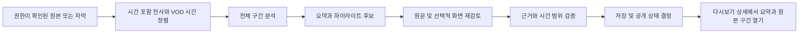

# 다시보기 AI 요약·하이라이트 기술 검토

검토일: 2026-09-14 (한국 시간)

상태: 기술 검토 완료. 구현·유료 API 실험·배포는 수행하지 않음.

확정된 요청: 치지직·유튜브 다시보기의 AI 요약, 추천 구간, 타임스탬프, 원본 재생 링크. 짧은 영상 파일 생성은 범위 밖이다. 아래 운영 방식과 수치는 제안이며 승인된 제품 요구사항이나 측정 결과가 아니다.

## 1. 결론과 주요 발견

**DeepSeek를 요약·구간 선정 모델로 사용하는 것은 타당하다. 가장 큰 선행 조건은 분석 가능한 자막·음성 확보이며, 이 경로가 확보되기 전에는 임의의 공개 VOD URL을 넣으면 자동으로 분석되는 기능을 약속할 수 없다.**

| 중요도 | 발견 | 실제 영향과 조치 |
| --- | --- | --- |
| 높음 | 현재 다시보기 수집은 메타데이터 수집이다. | 제목·썸네일·길이만으로 방송 내용 요약을 만들면 근거 없는 결과가 된다. 타임스탬프 자막 또는 사용 권한을 확보한 녹화 원본이 필요하다. |
| 높음 | 공개 영상이라는 사실만으로 자막 다운로드·음성 추출·AI 가공 권한이 확보되지는 않는다. | 유튜브 공식 API는 자막 다운로드에 영상 편집 권한을 요구한다. API 데이터 가공 정책도 별도 검토 대상이다. 치지직의 VOD 자막·미디어 취득 계약은 확인되지 않았다. |
| 중간 | 텍스트만으로 시각적 명장면을 충분히 포착하기 어렵다. | 토크 요약부터 검증하고, 게임·공연은 음향 신호와 후보 화면 분석을 함께 평가한다. |
| 중간 | 로컬 녹화와 공개 VOD의 시간축이 다를 수 있다. | 방송 대기·중단·편집 구간을 반영하는 시간 매핑이 필요하다. 잘못된 링크는 핵심 사용자 기능 실패다. |
| 중간 | 기존 예약 작업 Workflow는 장시간 AI 분석용으로 구성되지 않았다. | 별도 비동기 작업과 단계별 재시도·비용 제한을 설계한다. |

추천 도입 방향은 **권한이 확보된 원본/자막 → 시간 정보가 있는 전사 → DeepSeek 구간별 분석 → 전체 요약과 추천 구간 → 기존 다시보기 화면**이다. 자막이 있는 영상만 처리하는 방식은 초기 범위로는 가능하지만, 자막 없는 영상까지 지원한다는 요구를 충족하지는 않는다.

## 2. 현재 저장소에서 확인한 기반

검토 기준은 HEAD `9bf44786dee2397d381ebd9e2c12c01a70d4212e`와 당시 미커밋 작업 트리다. 특히 유튜브 VOD 화면·조회기는 미커밋 변경이므로 운영 배포 완료로 판단하지 않았다. 기존 작업은 수정하지 않았다.

| 역할 | 현재 파일과 확인 사항 | 연결 제안 |
| --- | --- | --- |
| 다시보기 진입점 | `src/features/media-library/ui/vods-overview.tsx`: 치지직·유튜브 VOD 탭 | 카드에서 요약 상세로 진입하고 추천 구간을 확인 |
| 치지직 목록 | `worker/features/chzzk/infrastructure/chzzk-api.ts`: `/service/v1/channels/{id}/videos`, D1 캐시 | VOD 식별·제목·길이 제공. 음성/자막 공급자로 간주하지 않음 |
| 치지직 계약 | `contracts/chzzk.ts`: `ChzzkVideoDto` | `videoNo`와 영상 길이를 분석 원본 식별에 사용 |
| 유튜브 목록 | `worker/features/youtube/infrastructure/d1-youtube-vods.ts` 및 `youtube_feed_videos` | 기존 피드의 영상 ID·채널·길이 재사용 |
| 원본 열기 | `src/features/chzzk/ui/vod-card.tsx`, `src/features/youtube/ui/youtube-video-card.tsx` | 현재는 원본 외부 링크. 시간 지정 링크는 추가 검증·구현 필요 |
| 비동기 기반 | `wrangler.jsonc`: Queues, D1, R2, Workflows | 계정 기술 기반 재사용, 분석 작업은 독립된 큐/Workflow 검토 |
| 기존 Workflow | `worker/workflows/scheduled-workflows.ts`: 조정 단계 timeout 1분, 설정상 steps 3 | 분석 전체를 기존 단일 단계에 끼워 넣지 않음 |
| 자산 저장 | `worker/features/assets/domain/asset-key-policy.ts`: 공개 이미지 경로 정책 | 전사·오디오용 비공개 저장소와 접근 정책 별도 구성 |

검색한 `worker`, `src`, `contracts`, `db`, `docs` 범위에서 DeepSeek 연동, 방송 전사, AI 하이라이트 파이프라인은 확인되지 않았다. 기존 Operations의 job summary는 운영 집계이며 방송 요약 기능이 아니다.

## 3. 플랫폼별 입력 확보

### 유튜브

공식 `captions.download`는 OAuth 사용자에게 영상 편집 권한을 요구하고 호출당 200 quota units를 사용한다. 일반 API 키로 임의의 공개 영상 자막을 다운로드하는 API로 사용할 수 없다. 자막 목록과 실제 자막 본문도 구분해야 한다. [공식 자막 다운로드 문서](https://developers.google.com/youtube/v3/docs/captions/download?hl=en)

기술적 접근 성공과 AI 처리 허용 여부는 별개다. YouTube API 정책은 무승인 시청각 콘텐츠 다운로드를 제한하며, III.E.4.h에는 API 데이터에서 파생 데이터·지표를 만드는 행위에 관한 제한이 있다. 따라서 OAuth를 확보했다고 자막의 외부 AI 전송·공개 요약까지 자동 허용된다고 가정하지 않는다. 적용 범위와 필요한 허가를 확인해야 한다. [YouTube 개발자 정책](https://developers.google.com/youtube/terms/developer-policies)

추천 입력 경로는 방송자/권리자가 별도로 제공하는 원본 녹화·자막이며, 분석 및 결과 공개에 대한 권한을 함께 확인한다. 유튜브 자막 API는 위 접근 권한과 이용 정책이 확인된 경우의 추가 경로다. 비공식 transcript 수집·다운로더에만 의존하면 차단, 인증 변화, 지역 제한에 따라 핵심 기능이 중단될 수 있다. 이번 검토에서는 영상 다운로드나 우회 수집을 수행하지 않았다.

### 치지직

확인한 공식 개발자 문서는 라이브·채널·채팅 등 기능을 안내하지만, 다시보기 자막 다운로드·원본 미디어 취득 기능은 확인하지 못했다. 이는 서비스 전체에 그런 기능이 없다는 단정은 아니다. 현재 저장소에서 쓰는 웹 서비스 엔드포인트를 공개 Open API 계약과 동일하게 취급할 수 없다. [치지직 공식 개발 문서](https://chzzk.gitbook.io/chzzk)

실행 가능한 후보는 방송자 녹화 원본 또는 별도 제공 자막 연계다. 플랫폼에서 직접 취득하려면 문서/제휴 경로, 권한, 만료 URL·로그인·지역 제한·VOD 보존 기간을 확인한다. 라이브 채팅 API가 있다는 사실도 과거 VOD 채팅 전체를 얻을 수 있다는 근거는 아니다. 채팅은 사용 가능한 경우의 선택적 신호로 둔다.

### 입력 경로별 판정

| 입력 | 기술 가능성 | 남은 조건 |
| --- | --- | --- |
| 권리자가 제공한 SRT/VTT/시간 포함 JSON | 높음 | 분석·공개 권한, 영상과 시간축 일치 |
| 권리자가 제공한 오디오/녹화 원본 | 높음 | 음성 인식 처리, 공개 VOD와 구간 정렬 |
| 유튜브 OAuth 자막 | 조건부 | 편집 권한, 자막 존재, API 이용 정책 적용 확인 |
| 임의의 유튜브·치지직 공개 URL만 제공 | 현재 보장 불가 | 허용되고 유지 가능한 자막/미디어 취득 경로 |

## 4. DeepSeek의 역할과 모델 선택

2026-09-14 조회한 공식 문서 기준 `deepseek-flash`는 DeepSeek-V4.1-Flash를 제공하며 텍스트와 이미지 입력을 지원한다. 문맥 길이는 1M tokens다. `deepseek-v4-pro`는 이미지 입력을 지원하지 않는다. 과거의 `deepseek-chat`·R1 가격표를 현재 견적으로 사용하지 않는다. [모델·가격](https://api-docs.deepseek.com/quick_start/pricing/), [이미지 입력](https://api-docs.deepseek.com/guides/vision/)

확인한 문서에서는 VOD URL이나 오디오 파일을 받아 전체 방송을 전사하는 계약을 확인하지 못했다. 설계상 DeepSeek 앞에 자막 취득 또는 STT 단계를 둔다. 이미지 지원은 후보 프레임을 평가하는 데 쓰며 연속 영상의 모든 움직임을 이해한다는 보장은 아니다.

제안 설정은 Flash의 비추론 모드를 기본으로 비교하고, 어려운 최종 후보 재평가에서만 추론 모드를 시험하는 것이다. 공식 문서상 추론 모드가 기본이므로 호출 시 의도를 명시한다. 한국어 출력, 멤버명·별명·게임 용어 사전을 제공하되 실제 발언에 없는 내용을 사전에서 만들어내지 않게 한다. [추론 모드](https://api-docs.deepseek.com/guides/thinking_mode/)

구조화 출력은 JSON mode를 사용하고 응용 계층에서 필수 필드·증거 ID·시간 범위를 검증한다. JSON mode 자체가 스키마와 사실성까지 보장하지는 않는다. 빈 응답과 출력 잘림도 실패 처리와 제한된 재시도 대상이다. [JSON Output](https://api-docs.deepseek.com/guides/json_mode/)

## 5. 추천 분석 흐름

1. **소스 확정:** 플랫폼·영상 ID·원본 버전·길이·취득 근거를 기록한다. 비공개 원본이 공개 결과로 자동 노출되지 않도록 공개 권한을 따로 둔다.
2. **전사:** 자막이 있으면 사용하고, 없으면 허용된 원본을 STT 처리한다. `segmentId`, 원본 기준 `startMs`, `endMs`, `text`, 전사 출처를 보존한다. 음성 구간만 잘라 처리해도 제거한 시간에 대한 역매핑을 유지한다.
3. **구간별 분석:** 초기 실험값으로 5~10분 단위와 20~30초 겹침을 사용하되 토큰·발화량으로 제한한다. 전체 방송을 처리하고 성공/실패/무음 구간을 구분한다. 긴 문맥 한 번 호출도 비교할 수 있지만 단계 재시도와 근거 추적 측면에서 분할 방식이 유리하다.
4. **요약과 후보 생성:** 구간 요약에서 전체 주제·챕터를 만들고, 추천 후보는 원본 segment ID로 제시하게 한다. 재미·중요도·완결성·다양성은 모델이 의미를 판단하며, 키워드 규칙만으로 선별하지 않는다.
5. **후보 재검토:** 선정 구간 주변 원문을 다시 읽어 도입과 결말이 잘리지 않게 조정한다. 필요 시 웃음·음량 변화·확보 가능한 채팅 밀도·화면을 보조 신호로 쓴다. 큰 소리나 많은 채팅 자체를 좋은 장면으로 확정하지 않는다.
6. **결과 저장:** 짧은 전체 요약, 시간순 챕터, 추천 구간 5~10개를 초기 표시안으로 제안한다. 근거가 부족하면 더 적게 반환한다. 시작/끝·선정 이유·근거 segment ID·처리 범위·모델/프롬프트 버전을 함께 저장한다.
7. **원본 이동:** 서버가 검증한 플랫폼 ID와 시간에서 링크를 생성한다. LLM이 임의의 URL을 생성하게 하지 않는다.

영상 전체 처리 실패를 조용히 숨기지 않는다. 일부 구간만 처리되면 `partial`과 누락 구간을 표시하고 전체 방송 요약으로 표현하지 않는다. 모델의 자기평가 점수는 검증된 정확도 확률로 표시하지 않는다.

### 화면 정보의 효용과 한계

토크는 전사만으로 유용한 결과가 나올 가능성이 높지만, 무언의 게임 플레이·표정·공연의 시각적 장면은 누락될 수 있다. 후보 주변의 여러 시간대 화면을 분석하면 보완할 수 있다. 다만 전사가 전혀 주목하지 않은 장면도 잡으려면 전체 영상의 저빈도 화면 샘플링이나 음향 이벤트 후보 경로가 필요하다. 후보 화면 검사만으로 시각적 하이라이트 전체를 커버한다고 주장하지 않는다.

이미지 입력은 크기에 따라 과금되고 공식 상한은 이미지당 1,024 tokens다. 이미지 개수·요청 크기 제한도 있으므로 긴 영상을 무제한 프레임으로 전송하지 않는다. [Vision 입력 제한](https://api-docs.deepseek.com/guides/vision/)

### 시간 정확도

시간은 LLM이 새로 계산하지 않고 선택한 실제 전사/프레임의 타임스탬프에서 결정한다. `0 <= start < end <= duration` 검증은 필요하지만 의미상 올바른 장면인지는 실제 재생으로 확인해야 한다.

로컬 녹화와 VOD가 중간 편집 없이 시작만 다르면 offset으로 맞출 수 있다. 중간 삭제가 있으면 구간별 매핑이 필요하다. 치지직과 유튜브에 같은 방송이 올라와도 영상별 시간축을 확인하지 않고 결과를 복사하지 않는다.

유튜브는 공식 IFrame API의 `startSeconds`·`seekTo`가 존재한다. 외부 원본 링크로 이동하는 UX와 앱 내 플레이어 UX 중 제품 선택에 맞춰 검증한다. [YouTube IFrame API](https://developers.google.com/youtube/iframe_api_reference)

치지직은 현재 코드에서 시간 지정 없이 VOD URL만 연다. 시각 지정 공유 링크와 모바일 앱 전환 후 위치 유지가 실제로 작동하는지는 미검증이다. 단순 원본 링크와 시간 복사만 제공되는 경우, 정확한 구간 이동이 가능한 것처럼 표시하지 않는다.

## 6. 비용 검토

USD, 세금·환율 제외. 공식 단가는 검토일 스냅샷이며 출시 시 재확인한다.

| DeepSeek Flash 단가 / 100만 tokens | 비혼잡 시간 | 혼잡 시간 |
| --- | ---: | ---: |
| 입력, 캐시 미적중 | $0.15 | $0.30 |
| 입력, 캐시 적중 | $0.003 | $0.006 |
| 출력 | $0.60 | $1.20 |

혼잡 시간은 평일 UTC 01~04시 및 06~10시, 한국 시간 10~13시 및 15~19시다. 견적은 캐시 미적중으로 계산한다. 공통 프롬프트 캐시와 우리 서비스의 완성 결과 재사용은 서로 다른 절감 방식이다. [공식 가격표](https://api-docs.deepseek.com/quick_start/pricing/)

**3시간 방송 1개당 총 입력 120,000 tokens, 총 출력 12,000 tokens**를 가정한다. 분할·겹침·통합 호출을 모두 합친 예시 예산이며, 한국어 3시간의 실측 토큰 수가 아니다. 비추론 모드 기준이고 재시도와 추가 화면 분석은 별도다.

`LLM 비용 = 입력 tokens / 1,000,000 × 입력 단가 + 출력 tokens / 1,000,000 × 출력 단가`

| 처리량 | DeepSeek 요약·선정 | STT 예시 | 합계 예시 |
| --- | ---: | ---: | ---: |
| 3시간 영상 1개 | $0.0252~0.0504 | $0.774 | $0.7992~0.8244 |
| 같은 길이 30개/월 | $0.756~1.512 | $23.22 | $23.976~24.732 |
| 같은 길이 300개/월 | $7.56~15.12 | $232.20 | $239.76~247.32 |

STT 예시는 Deepgram Nova-3 사전 녹음 단일 언어 PAYG $0.0043/분으로 180분을 전부 처리하는 경우다. 한국어 `ko` 지원은 공식 모델 표에서 확인했다. 한국어 고정 모델과 다국어 자동 전환은 같은 설정이 아니며 혼용 방송은 별도 평가한다. 이 단가 예시는 품질 우위나 최저가 보장이 아니다. 전송·스토리지·전처리 실행비·옵션·재시도는 제외했다. [STT 가격](https://deepgram.com/pricing), [언어 지원](https://developers.deepgram.com/docs/models-languages-overview)

프레임 100장을 최대 1,024 tokens씩 추가하면 Flash 이미지 **입력분만** $0.01536~0.03072가 추가된다. 화면 설명 출력·전처리비는 별도다. 자막을 이미 확보한 경우 STT 비용은 없으므로 총비용 구조가 크게 달라진다.

자체 운영 대안은 `faster-whisper`다. 단어 타임스탬프와 VAD를 지원한다. 직접 실행하면 외부 STT 분당 요금 대신 GPU/CPU 실행시간·서버·운영 비용을 부담한다. 현재 장비와 한국어 방송으로 속도·품질을 측정하기 전에는 무료 또는 더 저렴하다고 단정할 수 없다. [프로젝트 문서](https://github.com/SYSTRAN/faster-whisper)

비용 최적화 순서는 확보한 자막 재사용, 같은 원본 결과 재사용, 전사 재사용, 실패 단계만 재시도, Flash 출력 길이 제한, 비혼잡 시간 예약, 필요한 화면만 분석이다. VOD 수보다 **월 처리 시간과 재처리율**을 예산의 기준으로 잡는다.

## 7. OTW에 맞는 구현 경계

아래 이름은 신규 설계 제안이며 기존 구현을 의미하지 않는다.

| 구성 | 책임 |
| --- | --- |
| `src/features/vod-insights` | 요약·챕터·추천 구간·미완료 상태·관리자 재처리 UI |
| `worker/features/vod-insights` | 원본 취득/전사/분석 포트, 작업 상태, 증거 검증, 공개 정책 |
| `contracts/vod-insights.ts` | 프런트엔드와 Worker의 공통 상태·결과 계약 |
| `worker/app` | 인증된 API 등록, 큐·Workflow·외부 어댑터 조립 |
| D1 | 원본 식별·작업·최종 요약·추천 구간·공개 버전·사용량 |
| 비공개 R2 | 전사 및 큰 중간 산출물, 필요한 경우 일시적인 오디오·프레임 |
| 외부 미디어 실행기 또는 STT 서비스 | 녹화 전처리·음성 인식·프레임 추출 |

표준 Workers의 isolate 메모리는 128 MB이며 CPU 제한도 있다. 긴 녹화를 메모리에 올려 FFmpeg/Whisper를 수행하는 설계는 권하지 않는다. Worker는 인증·오케스트레이션·외부 API 호출에 쓰고 미디어 처리는 별도 실행기에 둔다. Workflow가 장시간 존재할 수 있다는 사실이 무제한 CPU/GPU 작업을 허용하는 것은 아니다. [Workers 제한](https://developers.cloudflare.com/workers/platform/limits/), [Workflows 재시도](https://developers.cloudflare.com/workflows/build/sleeping-and-retrying/)

초기 UX 제안은 관리자 생성/검토 → 공개 결과 조회다. 다시보기 카드의 원본 링크와 별도 요약 진입 버튼을 함께 제공한다. 페이지 조회마다 AI 호출을 하지 않는다. 일반 사용자 생성 요청을 열 경우 동일 영상 작업 합치기, 사용자·채널별 한도와 비용 예산이 필요하다.

작업은 `queued → acquiring → transcribing → analyzing → succeeded/partial/failed`와 별도의 공개 상태를 가진다. 입력 부재·권한 부족은 명시적인 처리 불가 사유로 반환한다. 완료 여부는 최종 산출물 저장·읽기 성공을 기준으로 판단한다.

중복 키는 원본 플랫폼/ID, 원본·전사 해시, 언어, 모델/프롬프트·알고리즘 버전을 포함한다. 편집되거나 삭제된 VOD는 결과를 무효화한다. 공개 결과는 승인된 하나의 버전을 가리키고 재분석 중인 결과로 즉시 덮어쓰지 않는다.

API 타임아웃 후 제공자가 이미 처리했을 수 있으므로 외부 호출의 exactly-once를 가정하지 않는다. 단계 결과·제공자 작업 ID 저장, 재조회, 재시도 상한과 예상비용 예약이 필요하다. 완료 콜백은 인증하고 재전송을 무해하게 처리한다. D1에는 단계 경계별 사용량을 배치 기록하고 토큰마다 쓰지 않는다.

전사·채팅·화면의 지시문은 분석 대상 데이터다. 모델에 외부 도구 실행 권한을 주지 않고 결과를 스키마·증거에 대조한다. URL 취득은 허용 소스 검증, 리다이렉트 재검사, 내부 주소 차단과 크기 제한을 적용한다. DeepSeek 키는 Worker secret으로 관리한다.

외부 AI에 전송할 데이터, 보관 기간, 삭제 방식은 공급자 계약과 실제 콘텐츠 권한에 맞춰 결정한다. 비공개 원본·채팅 식별자·토큰이 공개 결과나 로그에 섞이지 않도록 한다. API 권한 철회·영상 삭제 시 연결된 원본/전사/요약도 추적해 처리할 수 있어야 한다.

## 8. 실제 방송을 이용한 검증 제안

현재 실제 방송 전사 품질·DeepSeek 요약 품질·처리 시간은 측정하지 않았다. 다음은 도입 판단을 위한 제안 기준이다.

1. 실제 도입할 입력 경로에서 양 플랫폼 방송을 확보한다. 토크·게임·합방·노래/공연·장시간 방송을 포함한 10~20개를 제안한다. 수동으로 만든 이상적인 자막만 사용해 실제 취득 성공률을 대체하지 않는다.
2. 방송을 아는 검토자가 원본을 보고 핵심 주제와 추천 구간을 표시한다. 발언 오인·고유명사·시간 오차·시각적 누락을 따로 기록한다.
3. 텍스트 방식과 화면 보강 방식을 같은 방송으로 비교한다. 추천 5개 중 4개 이상이 실제로 유용한지, 중요한 장면을 얼마나 놓치는지 함께 평가한다. 이는 목표안이며 현재 달성 수치가 아니다.
4. 실제 다시보기 UI에서 요약 열기 → 추천 구간 선택 → 원본 해당 장면 도착을 데스크톱과 모바일에서 확인한다. 초기 시간 오차 목표 ±5초를 제안하되, 도입/결말이 끊기는지도 확인한다.
5. 원본 부재, STT 오류, 한 청크 실패, 중복 요청, 타임아웃, 삭제된 VOD를 실제 흐름에서 확인한다. 한 구간 실패를 전체 성공으로 표시하지 않아야 한다.
6. 방송 시간당 실제 비용, 처리 완료 시간 p50/p95, 검토자 수정 시간, 핵심 주제 포괄률과 추천 채택률을 측정한다. 지원 플랫폼·방송 유형별 미검증 범위를 남긴다.

## 9. 착수 전 결정할 사항

- 방송자 협조를 통해 원본 녹화·자막을 확보할 수 있는가? 없다면 플랫폼 직접 취득의 허용 경로를 먼저 확정해야 한다.
- 목표가 등록 멤버 방송인지 임의의 외부 URL인지, 하루 총 몇 시간인지?
- 초기 공개 결과에 관리자 검토를 둘지, 어느 방송 유형까지 자동 공개할지?
- 완성 대기 시간과 월 예산 상한은 얼마인지, STT를 외부 API 또는 별도 장비에서 운영할지?
- 치지직의 실제 시간 지정 이동이 대상 기기에서 동작하는지?

**추천 착수 조건:** 실제 사용할 입력 경로를 양 플랫폼에서 증명하고, 그 입력으로 Flash 요약·추천과 원본 구간 이동을 검증한다. 해당 조건을 확인한 뒤 입력 어댑터와 UI를 포함한 하나의 처리 흐름을 구현한다. 단순 모델 프롬프트 실험 성공을 전체 제품 구현 가능성의 증거로 사용하지 않는다.

이번 검토의 증거는 작업 트리 코드와 공식 문서 조회다. 운영 리소스·계약·로그인 권한·실제 VOD 접근성은 확인하지 않았다. 기능 구현과 런타임 테스트는 수행하지 않았으며, 기존 제품 요구사항이나 운영 정책을 변경하지 않았다.
