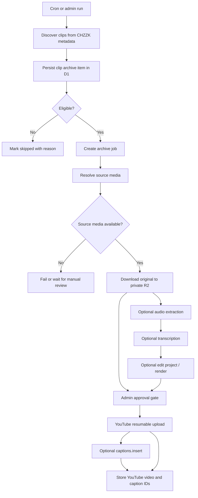

# 치지직 클립 YouTube 아카이브 자동화 구현 전략

## 개요

이 문서는 치지직 클립이 원본 다시보기 삭제와 함께 사라지는 문제를 줄이기 위해, 클립 영상을 보존하고 특정 YouTube 계정에 자동 업로드하는 독립 서비스의 장기 구현 전략을 정리한다. 초기 범위는 안정적인 아카이브와 비공개 업로드이며, 이후 자동 자막, 자막 검수, 편집, 렌더링, 공개 발행까지 단계적으로 확장한다.

작성 기준일: 2026-06-23

## 분리 원칙

- 이 기능은 OTW Schedule의 스케줄, 멤버, 관리자 설정, 배포 흐름과 결합하지 않는 별도 프로젝트로 다룬다.
- 이 폴더는 추후 독립 저장소로 그대로 분리할 수 있는 기획/설계 seed다.
- OTW Schedule의 D1 schema, Worker route, R2 prefix, 관리자 UI를 전제로 구현하지 않는다.
- 필요한 경우 OTW Schedule에서 채널 allowlist 같은 입력 데이터를 export할 수는 있지만, 런타임 의존성으로 삼지 않는다.
- YouTube 업로드에는 API key가 아니라 OAuth 2.0 사용자 동의와 refresh token 관리가 필요하다.
- 클립 원본/렌더링 결과물은 private object storage에 저장하고, 공개 라우트에 직접 노출하지 않는다.

## 핵심 결론

구현은 가능하지만, 일반 API 기능 추가가 아니라 미디어 처리 파이프라인 구축이다. 성공 여부를 가장 크게 좌우하는 부분은 치지직 클립 원본을 안정적이고 허용 가능한 방식으로 확보할 수 있는지다. 이 부분은 본 구현 전에 반드시 PoC 게이트로 검증한다.

권장 MVP는 다음 범위로 제한한다.

- 치지직 클립 신규 발견 및 중복 방지
- 원본 영상 확보 가능 여부 검증
- 원본 영상을 R2 private prefix에 저장
- 관리자 승인 후 YouTube `private` 업로드
- 업로드 기록과 실패 재시도 관리

자막과 편집은 초기 스키마와 작업 상태에 확장 지점을 마련해두되, MVP에서는 선택 기능으로 둔다.

## 외부 제약

### 치지직

- 공식 CHZZK Developers 문서는 Open API 도메인으로 `https://openapi.chzzk.naver.com`을 명시한다.
- 공식 문서의 주요 범위는 채널, 라이브, 채팅, 세션 등이다. 클립 원본 다운로드 또는 클립 미디어 파일 추출 API는 현재 구현 전제에 사용할 만큼 공식적으로 확인되지 않았다.
- 치지직 웹 서비스에서 관찰되는 `https://api.chzzk.naver.com/service/v1/channels/{channelId}/clips` 형태의 메타데이터 엔드포인트는 클립 목록 조회에는 활용 가능성이 있지만, 원본 영상 보존 기능의 안정적인 계약으로 보기 어렵다.
- 따라서 치지직 원본 확보는 "공식 지원 기능"이 아니라 "검증 필요 항목"으로 취급한다.

### YouTube

- 영상 업로드는 YouTube Data API `videos.insert`로 가능하다.
- 업로드에는 API key가 아니라 OAuth scope가 필요하다. 최소 scope 후보는 `https://www.googleapis.com/auth/youtube.upload`이다.
- YouTube는 재개 가능한 업로드 프로토콜을 제공한다. 업로드 세션 URI를 저장하고, 실패 시 진행 바이트 범위를 확인해 이어 올릴 수 있다.
- 2020-07-28 이후 생성된 미검증 API 프로젝트에서 `videos.insert`로 업로드한 영상은 private로 제한될 수 있다. 공개 또는 일부공개 자동 발행까지 목표로 할 경우 YouTube API audit/검증을 별도 마일스톤으로 둔다.
- `captions.insert`는 자막 트랙 업로드를 지원하며, 호출당 quota cost가 높다. 자막 자동 생성 후 무조건 업로드하기보다 관리자 승인 또는 배치 제한을 둔다.

### OpenAI 음성 인식

- OpenAI Speech to Text는 파일 기반 transcription을 지원한다.
- 파일 업로드 크기 제한이 있으므로 긴 영상은 오디오 추출 후 chunking이 필요하다.
- 자막/편집 확장을 고려하면 단순 텍스트보다 segment timestamp를 보존하는 JSON 산출물을 우선 저장해야 한다.

### Cloudflare

- Cloudflare Worker Cron을 선택할 경우 15분 wall time 제한을 전제로 설계해야 한다.
- Queue consumer도 장시간 미디어 처리에는 한계가 있다.
- Cloudflare Workflows는 다단계 작업과 retry, state persistence에는 적합하다.
- ffmpeg 기반 오디오 추출, 하드자막 렌더링, 인트로/아웃트로 합성은 Worker 런타임보다 외부 Node/Python worker, Cloudflare Containers, 또는 별도 렌더 서버가 적합하다.
- R2는 원본/중간 산출물 저장소로 적합하며, 큰 파일은 multipart upload를 고려한다.

## 목표 아키텍처



## 설계 원칙

- 모든 단계는 idempotent하게 만든다. 같은 `clipUID`는 여러 번 발견되어도 하나의 아카이브 item으로 합쳐야 한다.
- 원본 확보, 자막 생성, 렌더링, YouTube 업로드는 독립 job으로 분리한다.
- D1에는 상태와 메타데이터를 저장하고, 대용량 바이너리는 R2에 저장한다.
- YouTube 업로드 기본값은 `private`, `notifySubscribers=false`로 시작한다.
- 공개 발행, 하드자막, 자동 컷 편집은 관리자 검수 이후의 확장 기능으로 둔다.
- 치지직 원본 추출 방식은 실패 가능성이 높은 외부 의존성으로 보고, 모니터링과 fallback을 필수로 둔다.
- 저작권/초상권/채널 운영 권한은 기술 게이트와 별도로 운영 게이트로 둔다.

## 상태 모델

### Archive item status

| 상태 | 의미 |
| --- | --- |
| `discovered` | 클립 메타데이터만 수집됨 |
| `eligible` | 정책 필터를 통과해 아카이브 대상이 됨 |
| `source_resolved` | 원본 미디어 URL 또는 다운로드 계획이 확보됨 |
| `archived` | 원본 또는 보존 가능한 파일이 R2에 저장됨 |
| `needs_review` | 업로드 전 관리자 검수가 필요함 |
| `approved` | 업로드가 승인됨 |
| `uploaded` | YouTube 업로드 완료 |
| `captioned` | YouTube 자막 트랙 업로드 완료 |
| `published` | 공개/일부공개 전환 완료 |
| `skipped` | 정책상 제외됨 |
| `failed` | 복구 가능한 실패가 발생함 |
| `blocked` | 권한/정책/원본 추출 문제로 자동 진행 불가 |

### Job status

| 상태 | 의미 |
| --- | --- |
| `queued` | 실행 대기 |
| `running` | 실행 중 |
| `succeeded` | 성공 |
| `retrying` | 실패 후 재시도 예약 |
| `failed` | 재시도 가능한 실패 |
| `dead` | 재시도 한도 초과 |
| `cancelled` | 관리자 또는 정책에 의해 취소 |
| `skipped` | 선행 조건 불충족으로 생략 |

## 데이터 모델 초안

실제 구현 시 사용하는 프레임워크에 맞춰 schema와 migration을 생성한다.

### `clip_archive_items`

클립 단위의 canonical record다.

| 필드 | 설명 |
| --- | --- |
| `id` | 내부 PK |
| `source` | `chzzk` |
| `source_clip_uid` | 치지직 `clipUID`, unique |
| `source_video_no` | 연결된 VOD 번호 |
| `source_channel_id` | 치지직 채널 ID |
| `creator_id` | 내부 creator/channel 식별자 |
| `clip_title` | 클립 제목 |
| `source_url` | `https://chzzk.naver.com/clips/{clipUID}` |
| `thumbnail_url` | 치지직 썸네일 |
| `duration_seconds` | 클립 길이 |
| `read_count` | 발견 시점 조회수 |
| `created_date` | 치지직 클립 생성일 |
| `status` | archive item status |
| `eligibility_reason` | 제외/포함 사유 |
| `last_seen_at` | 마지막 메타데이터 확인 시각 |
| `created_at` | 내부 생성 시각 |
| `updated_at` | 내부 수정 시각 |

### `clip_archive_assets`

원본, 오디오, 자막, 편집 프로젝트, 렌더링 결과 등 산출물 record다.

| 필드 | 설명 |
| --- | --- |
| `id` | 내부 PK |
| `item_id` | `clip_archive_items.id` |
| `kind` | `original_video`, `audio`, `transcript_json`, `caption_srt`, `caption_vtt`, `edit_project`, `rendered_video`, `thumbnail` |
| `r2_key` | private R2 key |
| `content_type` | MIME type |
| `size_bytes` | 파일 크기 |
| `duration_seconds` | 미디어 길이 |
| `checksum_sha256` | 중복/무결성 확인용 |
| `metadata_json` | 코덱, 해상도, 언어, STT 모델 등 |
| `created_at` | 생성 시각 |

### `clip_archive_jobs`

모든 비동기 작업의 실행 기록이다.

| 필드 | 설명 |
| --- | --- |
| `id` | 내부 PK |
| `item_id` | 대상 item |
| `type` | `discover`, `resolve_source`, `download_source`, `extract_audio`, `transcribe`, `render`, `youtube_upload`, `caption_upload`, `cleanup` |
| `status` | job status |
| `attempt_count` | 시도 횟수 |
| `max_attempts` | 최대 재시도 횟수 |
| `next_run_at` | 다음 실행 가능 시각 |
| `locked_at` | worker lock 시각 |
| `locked_by` | 실행자 식별자 |
| `payload_json` | 작업 입력 |
| `result_json` | 작업 결과 |
| `error_code` | 분류 가능한 에러 |
| `error_message` | 디버깅 메시지 |
| `created_at` | 생성 시각 |
| `updated_at` | 수정 시각 |

### `youtube_upload_records`

YouTube 업로드와 자막 트랙 상태다.

| 필드 | 설명 |
| --- | --- |
| `id` | 내부 PK |
| `item_id` | 대상 item |
| `youtube_video_id` | 업로드 완료 후 YouTube video ID |
| `upload_session_uri` | resumable upload 세션 URI, 민감 정보로 취급 |
| `privacy_status` | `private`, `unlisted`, `public` |
| `title` | 업로드 제목 |
| `description` | 업로드 설명 |
| `tags_json` | 태그 배열 |
| `category_id` | YouTube category |
| `made_for_kids` | 아동용 여부 |
| `notify_subscribers` | 구독자 알림 여부 |
| `caption_track_id` | captions.insert 결과 |
| `status` | `pending`, `uploading`, `processing`, `uploaded`, `captioned`, `failed` |
| `created_at` | 생성 시각 |
| `updated_at` | 수정 시각 |

### `clip_edit_projects`

편집 기능 확장을 위한 선택 테이블이다. MVP에서는 생성하지 않아도 되지만, asset kind와 job type은 미리 열어둔다.

| 필드 | 설명 |
| --- | --- |
| `id` | 내부 PK |
| `item_id` | 대상 item |
| `version` | 편집안 버전 |
| `status` | `draft`, `approved`, `rendered`, `rejected` |
| `recipe_json` | 컷, 자막 스타일, 인트로/아웃트로, 음량, 크롭 등 |
| `created_by` | 관리자 ID |
| `created_at` | 생성 시각 |
| `updated_at` | 수정 시각 |

## R2 key 정책

클립 미디어는 기존 공개 이미지 라우트와 분리한다.

```text
clip-archive/
  chzzk/
    {source_channel_id}/
      {clip_uid}/
        original.mp4
        audio.m4a
        transcript.json
        captions.ko.vtt
        captions.ko.srt
        edit-project.v1.json
        rendered.v1.mp4
        thumbnail.jpg
```

주의 사항:

- `/r2-assets/*` 라우트의 allowlist에 이 prefix를 추가하지 않는다.
- 관리자 미리보기는 signed URL 또는 admin-only proxy endpoint를 별도로 둔다.
- 원본 파일 보존 기간과 렌더링 중간 파일 보존 기간을 분리한다.
- YouTube 업로드가 완료되어도 원본은 최소 보존 기간 동안 유지한다. 삭제 정책은 별도 설정으로 둔다.

## API 설계 초안

실제 구현 시 Worker/API route, frontend API client, hooks/UI 또는 선택한 백엔드 프레임워크의 contract를 함께 변경한다.

### 관리자 설정

| 메서드 | 경로 | 설명 |
| --- | --- | --- |
| `GET` | `/api/clip-archive/settings` | 자동화 설정 조회 |
| `PUT` | `/api/clip-archive/settings` | 자동화 설정 변경 |
| `POST` | `/api/clip-archive/run-now` | 수동 discover 실행 |

설정 후보:

- `clip_archive_enabled`
- `clip_archive_interval_hours`
- `clip_archive_clips_per_member`
- `clip_archive_max_duration_seconds`
- `clip_archive_min_read_count`
- `clip_archive_channel_allowlist`
- `clip_archive_upload_mode`: `disabled`, `manual_approval`, `auto_private`
- `clip_archive_caption_mode`: `disabled`, `generate_only`, `upload_after_review`, `auto_upload`
- `clip_archive_render_mode`: `disabled`, `manual`, `auto_after_review`
- `clip_archive_retention_days_original`
- `clip_archive_retention_days_intermediate`

### 아이템/작업 관리

| 메서드 | 경로 | 설명 |
| --- | --- | --- |
| `GET` | `/api/clip-archive/items` | 목록, 필터, 페이지네이션 |
| `GET` | `/api/clip-archive/items/:id` | 상세, assets, jobs, YouTube 상태 |
| `POST` | `/api/clip-archive/items/:id/approve` | 업로드 승인 |
| `POST` | `/api/clip-archive/items/:id/skip` | 제외 처리 |
| `POST` | `/api/clip-archive/items/:id/retry` | 실패 job 재시도 |
| `POST` | `/api/clip-archive/items/:id/transcribe` | 자막 생성 요청 |
| `POST` | `/api/clip-archive/items/:id/render` | 편집 렌더링 요청 |
| `GET` | `/api/clip-archive/jobs` | 작업 큐 상태 |

### YouTube OAuth

| 메서드 | 경로 | 설명 |
| --- | --- | --- |
| `GET` | `/api/youtube/oauth/start` | 관리자만 OAuth consent 시작 |
| `GET` | `/api/youtube/oauth/callback` | authorization code 처리 |
| `GET` | `/api/youtube/oauth/status` | 연결된 계정, scope, 만료 상태 |
| `DELETE` | `/api/youtube/oauth/connection` | 연결 해제 |

운영 단순화를 위해 MVP에서는 단일 업로드 계정의 refresh token을 Wrangler secret으로 저장하는 방식을 우선 검토한다. 다중 계정 또는 UI 기반 연결 관리가 필요해지면 D1 metadata + 암호화된 token storage 전략을 별도 설계한다.

## 단계별 구현 플랜

### Phase 0. 정책/기술 PoC

목표: 본 구현 착수 여부를 판단한다.

작업:

- 대상 클립 사용 권한과 업로드 계정 운영 권한을 확인한다.
- 치지직 클립 원본 영상 확보 PoC를 수행한다.
- 최신 클립, 오래된 클립, 원본 VOD 삭제 직전/삭제 후 클립을 포함해 샘플을 검증한다.
- 원본 미디어 URL 만료, IP 제한, 인증 필요 여부, 파일 포맷, 파일 크기, 다운로드 속도를 기록한다.
- YouTube OAuth 테스트 프로젝트를 만들고 `private` 업로드 1건을 수동으로 검증한다.
- OpenAI 또는 대체 STT로 1분 내외 클립 자막 생성 샘플을 만든다.
- ffmpeg 기반 오디오 추출과 하드자막 렌더링을 로컬 스크립트로 검증한다.

완료 기준:

- 치지직 원본 확보 성공률과 실패 유형이 정리되어 있다.
- 원본 확보 방식이 운영 정책상 허용 가능한지 판단되어 있다.
- YouTube private 업로드와 자막 트랙 업로드가 테스트 계정에서 성공한다.
- Worker-only 구현과 외부 media worker 필요 범위가 결정되어 있다.

중단 기준:

- 치지직 원본 확보가 불안정하거나 약관/권리상 사용할 수 없다.
- 자동 재업로드에 필요한 권한 동의를 받을 수 없다.
- YouTube 업로드 계정 검증 또는 private 제한 정책을 수용할 수 없다.

### Phase 1. 영구 상태 기반 구축

목표: 미디어 처리 없이도 클립 아카이브 후보를 안전하게 추적한다.

작업:

- `clip_archive_items`, `clip_archive_jobs`, `clip_archive_assets`, `youtube_upload_records` Drizzle schema를 추가한다.
- `clipUID` unique index, `status + updated_at`, `creator_id + created_date` index를 추가한다.
- 관리자 전용 Worker route와 frontend API client를 추가한다.
- 관리자 UI에 목록, 상태 필터, 상세 drawer, skip/retry 버튼을 추가한다.
- 치지직 클립 메타데이터 조회 결과를 archive item으로 upsert하는 discover service를 만든다.
- Cron 자동화를 켜기 전에 enable flag가 꺼진 상태로 수동 실행부터 지원한다.

완료 기준:

- 클립 메타데이터가 중복 없이 D1에 쌓인다.
- 관리자 UI에서 발견/제외/실패 상태를 볼 수 있다.
- 아직 R2 다운로드나 YouTube 업로드는 실행하지 않는다.

### Phase 2. 원본 아카이브

목표: 업로드 전 원본을 R2에 보존한다.

작업:

- `resolve_source` job을 구현한다.
- 원본 미디어 다운로드 worker를 구현한다. 파일 크기가 작으면 Worker, 안정성이 필요하면 Queue pull consumer 또는 외부 worker를 사용한다.
- R2 private prefix에 `original.mp4` 또는 원본 컨테이너를 저장한다.
- `clip_archive_assets`에 파일 크기, content type, checksum, duration을 저장한다.
- 실패 시 retry policy와 dead 상태를 적용한다.
- 원본 다운로드 성공 후 `needs_review` 상태로 전환한다.

완료 기준:

- 샘플 클립 원본이 R2에 보존된다.
- 치지직 원본이 사라져도 R2에 저장된 파일로 업로드 가능하다.
- 실패한 item은 재시도 또는 수동 skip이 가능하다.

### Phase 3. YouTube OAuth 및 private 업로드

목표: 승인된 클립을 YouTube에 비공개 업로드한다.

작업:

- Google Cloud OAuth client를 구성한다.
- 관리자만 OAuth consent를 시작할 수 있게 한다.
- refresh token 저장 방식을 정한다. MVP는 Wrangler secret 또는 제한된 운영 절차를 우선한다.
- `youtube_upload` job을 구현한다.
- YouTube resumable upload session URI를 저장하고 재시도할 수 있게 한다.
- 기본 metadata template을 만든다.
- `privacyStatus=private`, `notifySubscribers=false`, `madeForKids=false` 기본값을 적용한다.
- YouTube video ID와 processing 상태를 저장한다.

완료 기준:

- 관리자 승인 후 private 영상이 지정 계정에 업로드된다.
- 중복 업로드가 방지된다.
- 실패 후 같은 upload session 또는 새 session으로 재시도할 수 있다.

### Phase 4. 자동 자막

목표: 업로드 전후에 검수 가능한 자막 산출물을 만든다.

작업:

- `extract_audio` job을 구현한다.
- STT provider interface를 만든다.
- OpenAI transcription을 1차 provider로 연결하되, 파일 크기 제한 때문에 chunking을 구현한다.
- segment timestamp를 포함한 `transcript.json`을 R2에 저장한다.
- `.vtt`와 `.srt`를 생성해 `clip_archive_assets`에 저장한다.
- 관리자 UI에서 segment 단위 텍스트 편집과 저장을 지원한다.
- 승인된 자막만 `captions.insert`로 YouTube에 업로드한다.

완료 기준:

- 자막 생성 결과를 사람이 수정할 수 있다.
- 수정 결과가 VTT/SRT로 재생성된다.
- YouTube caption track ID가 저장된다.

### Phase 5. 편집 프로젝트와 렌더링

목표: 자동 자막을 넘어 컷 편집과 하드자막 영상을 생성한다.

작업:

- `clip_edit_projects.recipe_json` 포맷을 정의한다.
- 초기 recipe는 무손실에 가깝게 유지한다: trim, intro/outro, normalize audio, subtitle style.
- ffmpeg 실행 환경을 정한다. 후보는 외부 Node/Python worker, Cloudflare Containers, 로컬 운영 작업자다.
- 하드자막 렌더링은 `rendered.v1.mp4`로 R2에 저장한다.
- 렌더링 결과 미리보기와 승인 UI를 추가한다.
- YouTube 업로드 입력 asset을 `original_video` 또는 `rendered_video` 중 선택할 수 있게 한다.

완료 기준:

- 편집 recipe만 수정하면 재렌더링할 수 있다.
- 원본 보존본과 업로드용 렌더본이 분리된다.
- 하드자막/인트로/아웃트로를 적용한 private 업로드가 가능하다.

### Phase 6. 운영 안정화

목표: 자동화가 장기간 안전하게 운영되도록 만든다.

작업:

- DLQ 또는 dead job dashboard를 만든다.
- job type별 성공률, 평균 처리 시간, 실패 사유, API quota 사용량을 기록한다.
- YouTube upload/caption quota budget을 설정한다.
- R2 lifecycle cleanup을 적용한다.
- source extraction 실패율이 임계치를 넘으면 자동화를 일시 중지한다.
- 업로드 전 권리/정책 체크리스트를 관리자 UI에 노출한다.
- API project audit 필요 여부를 추적한다.

완료 기준:

- 자동화가 실패해도 운영자가 원인과 다음 액션을 알 수 있다.
- 비용과 quota가 예측 가능하다.
- 공개 전환은 명시적 승인 또는 별도 release gate를 통과해야 한다.

## MVP 범위와 제외 범위

### MVP에 포함

- 클립 discover/upsert
- 정책 필터
- R2 원본 보존
- 관리자 승인
- YouTube OAuth private 업로드
- 업로드 기록, 실패 재시도, 중복 방지

### MVP에서 제외

- 자동 공개 발행
- 자동 하드자막 렌더링
- 자동 하이라이트/컷 편집
- 다중 YouTube 계정 지원
- 대규모 backfill
- YouTube API audit 대응 자동화

## 필터 정책 초안

초기 자동 대상은 보수적으로 제한한다.

- creator/channel allowlist에 포함된 채널만 처리
- `duration_seconds <= 180` 기본값
- adult 또는 blind clip 제외
- title empty 제외
- 이미 같은 `clipUID`로 업로드된 item 제외
- read count 기준은 초기에는 사용하지 않거나 낮게 둔다
- source VOD 삭제 임박 추정은 후속 기능으로 둔다

## 관리자 UI 요구사항

- 클립 목록: creator/channel, 제목, 길이, 생성일, 조회수, 상태, 실패 사유
- 상세 화면: 원본 링크, 썸네일, R2 asset 상태, jobs timeline, YouTube status
- 액션: discover 수동 실행, approve, skip, retry, transcribe, render, upload captions
- 설정: enable toggle, interval, allowlist, max duration, upload mode, caption mode
- 검수: 자막 segment 편집, VTT/SRT 다운로드, 렌더 preview
- 안전장치: private 업로드 경고, 권리 확인 체크, 공개 발행 별도 확인

## 테스트 전략

### Unit tests

- `clipUID` upsert idempotency
- eligibility filter
- job state transitions
- YouTube metadata template
- VTT/SRT generation
- retry/backoff calculation

### Worker route tests

- admin auth enforcement
- settings validation
- list pagination/filter
- approve/skip/retry side effects
- OAuth callback error handling

### Integration tests

- mocked CHZZK metadata response
- mocked source resolver
- mocked R2 put/get
- mocked YouTube resumable upload
- mocked captions.insert
- mocked STT provider

### Manual canary

- allowlist 1명, clips 1개, private upload only
- 24시간 관찰 후 clips per member 확대
- caption generation은 별도 canary로 시작
- render pipeline은 최소 10개 샘플에서 영상/음성 sync 확인 후 활성화

## 위험과 대응

| 위험 | 영향 | 대응 |
| --- | --- | --- |
| 치지직 원본 추출 실패 | 핵심 기능 중단 | Phase 0 PoC gate, 실패율 모니터링, 수동 링크만 보존하는 fallback |
| 치지직 API 변경 | discover/resolve 중단 | service wrapper 분리, contract tests, 에러율 알림 |
| 권리/허가 문제 | 채널 제재, 분쟁 | allowlist, 관리자 승인, 권리 체크리스트, private 기본값 |
| YouTube project 미검증 private 제한 | 공개 자동화 불가 | MVP는 private, 공개는 audit 이후 |
| YouTube quota 초과 | 업로드/자막 실패 | 일일 budget, caption upload 승인제, retry backoff |
| STT 비용 증가 | 운영비 증가 | max duration, batch limit, generate-on-demand |
| 렌더링 자원 부족 | 처리 지연 | 외부 media worker, queue backpressure, render mode manual |
| R2 저장비 증가 | 비용 증가 | retention policy, intermediate cleanup |
| OAuth token 유출 | 계정 보안 사고 | secret storage, admin-only routes, token rotation, 최소 scope |

## 권장 구현 순서

1. Phase 0 PoC를 별도 브랜치/스크립트로 진행한다.
2. PoC 성공 후 archive schema와 migration을 추가한다.
3. admin API와 client contract를 만든다.
4. discover만 배포해 며칠간 데이터 품질을 본다.
5. R2 원본 보존을 수동 실행으로 붙인다.
6. YouTube private 업로드를 관리자 승인 뒤 실행한다.
7. 자동 자막을 generate-only로 붙이고 검수 UI를 만든다.
8. 자막 트랙 업로드를 승인제에 붙인다.
9. 렌더링/편집은 별도 media worker가 안정화된 뒤 활성화한다.

## 예상 난이도

| 구간 | 난이도 | 예상 기간 |
| --- | --- | --- |
| Phase 0 PoC | 중간 | 2-4일 |
| Phase 1 상태 기반 | 중간 | 2-4일 |
| Phase 2 원본 아카이브 | 중상 | 3-7일 |
| Phase 3 YouTube 업로드 | 중상 | 3-6일 |
| Phase 4 자동 자막 | 중상 | 4-8일 |
| Phase 5 편집/렌더링 | 높음 | 1-3주 |
| Phase 6 운영 안정화 | 중상 | 지속 개선 |

전체 MVP는 치지직 원본 확보가 안정적이라는 전제에서 2-3주를 예상한다. 자막 검수와 편집 렌더링까지 포함한 운영 버전은 4-8주 범위로 잡는 것이 안전하다.

## 참고 자료

- [CHZZK Developers](https://chzzk.gitbook.io/chzzk)
- [CHZZK Open API 참고사항](https://chzzk.gitbook.io/chzzk/chzzk-api/tips)
- [YouTube Data API videos.insert](https://developers.google.com/youtube/v3/docs/videos/insert)
- [YouTube resumable uploads](https://developers.google.com/youtube/v3/guides/using_resumable_upload_protocol)
- [YouTube Data API captions.insert](https://developers.google.com/youtube/v3/docs/captions/insert)
- [YouTube Data API overview and quota](https://developers.google.com/youtube/v3/getting-started)
- [YouTube API Services Terms of Service](https://developers.google.com/youtube/terms/api-services-terms-of-service)
- [YouTube copyright tips](https://support.google.com/youtube/answer/12361994)
- [OpenAI Speech to text](https://developers.openai.com/api/docs/guides/speech-to-text)
- [Cloudflare Queues limits](https://developers.cloudflare.com/queues/platform/limits/)
- [Cloudflare Workflows overview](https://developers.cloudflare.com/workflows/)
- [Cloudflare Workflows retries](https://developers.cloudflare.com/workflows/build/sleeping-and-retrying/)
- [Cloudflare R2 limits](https://developers.cloudflare.com/r2/platform/limits/)
- [Cloudflare R2 upload objects](https://developers.cloudflare.com/r2/objects/upload-objects/)
